# Apple Pay Capabilities

_Adding capabilities to an application often requires additional provisioning setup. This guide explains the setup needed for Apple Pay capabilities._

Apple Pay enables users to pay for physical goods via their iOS device. This section describes how to create all necessary components required for Apple pay in the Apple Developer Center.

When provisioning a new app through the developer center, there are three steps that need to be taken:

1.	Create a Merchant ID.
2.	Create an App ID with the Apply Pay capability and add the merchant to it.
3.	Generate a certificate for the Merchant ID.

The steps below will guide you through creating the above items:

<a name="merchantid" />

## Create Merchant ID

A Merchant ID is used to let Apple Pay know that you can accept payments, and is passed to PassKit’s `PaymentRequest` method and used in the Apple Pay entitlement:

1.	Browse to the [Apple Developer Center](https://developer.apple.com/account/) and go to the Certificates, Identifier, and Profiles section: 
 
    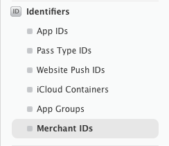

2.	Under **Identifiers**, select **Merchant IDs**, and then select the **+** to create a new merchant ID:  

3.	Fill out the form, illustrated below, with a new description and identifier. The description makes the ID identifiable to you and can be changed later. The identifier must be unique to you, and it must start with the string `merchant`. Apple recommends that the identifier be in the following format: `merchant.com.[Your-App-Name]`:
   
    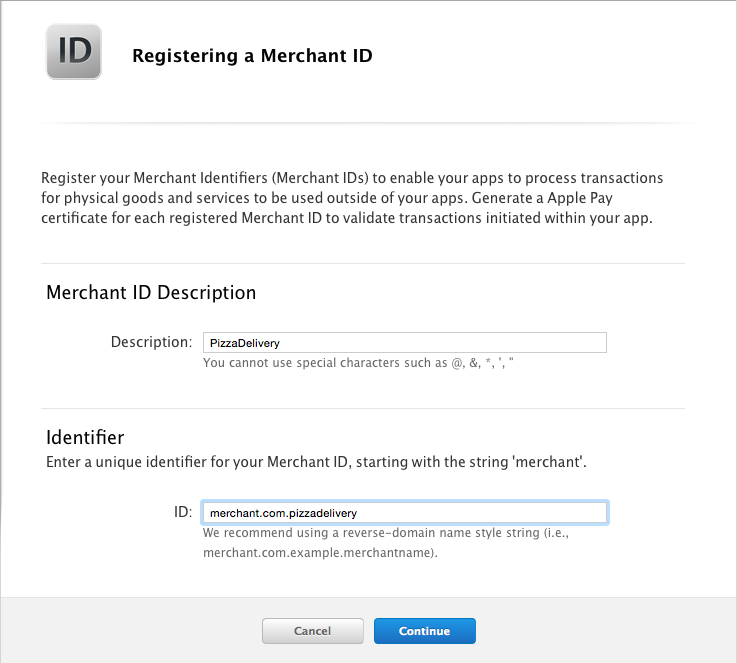

4.	Confirm the details, and **Register** your ID: 
    
    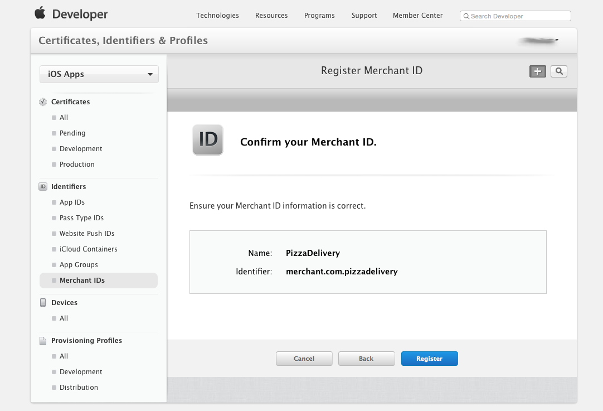

<a name="appid" />

## Create an App ID with the Apple Pay capability that includes the Merchant ID

1.	In the [Developer Center](https://developer.apple.com/account/) click on **App IDs** under **Identifiers**: 
    
    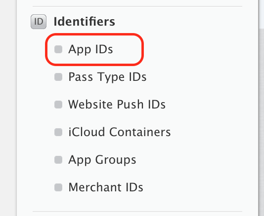

2.	Select the **+** button to add a new App ID: 
   
    

3.	Enter a Name for the App ID and give it an Explicit App ID:    
   
    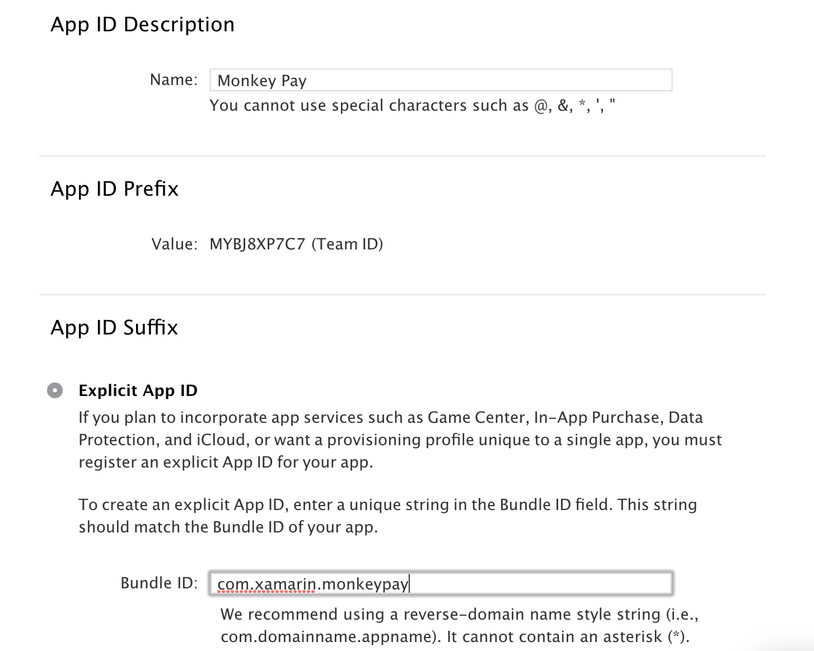

4.	Under App Services, select Apple Pay:    
  
    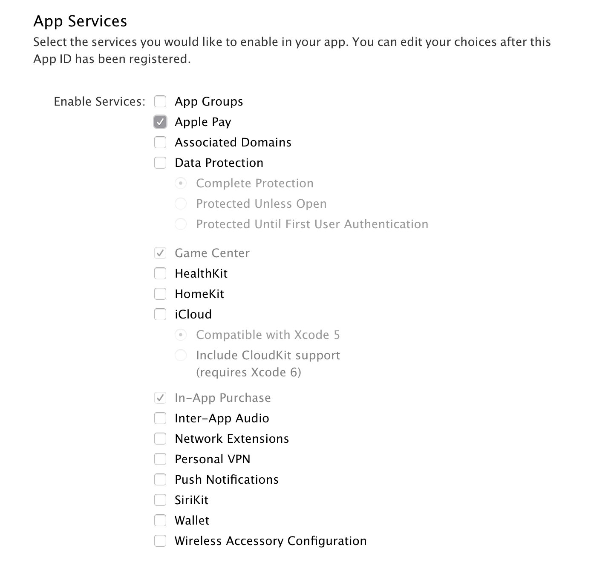

5.	Select **Continue** and then **Register**. Note that on the confirmation screen Apple Pay will display with Configurable selected, with a yellow symbol: 
   
    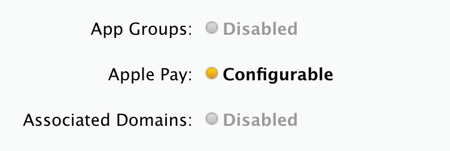

6.	Return to the list of App IDs and select the one you have just created:  
   
    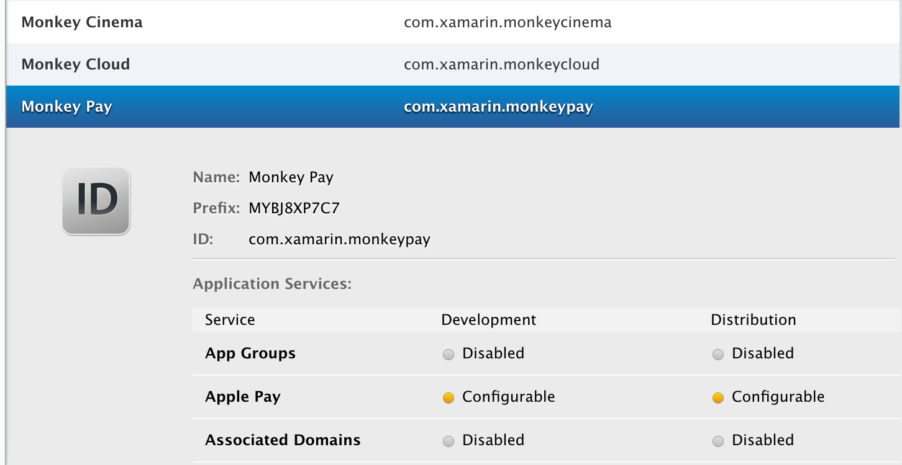

7.	Scroll down to the bottom of this expanded section and click **Edit**.
8.	Scroll down the list to Apple Pay and click the **Edit** button:  
    
    

9.	Select the Merchant ID to use with this App ID, and click **Continue**:  
    
    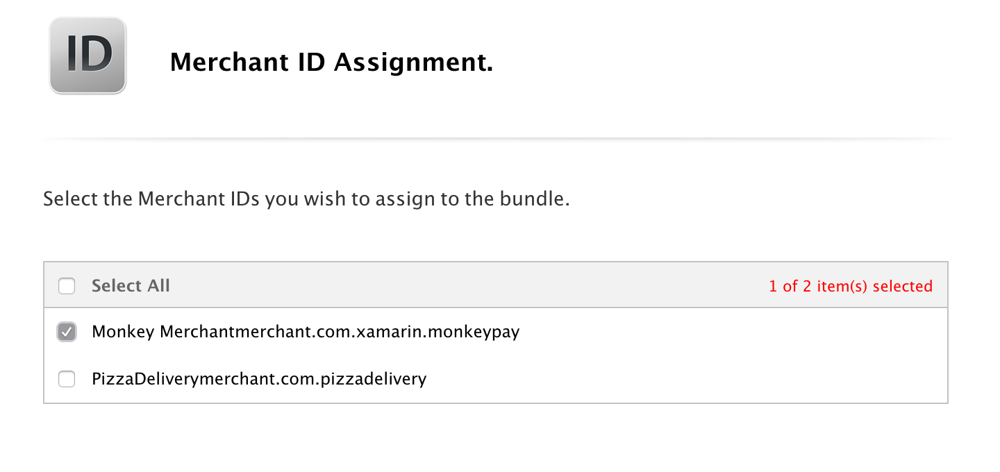

10.	Confirm the Merchant ID assignments, and press **Assign**:  
    
    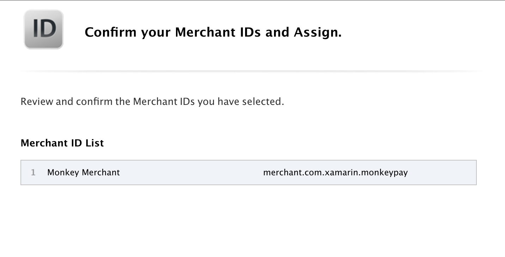

This App ID can now be used to generate, or to re-generate, a new provisioning profile, as described in the [Working with Capabilities](~/ios/deploy-test/provisioning/capabilities/index.md) guide. 

<a name="certificate" />

## Create a Certificate for your Merchant ID

A certificate is required by Apple to encrypt sensitive data associated with the transaction. Each Merchant ID created must have its own certificate. 

To create a certificate, follow the steps below:

1.	Select the Merchant ID that was created above and press **Edit**: 
    
    

2.	On the iOS Merchant ID Settings screen, click **Create Certificate**: 
   
    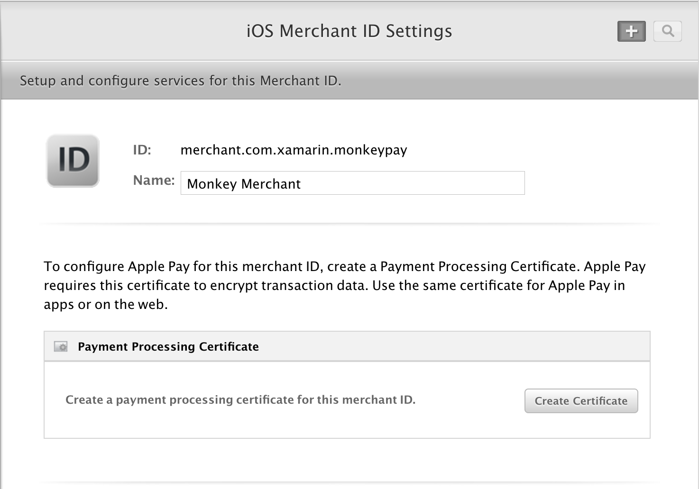

3.	Answer the following question: 

    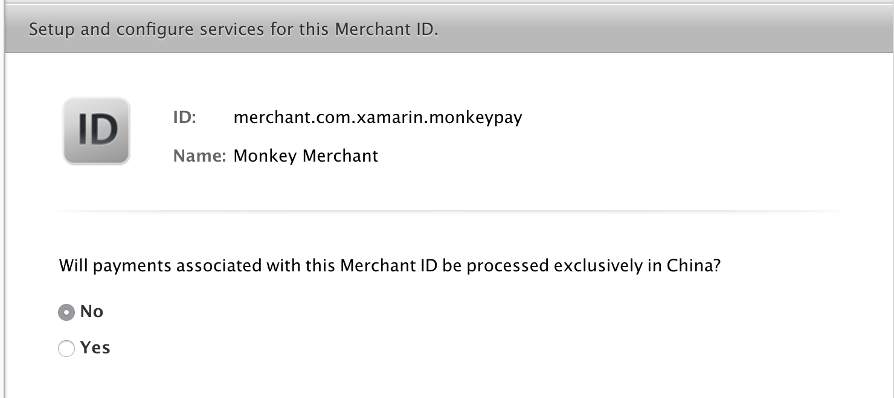

4.	At this point you will be prompted to create a _certificate signing request_: 

    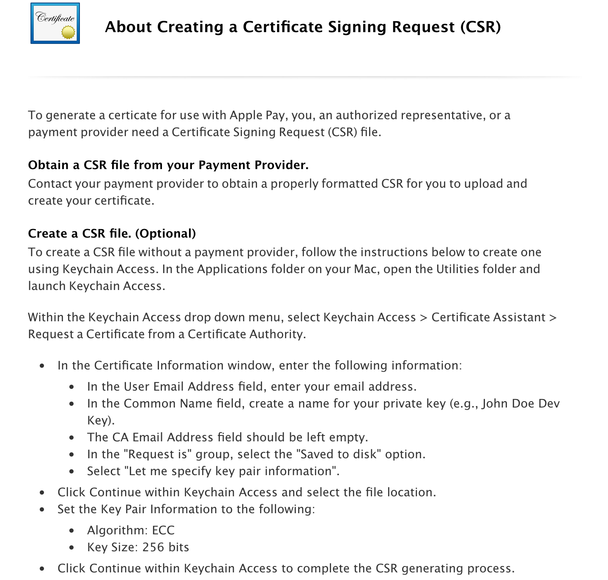
    
    > [!IMPORTANT]
> If you are using a payment provider for Apple Pay, such a JudoPay or Stripe, they can provide you with a properly formatted CSR that you can use at this point. Information on requesting this is found on the [JudoPay](https://www.judopay.com/docs/version-52/apple-pay/getting-started/#create-an-apple-pay-certificate) and [Stripe](https://stripe.com/docs/apple-pay/apps#csr) sites. To create your own CSR, follow the steps 5-8 below. Once you have a CSR go to step 9.

5.	Open the Keychain Access application, and browse to **Keychain Access > Certificate Assistant > Request a Certificate from a Certificate Authority:** 

     

6.	Enter your email address, enter a name for the private key, leave CA Email Address empty, select the **Save to Disk** option, and select **Let me specify key pair information**:

     

7.	Save the CSR to a convenient location: 

     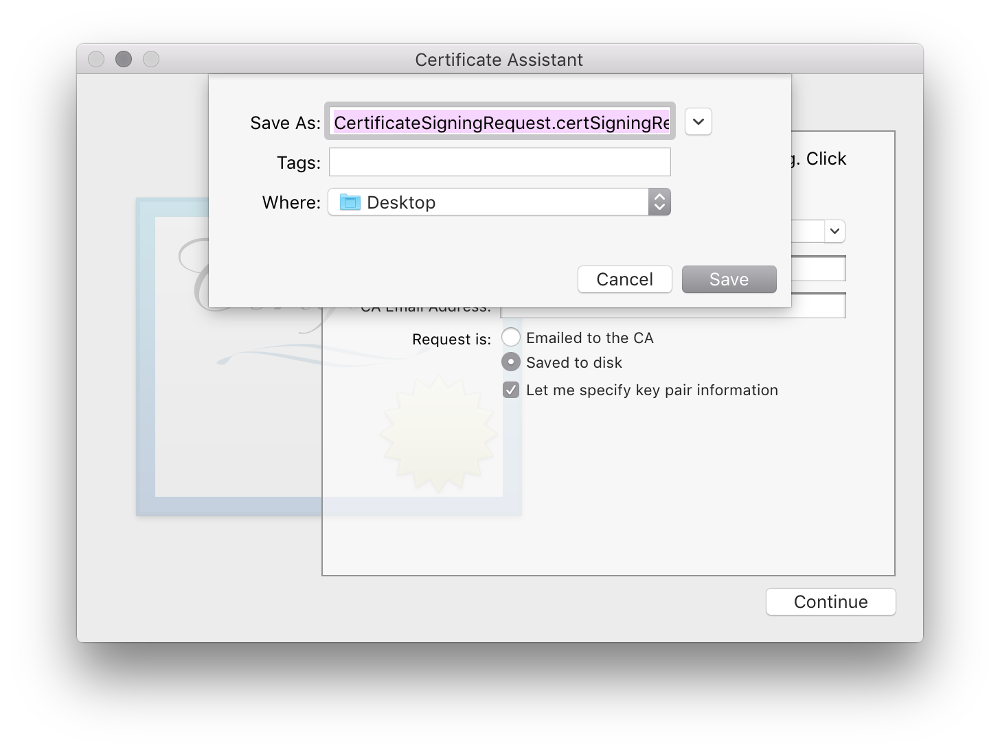

8.	In the Key Pair information screen, set **Key Size** to **256 bits** and **Algorithm** to **ECC** and click **Continue**:

     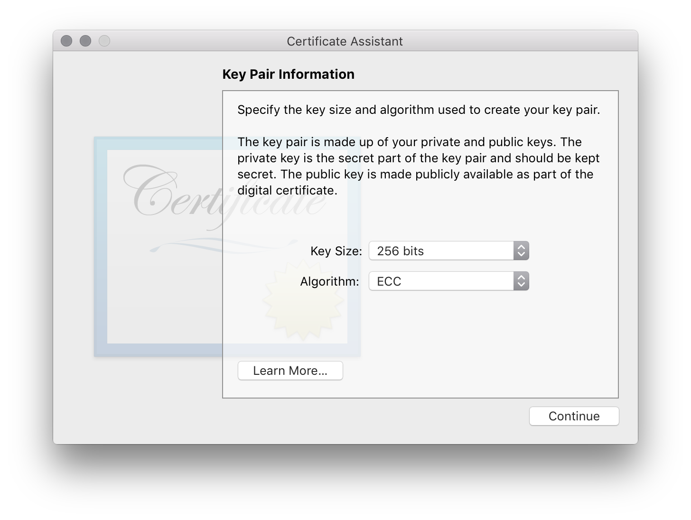

9.	On the Developer Center, click **Continue** to upload the CSR: 

     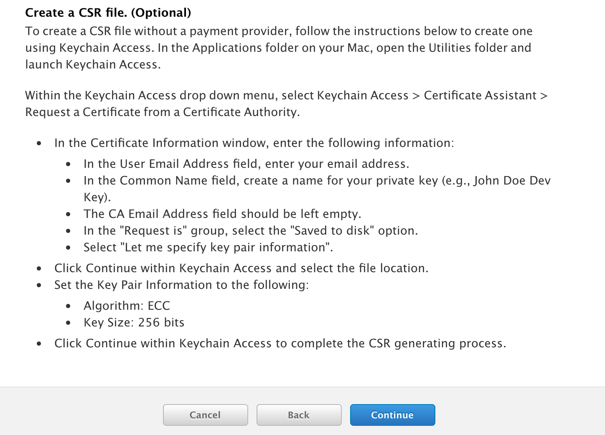

10.	Click **Choose File…** to select the CSR and press **Continue** to upload it to the developer portal: 

     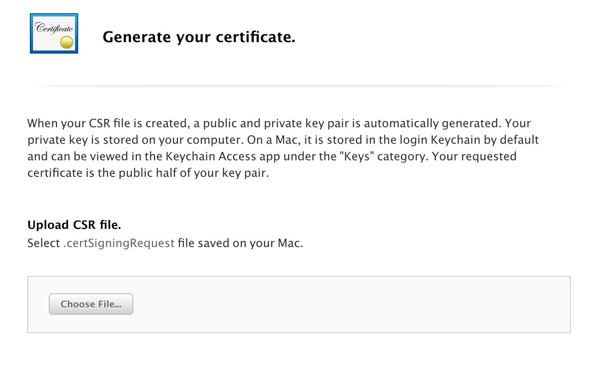

11.	Once the certificate has been generated, download it and double click on it to install it to your keychain.

For more information on using Apple Pay, refer to the following guide:

*	[Introduction to Apple Pay](~/ios/platform/apple-pay.md)

## Next Steps
 
The list below describes additional steps that may need to be taken:

* Use the framework namespace in your app.
* Add the required entitlements to your App. Information on the entitlements required and how to add them is detailed in the [Working with Entitlements](~/ios/deploy-test/provisioning/entitlements.md) guide.
* In the App's **iOS Bundle Signing**, ensure that the **Custom Entitlements** is set to **Entitlements.plist**. This is _not_ the default setting for Debug and iOS Simulator builds.

If you encounter issues with app services, refer to the [Troubleshooting](~/ios/deploy-test/provisioning/capabilities/index.md) section of the main guide.