# Working with Capabilities in Xamarin.iOS

_Adding capabilities to an application often requires additional provisioning setup. This guide explains the setup needed for all capabilities._

Apple provides developers with _capabilities_, often known as _app services_, as a means of extending functionality and widening the scope of what iOS apps can do. The capabilities allow developers to add a deeper integration of platform features to their application, such as: the ability to have monetary transactions initiated from the app, additional device services such as Siri, and more.
These capabilities can be used with Xamarin.iOS projects. The full list of services is described below:

* App Groups
* Associated Domains
* Data Protection
* Game Center
* HealthKit
* HomeKit
* Wireless Accessory Configuration
* iCloud
* In-App Purchase
* Inter-App Audio
* Apple Pay
* Wallet
* Push Notification
* Personal VPN
* Siri
* Maps
* Background Modes
* Keychain Sharing
* Network Extensions
* Hotspot Configuration
* Multipath
* NFC Tag Reading

Capabilities can be enabled either through Visual Studio for Mac and Visual Studio 2019, or manually in the Apple Developer Portal. Certain capabilities such as Wallet, Apple Pay, and iCloud require additional configuration of the App IDs.

This guide explains how to enable each of these App Services in your application automatically in Visual Studio and manually through the developer center, including any additional setup that may be required. 

## Adding App Services

To use capabilities, the app must have a valid provisioning profile that contains an App ID with the correct service enabled. Creating this provisioning profile can either be done automatically in Visual Studio for Mac and Visual Studio 2019, or manually in the Apple Developer Center.

This section explains how to use Visual Studio's automatic provisioning or the Developer Center to enable most capabilities. There are some capabilities such as Wallet, iCloud, Apple Pay, and App Groups that require additional setup. These are explained in detail in the adjoining guides.

> [!IMPORTANT]
> Not all capabilities can be added and managed with Automatic Provisioning. The following list contains the supported capabilities:
>
>* HealthKit 
>* HomeKit 
>* Personal VPN 
>* Wireless Accessory Configuration 
>* Inter-App Audio 
>* SiriKit 
>* Hotspot 
>* Network Extensions 
>* NFC Tag Reading
>* Multipath 
>
>Push Notifications, Game Center, In-App Purchase, Maps, Keychain Sharing, Associated Domains, and Data Protection capabilities are not currently supported. To add these capabilities, use manual provisioning and follow the steps in the [Developer Center](#devcenter) section.

## Using the IDE

# [Visual Studio for Mac](#tab/macos)

Capabilities are added to the **Entitlements.plist** in Visual Studio for Mac. To add capabilities, use the following steps:

1. Open the **Info.plist** file of your iOS application and select the **Automatically Provisioning** scheme and your **Team** from the combo box. Follow the steps in the [Automatic Provisioning](~/ios/get-started/installation/device-provisioning/automatic-provisioning.md) guide if you need help:

    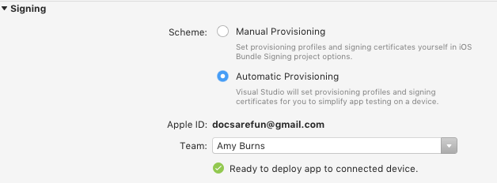

2. Open the **Entitlements.plist** file and select the capability that you wish to add:

    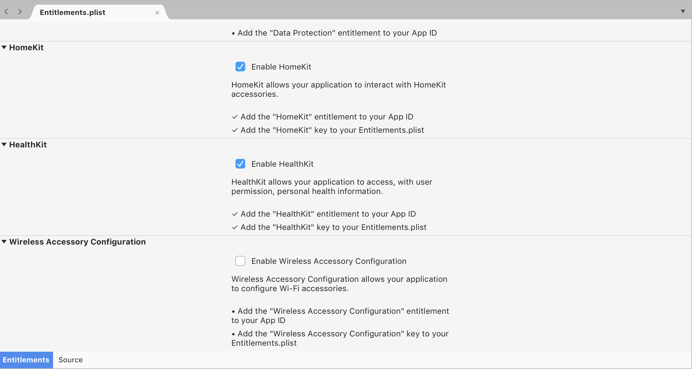

    Selecting a capability does two things:
    * Adds that feature to your App ID
    * Adds the entitlement key/value pair to your Entitlements.plist file.

    Visual Studio for Mac will advise you when these tasks have been carried out by displaying the following success message:

    

# [Visual Studio](#tab/windows)

Capabilities are added to the **Entitlements.plist**. To add capabilities in Visual Studio 2019, use the following steps:

1. Pair Visual Studio 2019 to a Mac as described in the [Pair to Mac](~/ios/get-started/installation/windows/connecting-to-mac/index.md) guide.

2. Open the Provisioning options by selecting **Project > Provisioning Properties…**

3. Select the **Automatically Provisioning** scheme and your **Team** from the combo box. Follow the steps in the [Automatic Provisioning](~/ios/get-started/installation/device-provisioning/automatic-provisioning.md) guide if you need help:

    

4. Open the **Entitlements.plist** file and select the capability that you wish to add. Save the file.

    Saving the **Entitlement.plist** does two things:

    * Adds that feature to your App ID
    * Adds the entitlement key/value pair to your Entitlements.plist file.

-----

<a name="devcenter" />

## Using the Developer Center

Using the developer center is a two step process that requires creating an App ID and then using that App ID to create a provisioning profile. These steps are detailed below.

### Creating an App ID with an app service

1.	Browse to the [Apple Developer Center](https://developer.apple.com/account) on a Mac (the build host mac if using a windows machine) and log in.
2.	Select **Certificates, Identifiers, and Profiles**:

    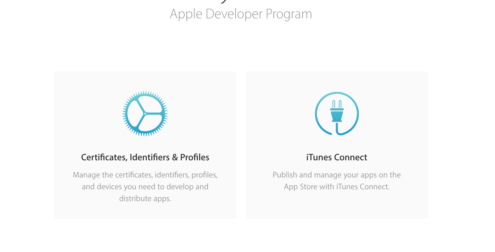

3.	Under **Identifiers**, select **App IDs**:

    

4.	Press the **+** button in the top right corner to create a new App ID.
5.	Enter an App ID description, select Explicit App ID, and enter a bundle ID in the format `com.domain.appname`. This bundle ID should match the bundle ID in your project:

    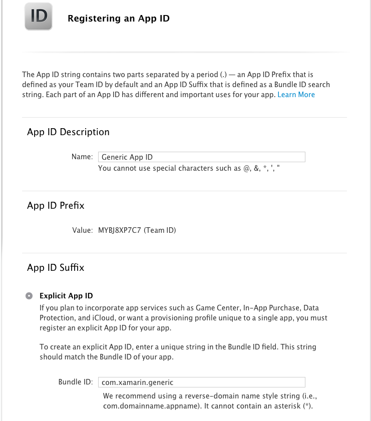

6.	Under **App Services** select the service or services that are required in your app:

    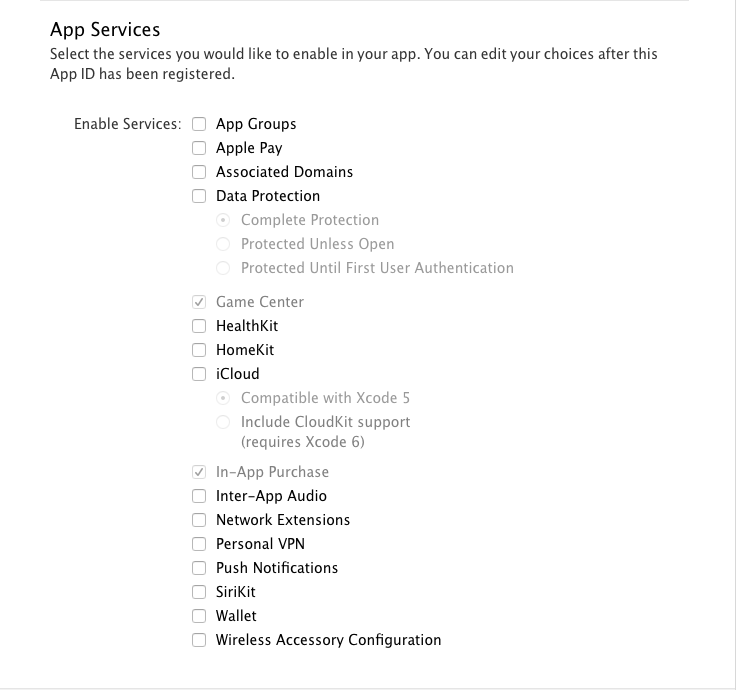

7.	Press **Continue**.
8.	Confirm your App ID. Each service will be in one of the following states: **Enabled**, **Disabled**, or **Configurable**, as illustrated below. If it’s **Enabled,** it is ready to be used in a provisioning profile. If it is **Configurable**, additional setup is required for this capability. These additional steps are described in more detail in later sections.

    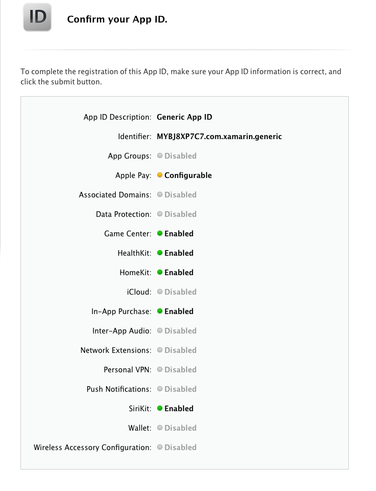

9.	Click **Register** and then **Done**. The newly created App ID should display in the iOS App IDs list.

<a name="provisioningprofile" />

### Creating a Provisioning Profile

Now create a provisioning profile that contains this App ID. Follow the steps below:

1.	In the Apple Developer Center, browse to **Provisioning Profiles > All**:

    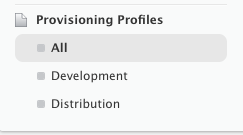

2.	Press the **+** button in the top right corner to create a new provisioning profile.
3.	Select the type of provisioning profile that you need, and click **Continue**:

    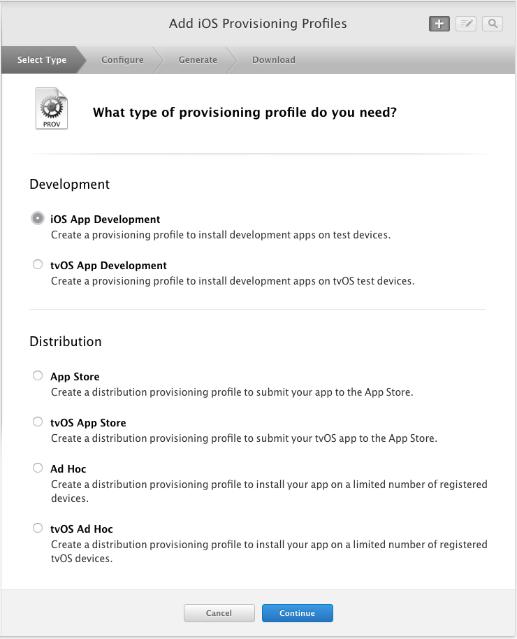

4.	From the dropdown list, select the App ID that was created in the steps above and press **Continue**:

    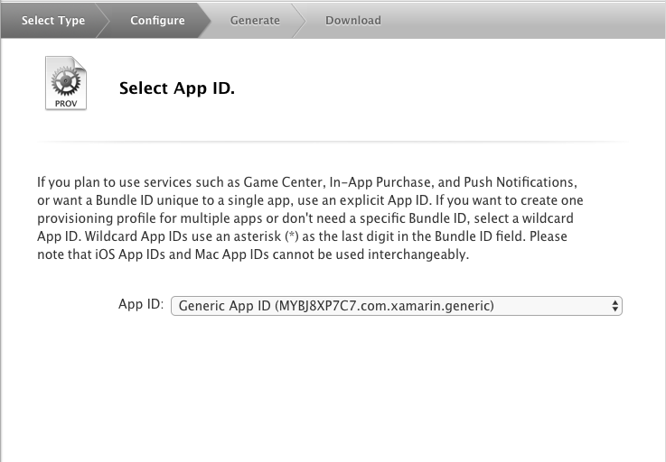

5.	Select the certificates used to sign the app and press **Continue**:

    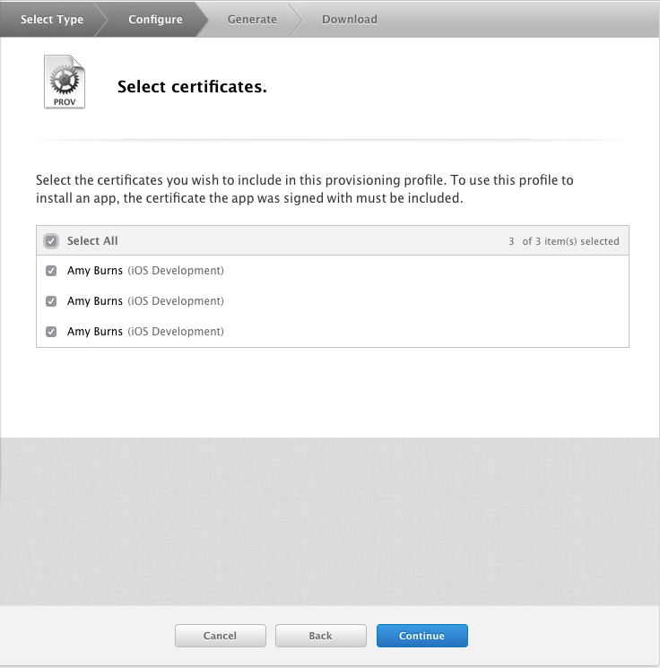

6.	Select the devices to be included in this profile and press **Continue**:

    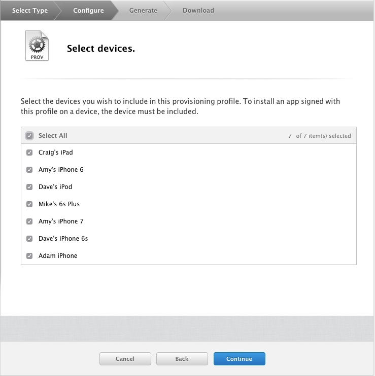

7.	Give the profile a name so that it can be identified and press **Continue** to generate the profile:

    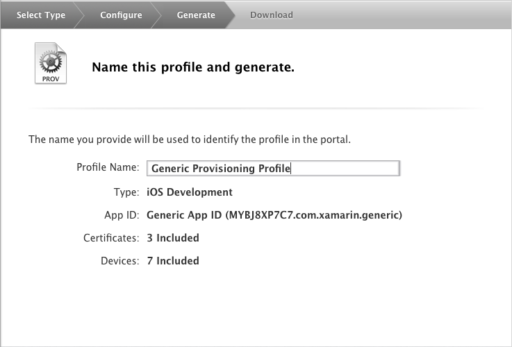

8.	Press the **Download** button to download it, and double-click on the file in Finder to install the provisioning profile.

9. If you are using Visual Studio ensure that the **Manual Provisioning** option is selected.

10.	In Visual Studio for Mac / Visual Studio, browse to **Project Options > Bundle Signing** and set the provisioning profile to the one that was just created:

    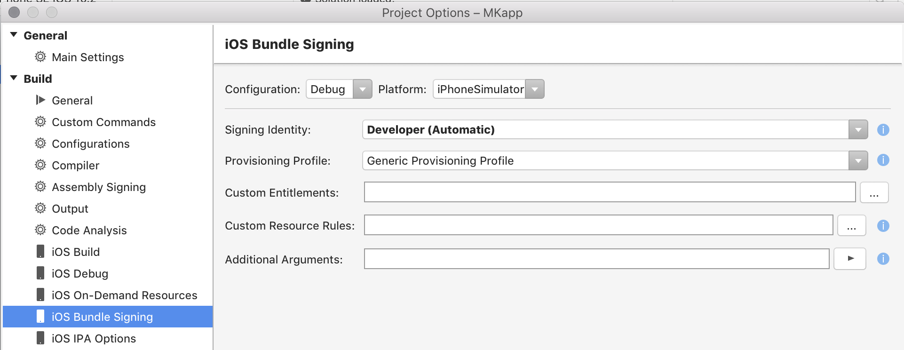

> [!IMPORTANT]
> You may also need to set entitlement keys in the Entitlement.plist file and privacy keys in the Info.plist file. More information on these entitlements is provided in the [Working with Entitlements](~/ios/deploy-test/provisioning/entitlements.md) guide.

<a name="nextsteps" />

## Next Steps

Once a Capability has been enabled on the server side, there is still work that needs to be done to allow your app to use the functionality. The list below describes additional steps that may need to be taken:

*	Use the framework namespace in your app.
*	Add the required entitlements to your App. Information on the entitlements required and how to add them is detailed in the [Introduction to Entitlements](~/ios/deploy-test/provisioning/entitlements.md) guide.

<a name="troubleshooting" />

## Troubleshooting Capabilities

The list below details some of the most common issues that can create roadblocks when developing an app with an app service enabled.

-	Ensure that the correct ID has been properly created and registered in the **Certificates, IDs & Profiles** section of Apple's Developer Portal.
-	Ensure that the Service have been added to the App's (or Extension's) ID and that the service is configured to use the App Group/Merchant ID/Container created above in the **Certificates, IDs & Profiles** of Apple's Developer Portal.
-	Ensure that the Provisioning Profiles and App IDs have been installed and that the App's **Info.plist** (in the Xamarin Project) is using one of the App IDs configured above.
-	Ensure that the App's **Entitlements.plist** file (in the Xamarin Project) has the correct service enabled.
-	Ensure that the appropriate privacy-keys are set in info.plist
-	In the App's **iOS Bundle Signing**, ensure that the **Custom Entitlements** is set to **Entitlements.plist**. This is _not_ the default setting for Debug and iOS Simulator builds.

<a name="summary" />

## Summary

This guide explained Capabilities, or _app services_, and described how they can be enabled in Visual Studio and in the Apple Developer Center. It also detailed how to set up more complicated services such as Wallet, iCloud, Apple Pay, and App Groups. Finally, it covered the next steps for getting set up and simple troubleshooting options.