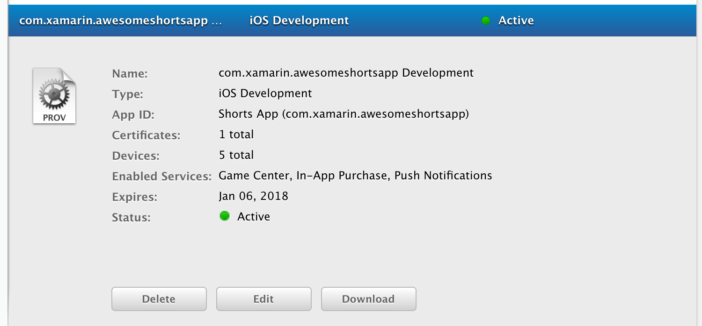

# fastlane for iOS – sigh

> [!IMPORTANT]
> fastlane recommends using [`match`](~/ios/deploy-test/provisioning/fastlane/match.md) for generating and maintaining your provisioning profiles. Use sigh directly only if you want full control and know enough about code signing.

## Overview

Traditionally, device provisioning is performed by each member of a development team via Xcode or on the Apple Developer Portal. It consists of several steps:

- Requesting a development certificate
- Adding a device to the portal
- Creating an App ID
- Creating a provisioning profile
- Downloading Profiles and Certificates

Each of these steps contain variables that need to be addressed, which depend on the type of application you are developing. More information on the steps required to set up a device for development either manually or via Xcode can be found in the [Device Provisioning](~/ios/get-started/installation/device-provisioning/index.md) guide.

This guide introduces fastlane tools as an alternative to using Xcode, and  explains the following:

- [What is sigh?](#whatissigh)
- [Creating an App ID](#appid)
- [Adding New Devices](#newdevices)
- [Using sigh](#using)
- [Additional Options](#options)

> [!NOTE]
> If there is an existing App ID that matches the bundle ID of your app, and if your device exists in the developer portal, you can ignore the steps on [Creating an App ID](#appid) and [Adding a device](#newdevices). In that case, go straight to [Using sigh](#using) to get started.

## Installation

For information on installing fastlane, refer to the Introduction to [fastlane](~/ios/deploy-test/provisioning/fastlane/index.md#Installation) guide.

<a name="whatissigh" />

## What is sigh

sigh provides a terminal interface that allows you to create and renew provisioning profiles for all configurations: Development, App Store Distribution, Ad Hoc Distribution and Enterprise Distribution. It addition it provides a straightforward way to download and repair provisioning profiles.

<a name="appid" />

## Creating an App ID

An App ID can be created with the following command:

    fastlane produce -u your@appleid.com -a com.company.appname --skip_itc

Where `com.company.appname` is the bundle ID of your app, which is found in the Info.plist file of your Xamarin.iOS application, as illustrated below:

[](sigh-images/fastlane-image5.png#lightbox)

The unique App ID must be a reverse-DNS style string. Once it has been created, keep a note of it, as you will need to use it when using sigh later in this guide.

If the app needs to be created on [iTunes Connect](~/ios/deploy-test/app-distribution/app-store-distribution/itunesconnect.md), remove the `--skip_itc` flag from the command above .

<a name="newdevices" />

## Adding New Devices

To add a single device to the developer portal from the command line, enter the following command:

```bash
fastlane run register_device name:"Adam iPhone" udid:"abcdeg1234567"
```

To add more than one device use the `register_devices` command:

```bash
    register_devices(
        devices: {
            "iPhone 6" => "1234567890123456789012345678901234567890",
            "iPad Air 2" => "abcdefghijklmnopqrstvuwxyzabcdefghijklmn"
         }
    )
```

<a name="using" />

## Using sigh

To start using the sigh utility, enter the following command into your terminal:

```bash
fastlane sigh
```

By default this will create an [App Store distribution](~/ios/deploy-test/app-distribution/app-store-distribution/index.md) provisioning profile. To set up your device for development, pass the `--development` flag:

```bash
fastlane sigh --development
```

Enter your Apple ID username when prompted by fastlane. You may also be asked for the password if this is the first time you have used fastlane. If not, it will pull the password environment variable from the keychain.

If your Apple ID is connected to multiple teams they will be displayed here. Select the number that corresponds to the team that you wish to use:

[](sigh-images/fastlane-image2.png#lightbox)

The Team ID can also be passed to the CLI in the following way:

```bash
fastlane sigh -l 2TU993NY9J
```

Enter the [App ID](#appid)) of your app. Remember, this should match the Bundle Identifier in your app's Info.plist.

All devices connected to your account will be added to your provisioning profile.

fastlane will then create, download, and install the provisioning profile for you.

If you browse the Developer Center, you can view the newly created provisioning profile, as illustrated below:

[](sigh-images/fastlane-image10.png#lightbox)

sigh will store provisioning profiles in the current folder, by default. To change the output directory, edit the `output_path`, or do the following:

```bash
fastlane sigh -o "~/Library/MobileDevice/Provisioning Profiles"
```

<a name="options" />

## sigh Additional Options

The following options can be used to give additional support when using sigh:

- To download all provisioning profiles use:

    ````bash
    fastlane sigh download_all
    ```

- To use a specific signing identity for your provisioning profile use:

    ```bash
    fastlane sigh -c "Amy cert"
    ```
    
    Where `Amy cert` is the Code Signing Identity name.


## Related Links

- [fastlane - sigh](https://github.com/fastlane/fastlane/tree/master/sigh#readme)
