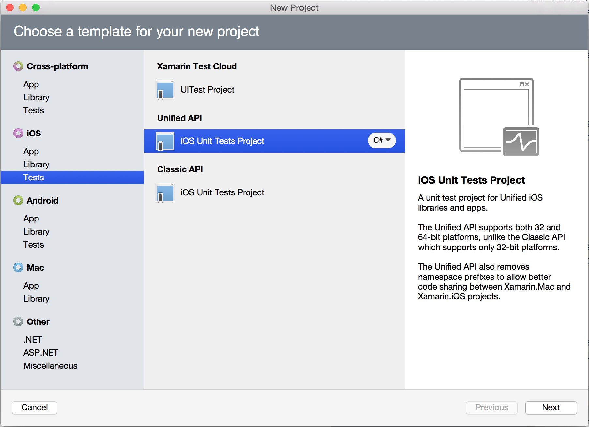
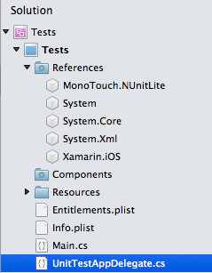
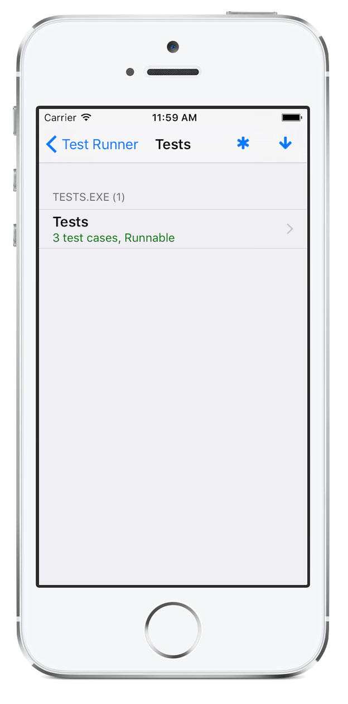
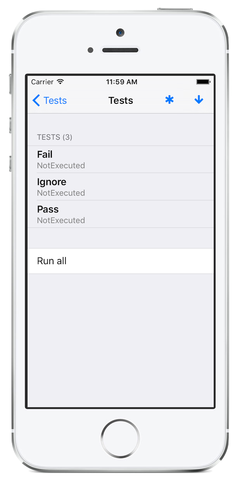
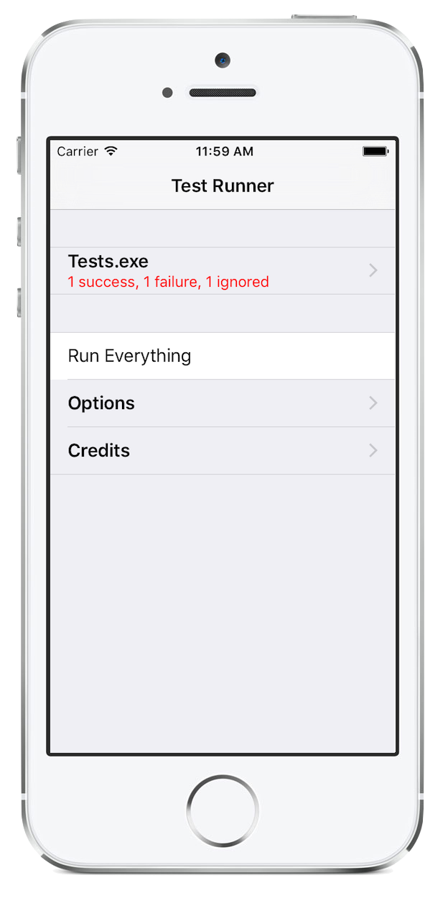
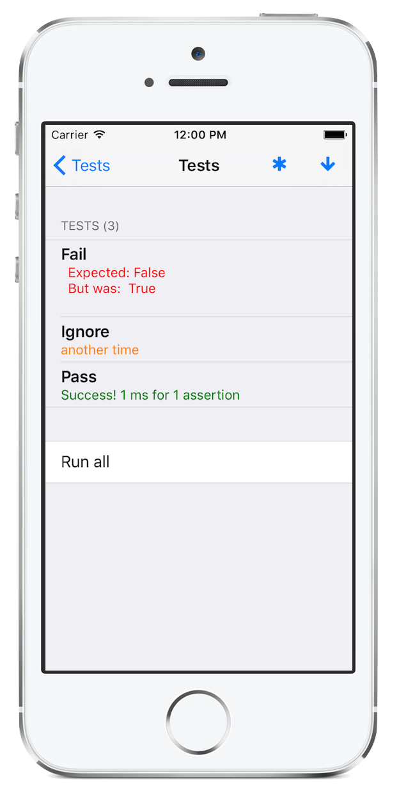
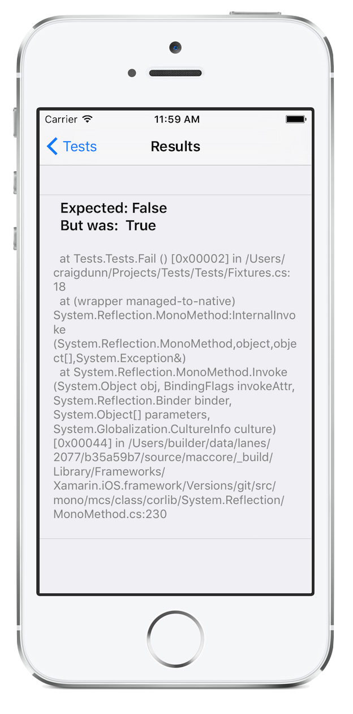

# Unit Testing

This document describes how to create unit tests for your Xamarin.iOS projects.
Unit testing with Xamarin.iOS is done using the Touch.Unit framework that includes
both an iOS test runner as well as a modified version of NUnit called [Touch.Unit](https://github.com/xamarin/Touch.Unit) that
provides a familiar set of APIs for writing unit tests.

## Setting up a Test Project

# [Visual Studio for Mac](#tab/vsmac)

To setup a unit testing framework for your project, all you need to do is to
add to your solution a project of type **iOS Unit Tests Project**. Do this
by right-clicking on your solution and selecting **Add > Add New Project**. From the
list select **iOS > Tests > Unified API > iOS Unit Tests Project**
(you can choose either C# or F#).



# [Visual Studio](#tab/vswin)

To setup a unit testing framework for your project, all you need to do is to
add to your solution a project of type **iOS Unit Tests Project**. Do this
by right-clicking on your solution and selecting **Add > New Project...**. From the
list select **Visual C# > iOS > Unit Test App (iOS)**.


-----

The above will create a basic project that contains a basic runner program
and which references the new MonoTouch.NUnitLite assembly, your project will
look like this:

# [Visual Studio for Mac](#tab/vsmac)



# [Visual Studio](#tab/vswin)


-----

The `AppDelegate.cs` class contains the test runner, and it looks like
this:

```csharp
[Register ("AppDelegate")]
public partial class AppDelegate : UIApplicationDelegate
{
        UIWindow window;
        TouchRunner runner;

        public override bool FinishedLaunching (UIApplication app, NSDictionary options)
        {
                // create a new window instance based on the screen size
                window = new UIWindow (UIScreen.MainScreen.Bounds);
                runner = new TouchRunner (window);

                // register every tests included in the main application/assembly
                runner.Add (System.Reflection.Assembly.GetExecutingAssembly ());

                window.RootViewController = new UINavigationController (runner.GetViewController ());

                // make the window visible
                window.MakeKeyAndVisible ();

                return true;
        }
}
```

## Writing Some Tests

Now that you have the basic shell in place, you should write your first set
of tests.

Tests are written by creating classes that have the `[TestFixture]` attribute
applied to them. Inside each TestFixture class you should apply the `[Test]`
attribute to every method that you want the test runner to invoke. The actual
test fixtures can live in any file in your Tests project.

To quickly get started select **Add/Add New File** and select in the Xamarin.iOS
group **UnitTests**. This will add a skeleton file that contains one passing test,
one failing test and one ignored tests, it looks like this:

```csharp
using System;
using NUnit.Framework;

namespace Fixtures {

        [TestFixture]
        public class Tests {

                [Test]
                public void Pass ()
                {
                        Assert.True (true);
                }

                [Test]
                public void Fail ()
                {
                        Assert.False (true);
                }

                [Test]
                [Ignore ("another time")]
                public void Ignore ()
                {
                        Assert.True (false);
                }
        }
}
```

## Running Your Tests

To run this project inside your solution right click on it and select **Debug Item**
or **Run Item**.

The test runner allows you to see which tests are registered and select
individually which tests can be executed.

[ ](touch.unit-images/02.png) 

[ ](touch.unit-images/03.png) 

[ ](touch.unit-images/04.png)

You can run individual test fixtures by selecting the text fixture from the
nested views, or you can run all of your tests with "Run Everything". If you run
the default test that is supposed to include one passing test, one failure and
one ignored test. This is what the report looks like, and you can drill down
directly to the failing tests and find out more information about the
failure:

[ ](touch.unit-images/05.png) [ ](touch.unit-images/06.png) [ ](touch.unit-images/07.png)

You can also look at the Application Output window in your IDE to see
which tests are being executed and their current status.

## Writing New Tests

NUnitLite is a modified version of the NUnit called [Touch.Unit](https://github.com/xamarin/Touch.Unit)
project. It is a lightweight testing framework for .NET, based on the
ideas in [NUnit](http://nunit.com/) and providing a subset of its features.
It uses minimal resources and will run on resource-restricted platforms such as
those used in embedded and mobile development. You can
[browse the NUnitLite API](https://developer.xamarin.com/api/namespace/NUnitLite/) available to you in
Xamarin.iOS. With the basic skeleton provided by the unit test template, your
main entry point are the [Assert class](https://developer.xamarin.com/api/type/NUnit.Framework.Assert/) methods.

In addition to the assert class methods, the unit testing functionality is
split on the following namespaces that are part of NUnitLite:

-   [NUnit.Framework](https://developer.xamarin.com/api/namespace/NUnit.Framework/)
-   [NUnit.Constraints](https://developer.xamarin.com/api/namespace/NUnit.Framework.Constraints/)
-   [NUnitLite](https://developer.xamarin.com/api/namespace/NUnitLite/)
-   [NUniteLite.Runner](https://developer.xamarin.com/api/namespace/NUnitLite.Runner/)


The Xamarin.iOS-specific unit test runner is documented here:

-   [NUnit.UI.TouchRunner](https://developer.xamarin.com/api/type/NUnit.UI.TouchRunner/)
