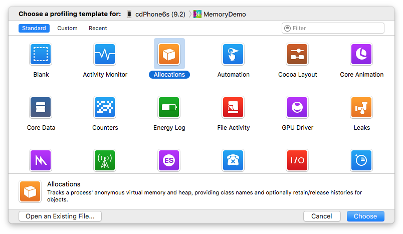
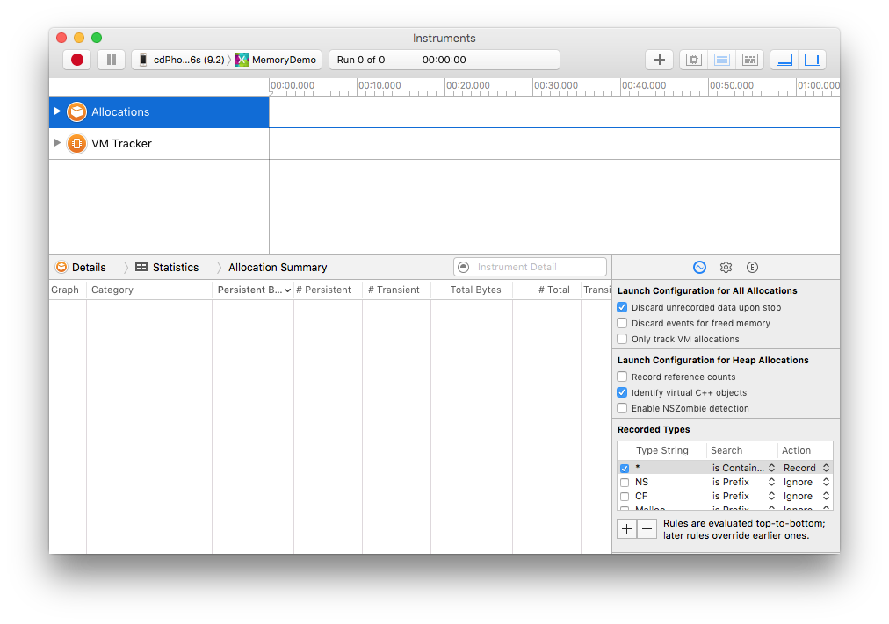
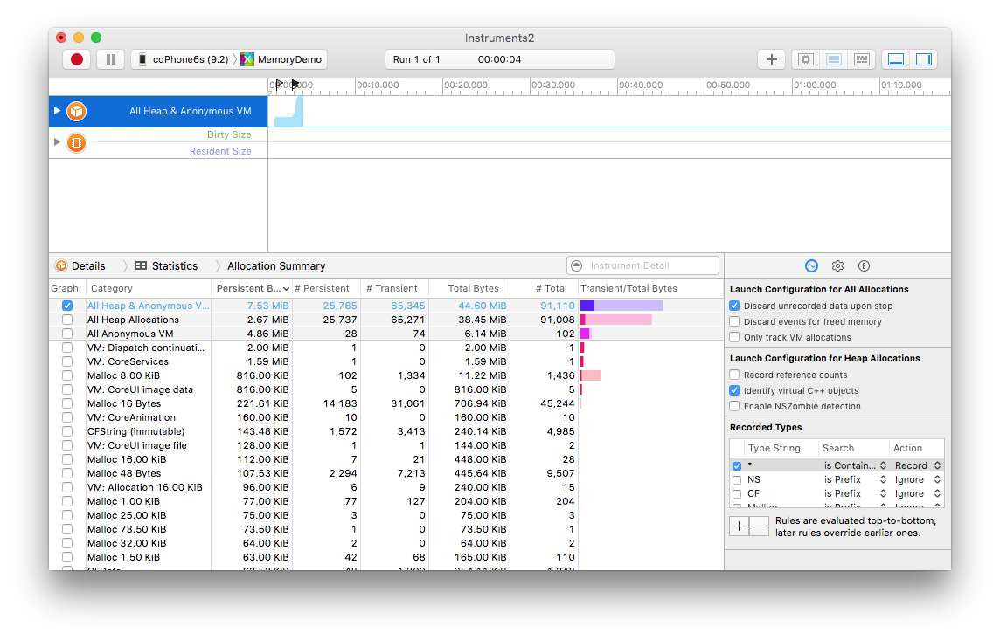

# Profiling Xamarin.iOS Applications with Instruments

Xcode **Instruments** is a tool that can be used to profile Xamarin.iOS apps on a device or
in the simulator. Mono uses its Just-in-Time model to compile code and
Instruments doesn’t interpret this kind of data well, so it can be difficult
to work with output from simulator-based applications that use Instruments.
Because of this issue, this guide will concentrate on how to use the developer app to
interpret Instruments output in this document.

## Requirements

Xcode Instruments only runs on a Mac.

## Opening the Instruments App

Select the device and run the Instruments app:

1. Open the Xamarin.iOS project in Visual Studio for Mac.
2. Select the **Debug|iPhone** configuration.
3. Connect an iOS device to the computer.
4. In the **Run** menu, select **Upload to Device** . The application will now be built and uploaded to the device.
5. In the **Tools** menu, select **Launch Instruments**.

Instruments will now open and display the following dialog:

 

Click to select the **Allocations** template. The other templates are valid, however this article only discusses
the **Allocations** profile template.

Next, select the device and application using the menu at the top of the window:

The iOS device should selected in the menu at the top of the window and
the application to be profiled should be selected next to it (**MemoryDemo** in the screenshot above).

If the device is not listed under in the menu, check the **Console** in Visual Studio for Mac for error messages that might be displayed when the app is deployed to the device. Also, ensure that the device has been provisioned for development through the Xcode Organizer.

Click **Choose** button and the next screen should appear:

Click the record button (red circle at the top-left) to start profiling.

The following screenshot shows an example of profiling using **Instruments**:

## Summary

This guide showed how to start Xcode Instruments to monitor an iOS app from within Visual Studio for Mac. Proceed to the [Instruments Walkthrough](~/ios/deploy-test/walkthrough-apples-instrument.md) for an example of how to diagnose a memory issue using Instruments.

## Related Links

- [Instruments Walkthrough](~/ios/deploy-test/walkthrough-apples-instrument.md)
- [Xamarin.iOS Garbage Collection (blog post)](http://c-sharx.net/2015-04-27-xamarin-ios-the-garbage-collector-and-me/)
