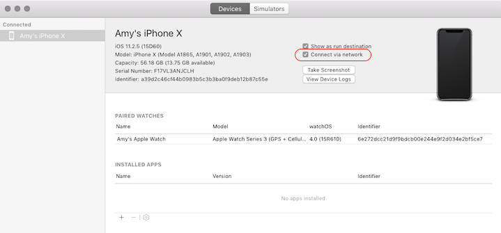

# Wireless Deployment for Xamarin.iOS and tvOS Apps

An important part of the developer workflow is deploying to a device. Xcode 9 introduced the option of deploying to an iOS device or Apple TV through a network, rather than having to hardwire your devices every time you want to deploy and debug your app. This feature has been introduced in Visual Studio for Mac 7.4 and Visual Studio 15.6 release.

This guide details how to pair and deploy to a device over the network.

## Requirements

Wireless deployment is available as a feature in both Visual Studio for Mac and Visual Studio.

To use wireless deployment, you must have the following:

# [Visual Studio for Mac](#tab/macos)

- macOS 10.12.4
- The latest version of Visual Studio for Mac
- Xcode 9.0 or later
- A device with iOS 11.0 or tvOS 11.0 and later

# [Visual Studio](#tab/windows)

- The latest version of Visual Studio
- A device with iOS 11.0 or tvOS 11.0 and later

On your Mac build host, the following components should be installed:

- macOS 10.12.4
- Visual Studio for Mac
- Xcode 9.0 or later

-----

## Connecting a Device

In order to deploy and debug wirelessly on your device, you must pair your iOS device or Apple TV with Xcode on your Mac. Once paired, you can select it from the device target list in Visual Studio. 

The following pairing process should only need to happen once per device. Xcode will retain the connection settings.

<a name="pair" />

### Pairing an iOS device with Xcode

1. Open Xcode and go to **Window > Devices and Simulators**.
2. Plug your iOS device into your Mac using a lightning cable. You may need to select to **Trust This Computer** on your device.
3. Select your device and then select the **Connect via network** checkbox to pair your device:
    

### Pairing an Apple TV with Xcode

1. Ensure your Mac and Apple TV are connected to the same network.

2. Open Xcode and go to **Window > Devices and Simulators**.

3. On the Apple TV, go to **Settings > Remotes and Devices > Remote App and Devices**.

4. Select the Apple TV in the **Discovered** area in Xcode and enter the verification code displayed on the Apple TV.

5. Click the **Connect** button. When it's successfully paired, a network connection icon appears beside the Apple TV.

## Deploy to a Device

When a device is connected wirelessly and ready to be used for deployment, it shows up in the device target list, as if the device were connected through USB.

To test on a physical device, the device must be [provisioned](~/ios/get-started/installation/device-provisioning/index.md). Make sure to do this before attempting to deploy to a device. 

To deploy to an iOS or tvOS device, use the following steps:

1. Ensure that your deployment machine and target device are on the same wireless network. 

2. Select your device from the target device list and run the application.

2. If your device is locked, you'll be prompted to unlock your device. Once the device is unlocked, your app is deployed to the device.

Wireless debugging is automatically enabled after wireless deployment, so you can use previously set breakpoints and continue your debugging workflow as you've always done.

## Troubleshooting

1. Always ensure that your iOS device or Apple TV are connected to the same network as your Mac.

2. If the device does not show in Visual Studio, check Xcode's **Devices and Simulators** window. 

    * If Xcode **does not** show your device as connected, try to [pair](#pair) your device again.

    * If Xcode does show the device as connected, try restarting Visual Studio and your device.

3. If you have not yet done so, you will need to [provision](~/ios/get-started/installation/device-provisioning/index.md) your device.

4. If you have problems with this feature that can't be fixed by the previous steps, please file an issue in [Developer Community](https://developercommunity.visualstudio.com/spaces/41/index.html).

## Related Links

- [Pair a wireless device with Xcode](https://help.apple.com/xcode/mac/9.0/index.html?localePath=en.lproj#/devbc48d1bad)
