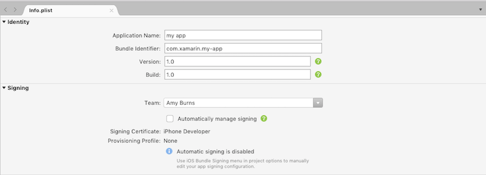
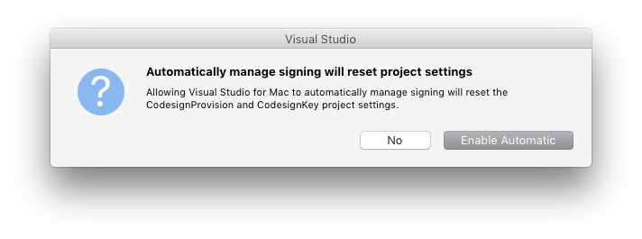

# Automatic Provisioning

_Once Xamarin.iOS has been successfully installed, the next step in iOS development is to provision your iOS device. This guide explores using Automatic Signing in Visual Studio for Mac to request development certificates and profiles._

## Requirements

- Visual Studio for Mac 7.3 or greater
- Xcode 9 or greater

> [!IMPORTANT]
>  This guide illustrates how to use Visual Studio for Mac to set up an Apple device for deployment and how to deploy an application. For manual steps on how to do this or to do this with Visual Studio on Windows, it is recommended that you follow the detailed steps in the [manual provisioning](~/ios/get-started/installation/device-provisioning/manual-provisioning.md) guide.

## Enabling Automatic Signing

Before you start the automatic signing process, you should ensure that you have an Apple ID added in Visual Studio for Mac, as described in the [Apple Account Management](~/cross-platform/macios/apple-account-management.md) guide. Once you've added an Apple ID, you can use any associated _Team_. This allows certificates, profiles, and other IDs to be made against the team. The team ID is also used to create a the prefix for an App ID that will be included in the provisioning profile. Having this allows Apple to verify that you are who you say you are.

To automatically sign your app for deployment on an iOS device, do the following:

1. Open an iOS project in Visual Studio for Mac.

2. Open the **Info.plist** file:

    

3. In the **Signing** section, select your team from the **Team** dropdown:

    

4. Select the **Automatically manage signing** checkbox, as illustrated below. This start the automatic signing process, where Visual Studio for Mac will attempt to generate an App ID, provisioning profile, and a signing identity and set these artifacts to be used for signing. When the checkbox has been selected, the manual controls for selecting signing identities are disabled.

    

5. The following dialog will pop up, advising you that the project file will be modified to use the newly generated certificate and provisioning profile:

    

6. After a few seconds a Signing Certificate and Provisioning profile will be created and displayed:

    

    If the automatic signing fails the **Automatic signing pad** will display the reason for the error.

## Triggering Automatic Provisioning

When automatic signing has been enabled, Visual Studio for Mac will update these artifacts if necessary when any of the following things happen:

* An iOS device is plugged into your mac
    - This automatically checks to see if the device is registered on the Apple Developer Portal. If it isn’t, it will add it and generate a new provisioning profile that contains it.
* The Bundle ID of your app is changed
    - This updates the app ID. A new provisioning profile containing this app ID is created.
* A supported capability is enabled in the Entitlements.plist file.
    - This capability will be added to the app ID and a new provisioning profile with the updated app ID is generated.
    - Not all capabilities are currently supported. For more information on the ones that are supported, check out the [Working with Capabilities](~/ios/deploy-test/provisioning/capabilities/index.md) guide.

## Related Links

- [Free Provisioning](~/ios/get-started/installation/device-provisioning/free-provisioning.md)
- [App Distribution](~/ios/deploy-test/app-distribution/index.md)
- [Troubleshooting](~/ios/deploy-test/troubleshooting.md)
- [Apple - App Distribution Guide](https://developer.apple.com/library/ios/documentation/IDEs/Conceptual/AppDistributionGuide/Introduction/Introduction.html)
