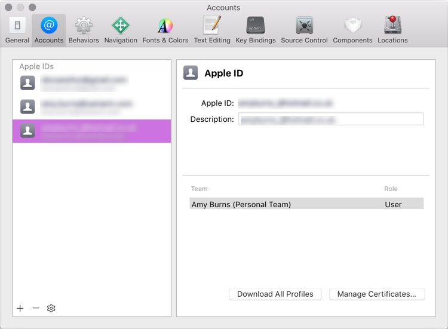
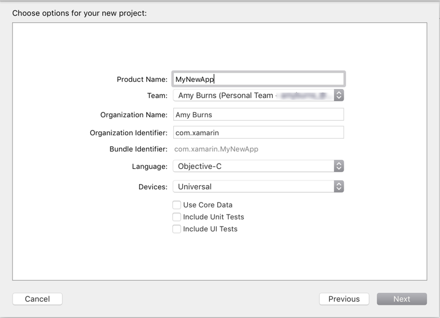
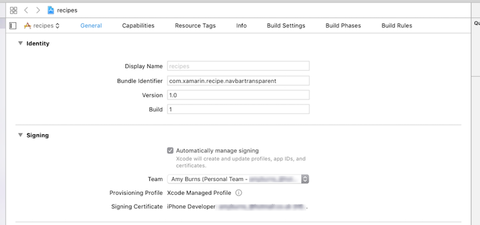
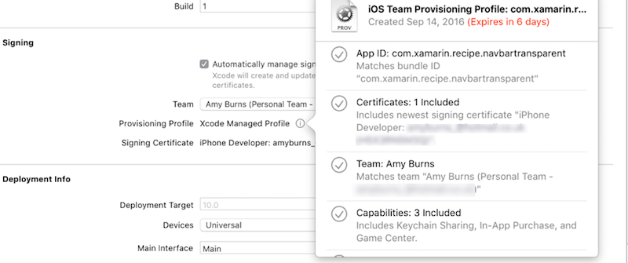
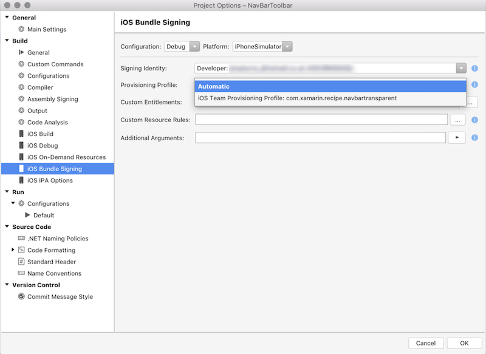

# Free Provisioning for Xamarin.iOS Apps

_With Apple's release of Xcode 7 came an important change for all iOS and Mac developers: free provisioning._

Free provisioning allows developers to deploy their Xamarin.iOS application to their iOS device **without** being part of any **Apple Developer Program**. This is extremely advantageous to developers, as testing on a device allows many benefits over testing on the simulator, including, but not limited to memory, storage, network connectivity among others.

Provisioning without an Apple Developer account must be performed through Xcode, which creates a *Signing Identity* (containing a developer certificate and private key), and a *Provisioning Profile* (containing an explicit App ID and the UDID of your connected iOS device).

## Requirements

To take advantage of deploying your Xamarin.iOS applications to a device with free provisioning you must be using Xcode 7 or above.

**The Apple ID being used must not be connected to any Apple Developer Program.**

The Bundle ID used in your app must be unique and cannot have been used in another app previously. Any Bundle ID used with free provisioning CAN NOT be re-used again. If you have already distributed an app, you cannot provision that app with free provisioning. 

Refer to the [App Distribution guides](~/ios/deploy-test/app-distribution/index.md) for more information.

If your app uses App Services, then you will need to create a provisioning profile as detailed in the [device provisioning](~/ios/get-started/installation/device-provisioning/index.md#appservices) guide. You can see further limitations in the [relevant section](#limitations) below.

## <a name="launching" /> Launching your App

To use free provisioning for deploying an application to a device you will use Xcode to create the signing identity and provisioning profiles, and will then use Visual Studio for Mac or Visual Studio choose the correct profile to sign our app with. Follow the step-by-step walkthrough below to do this:

1. If you do not have an Apple ID, create one at [appleid.apple.com](https://appleid.apple.com/account).
2. Open Xcode and browse to **Xcode > Preferences**.
3. Under **Accounts**, use the **+** button to add your existing Apple ID. It should look similar to the screenshot below:

  

4. Plug in the iOS device you wish to deploy to and create a new blank single-view iOS project in Xcode. Set the **Team** drop-down to the Apple ID that you have just added. It should be in a format similar to `your name (Personal Team - your Apple ID)`:

  

5. Under the **General > Identity** section, make sure that the Bundle Identifier matches _exactly_ the Bundle Identifier of your Xamarin.iOS app and ensure the deployment target matches or is lower than your connected iOS device. This step is extremely important, as Xcode will only create a provisioning profile with an explicit App ID:

  

6. In the Signing section, select **Automatically Manage Signing** and select your team from the drop down list:

  

7. The previous step will automatically generate a provisioning profile and signing identity for you. You can view this by clicking on the information icon next to provisioning profile:

  

8. To test in Xcode, deploy the blank application to your device by clicking the run button.

9. Return to your IDE, with the same device plugged in, and right-click on your Xamarin.iOS project name to open the **Project Options** dialog. Browse to the iOS Bundle Signing section and explicitly set your signing identity and provisioning profile:

  

If you cannot see your signing identity or the correct provisioning profile in your IDE, you may need to restart it.

## <a name="limitations" />Limitations

Apple has imposed a number of limitations on when and how you can use free provisioning to run your application on an iOS device, ensuring that you can only deploy to *your* device. These are listed in this section.

Access to iTunes Connect is also limited and therefore services such as publishing to the App Store and TestFlight are unavailable to developers provisioning their applications freely. An Apple Developer Account (Enterprise or Personal) is required to distribute via Ad Hoc and In-House means.

Provisioning Profiles created in this way will expire after one week, Signing Identities after one year. Furthermore, provisioning profiles will only be created with explicit App IDs and so you will need to follow the instructions [above](#launching) for every app that you wish to install.

Provisioning for most application services is also not possible with free provisioning. This includes:

- Apple Pay
- Game Center
- iCloud
- In-App Purchasing
- Push Notifications
- Wallet (Was Passbook)

A full list is provided by Apple in their [Supported Capabilities](https://developer.apple.com/library/prerelease/ios/documentation/IDEs/Conceptual/AppDistributionGuide/SupportedCapabilities/SupportedCapabilities.html#//apple_ref/doc/uid/TP40012582-CH38-SW1) guide. To Provision your app for use with application services, visit the [Working with Capabilities](~/ios/deploy-test/provisioning/capabilities/index.md) guides.

## Summary

This guide has explored the advantages and limitations of using free provisioning to install applications on an iOS device. It also went through, step-by-step, using free provisioning to install a Xamarin.iOS app.

## Related Links

- [Device Provisioning](~/ios/get-started/installation/device-provisioning/index.md)
- [Provisioning for Application Services](~/ios/get-started/installation/device-provisioning/index.md#appservices)
