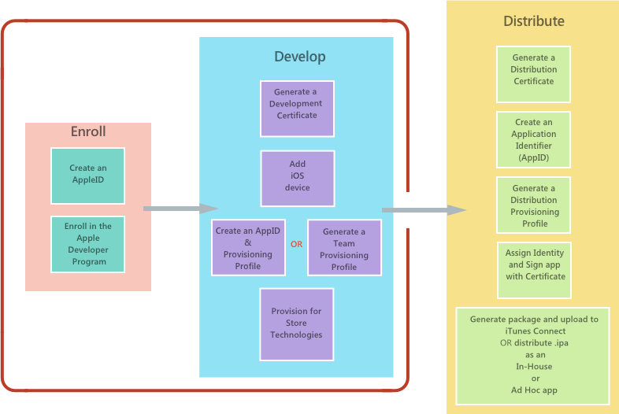

# Device Provisioning

_Once Xamarin.iOS has been successfully installed, the next step in iOS development is to provision your iOS device. This guide will explore requesting development certificates and profiles, working with app services, and deploying an app to device._

While developing a Xamarin.iOS application it is essential to test it by deploying the app to a physical device, in addition to the simulator. Device-only bugs and performance issues can transpire when running on a device, due to hardware limits such as memory or network connectivity. To test on a physical device, the device must be *provisioned*, and Apple must be informed that the device will be used for testing.

The highlighted sections in the image below show the steps required to get set up for iOS provisioning:

After this, the next step is to distribute the application. For more information on deployment, visit the [App Distribution](~/ios/deploy-test/app-distribution/index.md) guides.

Before deploying the application to a device, you need to have an active subscription to Apple's Developer Program, *or* use [Free Provisioning](~/ios/get-started/installation/device-provisioning/free-provisioning.md). Apple offers two program options:

- **Apple Developer Program** – Regardless of whether you are an individual or represent an organization, the Apple Developer Program allows you to develop, test, and distribute apps.
- **Apple Developer Enterprise Program** – The Enterprise program is most suited to organizations that want to develop and distribute apps in-house only. Members of the Enterprise program do not have access to iTunes Connect, and apps created cannot be published to the App Store.

To register for either of these programs, visit the [Apple Developer Portal](https://developer.apple.com/programs/enroll/) to register. Note that to register as an Apple developer, it is necessary to have an [Apple ID](https://appleid.apple.com/). This guide has been created with the assumption that you **are** a member of an Apple Developer Program.

Alternatively, Apple introduced [Free Provisioning](~/ios/get-started/installation/device-provisioning/free-provisioning.md) in Xcode 7 which allows a single application to run on a single device *without* being a member of Apple's Developer Program. There are a number of limitations when provisioning in this way, as detailed [here](~/ios/get-started/installation/device-provisioning/free-provisioning.md#limitations).

Any application that runs on a device needs to include a set of metadata (or *thumbprint*), which contains information about the application and the developer. Apple uses this thumbprint to make sure that the application is not tampered with when deploying to, or running on, a user's device. This is achieved by requiring app developers to register their Apple ID as a developer, and to setup an App ID, request a Certificate, and register the device on which the application will be deployed.

When deploying an application to a device, a Provisioning Profile is also installed on the iOS device. The Provisioning Profile exists to verify the information that the app was signed with at build time and is cryptographically signed by Apple. Together, the Provisioning Profile and 'thumbprint' checks determine if an application can be deployed to a device by checking:

- **Who** (Certificates – has the app been signed with a private key, which has a corresponding public key in the provisioning profile? The certificate also associates the developer with a development team)
- **What** (Individual App ID – Does the Bundle Identifier set in the Info.plist match the App ID in the provisioning profile?)
- **Where** (Devices – Is the device contained in the provisioning profile?)

These steps ensure that everything that is created or used during the development process, including the applications and devices, can be traced back to an Apple Developer account.

<a name="Provisioning_Profile" />

## Provisioning your Device

There are two ways to provision your iOS device:

* **Automatically (Recommended)** – Select the **Automatic Provisioning** scheme in your project to have Visual Studio automatically create and manage your Signing Identities, App IDs, and Provisioning Profiles. For information on how to automatically manage provisioning, see the [Automatic Provisioning](automatic-provisioning.md) guide. This is the recommended way of provisioning an iOS device.

* **Manually** – Signing Identities, App IDs, and Provisioning Profiles can be created and managed via the Apple Developer Portal, as described in [manual provisioning](manual-provisioning.md) guide. These artifacts can then be managed as described in the [Apple Account Management](~/cross-platform/macios/apple-account-management.md) guide.

<a name="appservices" />

## Provisioning for Application Services

Apple provides a selection of special Application Services, also called capabilities, that can be activated for a Xamarin.iOS application. These Application Services must be configured on both the iOS Provisioning Portal when the **App ID** is created and in the **Entitlements.plist** file that is part of the Xamarin.iOS application's project. For information on adding Application Services to your app, refer to the [Introduction to Capabilities](~/ios/deploy-test/provisioning/capabilities/index.md) guide and the [Working with Entitlements](~/ios/deploy-test/provisioning/entitlements.md) guide.

* Create an App ID with the required app services.
* Create a new [provisioning profile](#Provisioning_Profile) that contains this App ID.
* Set Entitlements in the Xamarin.iOS Project

## Related Links

- [Free Provisioning](~/ios/get-started/installation/device-provisioning/free-provisioning.md)
- [App Distribution](~/ios/deploy-test/app-distribution/index.md)
- [Troubleshooting](~/ios/deploy-test/troubleshooting.md)
- [Apple - App Distribution Guide](https://developer.apple.com/library/ios/documentation/IDEs/Conceptual/AppDistributionGuide/Introduction/Introduction.html)
