# Manual provisioning for Xamarin.iOS

_Once Xamarin.iOS has been successfully installed, the next step in iOS development is to provision your iOS device. This guide explores using manual provisioning to set up development certificates and profiles._

> [!NOTE]
> The instructions on this page are relevant for developers who have
> paid access to the Apple Developer Program. If you have a free account,
> please take a look at the [Free provisioning](~/ios/get-started/installation/device-provisioning/free-provisioning.md)
> guide for more information about on-device testing.

## Creating a signing identity

The first step in setting up a development device is to create a signing identity. A signing identity consists of two things:

- A Development Certificate
- A private key

Development certificates and associated [keys](#understanding-certificate-key-pairs) are critical for an iOS developer: they establish your identity with Apple and associate you with a given device and profile for development, akin to putting your digital signature on your applications. Apple checks for certificates to control access to the devices you are allowed to deploy.

Development teams, certificates, and profiles can be managed by accessing the [Certificates, Identifiers & Profiles](https://developer.apple.com/account/overview.action) (login required) section of Apple's Member Center. Apple requires you to have a signing identity to build your code for device or simulator.  

> [!IMPORTANT]
> It is important to note that you can only have two iOS Development certificates at any one time. If you need to create any more, you will need to revoke an existing one. Any machine using a revoked certificate will not be able to sign their app.

To Generate a signing identity, do the following:

1. Login to the  [Certificates, Identifiers, and Profiles section of the Developer Portal](https://developer.apple.com/account/overview.action) and select the **Certificates** section from the  **iOS Apps** column. Then, hit the **+** to create a new certificate:

    

2. Select the **iOS App Development** option for the certificate type and click **Continue**. This screen may look different depending on your account privileges:

    [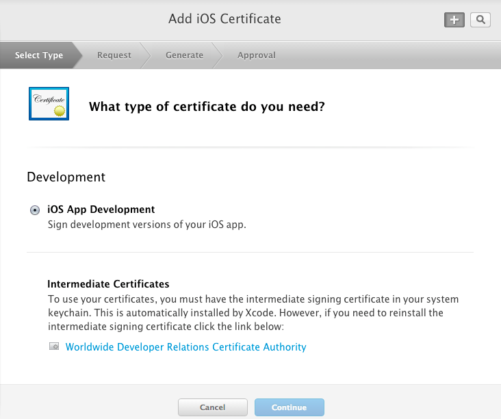](manual-provisioning-images/cert-first.png#lightbox)

3. Request a Certificate Signing Request, which will be uploaded to generate a certificate manually. To do this, launch **Keychain Access** on a Mac. Navigate to the main menu, and select **Certificate Assistant** and  **Request a Certificate from a Certificate Authority...**, as illustrated below:

      [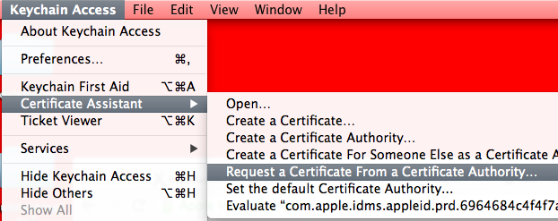](manual-provisioning-images/key-first.png#lightbox)

4. Fill in your information, and select the option to **Save to disk**:

    [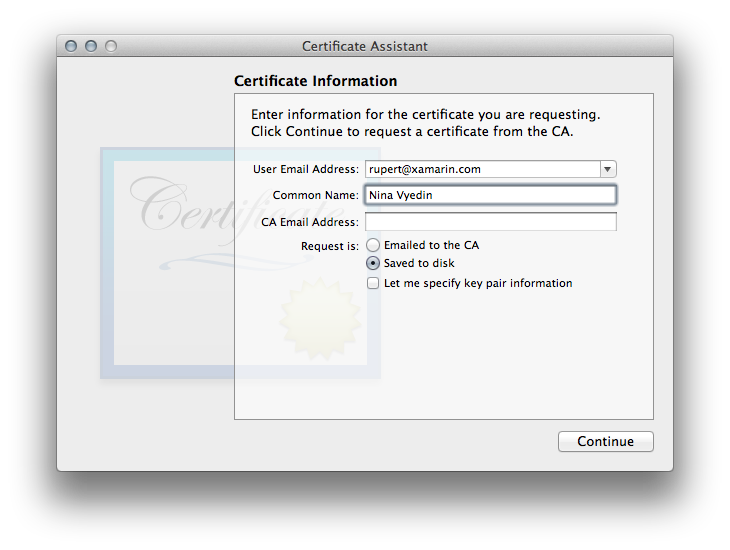](manual-provisioning-images/key-second.png#lightbox)

5. Save the CSR at a location where it can be easily found:

    [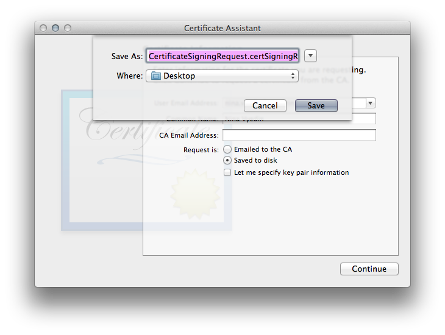](manual-provisioning-images/cert-third.png#lightbox)

6. Return to the Provisioning Portal, upload the Certificate to the portal, and submit:

    [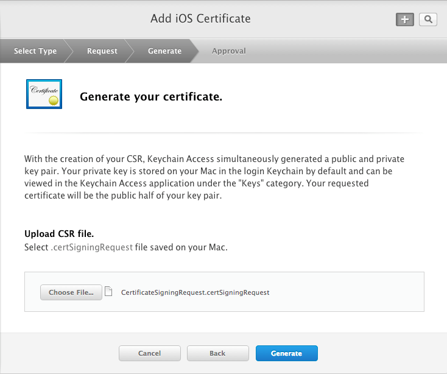](manual-provisioning-images/cert-second.png#lightbox)

    If you do not have admin privileges, the Certificate must be approved by an admin or team agent.

7. Once the Certificate is approved, download it from the Provisioning Portal:

    

8. Double-click on the downloaded Certificate to launch Keychain Access and open the **My Certificates** panel, showing the new certificate(s), and associated private key:

    [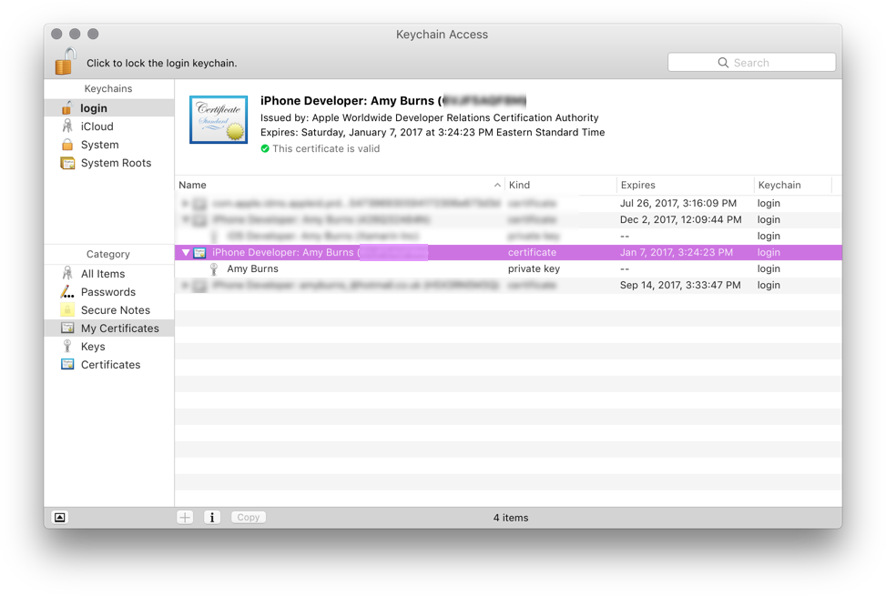](manual-provisioning-images/keychain.png#lightbox)

### Understanding certificate key pairs

# [Visual Studio for Mac](#tab/vsmac)

The Developer Profile contains certificates, their associated keys, and any provisioning profiles associated with the account. There are actually two versions of a Developer Profile — one is on the Developer Portal, and the other lives on a local Mac. The difference between the two is the type of keys they contain: _the Profile on the Portal houses all the public keys associated with your certificates, while the copy on your local Mac contains all the private keys_. For the certificates to be valid, the key pairs must match. Keep a backup of the Developer Profile on the local Mac, because if the private keys are lost, all the certificates and provisioning profiles will need to be regenerated.

# [Visual Studio](#tab/vswin)

The Developer Profile contains certificates, their associated keys, and any provisioning profiles associated with the account. There are actually two versions of a Developer Profile — one is on the Developer Portal, and the other lives on a Mac. The difference between the two is the type of keys they contain: _the Profile on the Portal houses all the public keys associated with your certificates, while the copy on your the Mac contains all the private keys_. For the certificates to be valid, the key pairs must match. Keep a backup of the Developer Profile on from the Xamarin Build Host's Mac, because if the private keys are lost, all the certificates and provisioning profiles will need to be regenerated.

-----

> [!WARNING]
> Losing the certificate and associated keys can be incredibly disruptive, as it will require revoking  existing certificates and re-provisioning any associated devices, including those registered for ad-hoc deployment. After successfully setting up  Development Certificates, export a backup copy and store them in a safe place. For more information on how to do this, refer to the Exporting and Importing Certificates and Profiles section of the [Maintaining Certificates](https://developer.apple.com/library/ios/documentation/IDEs/Conceptual/AppDistributionGuide/MaintainingCertificates/MaintainingCertificates.html) guide in Apple's docs.

<a name="provisioning" />

## Provisioning an iOS Device for development

Now that you’ve established your identity with Apple and have a development certificate, you must set up a provisioning profile and the required entities so it is possible to deploy an app to an Apple device. The device must be running a version of iOS that is supported by Xcode — it may be necessary to update the device, Xcode or both.

<a name="adddevice" />

## Add a device

When creating a provisioning profile for development, we must state which devices can run the application. To enable this, up to 100 devices per calendar year can be added to our Developer Portal, and from here we can select the devices to be added to a particular provisioning profile. Follow the steps below on your Mac to add a device to the Developer Portal

1. Start Xcode.
2. Connect the device to be provisioned to the Mac with its supplied USB cable.
2. From the **Windows** menu select **Devices**:

  [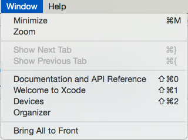](manual-provisioning-images/add01.png#lightbox)

3. Select the desired iOS device from the **DEVICES** list on the left side of the Devices Window.
4. Highlight the **Identifier** string and copy it to the clipboard:

  

5. In Safari, navigate to the [Apple Developer Center](https://developer.apple.com/membercenter/index.action) and log in.
6. Click the **Certificates, Identifiers & Profiles** link:

  [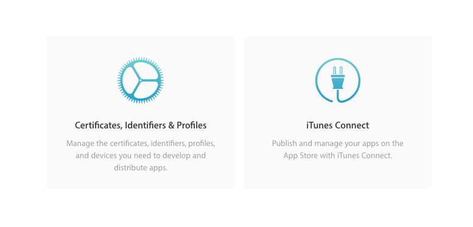](manual-provisioning-images/add03.png#lightbox)

7. Click on the **Devices** link:

  [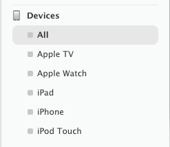](manual-provisioning-images/add04.png#lightbox)

8. Click the **+** button:

  

9. Provide a name for the new device and paste the device **Identifier** that we copied above into the **UUID** field:

  

10. Click the **Continue** button.
11. Finally, review the information and click the **Register** button:

  [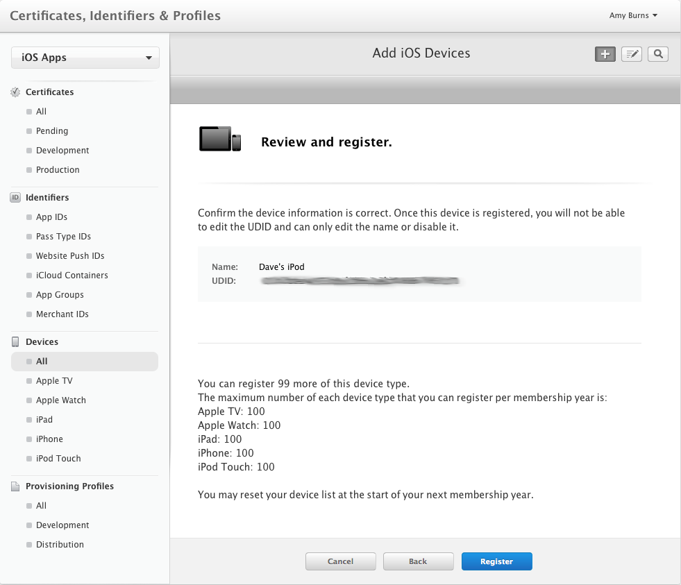](manual-provisioning-images/add07.png#lightbox)

Repeat the above steps for any iOS device that will be used to test or debug a Xamarin.iOS application.

After adding the device to the developer portal, it is necessary to create a provisioning profile and add the device to it.

<a name="provisioningprofile" />

## Creating a development provisioning profile

As with the Development Certificate, Provisioning Profiles can be manually created through the [Certificates, Identifiers & Profiles](https://developer.apple.com/account/overview.action) section of Apple's Members Center.

Before creating a provisioning profile, an *App ID* must be made. An App ID is a reverse-DNS style string that uniquely identifies an application. The steps below will demonstrate how to create a **Wildcard App ID**, which can be used to build and install most applications. **Explicit App IDs** only allow the installation of one application (with the matching bundle ID), and are generally used for certain iOS features such as Apple Pay and HealthKit. For  information on creating Explicit App IDs, refer to the [Working with Capabilities](~/ios/deploy-test/provisioning/capabilities/index.md) guide.

### App ID

1. In the [developer portal](https://developer.apple.com/account/overview.action) browse to the *Certificate, Identifiers and Profiles* section in the Apple Developer Center. Select **App IDs** under **Identifiers**.
2. Click the **+** button and provide a **Name**:

    [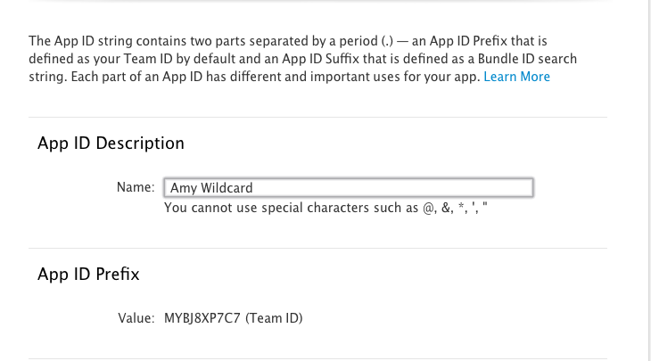](manual-provisioning-images/appid05a.png#lightbox)
3. The App prefix should be preset. Select **Wildcard App ID** for the app suffix. Enter a Bundle ID in the format `com.[DomainName].*`:

  [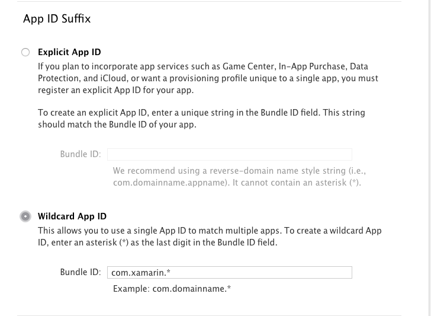](manual-provisioning-images/appid05b.png#lightbox)

3. Click the **Continue** button and following the on screen instructions to create the new App ID.

### Provisioning profile

Once the App ID has been created, the Provisioning Profile can be produced. This Provisioning Profile contains information on *what* app (or apps, if it's a wildcard app ID) this profile relates to, *who* can use the profile (depending on what developer certificates are added), and *what* devices can install the app.

To manually create a provisioning profile for development, do this:

1. Use Safari to browse to the [Apple Developers Member Center](https://developer.apple.com/membercenter/index.action), and under the section *Certificates, Identifiers & Profiles* select Provisioning Profiles.
2. Click the **+** button, in the top right corner to create a new profile.
3. From the **Development** section, select the radio button next to **iOS App Development**, and press **Continue**:

    [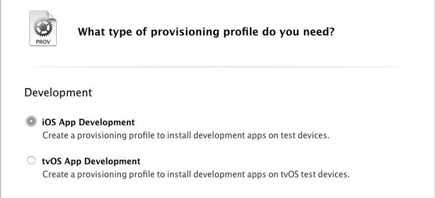](manual-provisioning-images/provisioning-profile01.png#lightbox)
4. From the dropdown menu, select the App ID that to use:

    [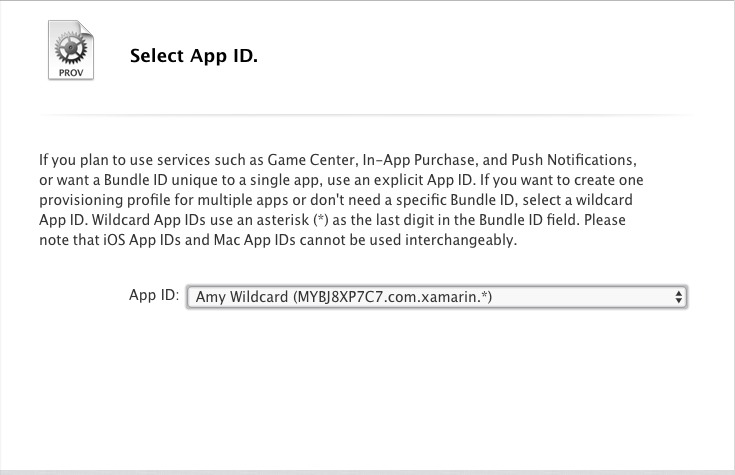](manual-provisioning-images/provisioning-profile02.png#lightbox)
5. Select the Certificate(s) to include in the provisioning profile, and press **Continue**:

    [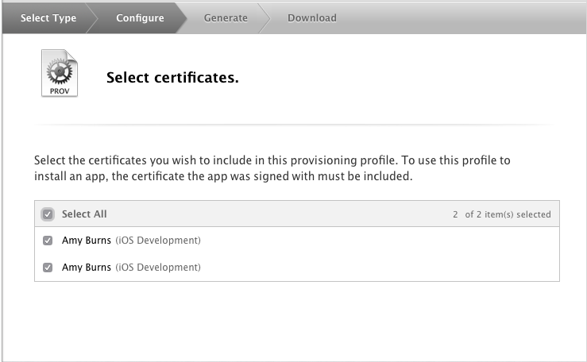](manual-provisioning-images/provisioning-profile03.png#lightbox)
6. Select all the devices that the app will be installed on.

    [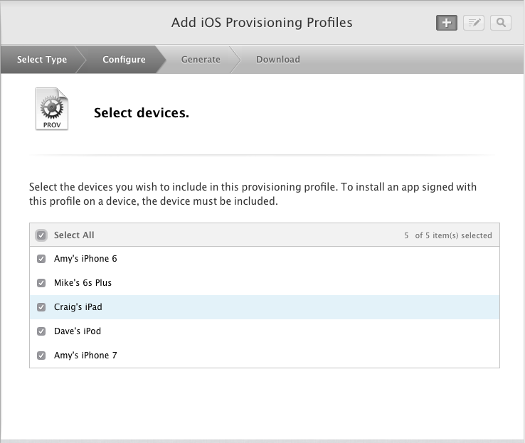](manual-provisioning-images/provisioning-profile04.png#lightbox)
7. Provide the Provisioning Profile with an identifiable a name, and press **Continue** to create the profile:

    [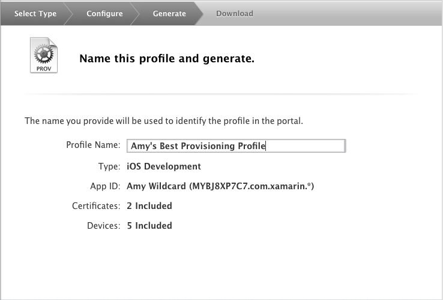](manual-provisioning-images/provisioning-profile05.png#lightbox)
8. Press **Download** to download the provisioning profile onto a Mac:

    [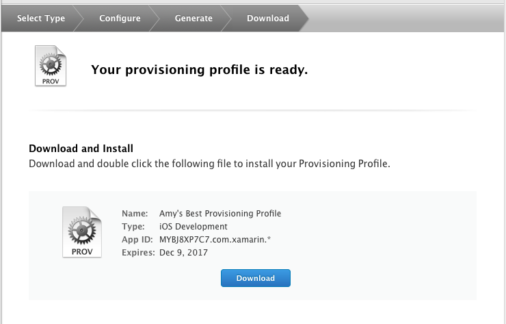](manual-provisioning-images/provisioning-profile06.png#lightbox)
9. Double-click on the file to install the provisioning profile in Xcode. Note that Xcode might not show any visual clues that it has installed the profile except for opening. This can be verified by browsing to **Xcode > Preferences > Accounts**. Select your Apple ID and click **View Details...**. Your new provisioning profile should be listed, as illustrated below:

      [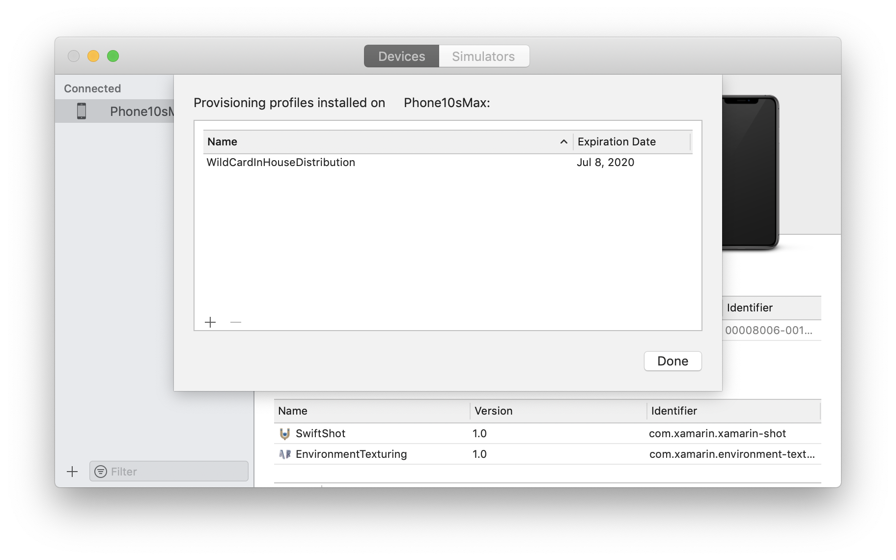](manual-provisioning-images/provisioning-profile07.png#lightbox)

After the provisioning profile has been successfully created it may be necessary to refresh Xcode so that all the development certificates are available to Visual Studio for Mac and Visual Studio.

<a name="download" />

## Downloading profiles and certificates in Xcode

Certificates and provisioning profiles that have been created in the Apple Developer Portal, may not automatically appear in Xcode. Therefore,
it may be necessary to download them so they that they can be accessed by
Visual Studio for Mac and Visual Studio. To update and download any certificates created in the Apple Developer portal, do the following:

1.   Quit Visual Studio for Mac or Visual Studio.
2.   Start Xcode.
3.   Choose  **Xcode Menu > Preferences...**
4.   Click the  **Accounts** tab.
5.   Select a team and click the  **Download Manual Profiles** button:
    [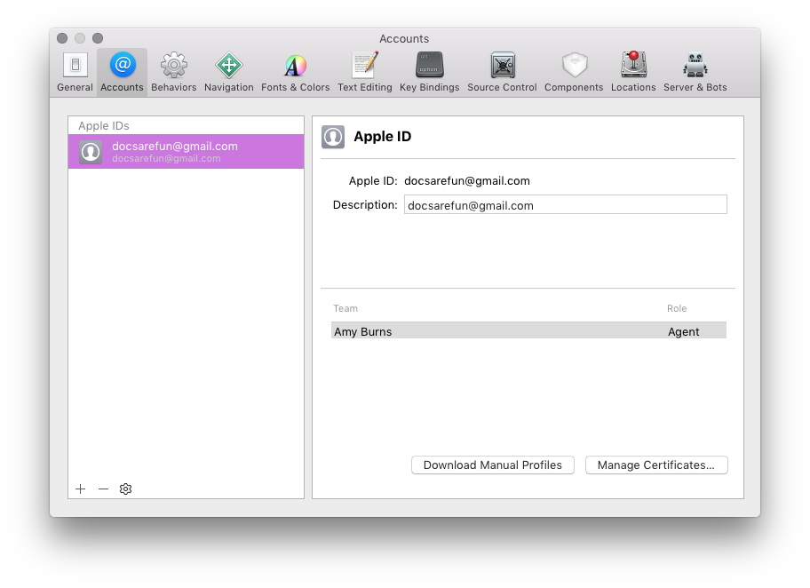](manual-provisioning-images/selectteam1.png#lightbox)

6.   Quit Xcode.
7.  Start Visual Studio for Mac or Visual Studio.

The new certificates or provisioning profiles will be available in Visual Studio for Mac or Visual Studio and ready to use.

# [Visual Studio for Mac](#tab/vsmac)

> [!IMPORTANT]
> It may be necessary to stop and restart Visual Studio for Mac before it will see any new or modified certificates or profiles updated by Xcode.

# [Visual Studio](#tab/vswin)

> [!IMPORTANT]
> It may be necessary to stop and restart Visual Studio before it will see any new or modified certificates or profiles updated by Xcode.

-----

<a name="appservices" />

## Provisioning for application services

Apple provides a selection of special Application Services, also called capabilities, that can be activated for a Xamarin.iOS application. These Application Services must be configured on both the iOS Provisioning Portal when the **App ID** is created and in the **Entitlements.plist** file that is part of the Xamarin.iOS application's project. For information on adding Application Services to your app, refer to the [Introduction to Capabilities](~/ios/deploy-test/provisioning/capabilities/index.md) guide and the [Working with Entitlements](~/ios/deploy-test/provisioning/entitlements.md) guide.

* Create an App ID with the required app services.
* Create a new [provisioning profile](#provisioningprofile) that contains this App ID.
* Set Entitlements in the Xamarin.iOS Project

## Deploying to a device

At this point provisioning should be complete, and the app is ready to be deployed to the device. To do this, follow the steps below:

# [Visual Studio for Mac](#tab/vsmac)

> [!IMPORTANT]
> Before you begin, make sure to select **Manual Provisioning** in the **Info.plist**.

1. Plug the device in to a Mac.
2. In the project's **Info.plist**, make sure the Bundle Identifier matches the App ID (unless the App ID is a wildcard):

  

3. Right-click on the project to view the Project Options dialog and browse to **Build > iOS Bundle Signing**. From the drop-down list next to both the **Signing Identity** and **Provisioning Profile**, verify that Visual Studio for Mac can see the correct profiles, and select a specific identity & profile:

  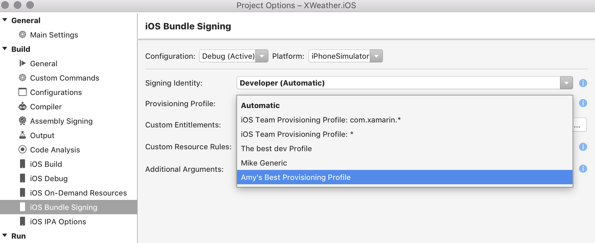

If this is set to **Automatic**, Visual Studio for Mac will select the identity and profile based on the Bundle ID that was set in step #2.

4. Make sure to set the build configuration to **iPhone** / **iPad**, rather the simulator.
5. Click **Run** in Visual Studio for Mac and view the app running on the device.

# [Visual Studio](#tab/vswin)

> [!IMPORTANT]
> Before you begin, make sure to select **Manual Provisioning** in **Project > Provisioning Properties…**.

1. Plug the device in to the Mac build host.
2. In the project's **Info.plist**, make sure the Bundle Identifier matches the App ID:

  

3. Right-click on the project to view the Project Options dialog, and browse to **Build > iOS Bundle Signing**. From the drop-down list next to both the **Signing Identity** and **Provisioning Profile** verify that Visual Studio can see the correct profiles, and select a specific identity & profile.

    If this is set to **Automatic**, Visual Studio will select the identity and profile based on the Bundle ID that was set in step #2.

4. Make sure to set the build configuration to **iPhone** or **iPad**, rather the simulator.
5. Click **Run** in Visual Studio and view the app running on the device.

-----

## Summary

This guide covered the steps required to setup the development environment for Xamarin.iOS. It explored how an application is code signed with information about the developer, their team, the devices that an app can run on, and individual app id.

## Related links

- [Free Provisioning](~/ios/get-started/installation/device-provisioning/free-provisioning.md)
- [App Distribution](~/ios/deploy-test/app-distribution/index.md)
- [Troubleshooting](~/ios/deploy-test/troubleshooting.md)
- [Apple - App Distribution Guide](https://developer.apple.com/library/ios/documentation/IDEs/Conceptual/AppDistributionGuide/Introduction/Introduction.html)
