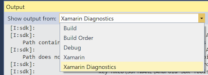
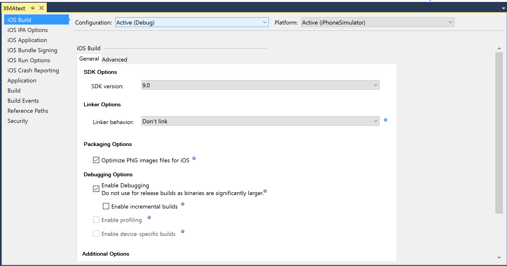
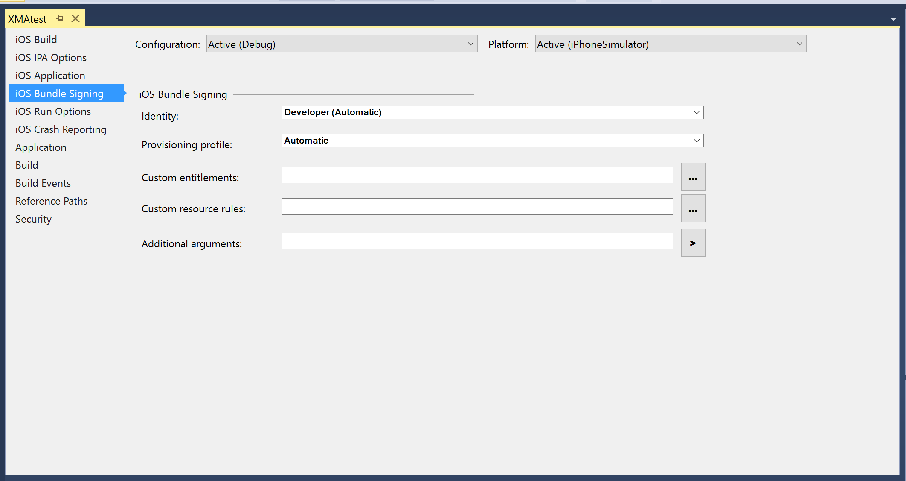
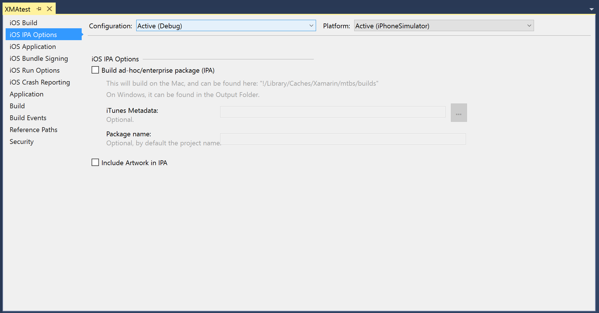
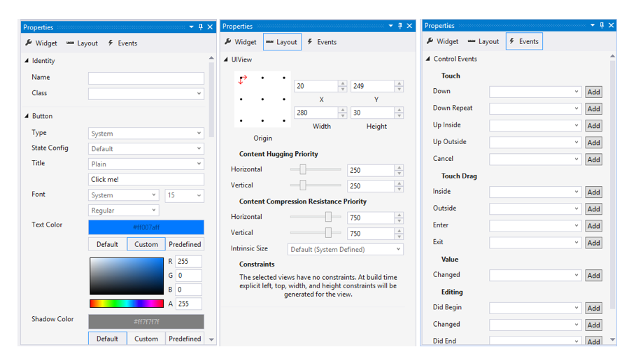
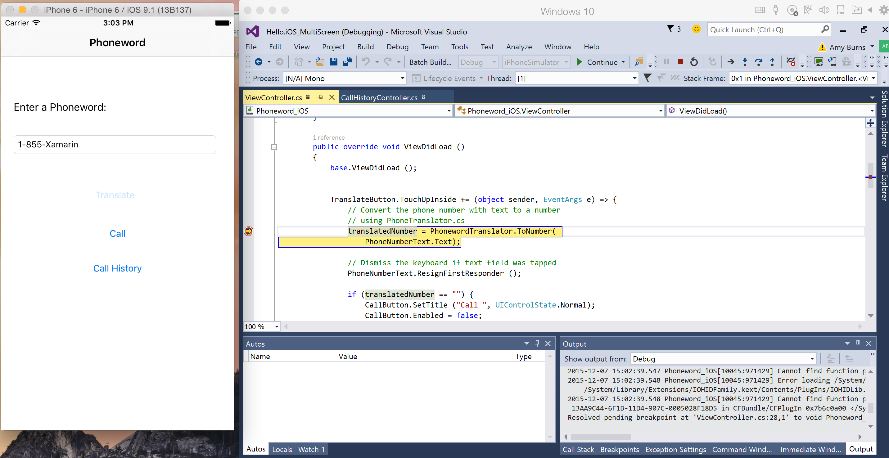
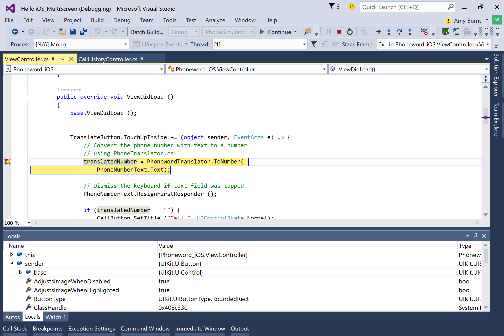

# Introduction to Xamarin.iOS for Visual Studio

_This article shows how to build and test Xamarin iOS applications using Visual Studio. It will explain how to use Visual Studio to create new iOS projects, build an iOS application, and then compile, test, and debug using a networked Mac to host Apple’s compiler and simulator, and Xamarin’s build toolchain._

Xamarin for Windows allows iOS applications to be written and tested within Visual Studio, with a networked Mac providing the build and deployment service.

This article covers the steps to install and configure the Xamarin.iOS tools on each computer to build iOS applications using Visual Studio.

Developing for iOS inside Visual Studio provides a number of benefits:

-  Creation of cross-platform solutions for iOS, Android and Windows applications.
-  Using your favorite Visual Studio tools (such as **Resharper** and **Team Foundation Server**) for all your
cross-platform projects, including iOS source code.
-  Work with a familiar IDE, while taking advantage of Xamarin.iOS bindings of all Apple’s APIs.

<a name="Requirements_and_Installation" />

## Requirements and Installation

There are a few requirements that must be adhered to when developing for iOS in Visual Studio. As briefly mentioned in the overview, a Mac is required to compile IPA files, and applications cannot be deployed to a device without Apple’s certificates and code-signing tools.

There are a number of configuration options available, so you can decide which works best for your development needs. These are listed below:

-  Use a Mac as your main development machine and run a Windows virtual machine with Visual Studio installed. We recommend using
VM software such as [Parallels](http://www.parallels.com/products/desktop/) or [VMWare](http://www.vmware.com/products/fusion/) .
-  Use a Mac just as a build host. In this scenario it would be connected to the same network as a Windows machine with
the [necessary](~/cross-platform/get-started/installation/windows.md#installation) tools installed.

In either case, you should follow these steps:

- [Install Visual Studio for Mac](https://docs.microsoft.com/visualstudio/mac/installation)
- [Install Xamarin tools on Windows](~/cross-platform/get-started/installation/windows.md)

## Connecting to the Mac

To connect Visual Studio to your Mac build host, follow the instructions
in the [Pair to Mac](~/ios/get-started/installation/windows/connecting-to-mac/index.md)
guide.

## Visual Studio Toolbar Overview

Xamarin iOS for Visual Studio adds items to the Standard toolbar and to the new iOS toolbar.
The functions of these toolbars are explained below.

### Standard Toolbar

The controls relevant to Xamarin iOS development are circled in red:

 

-  **Start** - Starts debugging or running the application on the selected platform. There must be a connected Mac (see the status indicator in the iOS toolbar).
-  **Solution Configurations** – Allows you to select the configuration to use (e.g., Debug, Release).
-  **Solution Platforms** - Allows you to select iPhone or iPhoneSimulator for deployment.

### iOS Toolbar

The iOS Toolbar in Visual Studio looks similar in each version of Visual Studio. These are all shown below:

Each item is explained below:

-  **Mac Agent/Connection Manager** – Displays the Xamarin Mac Agent dialog box. This icon will appear *orange* when connecting, and *green* when connected.
-  **Show iOS Simulator** – Brings the iOS Simulator window to the front on the Mac.
-  **Show IPA File on Build Server** – Opens Finder on the Mac to the location of the application’s IPA output file.

## iOS Output Options

### Output Window

There are options in the *Output* pane that you can view to discover build, deployment, and connection messages and errors.

The screenshot below shows the available output windows, which may differ depending on your project type:

- **Xamarin** – This contains information relating solely to Xamarin, such as the connection to the Mac and activation status.

	

- **Xamarin Diagnostics** – This shows more detailed information about your Xamarin project, such as the interaction with and for Android.

	

Other default Visual Studio Output panes like Debug and Build are still available inside the Output view and are used for Debugging Output and MSBuild Output:

-  **Debug**

	

- **Build** & **Build Order**

	

## iOS Project Properties

Visual Studio’s Project Properties can be accessed by right-clicking on the Project name and selecting *Properties* in the context menu. This will let you configure your iOS application, as shown in the screenshot below:

 

-  *iOS Bundle Signing* – connects to the Mac to populate the code signing identities and provisioning profiles:

 

-  *iOS IPA Options* – the IPA file will be saved on the Mac’s file system:

 

-  *iOS Run Options* – Configure additional parameters:

 

## Creating a New Project for iOS Applications

Creating a new iOS project from within Visual Studio is done just like any other project type. Selecting **File > New Project** will open the dialog shown below, illustrating some of the templates available for creating a new iOS project:

Storyboard and .xib files can be edited in Visual Studio using the iOS Designer. To create a Storyboard, choose the one of the Storyboard templates. This will generate a **Main.storyboard** file in the **Solution Explorer** as illustrated by the screenshot below:

To start creating or editing your Storyboard, double-click on `Main.storyboard` to open it in the iOS Designer:

To add objects to your view, use the **Toolbox** pane to drag and drop items onto your Design Surface. The Toolbox can be added by selecting **View > Toolbox**, if not already added. Object properties can be modified, their layouts adjusted, and events can be created by using the **Properties** pane, as illustrated below:

 For more information on using the iOS designer, refer to the [Designer](~/ios/user-interface/designer/index.md) guides.

## Running & Debugging iOS Applications

### Device Logging

In Visual Studio 2017, the Android and iOS log pads are unified.

The new Device Log tool window for Visual Studio allows to show logs for Android and iOS devices. It can be shown by executing any of the following commands:

- **View > Other Windows > Device Log**
- **Tools > iOS > Device Log**
- **iOS toolbar > Device Log**

Once the tool window is shown, the user can select the physical device from the devices dropdown. When a device is selected, logs will automatically be added to the table. Switching between devices will stop and start the device logging.

In order for the devices to appear in the combobox, an iOS project must be loaded. Additionally for iOS, Visual Studio must be [connected to the Mac Server](~/ios/get-started/installation/windows/connecting-to-mac/index.md) to discover the iOS devices connected to the Mac.

This tool window provides: a table of log entries, a dropdown for device selection, a way to clear log entries, a search box, and play/stop/pause buttons.

### Set Debugging Stops

Breakpoints can be set at any point in your application to signal to the debugger to temporarily stop the execution of the program. To set a breakpoint in your Visual Studio, click on the margin area of your editor, next to the line number of the code you wish to break at:

Start debugging, and use the simulator or device to navigate your application to a breakpoint. When a breakpoint is hit, the line will be highlighted and Visual Studio’s normal debugging behavior will be enabled: you can step into, over, or out of the code, examine local variables, or use the Immediate Window.

This screenshot shows the iOS Simulator running next to Visual Studio using Parallels on OS X:

### Examine Local Variables

## Summary

This article described how to use Xamarin iOS for Visual Studio. It listed the various features available for creating,
building, and testing an iOS app from within Visual Studio and walked through building and debugging a simple iOS application.

## Related Links

- [Xamarin.iOS Installation](~/ios/get-started/installation/windows/index.md)
- [Device Provisioning](~/ios/get-started/installation/device-provisioning/index.md)
- [Creating iOS UI in Code](~/ios/app-fundamentals/ios-code-only.md)
- [Connecting a Mac to your Visual Studio environment with XMA (video)](https://university.xamarin.com/lightninglectures/xamarin-mac-agent)
