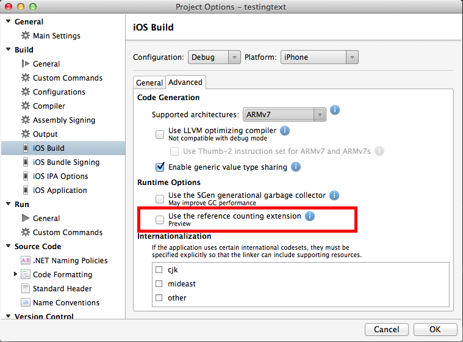

# New Reference Counting System

Xamarin.iOS 9.2.1 introduced the enhanced reference counting system to all applications by default. It can be used to eliminate many memory problems that were difficult to track and fix in earlier versions of Xamarin.iOS.

## Enabling the New Reference Counting System

As of Xamarin 9.2.1 the new ref counting system is enabled to **all** applications by default.

If you are developing an existing application, you can check the .csproj file to ensure that all occurrences of `MtouchUseRefCounting` are set to `true`, like below:

```xml
<MtouchUseRefCounting>true</MtouchUseRefCounting>
```

If it is set to `false` your application will not be using the new tooling.

### Using older versions of Xamarin

Xamarin.iOS 7.2.1 and above features a enhanced preview of our new reference counting system.

**Classic API:**

To enable this new Reference Counting System, check the **Use the reference counting extension** checkbox found in the **Advanced** tab of your project's **iOS Build options**, as shown below: 

[](newrefcount-images/image1.png#lightbox)

Note that these options have been removed in newer versions of Visual Studio for Mac.

 **[Unified API:](~/cross-platform/macios/unified/index.md)**

 The new reference counting extension is required for the Unified API and should be enabled by default. Older versions of your IDE may not have this value checked automatically and you might have to place a check by it yourself.

	
> [!IMPORTANT]
> An earlier version of this feature has been around since MonoTouch 5.2 but was only available for **sgen** as an experimental preview. This new, enhanced version is now also available for the **Boehm** garbage collector.


Historically there have been two kinds of objects managed by Xamarin.iOS: those
	that were merely a wrapper around a native object (peer objects) and those that
	extended or incorporated new functionality (derived objects) - usually by keeping
	extra in-memory state. Previously it was possible that we could augment a peer
	object with state (for example by adding a C# event handler) but that we let the
	object go unreferenced and then collected. This could cause a crash later
	on (e.g. if the Objective-C runtime called back into the managed object).

The new system automatically upgrades peer objects into objects that are
	managed by the runtime when they store any extra information.

This solves various crashes that happened in situations such as this one:

```csharp
class MyTableSource : UITableViewSource {
   public override UITableViewCell GetCell (UITableView tableView, NSIndexPath indexPath) {
        var cell = tableView.DequeueReusableCell ("myId");
        if (cell != null)
                return cell;

        cell = new UITableViewCell (UITableViewCellStyle.Default, "myId");
        var txt = new UITextField ();
        txt.TouchDown += delegate { Console.WriteLine ("...."); };
        cell.ContentView.AddSubview (txt);
        return cell;
   }
}
```

Without the reference count extension this code would crash because `cell`
	becomes collectible, and so its `TouchDown` delegate, which will translate 
	into a dangling pointer.

The reference count extension ensures the managed object stays alive and prevents
	its collection, provided the native object is retained by native code.

The new system also removes the need for *most* private backing fields used in 
	bindings - which is the default approach to keep instance alive. 
	The managed linker is smart enough to remove all those *unneeded* fields from 
	applications using the new reference count extension.

This means that each managed object instances consume less memory than before. 
	It also solves a related problem where some backing fields would hold references that 
	were not needed anymore by the Objective-C runtime, making it hard to reclaim 
	some memory.
