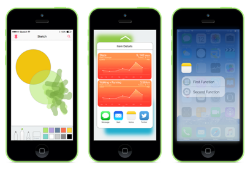
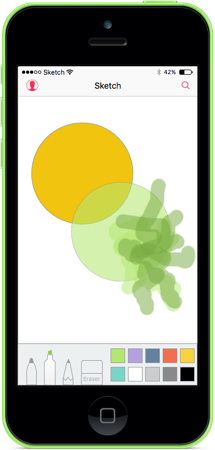
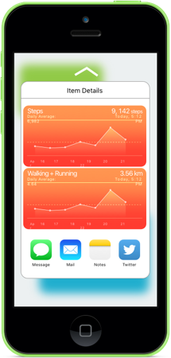
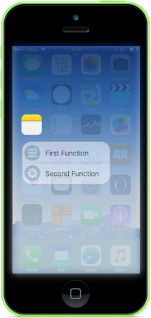
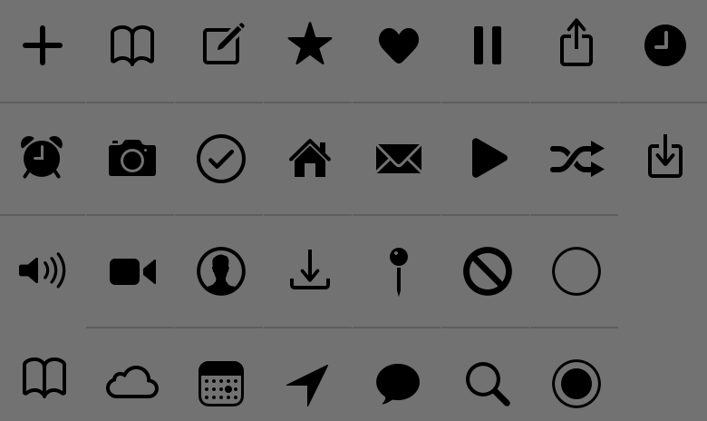

# Introduction to 3D Touch in Xamarin.iOS

_This article covers using the new iPhone 6s and iPhone 6s Plus 3D Touch gestures in your app._

[](3d-touch-images/info01.png#lightbox)

This article will provide and introduction to using the new 3D Touch APIs to add
pressure sensitive gestures to your Xamarin.iOS apps that are running on the new
iPhone 6s and iPhone 6s Plus devices.

With 3D Touch, an iPhone app is now able to not only tell that the user is
touching the device's screen, but it is able to sense how much pressure the user
is exerting and respond to the different pressure levels.

3D Touch provides the following features to your app:

- [Pressure Sensitivity](#Pressure-Sensitivity) - Apps can now measure how hard
  or light the user is touching the screen and take advantage of that information.
  For example, a painting app can make a line thicker or thinner based on how
  hard the user is touching the screen.
- [Peek and Pop](#Peek-and-Pop) - Your app can now let the user interact with its
  data without having to navigate out of their current context. By pressing hard on the screen the screen, they can peek at the item they are interested in
  (like previewing a message). By pressing harder, they can pop into the item.
- [Quick Actions](#Quick-Actions) - Think of Quick Actions like the contextual menus
  that can be popped-up when a user right-clicks on an item in a desktop app.
  Using Quick Actions, you can add shortcuts
  to functions in your app directly from the app icon on the Home screen.
- [Testing 3D Touch in the Simulator](#Testing-3D-Touch-in-the-Simulator) - With the correct Mac hardware, you can test 3D Touch enabled apps in the iOS Simulator.

<a name="Pressure-Sensitivity" />

## Pressure Sensitivity

As stated above, by using new properties of the [UITouch](xref:UIKit.UITouch) class you can measure the amount of pressure the user is applying to the iOS device's screen and use this information in your user interface. For example, making a brush stroke more translucent or opaque based on the amount of pressure.

[](3d-touch-images/pressure01.png#lightbox)

As a result of 3D Touch, if your app is running on iOS 9 (or greater) and the iOS device is capable of supporting 3D Touch, changes in pressure will cause the `TouchesMoved` event to be raised.

For example, when monitoring the `TouchesMoved` event of a [UIView](xref:UIKit.UIView), you can use the following code to get the current pressure that the user is applying to the screen:

```csharp
public override void TouchesMoved (NSSet touches, UIEvent evt)
{
    base.TouchesMoved (touches, evt);
    UITouch touch = touches.AnyObject as UITouch;
    if (touch != null)
    {
        // Get the pressure
        var force = touch.Force;
        var maxForce = touch.MaximumPossibleForce;

        // Do something with the touch and the pressure
        ...
    }
}
```

The `MaximumPossibleForce` property returns the highest possible value for the `Force` property of the [UITouch](xref:UIKit.UITouch) based on the iOS device that the app is running on.

> [!IMPORTANT]
> Changes in pressure will cause the `TouchesMoved` event to be raised, even if the X/Y coordinates have not changed. Because of this change in behavior, your iOS apps should be prepared for the `TouchesMoved` event to be invoked more often and for the X/Y coordinates to be the same as the last `TouchesMoved` call.


For more information, please see Apple's [TouchCanvas: Using UITouch efficiently and effectively](https://developer.apple.com/library/prerelease/ios/samplecode/TouchCanvas/)
sample app and [UITouch Class Reference](https://developer.apple.com/library/prerelease/ios/documentation/UIKit/Reference/UITouch_Class/).

<a name="Peek-and-Pop" />

## Peek and Pop

3D Touch provides new ways for a user to interact with information within your app quicker than ever, without having to navigate from their current location.

For example, if your app is displaying a table of messages, the user can press hard on an item to preview its content in an overlay view (which Apple refers to as a *Peek*).

[](3d-touch-images/peekandpop01.png#lightbox)

If the user presses harder, they will enter the regular message view (which is referred to as *Pop*-ping into the view).

### Checking for 3D Touch Availability

When working with a `UIViewController` you can use the following code to see if the iOS device the app is running on supports 3D Touch:

```csharp
public override void TraitCollectionDidChange(UITraitCollection previousTraitCollection)
{
    //Important: call the base function
    base.TraitCollectionDidChange(previousTraitCollection);

    //See if the new TraitCollection value includes force touch
    if (TraitCollection.ForceTouchCapability == UIForceTouchCapability.Available) {
        //Do something with 3D touch, for instance...
        RegisterForPreviewingWithDelegate (this, View);
        ...
```

This method may be called before *or after* `ViewDidLoad()`.

### Handling Peek and Pop

On an iOS device that can handle 3D Touch, we can use an instance of the  `UIViewControllerPreviewingDelegate` class to handle the display of **Peek** and **Pop** item details. For example, if we had a Table View Controller called `MasterViewController` we could use the following code to support **Peek** and **Pop**:

```csharp
using System;
using System.Collections.Generic;
using UIKit;
using Foundation;
using CoreGraphics;

namespace DTouch
{
    public class PreviewingDelegate : UIViewControllerPreviewingDelegate
    {
        #region Computed Properties
        public MasterViewController MasterController { get; set; }
        #endregion

        #region Constructors
        public PreviewingDelegate (MasterViewController masterController)
        {
            // Initialize
            this.MasterController = masterController;
        }

        public PreviewingDelegate (NSObjectFlag t) : base(t)
        {
        }

        public PreviewingDelegate (IntPtr handle) : base (handle)
        {
        }
        #endregion

        #region Override Methods
        /// Present the view controller for the "Pop" action.
        public override void CommitViewController (IUIViewControllerPreviewing previewingContext, UIViewController viewControllerToCommit)
        {
            // Reuse Peek view controller for details presentation
            MasterController.ShowViewController(viewControllerToCommit,this);
        }

        /// Create a previewing view controller to be shown at "Peek".
        public override UIViewController GetViewControllerForPreview (IUIViewControllerPreviewing previewingContext, CGPoint location)
        {
            // Grab the item to preview
            var indexPath = MasterController.TableView.IndexPathForRowAtPoint (location);
            var cell = MasterController.TableView.CellAt (indexPath);
            var item = MasterController.dataSource.Objects [indexPath.Row];

            // Grab a controller and set it to the default sizes
            var detailViewController = MasterController.Storyboard.InstantiateViewController ("DetailViewController") as DetailViewController;
            detailViewController.PreferredContentSize = new CGSize (0, 0);

            // Set the data for the display
            detailViewController.SetDetailItem (item);
            detailViewController.NavigationItem.LeftBarButtonItem = MasterController.SplitViewController.DisplayModeButtonItem;
            detailViewController.NavigationItem.LeftItemsSupplementBackButton = true;

            // Set the source rect to the cell frame, so everything else is blurred.
            previewingContext.SourceRect = cell.Frame;

            return detailViewController;
        }
        #endregion
    }
}
```

The `GetViewControllerForPreview` method is used to perform the **Peek** operation. It gains access to the table cell and backing data and then loads the `DetailViewController` from the current Storyboard. By setting the `PreferredContentSize` to (0,0) we are asking for the default **Peek** view size. Finally, we blur everything but the cell we are displaying with `previewingContext.SourceRect = cell.Frame` and we return the new view for display.

The `CommitViewController` reuses the view we created in the **Peek** for the **Pop** view when the user presses harder.

### Registering for Peek and Pop

From the View Controller that we want to allow the user to **Peek** and **Pop** items from, we need to register for this service. In the example given above of a Table View Controller (`MasterViewController`), we would use the following code:

```csharp
public override void ViewDidLoad ()
{
    base.ViewDidLoad ();

    // Check to see if 3D Touch is available
    if (TraitCollection.ForceTouchCapability == UIForceTouchCapability.Available) {
        // Register for Peek and Pop
        RegisterForPreviewingWithDelegate(new PreviewingDelegate(this), View);
    }
    ...

}
```

Here we are calling the `RegisterForPreviewingWithDelegate` method with an instance of the `PreviewingDelegate` we created above. On iOS devices that support 3D Touch, the user can press hard on an item to Peek at it. If they press even harder, the item will Pop into it standard display view.

For more information, please see our [iOS 9 ApplicationShortcuts Sample](https://docs.microsoft.com/samples/xamarin/ios-samples/ios9-viewcontrollerpreview) and Apple's [ViewControllerPreviews: Using the UIViewController previewing APIs](https://developer.apple.com/library/prerelease/ios/samplecode/ViewControllerPreviews/Introduction/Intro.html)
sample app, [UIPreviewAction Class Reference](https://developer.apple.com/library/prerelease/ios/documentation/UIKit/Reference/UIPreviewAction_Class/), [UIPreviewActionGroup Class Reference](https://developer.apple.com/library/prerelease/ios/documentation/UIKit/Reference/UIPreviewActionGroup_Class/) and [UIPreviewActionItem Protocol Reference](https://developer.apple.com/library/prerelease/ios/documentation/UIKit/Reference/UIPreviewActionItem_Protocol/).

<a name="Quick-Actions" />

## Quick Actions

Using 3D Touch and Quick Actions, you can add common, quick and easy to access
shortcuts to functions in your app from the Home screen icon on the iOS device.

As stated above, you can think of Quick Actions like the contextual menus that
can be popped-up when a user right-clicks on an item in a desktop app. You should
use Quick Actions to provide shortcuts to the most common functions or features
of your app.

[](3d-touch-images/quickactions01.png#lightbox)


### Defining Static Quick Actions

If one or more of the Quick Actions required by your app are static and do not need to change, you can define them in the app's `Info.plist` file. Edit this file in an external editor and add the following keys:

```xml
<key>UIApplicationShortcutItems</key>
<array>
    <dict>
        <key>UIApplicationShortcutItemIconType</key>
        <string>UIApplicationShortcutIconTypeSearch</string>
        <key>UIApplicationShortcutItemSubtitle</key>
        <string>Will search for an item</string>
        <key>UIApplicationShortcutItemTitle</key>
        <string>Search</string>
        <key>UIApplicationShortcutItemType</key>
        <string>com.company.appname.000</string>
    </dict>
    <dict>
        <key>UIApplicationShortcutItemIconType</key>
        <string>UIApplicationShortcutIconTypeShare</string>
        <key>UIApplicationShortcutItemSubtitle</key>
        <string>Will share an item</string>
        <key>UIApplicationShortcutItemTitle</key>
        <string>Share</string>
        <key>UIApplicationShortcutItemType</key>
        <string>com.company.appname.001</string>
    </dict>
</array>
```

Here we are defining two static Quick Action items with the following keys:

- `UIApplicationShortcutItemIconType` - Defines the icon that will be displayed by the Quick Action item as one of the following values:
  - `UIApplicationShortcutIconTypeAdd`
  - `UIApplicationShortcutIconTypeAlarm`
  - `UIApplicationShortcutIconTypeAudio`
  - `UIApplicationShortcutIconTypeBookmark`
  - `UIApplicationShortcutIconTypeCapturePhoto`
  - `UIApplicationShortcutIconTypeCaptureVideo`
  - `UIApplicationShortcutIconTypeCloud`
  - `UIApplicationShortcutIconTypeCompose`
  - `UIApplicationShortcutIconTypeConfirmation`
  - `UIApplicationShortcutIconTypeContact`
  - `UIApplicationShortcutIconTypeDate`
  - `UIApplicationShortcutIconTypeFavorite`
  - `UIApplicationShortcutIconTypeHome`
  - `UIApplicationShortcutIconTypeInvitation`
  - `UIApplicationShortcutIconTypeLocation`
  - `UIApplicationShortcutIconTypeLove`
  - `UIApplicationShortcutIconTypeMail`
  - `UIApplicationShortcutIconTypeMarkLocation`
  - `UIApplicationShortcutIconTypeMessage`
  - `UIApplicationShortcutIconTypePause`
  - `UIApplicationShortcutIconTypePlay`
  - `UIApplicationShortcutIconTypeProhibit`
  - `UIApplicationShortcutIconTypeSearch`
  - `UIApplicationShortcutIconTypeShare`
  - `UIApplicationShortcutIconTypeShuffle`
  - `UIApplicationShortcutIconTypeTask`
  - `UIApplicationShortcutIconTypeTaskCompleted`
  - `UIApplicationShortcutIconTypeTime`
  - `UIApplicationShortcutIconTypeUpdate`

  

- `UIApplicationShortcutItemSubtitle` - Defines the subtitle for the item.
- `UIApplicationShortcutItemTitle` - Defines the title for the item.
- `UIApplicationShortcutItemType` - Is a string value that we will use to identify the item in our app. See the following section for more information.

> [!IMPORTANT]
> Quick Action shortcut items that are set in the `Info.plist` file cannot be accessed with the `Application.ShortcutItems` property. They are only passed in to the `HandleShortcutItem` event handler.


### Identifying Quick Action Items

As you saw above, when you defined your Quick Action items in your app's `Info.plist`, you assigned a string value to the `UIApplicationShortcutItemType` key to identify them.

To make those identifiers easier to work with in code, add an class called `ShortcutIdentifier` to your app's project and make it look like the following:

```csharp
using System;

namespace AppSearch
{
    public static class ShortcutIdentifier
    {
        public const string First = "com.company.appname.000";
        public const string Second = "com.company.appname.001";
        public const string Third = "com.company.appname.002";
        public const string Fourth = "com.company.appname.003";
    }
}
```

<a name="Handling-a-Quick-Action" />

### Handling a Quick Action

Next, you need to modify your app's `AppDelegate.cs` file to handle the user selecting a Quick Action item from your app's icon on the Home screen.

Make the following edits:

```csharp
using System;
...

public UIApplicationShortcutItem LaunchedShortcutItem { get; set; }

public bool HandleShortcutItem(UIApplicationShortcutItem shortcutItem) {
    var handled = false;

    // Anything to process?
    if (shortcutItem == null) return false;

    // Take action based on the shortcut type
    switch (shortcutItem.Type) {
    case ShortcutIdentifier.First:
        Console.WriteLine ("First shortcut selected");
        handled = true;
        break;
    case ShortcutIdentifier.Second:
        Console.WriteLine ("Second shortcut selected");
        handled = true;
        break;
    case ShortcutIdentifier.Third:
        Console.WriteLine ("Third shortcut selected");
        handled = true;
        break;
    case ShortcutIdentifier.Fourth:
        Console.WriteLine ("Forth shortcut selected");
        handled = true;
        break;
    }

    // Return results
    return handled;
}

public override bool FinishedLaunching (UIApplication application, NSDictionary launchOptions)
{
    var shouldPerformAdditionalDelegateHandling = true;

    // Get possible shortcut item
    if (launchOptions != null) {
        LaunchedShortcutItem = launchOptions [UIApplication.LaunchOptionsShortcutItemKey] as UIApplicationShortcutItem;
        shouldPerformAdditionalDelegateHandling = (LaunchedShortcutItem == null);
    }

    return shouldPerformAdditionalDelegateHandling;
}

public override void OnActivated (UIApplication application)
{
    // Handle any shortcut item being selected
    HandleShortcutItem(LaunchedShortcutItem);

    // Clear shortcut after it's been handled
    LaunchedShortcutItem = null;
}

public override void PerformActionForShortcutItem (UIApplication application, UIApplicationShortcutItem shortcutItem, UIOperationHandler completionHandler)
{
    // Perform action
    completionHandler(HandleShortcutItem(shortcutItem));
}
```

First, we define a public `LaunchedShortcutItem` property to track the last selected Quick Action item by the user. Then, we override the `FinishedLaunching` method and see if `launchOptions` have been passed and if they contains a Quick Action item. If they do, we store the Quick Action in the `LaunchedShortcutItem` property.

Next, we override the `OnActivated` method and pass any selected Quick Launch item to the `HandleShortcutItem` method to be acted on. Currently we are only writing a message to the **Console**. In a real app, you'd handle what ever action was required. After the action has been taken, the `LaunchedShortcutItem` property is cleared.

Finally, if your app was already running, the `PerformActionForShortcutItem` method would be called to handle the Quick Action item so we need to override it and call our `HandleShortcutItem` method here as well.


### Creating Dynamic Quick Action Items

In addition to defining static Quick Action items in your app's `Info.plist` file, you can create dynamic on-the-fly Quick Actions. To define two new dynamic Quick Actions, edit your `AppDelegate.cs` file again and modify the `FinishedLaunching` method to look like the following:

```csharp
public override bool FinishedLaunching (UIApplication application, NSDictionary launchOptions)
{
    var shouldPerformAdditionalDelegateHandling = true;

    // Get possible shortcut item
    if (launchOptions != null) {
        LaunchedShortcutItem = launchOptions [UIApplication.LaunchOptionsShortcutItemKey] as UIApplicationShortcutItem;
        shouldPerformAdditionalDelegateHandling = (LaunchedShortcutItem == null);
    }

    // Add dynamic shortcut items
    if (application.ShortcutItems.Length == 0) {
        var shortcut3 = new UIMutableApplicationShortcutItem (ShortcutIdentifier.Third, "Play") {
            LocalizedSubtitle = "Will play an item",
            Icon = UIApplicationShortcutIcon.FromType(UIApplicationShortcutIconType.Play)
        };

        var shortcut4 = new UIMutableApplicationShortcutItem (ShortcutIdentifier.Fourth, "Pause") {
            LocalizedSubtitle = "Will pause an item",
            Icon = UIApplicationShortcutIcon.FromType(UIApplicationShortcutIconType.Pause)
        };

        // Update the application providing the initial 'dynamic' shortcut items.
        application.ShortcutItems = new UIApplicationShortcutItem[]{shortcut3, shortcut4};
    }

    return shouldPerformAdditionalDelegateHandling;
}
```

Now we are checking to see if the `application` already contains a set of dynamically created `ShortcutItems`, if it doesn't we'll create two new `UIMutableApplicationShortcutItem` objects to define the new items and add them to the `ShortcutItems` array.

The code we already added in the [Handling a Quick Action](#Handling-a-Quick-Action) section above will handle these dynamic Quick Actions just like the static ones.

It should be noted that you can create a mixture of both static and dynamic Quick Action items (as we are doing here), you are not limited to one or the other.

For more information, please our [iOS 9 ViewControllerPreview Sample](https://docs.microsoft.com/samples/xamarin/ios-samples/ios9-viewcontrollerpreview) and see Apple's [ApplicationShortcuts: Using UIApplicationShortcutItem](https://developer.apple.com/library/prerelease/ios/samplecode/ApplicationShortcuts/) sample app, [UIApplicationShortcutItem Class Reference](https://developer.apple.com/library/prerelease/ios/documentation/UIKit/Reference/UIApplicationShortcutItem_class/), [UIMutableApplicationShortcutItem Class Reference](https://developer.apple.com/library/prerelease/ios/documentation/UIKit/Reference/UIMutableApplicationShortcutItem_class/) and [UIApplicationShortcutIcon Class Reference](https://developer.apple.com/library/prerelease/ios/documentation/UIKit/Reference/UIApplicationShortcutIcon_Class/).

<a name="Testing-3D-Touch-in-the-Simulator" />

## Testing 3D Touch in the Simulator

When using the latest version of Xcode and the iOS Simulator on a compatible Mac with a Force Touch enable trackpad, you can test 3D Touch functionality in Simulator.

To enable this functionality, run any app in simulated iPhone hardware that supports 3D Touch (iPhone 6s and greater). Next, select the **Hardware** menu in the iOS Simulator and enable the **Use Trackpad Force for 3D touch** menu item:

[](3d-touch-images/simulator01.png#lightbox)

With this feature active, you can press harder on the Mac's trackpad to enable 3D Touch just like you would on real iPhone hardware.

## Summary

This article has introduced the new 3D Touch APIs made available in iOS 9 for
the iPhone 6s and iPhone 6s Plus. It covered adding Pressure Sensitivity
to an app; using Peek and Pop to quickly display in-app information from the
current context without navigation; and using Quick Actions to provide
shortcuts to your app's most commonly used features.


## Related Links

- [iOS 9 ViewControllerPreview Sample](https://docs.microsoft.com/samples/xamarin/ios-samples/ios9-viewcontrollerpreview)
- [iOS 9 ApplicationShortcuts Sample](https://docs.microsoft.com/samples/xamarin/ios-samples/ios9-applicationshortcuts)
- [iOS 9 for Developers](https://developer.apple.com/ios/pre-release/)
- [iOS 9.0](https://developer.apple.com/library/prerelease/ios/releasenotes/General/WhatsNewIniOS/Articles/iOS9.html)
- [Get your iPhone apps ready for 3D Touch](https://developer.apple.com/ios/3d-touch/)
