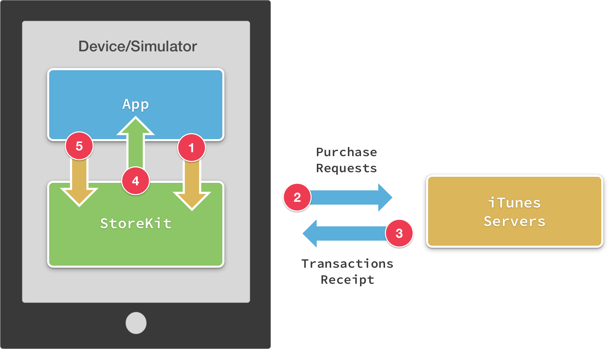
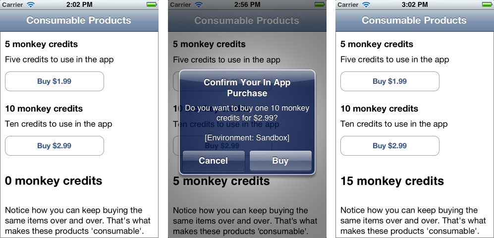
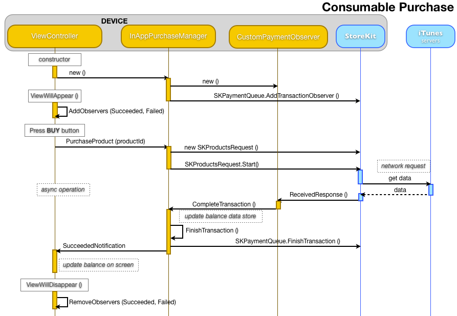
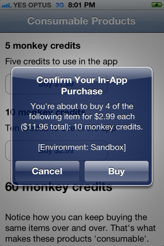
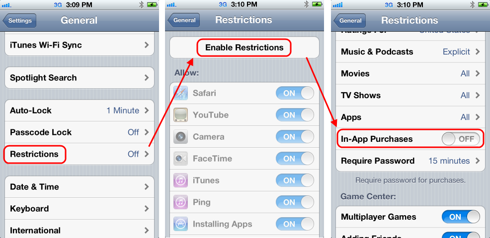
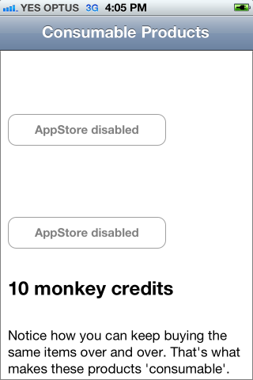
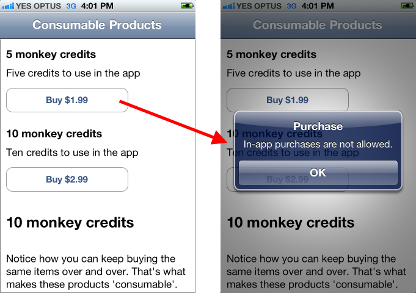

# Purchasing Consumable Products

Consumable products are the simplest to implement, since there is no
‘restore’ requirement. They are useful for products like in-game currency or
a single-use piece of functionality. Users can re-purchase consumable products
over-and-over again.

## Built-In Product Delivery

The sample code accompanying this document demonstrates built-in products –
the Product IDs are hardcoded into the application because they are tightly
coupled to the code that ‘unlocks’ the feature after payment. The purchasing
process can be visualized like this:   
   
[ ](purchasing-consumable-products-images/image26.png)     
   
 The basic workflow is:   
   
   
   
 1. The app adds an `SKPayment` to the queue. If required the user will be prompted for
their Apple ID, and asked to confirm the payment.   
   
 2. StoreKit sends the
request to the server for processing.   
   
 3. When the transaction is
complete, the server responds with a transaction receipt.   
   
 4. The `SKPaymentTransactionObserver` subclass receives the receipt and
processes it.   
   
 5. The application enables the product (by updating `NSUserDefaults` or some other mechanism), and then calls
StoreKit’s `FinishTransaction`.

There is another type of workflow – *Server-Delivered Products* –
that is discussed later in the document (see the section *Receipt Verification and Server-Delivered Products*).

## Consumable Products example

The [InAppPurchaseSample code](https://developer.xamarin.com/samples/monotouch/StoreKit/) contains a project called *Consumables* that implements a basic
‘in-game currency’ (called “monkey credits”). The sample shows how to
implement two in-app purchase products to allow the user to buy as many
“monkey credits” as they wish – in a real application there would also be
some way of spending them!   
   
   
   
 The application is shown in these
screenshots – each purchase adds more “monkey credits” to the user’s
balance:   
   
   
   
 [ ](purchasing-consumable-products-images/image27.png)   
   
   
   
 The interactions between custom classes, StoreKit and the App Store look
like this:   
   
   
   
 [ ](purchasing-consumable-products-images/image28.png)

&nbsp;

### ViewController Methods

In addition to the properties and methods required to retrieve product
information, the view controller requires additional notification observers to
listen for purchase-related notifications. These are just `NSObjects`
that will be registered and removed in `ViewWillAppear` and `ViewWillDisappear` respectively.

```csharp
NSObject succeededObserver, failedObserver;
```

The constructor will also create the `SKProductsRequestDelegate`
subclass ( `InAppPurchaseManager`) that in turn creates and registers
the `SKPaymentTransactionObserver`
( `CustomPaymentObserver`).   
   
   
   
 The first part of
processing an in-app purchase transaction is to handle the button press when the
user wishes to buy something, as shown in the following code from the sample
application:

```csharp
buy5Button.TouchUpInside += (sender, e) => {
   iap.PurchaseProduct (Buy5ProductId);
};​
buy10Button.TouchUpInside += (sender, e) => {
   iap.PurchaseProduct (Buy10ProductId);
};
```

   
   
 The second part of the user interface is handling the notification
that the transaction succeeded, in this case by updating the displayed
balance:

```csharp
priceObserver = NSNotificationCenter.DefaultCenter.AddObserver (InAppPurchaseManager.InAppPurchaseManagerTransactionSucceededNotification,
(notification) => {
   balanceLabel.Text = CreditManager.Balance() + " monkey credits";
});
```

The final part of the user interface is displaying a message if a transaction
is cancelled for some reason. In the example code a message is simply written to
the output window:

```csharp
failedObserver = NSNotificationCenter.DefaultCenter.AddObserver (InAppPurchaseManager.InAppPurchaseManagerTransactionFailedNotification,
(notification) => {
   Console.WriteLine ("Transaction Failed");
});
```

In addition to these methods on the view controller, a consumable product
purchase transaction also requires code on the `SKProductsRequestDelegate` and the `SKPaymentTransactionObserver`.

### InAppPurchaseManager Methods

The sample code implements a number of purchase related methods on the
InAppPurchaseManager class, including the `PurchaseProduct` method
that creates an `SKPayment` instance and adds it to the queue for
processing:

```csharp
public void PurchaseProduct(string appStoreProductId)
{
   SKPayment payment = SKPayment.PaymentWithProduct (appStoreProductId);​
   SKPaymentQueue.DefaultQueue.AddPayment (payment);
}
```

Adding the payment to the queue is an asynchronous operation. The application
regains control while StoreKit processes the transaction and sends it to
Apple’s servers. It is at this point that iOS will verify the user is logged
in to the App Store and prompt her for an Apple ID and password if required.   
   
   
   
 Assuming the user successfully authenticates with the App Store
and agrees to the transaction, the `SKPaymentTransactionObserver`
will receive StoreKit’s response and call the following method to fulfill the
transaction and finalize it.

```csharp
public void CompleteTransaction (SKPaymentTransaction transaction)
{
   var productId = transaction.Payment.ProductIdentifier;
   // Register the purchase, so it is remembered for next time
   PhotoFilterManager.Purchase(productId);
   FinishTransaction(transaction, true);
}
```

The last step is to ensure that you notify StoreKit that you have
successfully fulfilled the transaction, by calling `FinishTransaction`:

```csharp
public void FinishTransaction(SKPaymentTransaction transaction, bool wasSuccessful)
{
   // remove the transaction from the payment queue.
   SKPaymentQueue.DefaultQueue.FinishTransaction(transaction);  // THIS IS IMPORTANT - LET'S APPLE KNOW WE'RE DONE !!!!
   using (var pool = new NSAutoreleasePool()) {
       NSDictionary userInfo = NSDictionary.FromObjectsAndKeys(new NSObject[] {transaction},new NSObject[] {new NSString("transaction")});
       if (wasSuccessful) {
           // send out a notification that we've finished the transaction
           NSNotificationCenter.DefaultCenter.PostNotificationName (InAppPurchaseManagerTransactionSucceededNotification, this, userInfo);
       } else {
           // send out a notification for the failed transaction
           NSNotificationCenter.DefaultCenter.PostNotificationName (InAppPurchaseManagerTransactionFailedNotification, this, userInfo);
       }
   }
}
```

Once the product is delivered, `SKPaymentQueue.DefaultQueue.FinishTransaction` must be called to
remove the transaction from the payment queue.

### SKPaymentTransactionObserver (CustomPaymentObserver) Methods

StoreKit calls the `UpdatedTransactions` method when it receives a
response from Apple’s servers, and passes an array of `SKPaymentTransaction` objects for your code to inspect. The method
loops through each transaction and performs a different function based on the
transaction state (as shown here):

```csharp
public override void UpdatedTransactions (SKPaymentQueue queue, SKPaymentTransaction[] transactions)
{
   foreach (SKPaymentTransaction transaction in transactions)
   {
       switch (transaction.TransactionState)
       {
           case SKPaymentTransactionState.Purchased:
              theManager.CompleteTransaction(transaction);
               break;
           case SKPaymentTransactionState.Failed:
              theManager.FailedTransaction(transaction);
               break;
           default:
               break;
       }
   }
}
```

The `CompleteTransaction` method was covered earlier in this
section – it saves the purchase details to `NSUserDefaults`,
finalizes the transaction with StoreKit and finally notifies the UI to
update.

### Purchasing Multiple Products

If it makes sense in your application to purchase multiple products, use the `SKMutablePayment` class and set the Quantity field:

```csharp
public void PurchaseProduct(string appStoreProductId)
{
   SKMutablePayment payment = SKMutablePayment.PaymentWithProduct (appStoreProductId);
   payment.Quantity = 4; // hardcoded as an example
   SKPaymentQueue.DefaultQueue.AddPayment (payment);
}
```

The code handling the completed transaction must also query the Quantity
property to correctly fulfill the purchase:

```csharp
public void CompleteTransaction (SKPaymentTransaction transaction)
{
   var productId = transaction.Payment.ProductIdentifier;
   var qty = transaction.Payment.Quantity;
   if (productId == ConsumableViewController.Buy5ProductId)
       CreditManager.Add(5 * qty);
   else if (productId == ConsumableViewController.Buy10ProductId)
       CreditManager.Add(10 * qty);
   else
       Console.WriteLine ("Shouldn't happen, there are only two products");
   FinishTransaction(transaction, true);
}
```

When the user purchases multiple quantities, the StoreKit confirmation alert
will reflect the quantity, the unit price and the total price they’ll be
charged, as shown in the following screenshot:

[ ](purchasing-consumable-products-images/image30.png)

## Handling Network Outages

In-app purchases require a working network connection for StoreKit to
communicate with Apple’s servers. If a network connection is not available,
then in-app purchasing will be unavailable.

### Product Requests

If the network is unavailable while making an `SKProductRequest`,
the `RequestFailed` method of the `SKProductsRequestDelegate` subclass
( `InAppPurchaseManager`) will be called, as shown below:

```csharp
public override void RequestFailed (SKRequest request, NSError error)
{
   using (var pool = new NSAutoreleasePool()) {
       NSDictionary userInfo = NSDictionary.FromObjectsAndKeys(new NSObject[] {error},new NSObject[] {new NSString("error")});
       // send out a notification for the failed transaction
       NSNotificationCenter.DefaultCenter.PostNotificationName (InAppPurchaseManagerRequestFailedNotification, this, userInfo);
   }
}
```

The ViewController then listens for the notification and displays a message
in the purchase buttons:

```csharp
requestObserver = NSNotificationCenter.DefaultCenter.AddObserver (InAppPurchaseManager.InAppPurchaseManagerRequestFailedNotification,
(notification) => {
   Console.WriteLine ("Request Failed");
   buy5Button.SetTitle ("Network down?", UIControlState.Disabled);
   buy10Button.SetTitle ("Network down?", UIControlState.Disabled);
});
```

Because a network connection can be transient on mobile devices, applications
may wish to monitor network status using the SystemConfiguration framework, and
re-try when a network connection is available. Refer to Apple’s or the that
uses it.

### Purchase Transactions

The StoreKit payment queue will store and forward purchase requests if
possible, so the effect of a network outage will vary depending on when the
network failed during the purchase process.   
   
   
   
 If an error does
occur during a transaction, the `SKPaymentTransactionObserver`
subclass ( `CustomPaymentObserver`) will have the `UpdatedTransactions` method called and the `SKPaymentTransaction` class will be in the Failed state.

```csharp
public override void UpdatedTransactions (SKPaymentQueue queue, SKPaymentTransaction[] transactions)
{
   foreach (SKPaymentTransaction transaction in transactions)
   {
       switch (transaction.TransactionState)
       {
           case SKPaymentTransactionState.Purchased:
               theManager.CompleteTransaction(transaction);
               break;
           case SKPaymentTransactionState.Failed:
               theManager.FailedTransaction(transaction);
               break;
           default:
               break;
       }
   }
}
```

The `FailedTransaction` method detects whether the error was due
to user-cancellation, as shown here:

```csharp
public void FailedTransaction (SKPaymentTransaction transaction)
{
   //SKErrorPaymentCancelled == 2
   if (transaction.Error.Code == 2) // user cancelled
       Console.WriteLine("User CANCELLED FailedTransaction Code=" + transaction.Error.Code + " " + transaction.Error.LocalizedDescription);
   else // error!
       Console.WriteLine("FailedTransaction Code=" + transaction.Error.Code + " " + transaction.Error.LocalizedDescription);
   FinishTransaction(transaction,false);
}
```

Even if a transaction fails, the `FinishTransaction` method must
be called to remove the transaction from the payment queue:

```csharp
SKPaymentQueue.DefaultQueue.FinishTransaction(transaction);
```

The example code then sends a notification so that the ViewController can
display a message. Applications should not show an additional message if the
user canceled the transaction. Other error codes that might occur include:

```csharp
FailedTransaction Code=0 Cannot connect to iTunes Store
FailedTransaction Code=5002 An unknown error has occurred
FailedTransaction Code=5020 Forget Your Password?
Applications may detect and respond to specific error codes, or handle them in the same way.
```

## Handling Restrictions

The **Settings > General > Restrictions** feature of iOS
allows users to lock certain features of their device.   
   
   
   
 You
can query whether the user is allowed to make in-app purchases via the `SKPaymentQueue.CanMakePayments` method. If this returns false then
the user cannot access in-app purchasing. StoreKit will automatically display an
error message to the user if a purchase is attempted. By checking this value
your application can instead hide the purchase buttons or take some other action
to help the user.   
   
   
   
 In the `InAppPurchaseManager.cs`
file the `CanMakePayments` method wraps the StoreKit function like
this:

```csharp
public bool CanMakePayments()
{
   return SKPaymentQueue.CanMakePayments;​
}
```

To test this method, use the **Restrictions** feature of iOS to
disable **In-App Purchases**:   
   
   
   
 [ ](purchasing-consumable-products-images/image31.png)   
   
   
   
 This example code from `ConsumableViewController` reacts to `CanMakePayments` returning false by displaying **AppStore Disabled** text on the disabled buttons.

```csharp
// only if we can make payments, request the prices
if (iap.CanMakePayments()) {
   // now go get prices, if we don't have them already
   if (!pricesLoaded)
       iap.RequestProductData(products); // async request via StoreKit -> App Store
} else {
   // can't make payments (purchases turned off in Settings?)
   // the buttons are disabled by default, and only enabled when prices are retrieved
   buy5Button.SetTitle ("AppStore disabled", UIControlState.Disabled);
   buy10Button.SetTitle ("AppStore disabled", UIControlState.Disabled);
}
```

The application looks like this when the **In-App Purchases**
feature is restricted – the purchase buttons are disabled.   
   
   
   
 [ ](purchasing-consumable-products-images/image32.png)   
   
   
   

Product information can still be requested when `CanMakePayments` is
false, so the app can still retrieve and display prices. This means if we
removed the `CanMakePayments` check from the code the purchase
buttons would still be active, however when a purchase is attempted the user
will see a message that **In-app purchases are not allowed**
(generated by StoreKit when the payment queue is accessed):   
   
   
   
 [ ](purchasing-consumable-products-images/image33.png)   
   
   
   
 Real-world applications may take a different approach to handling the
restriction, such as hiding the buttons altogether and perhaps offering a more
detailed message than the alert that StoreKit shows automatically.

