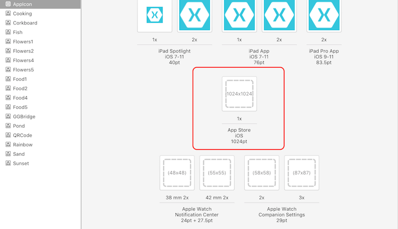

# Updating Your App to iOS 11

_Exploring the new features of iOS 11_

In iOS 11, Apple has introduced architecture updates, new visual changes, and an updated iTunes Connect process. This guide explores each of these changes, helping you to get your Xamarin.iOS app updated for iOS 11.

## [Architecture Changes](architecture-changes.md)

One of the biggest changes that you should be aware of with iOS 11 is the deprecation of 32-bit support for apps, as detailed in [Apple's](https://developer.apple.com/news/?id=06282017b) press release.

This guide guides you through updating your app for 64-bit.

## [Visual Design Updates](visual-design.md)

In iOS 11, Apple introduced new visual changes including updates to the navigation bar, search bar, and table views. In addition improvements have been made to allow for more flexibility over margins and full screen content. These changes are covered in this guide.

## [App Store Changes](app-store-changes.md)

The iOS App Store has had a complete redesign, which not only allows users to efficiently navigate the store, but also allows you, as a developer, to promote your app to users. These promotions include updates to in-app purchases and updates to the product page. iOS 11 also adds updates regarding how to communicate with users, how to add your app icon, and how to release your app to the public.

## App Icon Updates

> [!NOTE]
> App icons should now be delivered by an _Asset Catalog_. 

For information on using asset catalogs refer to the [App Store Icon](~/ios/app-fundamentals/images-icons/app-store-icon.md) guide. For help with migrating icons from an Info.plist to an Asset catalog, see the [Migrating from Info.plist to Asset Catalogs](~/ios/app-fundamentals/images-icons/app-icons.md) guide.

The required icon in the Asset Catalog is named **App Store** and should be 1024 x 1024 in size. Apple have stated that the app store icon in the asset catalog can't be transparent nor contain an alpha channel.

## Related Links

- [What’s New in iOS 11 (Apple)](https://developer.apple.com/ios/)
- [Updated App Store Product Page (Apple)](https://developer.apple.com/app-store/product-page/)
- [Updating Your App for iOS 11 (WWDC) (video)](https://developer.apple.com/videos/play/wwdc2017/204/)
