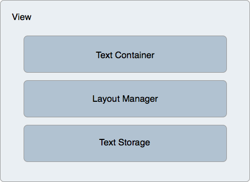
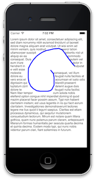

# Text Kit

Text Kit is a new API that offers powerful text layout and rendering features. It is built on top of the low level Core Text framework, but is much easier to use than Core Text.

To make the features of Text Kit available to standard controls, several iOS text controls have been re-implemented to use Text Kit, including:

-  UITextView
-  UITextField
-  UILabel


## Architecture

Text Kit provides a layered architecture that separates the text storage from the layout and display, including the following classes:

-  `NSTextContainer` – Provides the coordinate system and geometry that is used to layout text.
-  `NSLayoutManager` – Lays out text by turning text into glyphs. 
-  `NSTextStorage` – Holds the text data, as well as handles batch text property updates. Any batch updates are handed to the layout manager for the actual processing of the changes, such as recalculating the layout and redrawing the text.


These three classes are applied to a view that renders text. The built-in text handling views, such as `UITextView`, `UITextField`, and `UILabel` already have them set, but you can create and apply them to any `UIView` instance as well.

The following figure illustrates this architecture:

 

## Text Storage and Attributes

The `NSTextStorage` class holds the text that is displayed by a view. It also communicates any changes to the text - such as changes to characters or their attributes - to the layout manager for display. `NSTextStorage` inherits from `MSMutableAttributed` string, allowing changes to text attributes to be specified in batches between `BeginEditing` and `EndEditing` calls.

For example, the following code snippet specifies a change to the foreground and background colors, respectively, and targets particular ranges:

```csharp
textView.TextStorage.BeginEditing ();
textView.TextStorage.AddAttribute(UIStringAttributeKey.ForegroundColor, UIColor.Green, new NSRange(200, 400));
textView.TextStorage.AddAttribute(UIStringAttributeKey.BackgroundColor, UIColor.Black, new NSRange(210, 300));
textView.TextStorage.EndEditing ();
```

After `EndEditing` is called, the changes are sent to the layout manager, which in turn performs any necessary layout and rendering calculations for the text to be displayed in the view.

## Layout with Exclusion Path

Text Kit also supports layout, and allows for complex scenarios such as multi-column text and flowing text around specified paths called *exclusion paths*. Exclusion paths are applied to the text container, which modifies the geometry of the text layout, causing the text to flow around the specified paths.

Adding an exclusion path requires setting the `ExclusionPaths` property on the layout manager. Setting this property causes the layout manager to invalidate the text layout and flow the text around the exclusion path.

### Exclusion based on a CGPath

Consider the following `UITextView` subclass implementation:

```csharp
public class ExclusionPathView : UITextView
{
    CGPath exclusionPath;
	CGPoint initialPoint;
	CGPoint latestPoint;
	UIBezierPath bezierPath;

	public ExclusionPathView (string text)
	{
		Text = text;
		ContentInset = new UIEdgeInsets (20, 0, 0, 0);
		BackgroundColor = UIColor.White;
		exclusionPath = new CGPath ();
		bezierPath = UIBezierPath.Create ();

		LayoutManager.AllowsNonContiguousLayout = false;
	}

	public override void TouchesBegan (NSSet touches, UIEvent evt)
	{
		base.TouchesBegan (touches, evt);

		var touch = touches.AnyObject as UITouch;

		if (touch != null) {
			initialPoint = touch.LocationInView (this);
		}
	}

	public override void TouchesMoved (NSSet touches, UIEvent evt)
	{
		base.TouchesMoved (touches, evt);

		UITouch touch = touches.AnyObject as UITouch;

		if (touch != null) {
			latestPoint = touch.LocationInView (this);
			SetNeedsDisplay ();
		}
	}

	public override void TouchesEnded (NSSet touches, UIEvent evt)
	{
		base.TouchesEnded (touches, evt);

		bezierPath.CGPath = exclusionPath;
		TextContainer.ExclusionPaths = new UIBezierPath[] { bezierPath };
	}

	public override void Draw (CGRect rect)
	{
		base.Draw (rect);

		if (!initialPoint.IsEmpty) {

			using (var g = UIGraphics.GetCurrentContext ()) {

				g.SetLineWidth (4);
				UIColor.Blue.SetStroke ();

				if (exclusionPath.IsEmpty) {
					exclusionPath.AddLines (new CGPoint[] { initialPoint, latestPoint });
				} else {
					exclusionPath.AddLineToPoint (latestPoint);
				}

				g.AddPath (exclusionPath);
				g.DrawPath (CGPathDrawingMode.Stroke);
			}
		}
	}
}
```

This code adds support for drawing on the text view using Core Graphics. Since the `UITextView` class is now built to use Text Kit for its text rendering and layout, it can use all the features of Text Kit, such as setting exclusion paths.

> [!IMPORTANT]
>   Note: This example subclasses `UITextView` to add touch drawing support. Subclassing `UITextView` isn’t necessary to get the features of Text Kit.


After the user draws on the text view, the drawn `CGPath` is applied to a `UIBezierPath` instance by setting the `UIBezierPath.CGPath` property:

```csharp
bezierPath.CGPath = exclusionPath;
```

Updating the following line of code makes the text layout update around the path:

```csharp
TextContainer.ExclusionPaths = new UIBezierPath[] { bezierPath };
```

The following screenshot illustrates how the text layout changes to flow around the drawn path:

<!-- --> 


Notice that the layout manager’s `AllowsNonContiguousLayout` property is set to false in this case. This causes the layout to be recalculated for all cases where the text changes. Setting this to true may benefit performance by avoiding a full-layout refresh, especially in the case of large documents. However, setting `AllowsNonContiguousLayout` to true would prevent the exclusion path from updating the layout in some circumstances - for example, if text is entered at runtime without a trailing carriage return prior to the path being set.


## Related Links

- [Intro to iOS 7 (sample)](https://developer.xamarin.com/samples/monotouch/IntroToiOS7)
- [iOS 7 User Interface Overview](~/ios/platform/introduction-to-ios7/ios7-ui.md)
- [Backgrounding](~/ios/app-fundamentals/backgrounding/index.md)
