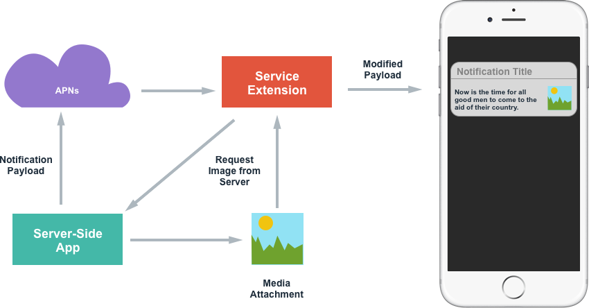
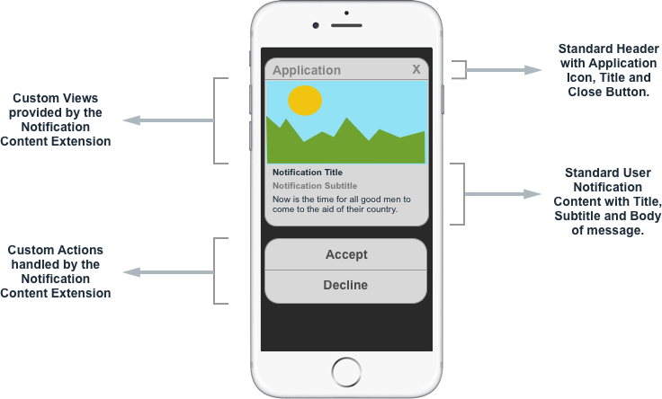
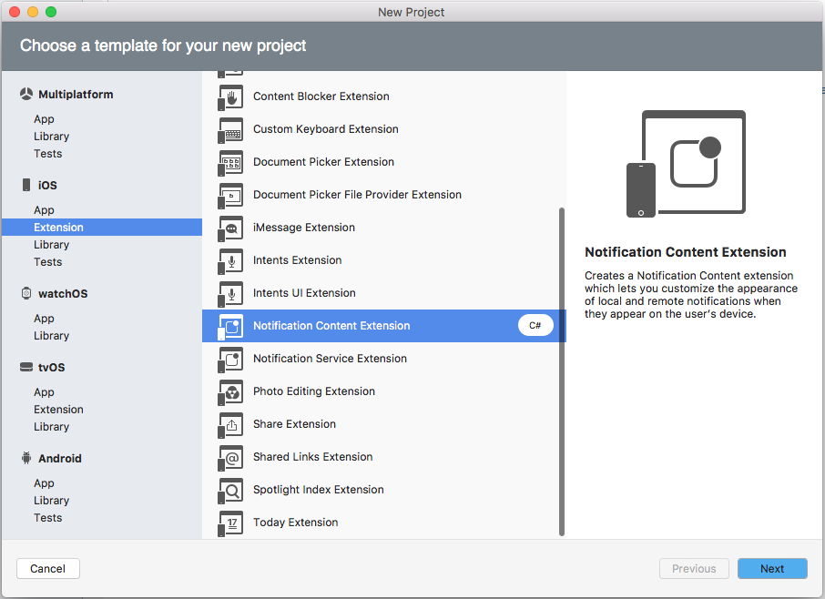
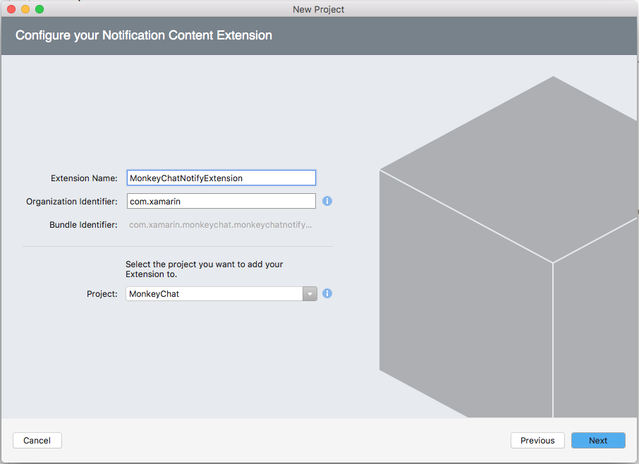
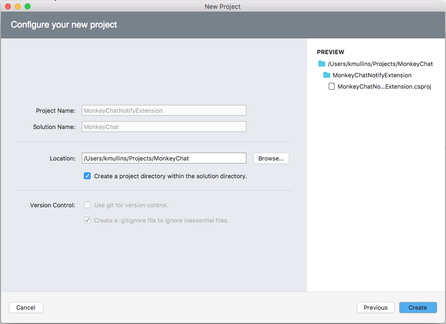
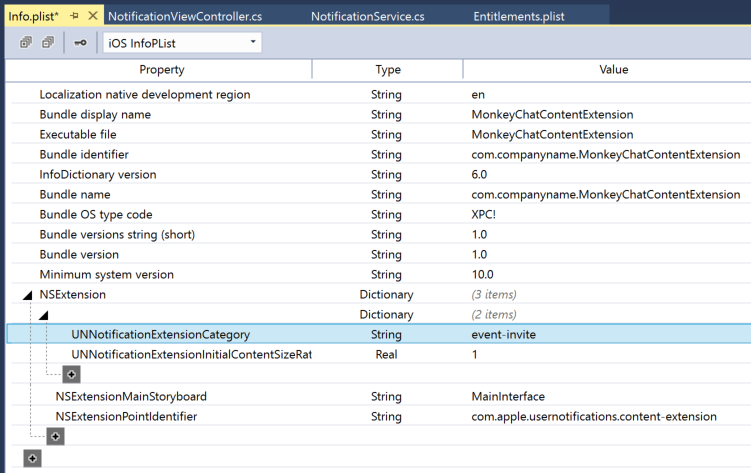

# Advanced User Notifications in Xamarin.iOS

New to iOS 10, the User Notification framework allows for the delivery and handling of local and remote notifications. Using this framework, an app or app extension can schedule the delivery of local notifications by specifying a set of conditions such as location or time of day.

## About User Notifications

The new User Notification framework allows for the delivery and handling of local and remote notifications. Using this framework, an app or App Extension can schedule the delivery of local notifications by specifying a set of conditions such as location or time of day.

Additionally, the app or extension can receive (and potentially modify) both local and remote notifications as they are delivered to the user's iOS device.

The new User Notification UI framework allows an app or App Extension to customize the appearance of both local and remote notifications when they are presented to the user.

This framework provides the following ways that an app can deliver notifications to a user:

- **Visual Alerts** - Where the notification rolls down from the top of the screen as a banner.
- **Sound and Vibrations** - Can be associated with a notification.
- **App Icon Badging** - Where the app's icon displays a badge showing that new content is available. Such as the number of unread email messages.

Additionally, depending on the user's current context, there are different ways that a notification will be presented:

- If the device is unlocked, the notification will roll down from the top of the screen as a banner.
- If the device is locked, the notification will be displayed on the user's lock screen.
- If the user has missed a notification, they can open the Notification Center and view any available, waiting notifications there.

A Xamarin.iOS app has two types of User Notifications that it is able to send:

- **Local Notifications** - These are sent by apps installed locally on the users device.
- **Remote Notifications** - Are sent from a remote server and either presented to the user or triggers a background update of the app's content.

For more information, please see our [Enhanced User Notifications](~/ios/platform/user-notifications/enhanced-user-notifications.md) documentation.

## The New User Notification Interface

User Notifications in iOS 10 are presented with a new UI design that provides more content such as a Title, Subtitle and optional Media Attachments that can be presented on the Lock Screen, as a Banner at the top of the device or in the Notification Center.

No matter where a User Notification is displayed in iOS 10, it is presented with the same look and feel and with the same features and functionality.

In iOS 8, Apple introduced Actionable Notifications where the developer could attach Custom Actions to a Notification and allow the user to take action on a Notification without having to launch the app. In iOS 9, Apple enhanced Actionable Notifications with Quick Reply which allows the user to respond to a Notification with text entry.

Because User Notifications are a more integral part of the user experience in iOS 10, Apple has further expanded Actionable Notifications to support 3D Touch, where the user presses on a notification and a custom user interface is display to provide rich interaction with the notification.

When the custom User Notification UI is displayed, if the user interacts with any Actions attached to the Notification, the custom UI can be instantly updated to provide feedback as to what has been changed.

New to iOS 10, the User Notification UI API allows a Xamarin.iOS app to easily take advantage of these new User Notification UI features.

## Adding Media Attachments

One of the more common items that get shared between users is photos, so iOS 10 added the ability to attach a Media Item (such as a photo) directly to a Notification, where it will be presented and readily available to the user along with the rest of the Notification's content.

However, because of the sizes involved in sending even a small image, attaching it to a Remote Notification Payload becomes impractical. To handle this situation, the developer can use the new Service Extension in iOS 10 to download the image from another source (such as a CloudKit datastore) and attach it to the notification's content before it is displayed to the user.

For a Remote Notification to be modified by a Service Extension, its payload must be marked as mutable. For example:

```csharp
{
	aps : {
		alert : "New Photo Available",
		mutable-content: 1
	},
	my-attachment : "https://example.com/photo.jpg"
}
```

Take a look at the following overview of the process:

[](advanced-user-notifications-images/extension02.png#lightbox)

Once the Remote Notification is delivered to the device (via APNs), the Service Extension can then download the required image via any means desired (such as an `NSURLSession`) and after it receives the image, it can modify the contents of the Notification and display it to the user.

The following is an example of how this process might be handled in code:

```csharp
using System;
using Foundation;
using UIKit;
using UserNotifications;

namespace MonkeyNotification
{
	public class NotificationService : UNNotificationServiceExtension
	{
		#region Constructors
		public NotificationService ()
		{
		}
		#endregion

		#region Override Methods
		public override void DidReceiveNotificationRequest (UNNotificationRequest request, Action<UNNotificationContent> contentHandler)
		{
			// Get file URL
			var attachementPath = request.Content.UserInfo.ObjectForKey (new NSString ("my-attachment"));
			var url = new NSUrl (attachementPath.ToString ());

			// Download the file
			var localURL = new NSUrl ("PathToLocalCopy");

			// Create attachment
			var attachmentID = "image";
			var options = new UNNotificationAttachmentOptions ();
			NSError err;
			var attachment = UNNotificationAttachment.FromIdentifier (attachmentID, localURL, options , out err);

			// Modify contents
			var content = request.Content.MutableCopy() as UNMutableNotificationContent;
			content.Attachments = new UNNotificationAttachment [] { attachment };

			// Display notification
			contentHandler (content);
		}

		public override void TimeWillExpire ()
		{
			// Handle service timing out
		}
		#endregion
	}
}
```

When the Notification is received from APNs, the custom address of the image is read from the content and file is downloaded from the server. Then a `UNNotificationAttachement` is created with a unique ID and the local location of the image (as a `NSUrl`). A mutable copy of the Notification Content is created and Media Attachments are added. Finally, the Notification is displayed to the user by calling the `contentHandler`.

Once an attachment has been added to a Notification, the system takes over the movement and management of the file.

In addition to the Remote Notifications presented above, Media Attachments are also supported from Local Notifications, where the `UNNotificationAttachement` is created and attached to the Notification along with its Content.

Notification in iOS 10 support Media Attachments of images (static and GIFs), audio or video and the system will automatically display the correct custom UI for each of these types of attachments when the Notification is presented to the user.

> [!NOTE]
> Care should be taken to optimize both the media size and the time it takes to download the media from the remote server (or to assemble the media for Local Notifications) as the system imposes strict limits to both when running the app's Service Extension. For example, consider sending a scaled down version of the image or a tiny clip of a video to be presented in the Notification.

## Creating Custom User Interfaces

To create a custom User Interface for its User Notifications, the developer needs to add a Notification Content Extension (new to iOS 10) to the app's solution.

The Notification Content Extension allows the developer to add their own views to the Notification UI and draw out any content they want. However, interactive UI widgets (such as Buttons or Text Fields) are **not** supported by the Notification UI and should never be added to a custom UI design.

To support user interaction with a User Notification, Custom Actions should be created, registered with the system and attached to the Notification before it is scheduled with the system. The Notification Content Extension will be called to handle the processing of these actions. See the [Working with Notification Actions](~/ios/platform/user-notifications/enhanced-user-notifications.md) section of the [Enhanced User Notifications](~/ios/platform/user-notifications/enhanced-user-notifications.md) document for more details on Custom Actions.

When a User Notification with a Custom UI is presented to the user, it will have the following elements:

[](advanced-user-notifications-images/customui01.png#lightbox)

If the user interacts with the Custom Actions (presented below the Notification), the User Interface can be updated to give the user feedback as the what happened when they invoked a given action.

### Adding a Notification Content Extension

To implement a Custom User Notification UI in a Xamarin.iOS app, do the following:

# [Visual Studio for Mac](#tab/vsmac)

1. Open the app's solution in Visual Studio for Mac.
2. Right-click on the Solution Name in the **Solution Pad** and select **Add** > **Add New Project**.
3. Select **iOS** > **Extensions** > **Notification Content Extensions** and click the **Next** button: 

	[](advanced-user-notifications-images/notify01.png#lightbox)
4. Enter a **Name** for the extension and click the **Next** button: 

	[](advanced-user-notifications-images/notify02.png#lightbox)
5. Adjust the **Project Name** and/or **Solution Name** if required and click the **Create** button: 

	[](advanced-user-notifications-images/notify03.png#lightbox)

# [Visual Studio](#tab/vswin)

1. Open the app's solution in Visual Studio for Mac.
2. Right-click on the Solution Name in the **Solution Explorer** and select **Add > New Project...**.
3. Select **Visual C# > iOS Extensions > Notification Content Extension**:

	[](advanced-user-notifications-images/notify01.w157.png#lightbox)
4. Enter a **Name** for the extension and click the **OK** button.

-----

When the Notification Content Extension is added to the solution, three files will be created in the Extension's project:

1. `NotificationViewController.cs` - This is the main view controller for the Notification Content Extension.
2. `MainInterface.storyboard` - Where the developer lays out the visible UI for the Notification Content Extension in the iOS Designer.
3. `Info.plist` - Controls the configuration of the Notification Content Extension.

The default `NotificationViewController.cs` file looks like the following:

```csharp
using System;
using Foundation;
using UIKit;
using UserNotifications;
using UserNotificationsUI;


namespace MonkeyChatNotifyExtension
{
	public partial class NotificationViewController : UIViewController, IUNNotificationContentExtension
	{
		#region Constructors
		protected NotificationViewController (IntPtr handle) : base (handle)
		{
			// Note: this .ctor should not contain any initialization logic.
		}
		#endregion

		#region Override Methods
		public override void ViewDidLoad ()
		{
			base.ViewDidLoad ();

			// Do any required interface initialization here.
		}
		#endregion

		#region Public Methods
		[Export ("didReceiveNotification:")]
		public void DidReceiveNotification (UNNotification notification)
		{
			label.Text = notification.Request.Content.Body;

			// Grab content
			var content = notification.Request.Content;

		}
		#endregion
	}
}
```

The `DidReceiveNotification` method is called when the Notification is expanded by the user so that the Notification Content Extension can populate the custom UI with the contents of the `UNNotification`. For the example above, a Label has been added to the view, exposed to code with the name `label` and is used to display the body of the Notification.

### Setting the Notification Content Extension's Categories

The system needs to be informed on how to find the app's Notification Content Extension based on the specific categories it responds to. Do the following:

# [Visual Studio for Mac](#tab/vsmac)

1. Double-click the Extension's `Info.plist` file in the **Solution Pad** to open it for editing.
2. Switch to the **Source** view.
3. Expand the `NSExtension` key.
4. Add the `UNNotificationExtensionCategory` key as type **String** with the value of the category the Extension belongs to (in this example `event-invite): 

	[](advanced-user-notifications-images/customui02.png#lightbox)
5. Save your changes.

# [Visual Studio](#tab/vswin)

1. Double-click the Extension's `Info.plist` file in the **Solution Explorer** to open it for editing.
3. Expand the `NSExtension` key.
4. Add the `UNNotificationExtensionCategory` key as type **String** with the value of the category the Extension belongs to (in this example `event-invite): 

	[](advanced-user-notifications-images/customui02w.png#lightbox)
5. Save your changes.

-----

Notification Content Extension Categories (`UNNotificationExtensionCategory`) use the same category values that are used to register Notification Actions. In the situation where the app will use the same UI for multiple categories, switch the `UNNotificationExtensionCategory` to the type **Array** and provide all of the categories required. For example:

# [Visual Studio for Mac](#tab/vsmac)

[](advanced-user-notifications-images/customui03.png#lightbox)

# [Visual Studio](#tab/vswin)

[](advanced-user-notifications-images/customui03w.png#lightbox)

-----

### Hiding the Default Notification Content

In the situation where the Custom Notification UI will be displaying the same content as the default Notification (Title, Subtitle and Body displayed automatically at the bottom of the Notification UI), this default information can be hidden by adding the `UNNotificationExtensionDefaultContentHidden` key to the `NSExtensionAttributes` key as type **Boolean** with a value of `YES` in the Extension's `Info.plist` file:

# [Visual Studio for Mac](#tab/vsmac)

[](advanced-user-notifications-images/customui04.png#lightbox)

# [Visual Studio](#tab/vswin)

[](advanced-user-notifications-images/customui04w.png#lightbox)

-----

### Designing the Custom UI

To design the Notification Content Extension's custom user interface, double-click the `MainInterface.storyboard` file to open it for editing in the iOS Designer, drag in the elements that you need to build the desired interface (such as `UILabels` and `UIImageViews`).

> [!NOTE]
> The Notification UI does _not_ support interactive controls such as text fields or buttons in a Notification Content Extension. While they can be added to the storyboard, the user will not be able to interact with them. To add user interaction to a Custom Notification UI, use custom actions instead.

Once the UI has been laid out and the necessary controls exposed to C# code, open the `NotificationViewController.cs` for editing and modify the `DidReceiveNotification` method to populate the UI when the user expands the notification. For example:

```csharp
using System;
using Foundation;
using UIKit;
using UserNotifications;
using UserNotificationsUI;


namespace MonkeyChatNotifyExtension
{
	public partial class NotificationViewController : UIViewController, IUNNotificationContentExtension
	{
		#region Constructors
		protected NotificationViewController (IntPtr handle) : base (handle)
		{
			// Note: this .ctor should not contain any initialization logic.
		}
		#endregion

		#region Override Methods
		public override void ViewDidLoad ()
		{
			base.ViewDidLoad ();

			// Do any required interface initialization here.
		}
		#endregion

		#region Public Methods
		[Export ("didReceiveNotification:")]
		public void DidReceiveNotification (UNNotification notification)
		{
			label.Text = notification.Request.Content.Body;

			// Grab content
			var content = notification.Request.Content;

			// Display content in the UILabels
			EventTitle.Text = content.Title;
			EventDate.Text = content.Subtitle;
			EventMessage.Text = content.Body;

			// Get location and display
			var location = content.UserInfo ["location"].ToString ();
			if (location != null) {
				Event.Location.Text = location;
			}

		}
		#endregion
	}
}
```

### Setting the Content Area Size

To adjust the size of the content area displayed to the user, the code below is setting the `PreferredContentSize` property in the `ViewDidLoad` method to the desired size. This size could also be adjusted by applying constraints to the View in the iOS Designer, it is left to the developer to pick the method that works best for them.

Because the Notification system is already running before the Notification Content Extension is invoked, the content area will start out full sized and be animated down to the requested size when presented to the user.

To eliminate this effect, edit the `Info.plist` file for the Extension and set the `UNNotificationExtensionInitialContentSizeRatio` key of the `NSExtensionAttributes` key to type **Number** with a value representing the desired ratio. For example:

# [Visual Studio for Mac](#tab/vsmac)

[](advanced-user-notifications-images/customui05.png#lightbox)

# [Visual Studio](#tab/vswin)

[](advanced-user-notifications-images/customui05w.png#lightbox)

-----

### Using Media Attachments in Custom UI

Because Media Attachments (as seen in the [Adding Media Attachments](#Adding-Media-Attachments) section above) are part of the Notification Payload, they can be accessed and displayed in the Notification Content Extension just like they would be in the default Notification UI.

For example, if the Custom UI above included a `UIImageView` that was exposed to C# code, the following code could be used to populate it from with the Media Attachment:

```csharp
using System;
using Foundation;
using UIKit;
using UserNotifications;
using UserNotificationsUI;

namespace MonkeyChatNotifyExtension
{
	public partial class NotificationViewController : UIViewController, IUNNotificationContentExtension
	{
		#region Constructors
		protected NotificationViewController (IntPtr handle) : base (handle)
		{
			// Note: this .ctor should not contain any initialization logic.
		}
		#endregion

		#region Override Methods
		public override void ViewDidLoad ()
		{
			base.ViewDidLoad ();

			// Do any required interface initialization here.
		}
		#endregion

		#region Public Methods
		[Export ("didReceiveNotification:")]
		public void DidReceiveNotification (UNNotification notification)
		{
			label.Text = notification.Request.Content.Body;

			// Grab content
			var content = notification.Request.Content;

			// Display content in the UILabels
			EventTitle.Text = content.Title;
			EventDate.Text = content.Subtitle;
			EventMessage.Text = content.Body;

			// Get location and display
			var location = content.UserInfo ["location"].ToString ();
			if (location != null) {
				Event.Location.Text = location;
			}

			// Get Media Attachment
			if (content.Attachements.Length > 1) {
				var attachment = content.Attachments [0];
				if (attachment.Url.StartAccessingSecurityScopedResource ()) {
					EventImage.Image = UIImage.FromFile (attachment.Url.Path);
					attachment.Url.StopAccessingSecurityScopedResource ();
				}
			}
		}
		#endregion
	}
}
```

Because the Media Attachment is managed by the system, it is outside of the app's sandbox. The extension needs to inform the system that it wants access to the file by calling the `StartAccessingSecurityScopedResource` method. When the extension is done with the file, it needs to call the `StopAccessingSecurityScopedResource` to release its connection.

### Adding Custom Actions to a Custom UI

As stated above, the Notification UI does not support user interaction so controls such as text fields or buttons are not supported in the UI design.

Instead, the standard custom actions mechanism is used to add interactivity to a Custom Notification UI. See the [Working with Notification Actions](~/ios/platform/user-notifications/enhanced-user-notifications.md) section of the [Enhanced User Notifications](~/ios/platform/user-notifications/enhanced-user-notifications.md) document for more details on custom actions.

In addition to the custom actions, the Notification Content Extension can respond to the following built-in actions as well:

- **Default Action** - This is when the user taps a notification to open the app and display the details of the given notification.
- **Dismiss Action** - This action is sent to the app when the user dismisses a given notification.

Notification Content Extensions also have the ability to update their UI when the user invokes one of the Custom Actions, such as showing a date as accepted when the user taps the **Accept** Custom Action button. Additionally, the Notification Content Extensions can tell the system to delay the dismissal of the Notification UI so the user can see the effect of their action before the Notification is closed.

This is done by implementing a second version of the `DidReceiveNotification` method that includes a completion handler. For example:

```csharp
using System;
using Foundation;
using UIKit;
using UserNotifications;
using UserNotificationsUI;
using CoreGraphics;

namespace myApp {
	public class NotificationViewController : UIViewController, UNNotificationContentExtension {

		public override void ViewDidLoad() {
			base.ViewDidLoad();

			// Adjust the size of the content area
			var size = View.Bounds.Size
			PreferredContentSize = new CGSize(size.Width, size.Width/2);
		}

		public void DidReceiveNotification(UNNotification notification) {

			// Grab content
			var content = notification.Request.Content;

			// Display content in the UILabels
			EventTitle.Text = content.Title;
			EventDate.Text = content.Subtitle;
			EventMessage.Text = content.Body;

			// Get location and display
			var location = Content.UserInfo["location"] as string;
			if (location != null) {
				Event.Location.Text = location;
			}

			// Get Media Attachment
			if (content.Attachements.Length > 1) {
				var attachment = content.Attachments[0];
				if (attachment.Url.StartAccessingSecurityScopedResource()) {
					EventImage.Image = UIImage.FromFile(attachment.Url.Path);
					attachment.Url.StopAccessingSecurityScopedResource();
				}
			}
		}

		[Export ("didReceiveNotificationResponse:completionHandler:")]
		public void DidReceiveNotification (UNNotificationResponse response, Action<UNNotificationContentExtensionResponseOption> completionHandler)
		{

			// Update UI when the user interacts with the
			// Notification
			Server.PostEventResponse += (response) {
				// Take action based on the response
				switch(response.ActionIdentifier){
				case "accept":
					EventResponse.Text = "Going!";
					EventResponse.TextColor = UIColor.Green;
					break;
				case "decline":
					EventResponse.Text = "Not Going.";
					EventResponse.TextColor = UIColor.Red;
					break;
				}

				// Close Notification
				completionHandler (UNNotificationContentExtensionResponseOption.Dismiss);
			};
		}
	}
}
```

By adding the `Server.PostEventResponse` handler to the `DidReceiveNotification` method of the Notification Content Extension, the Extension *must* handle all custom actions. The extension can also forward the custom actions on to the containing app by changing the `UNNotificationContentExtensionResponseOption`. For example:

```csharp
// Close Notification
completionHandler (UNNotificationContentExtensionResponseOption.DismissAndForwardAction);
```

### Working with the Text Input Action in Custom UI

Depending on the design of the app and the Notification, there might be times that require the user to enter text into the Notification (such as replying to a message). A Notification Content Extension has access to the built-in text input action just like a standard notification does.

For example:

```csharp
using System;
using Foundation;
using UIKit;
using UserNotifications;
using UserNotificationsUI;


namespace MonkeyChatNotifyExtension
{
	public partial class NotificationViewController : UIViewController, IUNNotificationContentExtension
	{
		#region Computed Properties
		// Allow to take input
		public override bool CanBecomeFirstResponder {
			get { return true; }
		}

		// Return the custom created text input view with the
		// required buttons and return here
		public override UIView InputAccessoryView {
			get { return InputView; }
		}
		#endregion

		#region Constructors
		protected NotificationViewController (IntPtr handle) : base (handle)
		{
			// Note: this .ctor should not contain any initialization logic.
		}
		#endregion

		#region Override Methods
		public override void ViewDidLoad ()
		{
			base.ViewDidLoad ();

			// Do any required interface initialization here.
		}
		#endregion

		#region Private Methods
		private UNNotificationCategory MakeExtensionCategory ()
		{

			// Create Accept Action
			...

			// Create decline Action
			...

			// Create Text Input Action
			var commentID = "comment";
			var commentTitle = "Comment";
			var textInputButtonTitle = "Send";
			var textInputPlaceholder = "Enter comment here...";
			var commentAction = UNTextInputNotificationAction.FromIdentifier (commentID, commentTitle, UNNotificationActionOptions.None, textInputButtonTitle, textInputPlaceholder);

			// Create category
			var categoryID = "event-invite";
			var actions = new UNNotificationAction [] { acceptAction, declineAction, commentAction };
			var intentIDs = new string [] { };
			var category = UNNotificationCategory.FromIdentifier (categoryID, actions, intentIDs, UNNotificationCategoryOptions.None);

			// Return new category
			return category;

		}
		#endregion

		#region Public Methods
		[Export ("didReceiveNotification:")]
		public void DidReceiveNotification (UNNotification notification)
		{
			label.Text = notification.Request.Content.Body;

			// Grab content
			var content = notification.Request.Content;

			// Display content in the UILabels
			EventTitle.Text = content.Title;
			EventDate.Text = content.Subtitle;
			EventMessage.Text = content.Body;

			// Get location and display
			var location = content.UserInfo ["location"].ToString ();
			if (location != null) {
				Event.Location.Text = location;
			}

			// Get Media Attachment
			if (content.Attachements.Length > 1) {
				var attachment = content.Attachments [0];
				if (attachment.Url.StartAccessingSecurityScopedResource ()) {
					EventImage.Image = UIImage.FromFile (attachment.Url.Path);
					attachment.Url.StopAccessingSecurityScopedResource ();
				}
			}
		}

		[Export ("didReceiveNotificationResponse:completionHandler:")]
		public void DidReceiveNotification (UNNotificationResponse response, Action<UNNotificationContentExtensionResponseOption> completionHandler)
		{

			// Is text input?
			if (response is UNTextInputNotificationResponse) {
				var textResponse = response as UNTextInputNotificationResponse;
				Server.Send (textResponse.UserText, () => {
					// Close Notification
					completionHandler (UNNotificationContentExtensionResponseOption.Dismiss);
				});
			}

			// Update UI when the user interacts with the
			// Notification
			Server.PostEventResponse += (response) {
				// Take action based on the response
				switch (response.ActionIdentifier) {
				case "accept":
					EventResponse.Text = "Going!";
					EventResponse.TextColor = UIColor.Green;
					break;
				case "decline":
					EventResponse.Text = "Not Going.";
					EventResponse.TextColor = UIColor.Red;
					break;
				}

				// Close Notification
				completionHandler (UNNotificationContentExtensionResponseOption.Dismiss);
			};
		}
		#endregion
	}
}
```

This code creates a new text input action and adds it to the Extension's category (in the `MakeExtensionCategory`) method. In the `DidReceive` override method, it handles the user entering text with the following code:

```csharp
// Is text input?
if (response is UNTextInputNotificationResponse) {
	var textResponse = response as UNTextInputNotificationResponse;
	Server.Send (textResponse.UserText, () => {
		// Close Notification
		completionHandler (UNNotificationContentExtensionResponseOption.Dismiss);
	});
}
```

If the design calls for adding custom buttons to the Text Input Field, add the following code to include them:

```csharp
// Allow to take input
public override bool CanBecomeFirstResponder {
	get {return true;}
}

// Return the custom created text input view with the
// required buttons and return here
public override UIView InputAccessoryView {
	get {return InputView;}
}
```

When the comment action is triggered by the user, both the view controller and the custom text input field need to be activated:

```csharp
// Update UI when the user interacts with the
// Notification
Server.PostEventResponse += (response) {
	// Take action based on the response
	switch(response.ActionIdentifier){
	...
	case "comment":
		BecomeFirstResponder();
		TextField.BecomeFirstResponder();
		break;
	}

	// Close Notification
	completionHandler (UNNotificationContentExtensionResponseOption.Dismiss);

};
```

<a name="Summary" />

## Summary

This article has taken an advanced look at using the new User Notification framework in a Xamarin.iOS app. It covered adding Media Attachments to both Local and Remote Notification and it covered using the new User Notification UI to create custom Notification UIs.


## Related Links

- [iOS 10 Samples](https://developer.xamarin.com/samples/ios/iOS10/)
- [UserNotifications Framework Reference](https://developer.apple.com/reference/usernotifications)
- [UserNotificationsUI](https://developer.apple.com/reference/usernotificationsui)
- [Local and Remote Notification Programming Guide](https://developer.apple.com/library/prerelease/content/documentation/NetworkingInternet/Conceptual/RemoteNotificationsPG/Chapters/Introduction.html)
