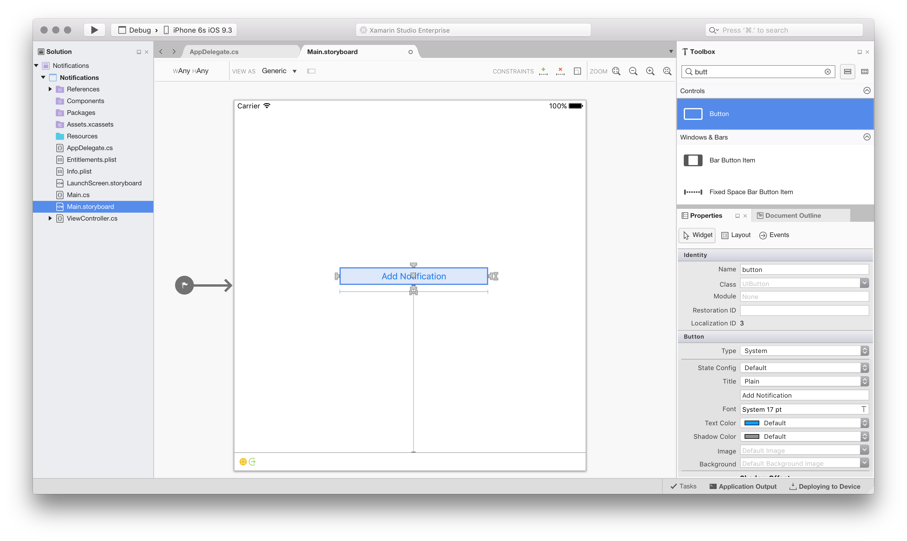
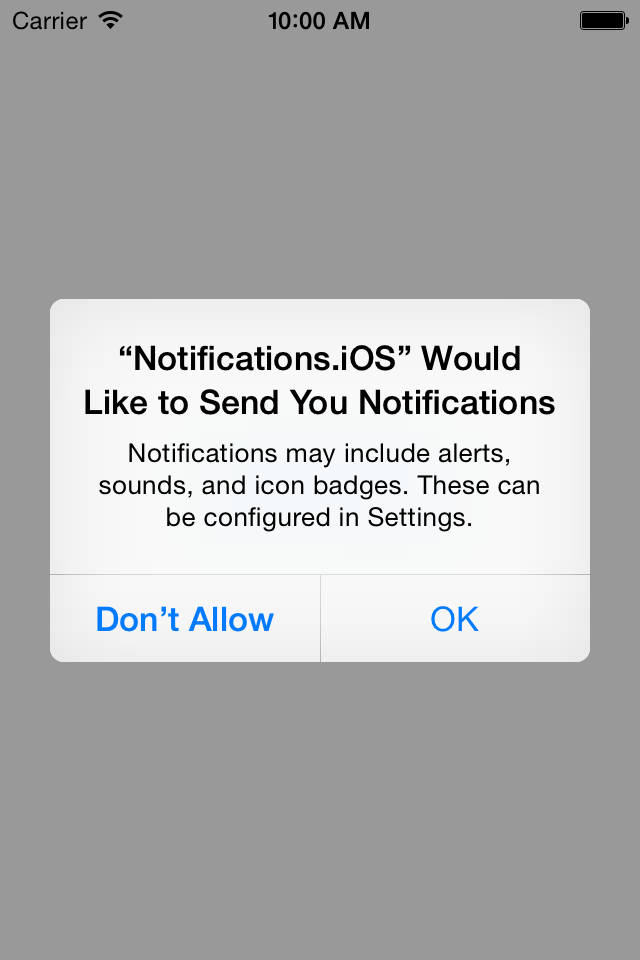
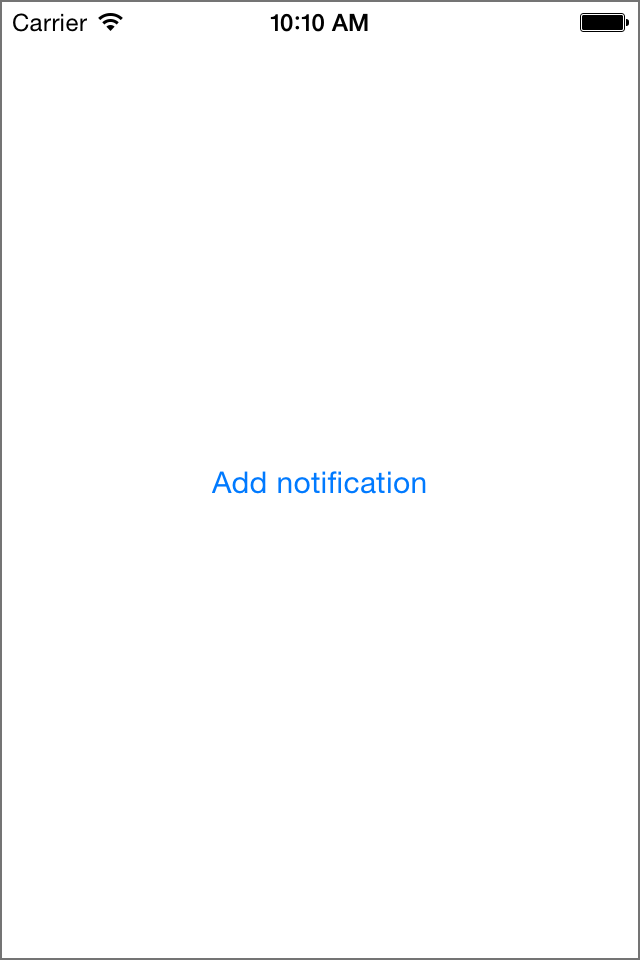
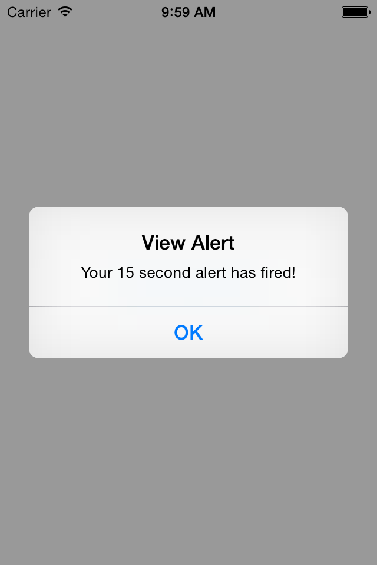

# Walkthrough - Using Local Notifications in Xamarin.iOS

_In this section we'll walk through how to use local notifications in a Xamarin.iOS application. It will demonstrate the basics of creating and publishing a notification that will pop up an alert when received by the app._

> [!IMPORTANT]
> The information in this section pertains to iOS 9 and prior, it has been left here to support older iOS versions. For iOS 10 and later, please see the [User Notification Framework guide](~/ios/platform/user-notifications/index.md) for supporting both Local and Remote Notification on an iOS device.

## Walkthrough

Let create a simple application that will show local notifications in action. This application will have a single
    button on it. When we click on the button, it will create a local notification. After the specified time period has
    elapsed, we will see the notification appear.


1. In Visual Studio for Mac, create a new Single View iOS solution and call it `Notifications`.
1. Open the `Main.storyboard` file, and drag a button onto the View. Name the button **button**, and give it the title **Add Notification**. You may also want to set some [constraints](~/ios/user-interface/designer/designer-auto-layout.md) to the button at this point: 

	
1. Edit the `ViewController` class, and add the following event handler to the ViewDidLoad method:

    ```csharp
	button.TouchUpInside += (sender, e) =>
	{
	    // create the notification
	    var notification = new UILocalNotification();

	    // set the fire date (the date time in which it will fire)
	    notification.FireDate = NSDate.FromTimeIntervalSinceNow(60);

	    // configure the alert
	    notification.AlertAction = "View Alert";
	    notification.AlertBody = "Your one minute alert has fired!";

	    // modify the badge
	    notification.ApplicationIconBadgeNumber = 1;

	    // set the sound to be the default sound
	    notification.SoundName = UILocalNotification.DefaultSoundName;

	    // schedule it
	    UIApplication.SharedApplication.ScheduleLocalNotification(notification);
	};
	```

	This code will create a notification that uses a sound, sets the value of the icon badge to 1, and displays an alert to the user.

1. Next edit the file `AppDelegate.cs`, first add the following code to
    the `FinishedLaunching` method. We have checked to see if the device is running iOS 8, if so we are **required** to ask
    for the user's permission to receive notifications:

    ```csharp
	if (UIDevice.CurrentDevice.CheckSystemVersion (8, 0)) {
			var notificationSettings = UIUserNotificationSettings.GetSettingsForTypes (
				UIUserNotificationType.Alert | UIUserNotificationType.Badge | UIUserNotificationType.Sound, null
			);

			application.RegisterUserNotificationSettings (notificationSettings);
		}
	```

1. Still in `AppDelegate.cs`, add the following method which will be called
    when a notification is received:

    ```csharp
	public override void ReceivedLocalNotification(UIApplication application, UILocalNotification notification)
	        {
	            // show an alert
	            UIAlertController okayAlertController = UIAlertController.Create(notification.AlertAction, notification.AlertBody, UIAlertControllerStyle.Alert);
	            okayAlertController.AddAction(UIAlertAction.Create("OK", UIAlertActionStyle.Default, null));

	            Window.RootViewController.PresentViewController(okayAlertController, true, null);

	            // reset our badge
	            UIApplication.SharedApplication.ApplicationIconBadgeNumber = 0;
	        }

	```

1. We need to handle the case where the notification was launched because of a local notification. Edit
        the method `FinishedLaunching` in the `AppDelegate` to include the following snippet of code:


    ```csharp
	// check for a notification

    if (launchOptions != null)
    {
        // check for a local notification
        if (launchOptions.ContainsKey(UIApplication.LaunchOptionsLocalNotificationKey))
        {
            var localNotification = launchOptions[UIApplication.LaunchOptionsLocalNotificationKey] as UILocalNotification;
            if (localNotification != null)
            {
                UIAlertController okayAlertController = UIAlertController.Create(localNotification.AlertAction, localNotification.AlertBody, UIAlertControllerStyle.Alert);
                okayAlertController.AddAction(UIAlertAction.Create("OK", UIAlertActionStyle.Default, null));

                Window.RootViewController.PresentViewController(okayAlertController, true, null);

                // reset our badge
                UIApplication.SharedApplication.ApplicationIconBadgeNumber = 0;
            }
        }
    }

	```

1. Finally, run the application. On iOS 8 you will be prompted to allow notifications. Click **OK** and then click the **Add notification** button. After a short pause you should see the alert dialog, as shown in the following screenshots:

    
    
    

## Summary

This walkthrough showed how to use the various API's for creating and publishing notifications in iOS. It also demonstrated
    how to update the application icon with a badge to provide some application specific feedback to the user.


## Related Links

- [Local Notifications (sample)](https://developer.xamarin.com/samples/monotouch/LocalNotifications)
- [Local and Push Notifications Programming Guide](https://developer.apple.com/library/prerelease/content/documentation/NetworkingInternet/Conceptual/RemoteNotificationsPG/)
