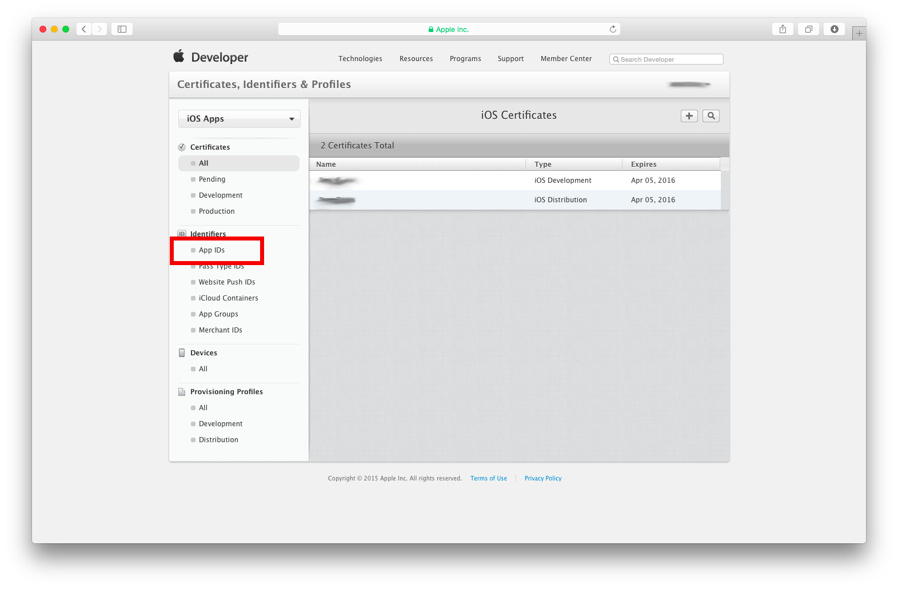
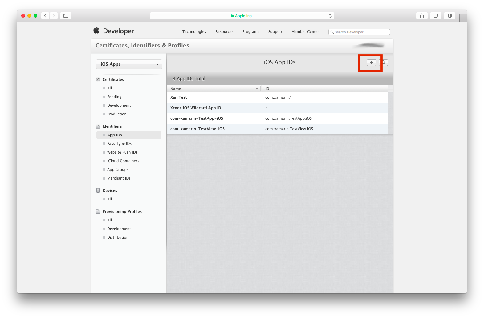
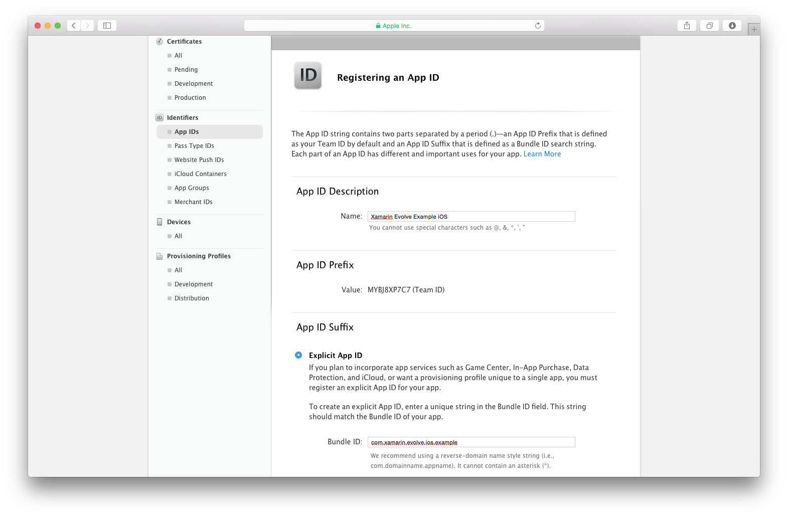
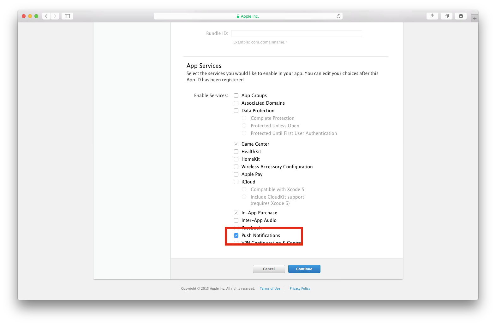
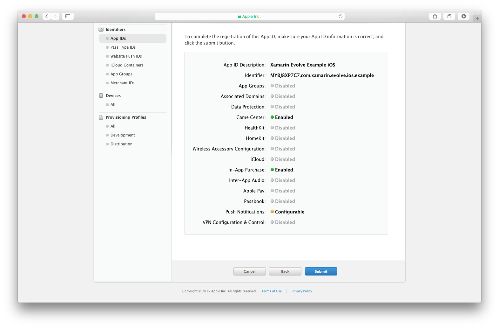
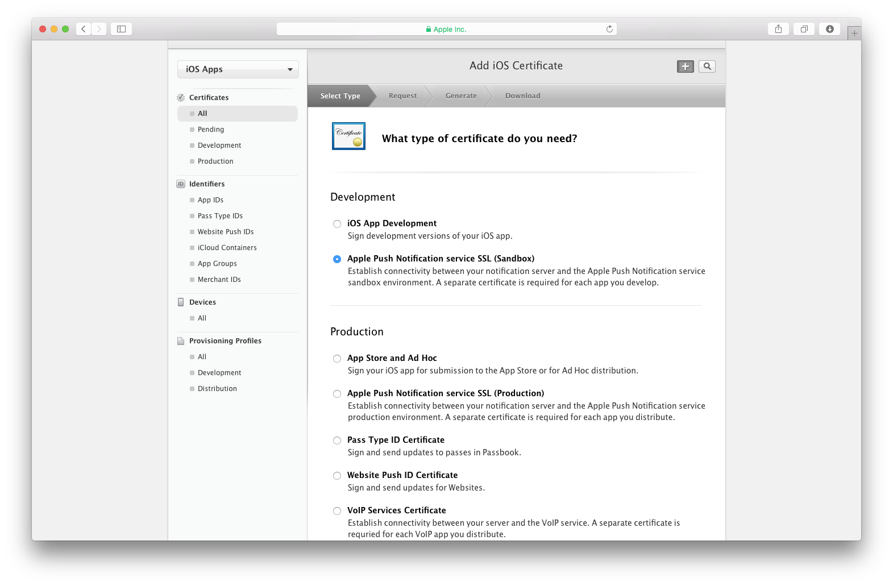
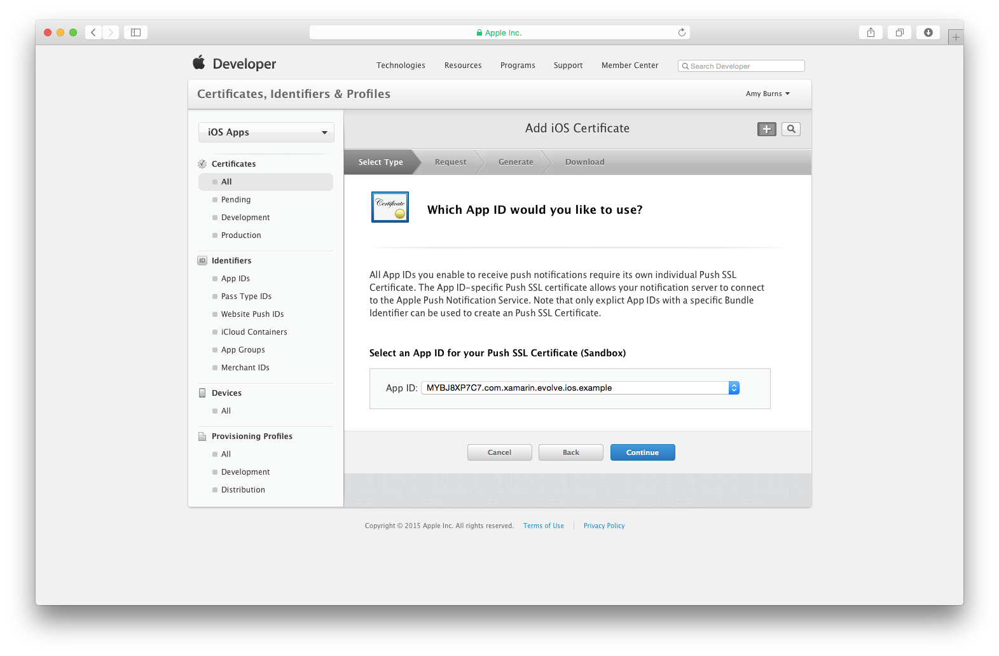
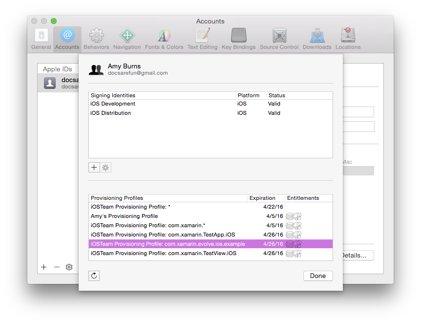
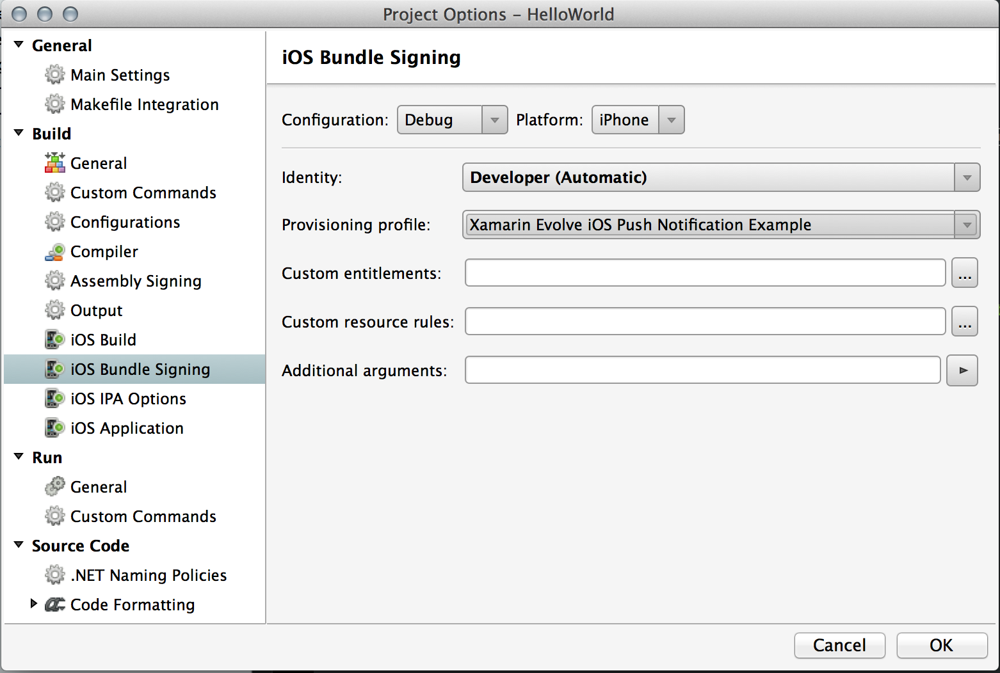
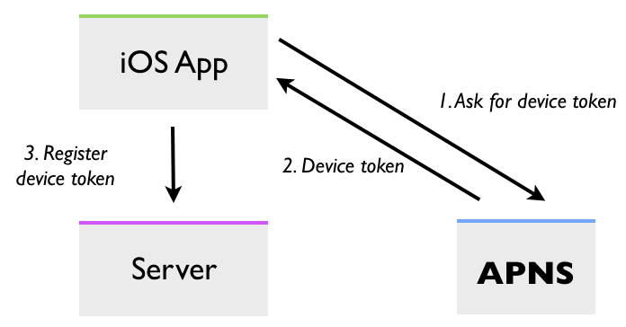

# Push Notifications in iOS

> [!IMPORTANT]
> The information in this section pertains to iOS 9 and prior, it has been left here to support older iOS versions. For iOS 10 and later, please see the [User Notification Framework guide](~/ios/platform/user-notifications/index.md) for supporting both Local and Remote Notification on an iOS device.

Push notifications should be kept brief and only contain enough data to notify the mobile application that it
    should contact the server application for an update. For example, when new email arrives, the server application
    would only notify the mobile application that new email has arrived. The notification would not contain the new
    email itself. The mobile application would then retrieve the new emails from the server when it was appropriate

At the center of push notifications in iOS is the *Apple Push Notification Gateway Service (APNS)*. This is a
    service provided by Apple that is responsible for routing notifications from an application server to iOS devices.
    The following image illustrates the push notification topology for iOS:
 

Remote notifications themselves are JSON formatted strings that adhere to the format and protocols specified in [The Notification Payload](https://developer.apple.com/library/prerelease/content/documentation/NetworkingInternet/Conceptual/RemoteNotificationsPG/CreatingtheNotificationPayload.html#//apple_ref/doc/uid/TP40008194-CH10-SW1) section of the [Local and Push Notification Programming Guide](https://developer.apple.com/library/prerelease/content/documentation/NetworkingInternet/Conceptual/RemoteNotificationsPG/) in the [iOS developer documentation](https://developer.apple.com/devcenter/ios/index.action).

Apple maintains two environments of APNS: a *Sandbox* and a *Production* environment. The Sandbox
    environment is meant for testing during the development phase and can be found at `gateway.sandbox.push.apple.com`
    on TCP port 2195. The Production environment is meant to be used in applications that have been deployed and can be
    found at `gateway.push.apple.com` on TCP port 2195.

## Requirements

Push notification must observe the following rules that are dictated by the architecture of APNS:

-  **256 byte Message Limit** - The entire message size of the notification must not exceed 256 bytes.
-  **No Receipt Confirmation** - APNS does not provide the sender with any notification that a message made it to the intended recipient. If the device is unreachable and multiple sequential notifications are sent, all notifications except the most recent will be lost. Only the most recent notification will be delivered to the device.
-  **Each application requires a secure certificate** - Communication with APNS must be done over SSL.


## Creating and Using Certificates

Each of the environments mentioned in the previous section require their own certificate. This section will cover how to create a certificate, associate it with a provisioning profile, and then get a Personal Information Exchange certificate for use with PushSharp.

1.  To create a certificates go to the iOS Provisioning Portal on Apple's website, as shown in the following screenshot (notice the App IDs menu item on the left):

	[](remote-notifications-in-ios-images/image5new.png#lightbox)

2.  Next, navigate to the App ID's section and create a new app ID as shown in the following screenshot:

	[](remote-notifications-in-ios-images/image6new.png#lightbox)

3.  When you click on the **+** button, you will be able to enter the description and a Bundle Identifier for the app ID, as shown in the next screenshot:

	[](remote-notifications-in-ios-images/image7new.png#lightbox)

4. Make sure to select **Explicit App ID** and that the Bundle Identifier doesn't end with a  `*` . This will create an identifier that is good for multiple applications, and push notification certificates must be for a single application.

1. Under App Services, select **Push Notifications**:

	[](remote-notifications-in-ios-images/image8new.png#lightbox)

2. And press **Submit** to confirm registration of the new App ID:

	[](remote-notifications-in-ios-images/image9new.png#lightbox)

3.  Next, you must create the certificate for the app ID. In the left hand navigation, browse to **Certificates > All** and select the `+` button, as shown in the following screenshot:

	[](remote-notifications-in-ios-images/image8.png#lightbox)

4.	Select whether you would like to use a Development or Production certificate:

	[](remote-notifications-in-ios-images/image11new.png#lightbox)

5. And then select the new App ID that we have just created:

	[](remote-notifications-in-ios-images/image12new.png#lightbox)

6.  This will display instructions that will take you through the process of creating a  *Certificate Signing Request* using the  **Keychain Access** application on your Mac.

7.  Now that the certificate has been created, it must be used as part of the build process to sign the application so that it may register with APNs. This requires creating and installing a provisioning profile that uses the certificate.

8.  To create a development provisioning profile, navigate to the **Provisioning Profiles** section and follow the steps to create it, using the App Id we have just created.

9.  Once you've created the provisioning profile, open up  **Xcode Organizer** and refresh it. If the provisioning profile you created does not appear it may be necessary to download the profile from the iOS Provisioning Portal and manually import it. The following screen shot shows an example of the Organizer with the provision profile added:

	[](remote-notifications-in-ios-images/image13new.png#lightbox)

10.  At this point we need to configure the Xamarin.iOS project to use this newly created provisioning profile. This is done from  **Project Options** dialog, under  **iOS Bundle Signing** tab, as showing in the following screenshot:

	[](remote-notifications-in-ios-images/image11.png#lightbox)

At this point the application is configured to work with push notifications. However, there are still a few more steps required with the certificate. This certificate is in DER format that is not compatible with PushSharp, which requires a Personal Information Exchange (PKCS12) certificate. To convert the certificate so that it is usable by PushSharp, perform these final steps:

1.  **Download the certificate file** - Login to the iOS Provisioning Portal, chose the Certificates tab, select the certificate associated with the correct provisioning profile and chose  **Download** .
1.  **Open Keychain Access** - This is application is a GUI interface to the password management system in OS X.
1.  **Import the Certificate** - If the certificated isn't already installed,  **File...Import Items** from the Keychain Access menu. Navigate to the certificate that exported above, and select it.
1.  **Export the Certificate** - Expand the certificate so the associated private key is visible, right-click on the key and chose Export. You will be prompted for a filename and a password for the exported file.

At this point we are done with certificates. We have created a certificate that will be used to sign iOS applications
    and converted that certificate to a format that can be used with PushSharp in a server application. Next let's look
    at how iOS applications interact with APNS.

## Registering with APNS

Before an iOS application can receive remote notification it must register with APNS. APNS will generate a unique
    device token and return that to the iOS application. The iOS application will then take the device token and then
    register itself with the application server. Once all this happens, registration is complete, and the application
    server may push notifications to the mobile device.

In theory, the device token may change each time an iOS application registers itself with APNS, however in practice
    this does not happen that often. As an optimization an application may cache the most recent device token and only
    update the application server when it does change. The following diagram illustrates the process of registration and
    obtaining a device token:

 

Registration with APNS is handled in the `FinishedLaunching` method of the application delegate class by
    calling `RegisterForRemoteNotificationTypes` on the current `UIApplication` object. When an
    iOS application registers with APNS, it must also specify what types of remote notifications it would like to
    receive. These remote notification types are declared in the enumeration `UIRemoteNotificationType`. The
    following code snippet is an example of how an iOS application can register to receive remote alert and badge
    notifications:

```csharp
if (UIDevice.CurrentDevice.CheckSystemVersion (8, 0)) {
    var pushSettings = UIUserNotificationSettings.GetSettingsForTypes (
                       UIUserNotificationType.Alert | UIUserNotificationType.Badge | UIUserNotificationType.Sound,
                       new NSSet ());

    UIApplication.SharedApplication.RegisterUserNotificationSettings (pushSettings);
    UIApplication.SharedApplication.RegisterForRemoteNotifications ();
} else {
    UIRemoteNotificationType notificationTypes = UIRemoteNotificationType.Alert | UIRemoteNotificationType.Badge | UIRemoteNotificationType.Sound;
    UIApplication.SharedApplication.RegisterForRemoteNotificationTypes (notificationTypes);
}
```

The APNS registration request happens in the background - when the response is received, iOS will call the method `RegisteredForRemoteNotifications` in the `AppDelegate` class and pass the registered device
    token. The token will be contained in an `NSData` object. The following code snippet shows how to
    retrieve the device token that APNS provided:

```csharp
public override void RegisteredForRemoteNotifications (
UIApplication application, NSData deviceToken)
{
    // Get current device token
    var DeviceToken = deviceToken.Description;
    if (!string.IsNullOrWhiteSpace(DeviceToken)) {
    	DeviceToken = DeviceToken.Trim('<').Trim('>');
    }

    // Get previous device token
    var oldDeviceToken = NSUserDefaults.StandardUserDefaults.StringForKey("PushDeviceToken");

    // Has the token changed?
    if (string.IsNullOrEmpty(oldDeviceToken) || !oldDeviceToken.Equals(DeviceToken))
	{
		//TODO: Put your own logic here to notify your server that the device token has changed/been created!
	}

	// Save new device token
	NSUserDefaults.StandardUserDefaults.SetString(DeviceToken, "PushDeviceToken");
}
```

If the registration fails for some reason (such as the device is not connected to the Internet), iOS will call `FailedToRegisterForRemoteNotifications` on the application delegate class. The following code snippet shows how to display an alert to the user informing them that the registration failed:

```csharp
public override void FailedToRegisterForRemoteNotifications (UIApplication application , NSError error)
{
    new UIAlertView("Error registering push notifications", error.LocalizedDescription, null, "OK", null).Show();
}
```

### Device Token Housekeeping

Device tokens will expire or change over time. Because of this fact, server applications will need to do some house
    cleaning and purge these expired or changed tokens. When an application sends as push notification to a device that
    has an expired token, APNS will record and save that expired token. Servers may then query APNS to find out what
    tokens have expired.

APNS used to provide a *Feedback Service* - an HTTPS endpoint that authenticates via the certificate that was created to send push notifications and sends back data about what tokens have expired. This has been deprecated by Apple and removed.

Instead, there is a new HTTP status code for the case that was previously reported by the Feedback Service:

> 410 - The device token is no longer active for the topic.

Additionally, a new `timestamp` JSON data key will be in the response body:

> If the value in the :status header is 410, the value of this key is the last time at which APNs confirmed that the device token was no longer valid for the topic.
>
> Stop pushing notifications until the device registers a token with a later timestamp with your provider.

## Summary

This section introduce the key concepts surrounding push notifications in iOS. It explained the role of the Apple
    Push Notification Gateway Service (APNS). It then covered the creation and use of the security certificates that are
    essential to APNS. Finally this document finished up with a discussion on how application servers can use the *Feedback Services* to
    stop tracking expired device tokens.


## Related Links

- [Notifications - Demonstrating Local and remote notifications (sample)](https://developer.xamarin.com/samples/monotouch/Notifications/)
- [Local and Push Notifications for Developers](https://developer.apple.com/notifications/)
- [UIApplication](http://iosapi.xamarin.com/?link=T%3aMonoTouch.UIKit.UIApplication)
- [UIRemoteNotificationType](http://iosapi.xamarin.com/?link=T%3aMonoTouch.UIKit.UIRemoteNotificationType)
