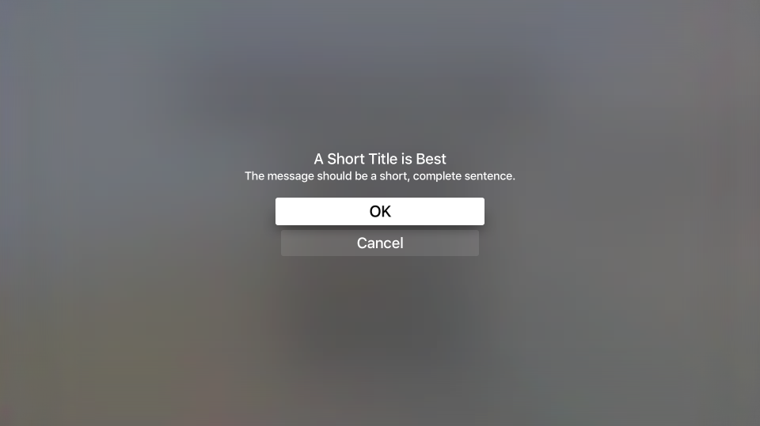
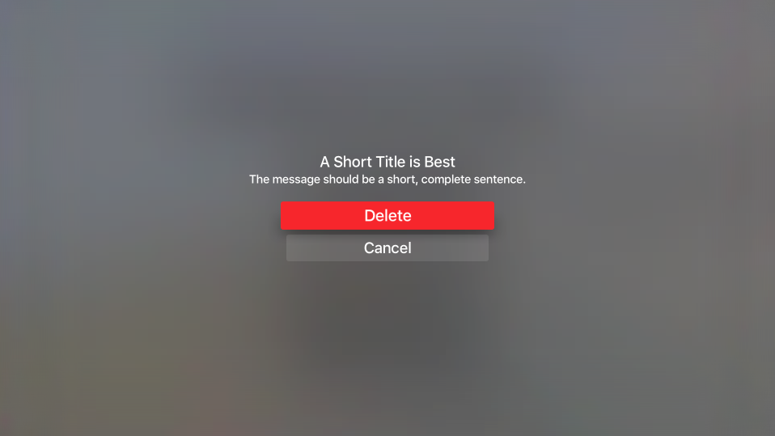
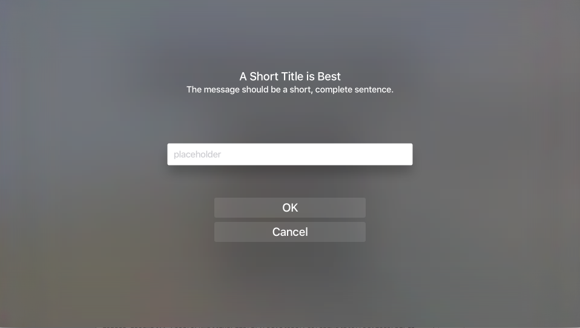
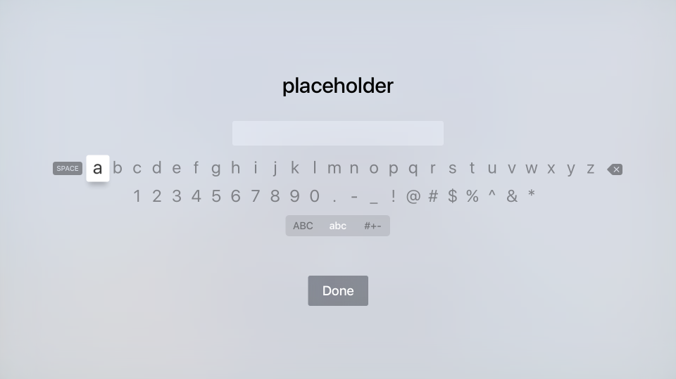

# Working with tvOS Alerts in Xamarin

_This article covers working with UIAlertController to display an alert message to the user in Xamarin.tvOS._

If you need to get the attention of the tvOS user or ask permission to perform a destructive action (such as deleting a file), you can present an alert message using the `UIAlertViewController`:

[](alerts-images/alert01.png#lightbox)

If addition to displaying a message, you can add buttons and text fields to an alert to allow the user to respond to actions and provide feedback.

<a name="About-Alerts" />

## About Alerts

As stated above, alerts are used to get the user's attention and inform them of the state of your app or request feedback. Alerts must present a Title, they can optionally have a message and one or more buttons or text fields.

[](alerts-images/alert04.png#lightbox)

Apple has the following suggestions for working with Alerts:

- **Use Alerts Sparingly** - Alerts disrupt the user's flow with the app and interrupt the user experience and as such, should only be used for important situations such as error notifications, In-App Purchases and destructive actions. 
- **Provides Useful Choices** - If the Alert presents options to the user, your should ensure that each option offers critical information and provides useful actions for the user to take.

<a name="Alert-Titles-and-Messages" />

### Alert Titles and Messages

Apple has the following suggestions for presenting an Alert's Title and optional Message:

- **Use Multiword Titles** - An Alert's Title should get the point of the situation across clearly while still remaining simple. A single word title rarely provides enough information.
- **Use Descriptive Titles that do not Require a Message** - Wherever possible, consider making the Alert's title descriptive enough that the optional Message text is not required. 
- **Make the Message a Short, Complete Sentence** - If the optional Message is required to get the point of the Alert across, keep it as simple as possible and make it a complete sentence with proper capitalization and punctuation.

<a name="Alert-Buttons" />

### Alert Buttons

Apple has the following suggestion for adding Buttons to an Alert:

- **Limit to Two Buttons** - Wherever possible, limit the Alert to a maximum of two Buttons. Single Button Alerts provide information but no actions. Two Button Alerts provide a simple yes/no choice of action.
- **Use Succinct, Logical Button Titles** - Simple one to two word Button titles that clearly describe the Button's action work best. For more information, see our [Working with Buttons](~/ios/tvos/user-interface/buttons.md) documentation.
- **Clearly Mark Destructive Buttons** - For Buttons that perform a destructive action (such as deleting a file) clearly mark them with the `UIAlertActionStyle.Destructive` style.

<a name="Displaying-an-Alert" />

## Displaying an Alert

To display an alert, you create an instance of the `UIAlertViewController` and configure it by adding Actions (buttons) and selecting the style of the Alert. For example, the following code displays an OK/Cancel alert:

```csharp
const string title = "A Short Title is Best";
const string message = "A message should be a short, complete sentence.";
const string acceptButtonTitle = "OK";
const string cancelButtonTitle = "Cancel";
const string deleteButtonTitle = "Delete";
...
		
var alertController = UIAlertController.Create (title, message, UIAlertControllerStyle.Alert);

// Create the action.
var acceptAction = UIAlertAction.Create (acceptButtonTitle, UIAlertActionStyle.Default, _ => 
	Console.WriteLine ("The \"OK/Cancel\" alert's other action occurred.")
);

var cancelAction = UIAlertAction.Create (cancelButtonTitle, UIAlertActionStyle.Cancel, _ => 
	Console.WriteLine ("The \"OK/Cancel\" alert's other action occurred.")
);

// Add the actions.
alertController.AddAction (acceptAction);
alertController.AddAction (cancelAction);
PresentViewController (alertController, true, null);
```

Let's take a look at this code in detail. First, we create a new Alert with the given title and message:

```csharp
UIAlertController.Create (title, message, UIAlertControllerStyle.Alert)
```

Next, for each button that we want to display in the alert we create an Action defining the title of the button, its style and the action we want to take if the button is pressed:

```csharp
UIAlertAction.Create ("Button Title", UIAlertActionStyle.Default, _ => 
	// Do something when the button is pressed
	...
);
```

The `UIAlertActionStyle` enum allow you to set the style of the button as one of the following:

- **Default** - The button will be the default button selected when the alert is displayed.
- **Cancel** - The button is the cancel button for the alert.
- **Destructive** - Highlights the button as a destructive action, such as deleting a file. Currently, tvOS renders the Destructive button with a red background.

The `AddAction` method adds the given action to the `UIAlertViewController` and finally the `PresentViewController (alertController, true, null)` method displays the given alert to the user.

<a name="Adding-Text-Fields" />

## Adding Text Fields

In addition to adding Actions (buttons) to the Alert, you can add Text Fields to the Alert to allow the user to fill in information such as user IDs and passwords:

[](alerts-images/alert02.png#lightbox)

If the user selects the Text Field, the standard tvOS keyboard will be displayed allowing them to enter a value for the field:

[](alerts-images/alert03.png#lightbox)

The following code displays an OK/Cancel Alert with a single Text Field for entering a value:

```csharp
UIAlertController alert = UIAlertController.Create(title, description, UIAlertControllerStyle.Alert);
UITextField field = null;

// Add and configure text field
alert.AddTextField ((textField) => {
	// Save the field
	field = textField;

	// Initialize field
	field.Placeholder = placeholder;
	field.Text = text;
	field.AutocorrectionType = UITextAutocorrectionType.No;
	field.KeyboardType = UIKeyboardType.Default;
	field.ReturnKeyType = UIReturnKeyType.Done;
	field.ClearButtonMode = UITextFieldViewMode.WhileEditing;

});

// Add cancel button
alert.AddAction(UIAlertAction.Create("Cancel",UIAlertActionStyle.Cancel,(actionCancel) => {
	// User canceled, do something
	...
}));

// Add ok button
alert.AddAction(UIAlertAction.Create("OK",UIAlertActionStyle.Default,(actionOK) => {
	// User selected ok, do something
	...
}));

// Display the alert
controller.PresentViewController(alert,true,null);
```

The `AddTextField` method adds a new text field to the alert that you can then configure by setting properties such as the placeholder text (the text that appears when the field is empty), the default text value and the type of keyboard. For example:

```csharp
// Initialize field
field.Placeholder = placeholder;
field.Text = text;
field.AutocorrectionType = UITextAutocorrectionType.No;
field.KeyboardType = UIKeyboardType.Default;
field.ReturnKeyType = UIReturnKeyType.Done;
field.ClearButtonMode = UITextFieldViewMode.WhileEditing;
```

So that we can act on the value of the Text Field later, we are also saving a copy of using the following code:

```csharp
UITextField field = null;
...

// Add and configure text field
alert.AddTextField ((textField) => {
	// Save the field
	field = textField;
	...
});
```

After the user has entered a value in the Text Field, we can use the `field` variable to access that value.

<a name="Alert-View-Controller-Helper-Class" />

## Alert View Controller Helper Class

Because displaying simple, common types of Alerts using `UIAlertViewController` can result in quite a bit of duplicate code, you can use a helper class to reduce the amount of repetitive code. For example:

```csharp
using System;
using Foundation;
using UIKit;
using System.CodeDom.Compiler;

namespace UIKit
{
	/// <summary>
	/// Alert view controller is a reusable helper class that makes working with <c>UIAlertViewController</c> alerts
	/// easier in a tvOS app.
	/// </summary>
	public class AlertViewController
	{
		#region Static Methods
		public static UIAlertController PresentOKAlert(string title, string description, UIViewController controller) {
			// No, inform the user that they must create a home first
			UIAlertController alert = UIAlertController.Create(title, description, UIAlertControllerStyle.Alert);

			// Configure the alert
			alert.AddAction(UIAlertAction.Create("OK",UIAlertActionStyle.Default,(action) => {}));

			// Display the alert
			controller.PresentViewController(alert,true,null);

			// Return created controller
			return alert;
		}

		public static UIAlertController PresentOKCancelAlert(string title, string description, UIViewController controller, AlertOKCancelDelegate action) {
			// No, inform the user that they must create a home first
			UIAlertController alert = UIAlertController.Create(title, description, UIAlertControllerStyle.Alert);

			// Add cancel button
			alert.AddAction(UIAlertAction.Create("Cancel",UIAlertActionStyle.Cancel,(actionCancel) => {
				// Any action?
				if (action!=null) {
					action(false);
				}
			}));

			// Add ok button
			alert.AddAction(UIAlertAction.Create("OK",UIAlertActionStyle.Default,(actionOK) => {
				// Any action?
				if (action!=null) {
					action(true);
				}
			}));

			// Display the alert
			controller.PresentViewController(alert,true,null);

			// Return created controller
			return alert;
		}

		public static UIAlertController PresentDestructiveAlert(string title, string description, string destructiveAction, UIViewController controller, AlertOKCancelDelegate action) {
			// No, inform the user that they must create a home first
			UIAlertController alert = UIAlertController.Create(title, description, UIAlertControllerStyle.Alert);

			// Add cancel button
			alert.AddAction(UIAlertAction.Create("Cancel",UIAlertActionStyle.Cancel,(actionCancel) => {
				// Any action?
				if (action!=null) {
					action(false);
				}
			}));

			// Add ok button
			alert.AddAction(UIAlertAction.Create(destructiveAction,UIAlertActionStyle.Destructive,(actionOK) => {
				// Any action?
				if (action!=null) {
					action(true);
				}
			}));

			// Display the alert
			controller.PresentViewController(alert,true,null);

			// Return created controller
			return alert;
		}

		public static UIAlertController PresentTextInputAlert(string title, string description, string placeholder, string text, UIViewController controller, AlertTextInputDelegate action) {
			// No, inform the user that they must create a home first
			UIAlertController alert = UIAlertController.Create(title, description, UIAlertControllerStyle.Alert);
			UITextField field = null;

			// Add and configure text field
			alert.AddTextField ((textField) => {
				// Save the field
				field = textField;

				// Initialize field
				field.Placeholder = placeholder;
				field.Text = text;
				field.AutocorrectionType = UITextAutocorrectionType.No;
				field.KeyboardType = UIKeyboardType.Default;
				field.ReturnKeyType = UIReturnKeyType.Done;
				field.ClearButtonMode = UITextFieldViewMode.WhileEditing;

			});

			// Add cancel button
			alert.AddAction(UIAlertAction.Create("Cancel",UIAlertActionStyle.Cancel,(actionCancel) => {
				// Any action?
				if (action!=null) {
					action(false,"");
				}
			}));

			// Add ok button
			alert.AddAction(UIAlertAction.Create("OK",UIAlertActionStyle.Default,(actionOK) => {
				// Any action?
				if (action!=null && field !=null) {
					action(true, field.Text);
				}
			}));

			// Display the alert
			controller.PresentViewController(alert,true,null);

			// Return created controller
			return alert;
		}
		#endregion

		#region Delegates
		public delegate void AlertOKCancelDelegate(bool OK);
		public delegate void AlertTextInputDelegate(bool OK, string text);
		#endregion
	}
}
```

Using this class, displaying and responding to simple alerts can be done as follows:

```csharp
#region Custom Actions
partial void DisplayDestructiveAlert (Foundation.NSObject sender) {
	// User helper class to present alert
	AlertViewController.PresentDestructiveAlert("A Short Title is Best","The message should be a short, complete sentence.","Delete",this, (ok) => {
		Console.WriteLine("Destructive Alert: The user selected {0}",ok);
	});
}

partial void DisplayOkCancelAlert (Foundation.NSObject sender) {
	// User helper class to present alert
	AlertViewController.PresentOKCancelAlert("A Short Title is Best","The message should be a short, complete sentence.",this, (ok) => {
		Console.WriteLine("OK/Cancel Alert: The user selected {0}",ok);
	});
}

partial void DisplaySimpleAlert (Foundation.NSObject sender) {
	// User helper class to present alert
	AlertViewController.PresentOKAlert("A Short Title is Best","The message should be a short, complete sentence.",this);
}

partial void DisplayTextInputAlert (Foundation.NSObject sender) {
	// User helper class to present alert
	AlertViewController.PresentTextInputAlert("A Short Title is Best","The message should be a short, complete sentence.","placeholder", "", this, (ok, text) => {
		Console.WriteLine("Text Input Alert: The user selected {0} and entered `{1}`",ok,text);
	});
}
#endregion
```


<a name="Summary" />

## Summary

This article has covered working with `UIAlertController` to display an alert message to the user in Xamarin.tvOS. First, it showed how to display a simple alert and add buttons. Next, it showed how to add Text Fields to an alert. Finally, it showed how to use a helper class to reduce the amount of repetitive code required to display an Alert.


## Related Links

- [tvOS Samples](https://developer.xamarin.com/samples/tvos/all/)
- [tvOS](https://developer.apple.com/tvos/)
- [tvOS Human Interface Guides](https://developer.apple.com/tvos/human-interface-guidelines/)
- [App Programming Guide for tvOS](https://developer.apple.com/library/prerelease/tvos/documentation/General/Conceptual/AppleTV_PG/)
