# Working with Table Views

_This article covers designing and working with Table Views and Table View Controllers inside of a Xamarin.tvOS app._

In tvOS, a Table View is presented as a single column of scrolling rows that can optionally be organized into groups or sections. Table Views should be used when you need to display a large amount of data efficiently to the user, in a clear to understand way.

Table Views are typically displayed in one side of a [Split View](~/ios/tvos/user-interface/split-views.md) as navigation, with the details of the selected item displayed in the opposite side:

[](table-views-images/intro01.png#lightbox)

<a name="About-Table-Views" />

## About Table Views

A `UITableView` displays a single column of scrollable rows as a hierarchical list of information that can optionally be organized into groups or sections: 

[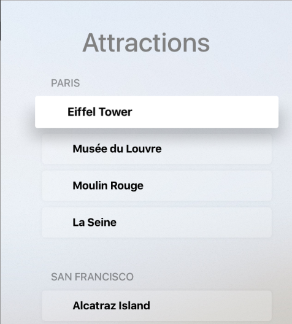](table-views-images/table01.png#lightbox)

Apple has the following suggestions for working with tables:

- **Be Aware of Width** - Try to strike the correct balance in your table widths. If the table is too wide, it can be difficult to scan from a distance and can take away from the available content area. If the table is too narrow, it can cause the information to be truncated or wrap, again this can be difficult for the user to read from across the room.
- **Show Table Contents Quickly** - For large lists of data, lazy-load the content and start showing information as soon as the table is presented to the user. If the table takes to long to load, the user might lose interest in your app or think it is locked up.
- **Inform User of Long Content Loads** - If a long table load time is unavoidable, present a [Progress Bar or Activity Indicator](~/ios/tvos/user-interface/progress-indicators.md) so that they know the app hasn't locked up.

<a name="Table-Cell-Types" />

## Table View Cell Types

A `UITableViewCell` is used to represent the individual Rows of data in the Table View. Apple has defined several default Table Cell Types:

- **Default** - This type presents an option Image on the left side of the Cell and left-aligned Title on the right. 
- **Subtitle** - This type presents a left-aligned Title on the first line and a smaller left-aligned Subtitle on the next line.
- **Value 1** - This type presents a left-aligned Title with a lighter colored, right-aligned Subtitle on the same line.
- **Value 2** - This type presents a right-aligned Title with a lighter colored, left-aligned Subtitle on the same line.

All of the default Table View Cell Types also support graphical elements such as Disclosure Indicators or Check Marks. 

Additionally, you can define a **Custom** Table View Cell Type and present a _Prototype Cell_, that you either create in the Interface Designer or via code.

Apple has the following suggestions for working with Table View Cells:

- **Avoid Text Clipping** - Keep the individual lines of text short so that they don't end up truncated. Truncated words or phrases are hard for the user to parse from across the room.
- **Consider the Focused Row State** - Because a Row becomes bigger, with more rounded corners when in focus, you need to test your Cell's appearance in all states. Images or text may become clipped or look incorrect in the Focused state.
- **Use Editable Tables Sparingly** - Moving or deleting Table Rows is more time consuming on tvOS than iOS. You need to decide carefully if this feature will add or distract from your tvOS app.
- **Create Custom Cell Types Where Appropriate** - While the built-in Table View Cell Types are great for many situations, consider creating Custom Cell Types for non-standard information to provide greater control and better present the information to the user.

<a name="Working-With-Table-Views" />

## Working With Table Views

The easiest way to work with Table Views in a Xamarin.tvOS app is to create and modify their appearance in the Interface Designer.

To get started, do the following:

# [Visual Studio for Mac](#tab/vsmac)
	
1. In Visual Studio for Mac, start a new tvOS app project and select **tvOS** > **App** > **Single View App** and click the **Next** button: 

	[](table-views-images/table02.png#lightbox)
1. Enter a **Name** for the app and click **Next**: 

	[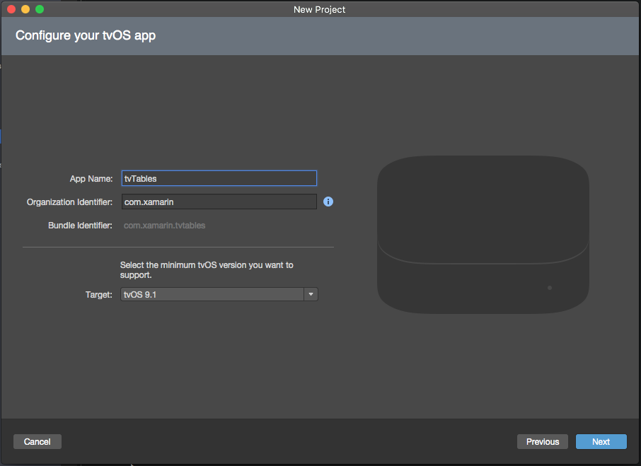](table-views-images/table03.png#lightbox)
1. Either adjust the **Project Name** and **Solution Name** or accept the defaults and click the **Create** button to create the new solution: 

	[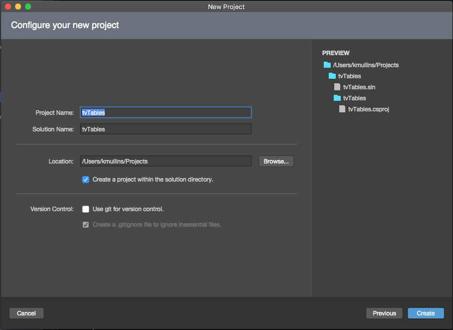](table-views-images/table04.png#lightbox)
1. In the **Solution Pad**, double-click the `Main.storyboard` file to open it in the iOS Designer: 

	[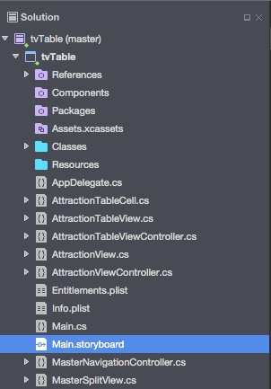](table-views-images/table05.png#lightbox)
1. Select and delete the **Default View Controller**: 

	[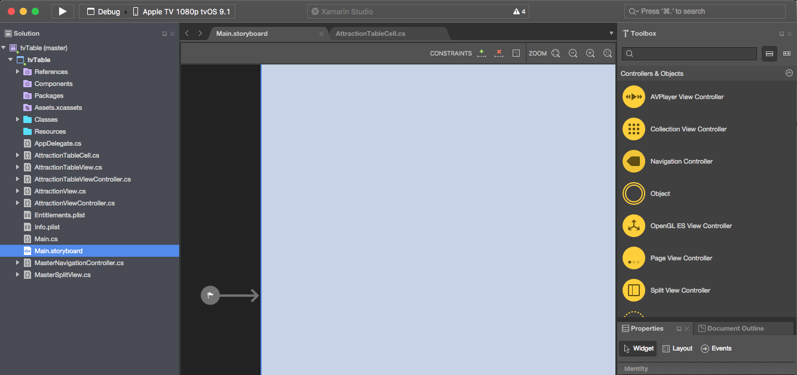](table-views-images/table06.png#lightbox)
1. Select a **Split View Controller** from the **Toolbox** and drag it onto the Design Surface.
1. By default, you'll get a [Split View](~/ios/tvos/user-interface/split-views.md) with a **Navigation View Controller** and a **Table View Controller** in the left hand side and a **View Controller** in the right hand side. This is Apple's suggested usage of a Table View in tvOS: 

	[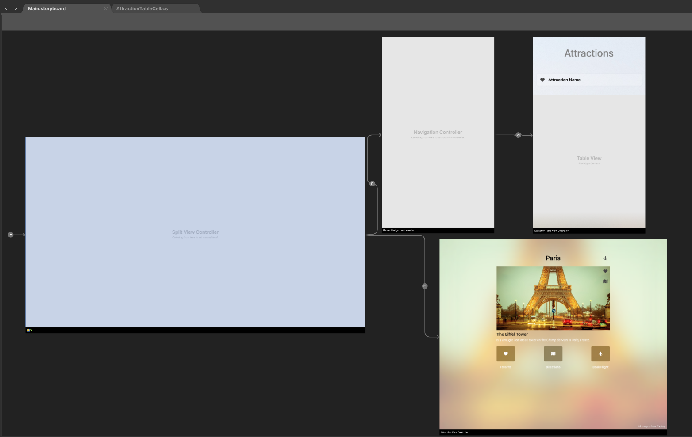](table-views-images/table08.png#lightbox)
1. You will need to select every part of the Table View and assign it a custom **Class Name** in the **Widget** tab of the **Properties Explorer** so that you can access it later in C# code. For example, the **Table View Controller**: 

	[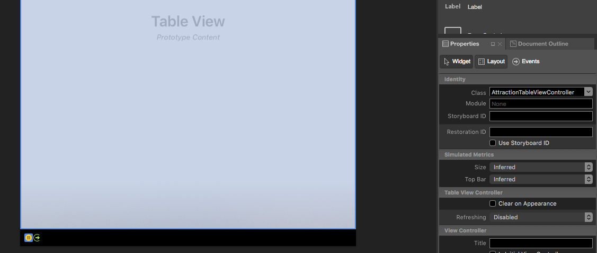](table-views-images/table09.png#lightbox)
1. Ensure that you create a custom class for the **Table View Controller**, the **Table View** and any **Prototype Cells**. Visual Studio for Mac will add the custom classes to the Project Tree as they are created: 

	[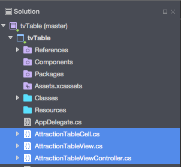](table-views-images/table10.png#lightbox)
1. Next, select the Table View in the Design Surface and adjust it's properties as needed. Such as the number of **Prototype Cells** and the **Style** (Plain or Grouped): 

	[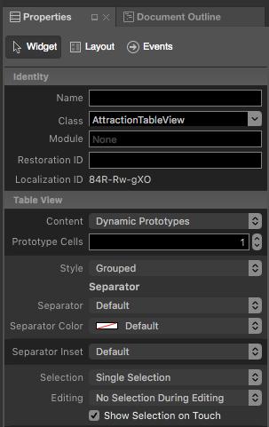](table-views-images/table11.png#lightbox)
1. For each **Prototype Cell**, select it and assign a unique **Identifier** in the **Widget** tab of the **Properties Explorer**. This step is _very important_ as you will need this Identifier later when you populate the table. For example `AttrCell`: 

	[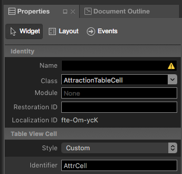](table-views-images/table12.png#lightbox)
1. You can also select to present the Cell as one of the [Default Table View Cell Types](#Table-View-Cell-Types) via the **Style** dropdown or set it to **Custom** and use the Design Surface to layout the Cell by dragging in other UI widgets from the **Toolbox**: 

	[](table-views-images/table13.png#lightbox)
1. Assign a unique **Name** to each UI element in the Prototype Cell design in the **Widget** tab of the **Properties Explorer** so you can access them later in C# code: 

	[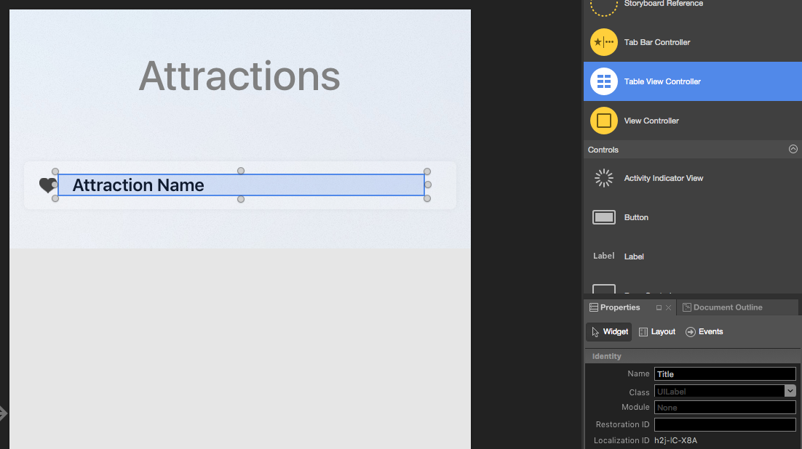](table-views-images/table14.png#lightbox)
1. Repeat the above step for all of the Prototype Cells in the Table View.
1. Next, assign custom classes to the rest of your UI design, layout the Details view and assign unique **Names** to each UI element in the Details view so that you can access them in C# as well. For Example: 

	[](table-views-images/table15.png#lightbox)
1. Save your Changes to the Storyboard.
	
# [Visual Studio](#tab/vswin)
	
1. In Visual Studio, start a new tvOS app project and select **tvOS** > **Single View App** and enter a name for your app. Click the **Okay** button to create a new solution: 

	[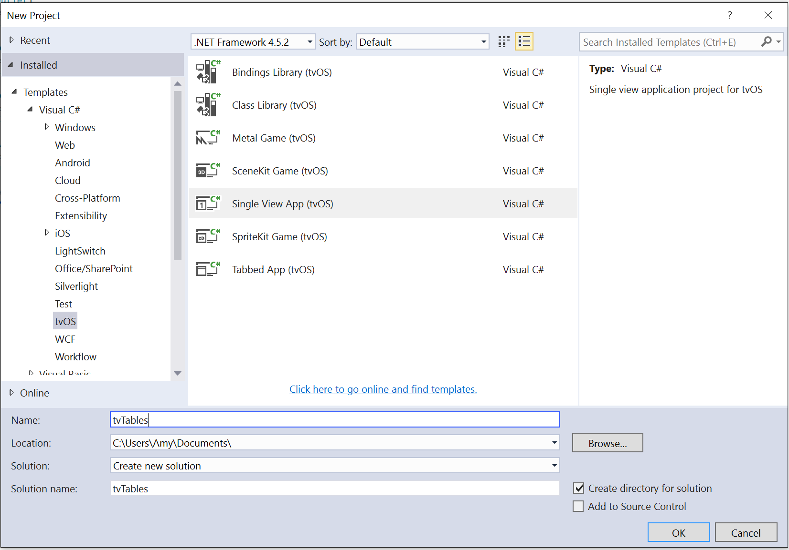](table-views-images/table02-vs.png#lightbox)
1. In the **Solution Explorer**, double-click the `Main.storyboard` file to open it in the iOS Designer: 

	[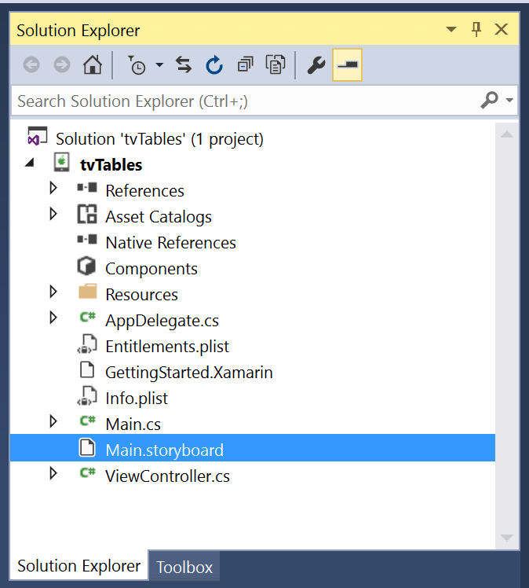](table-views-images/table05-vs.png#lightbox)
1. Select and delete the **Default View Controller**: 

	[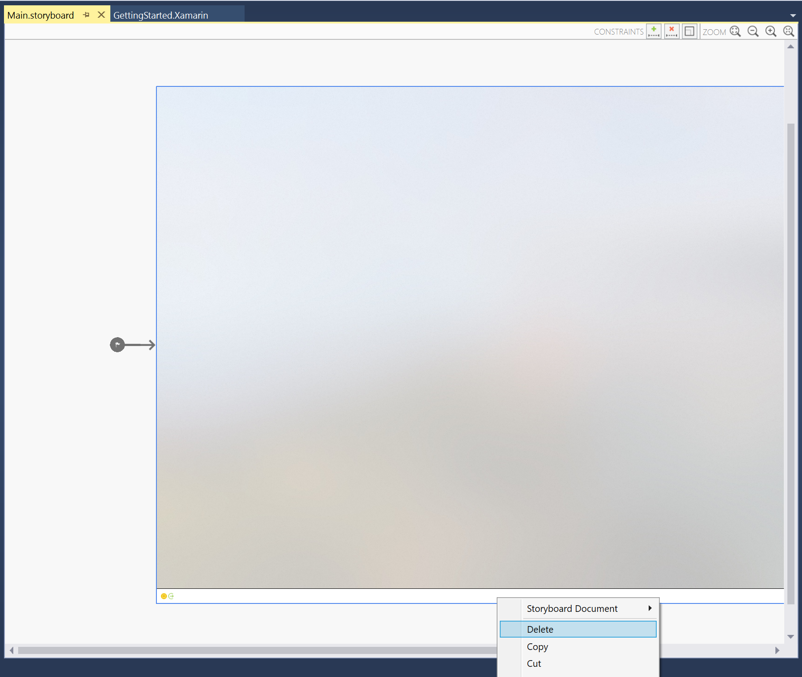](table-views-images/table06-vs.png#lightbox)
1. Select a **Split View Controller** from the **Toolbox** and drag it onto the Design Surface: 

	[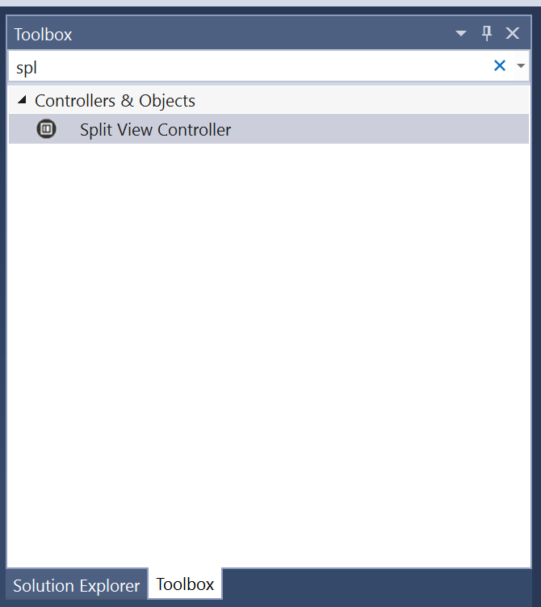](table-views-images/table07-vs.png#lightbox)
1. By default, you'll get a [Split View](~/ios/tvos/user-interface/split-views.md) with a **Navigation View Controller** and a **Table View Controller** in the left hand side and a **View Controller** in the right hand side. This is Apple's suggested usage of a Table View in tvOS: 

	[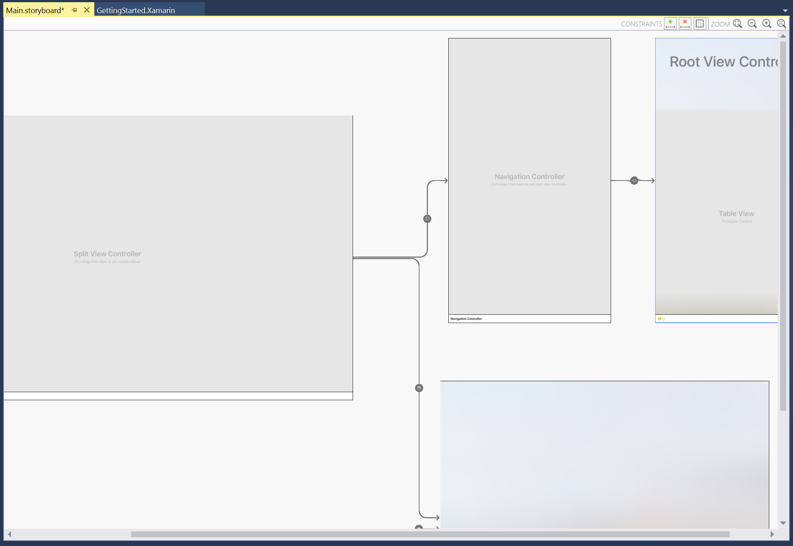](table-views-images/table08-vs.png#lightbox)
1. You will need to select every part of the Table View and assign it a custom **Class Name** in the **Widget** tab of the **Properties Explorer** so that you can access it later in C# code. For example, the **Table View Controller**: 

	[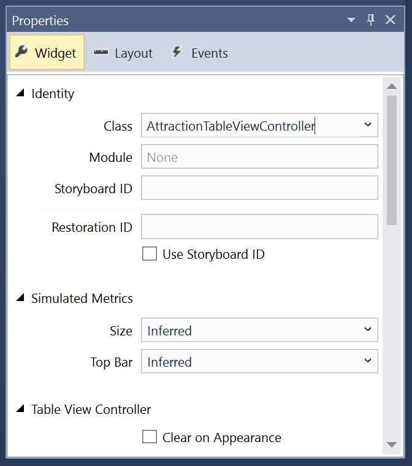](table-views-images/table09-vs.png#lightbox)
1. Ensure that you create a custom class for the **Table View Controller**, the **Table View** and any **Prototype Cells**. Visual Studio for Mac will add the custom classes to the Project Tree as they are created: 

	[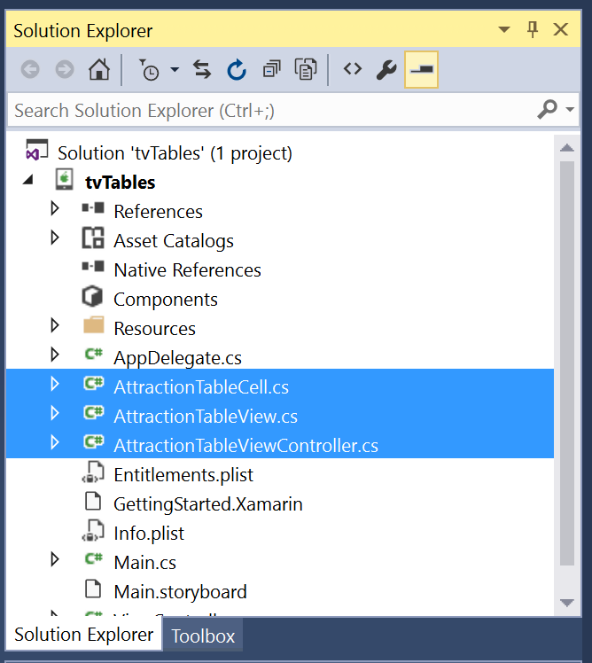](table-views-images/table10-vs.png#lightbox)
1. Next, select the Table View in the Design Surface and adjust it's properties as needed. Such as the number of **Prototype Cells** and the **Style** (Plain or Grouped): 

	[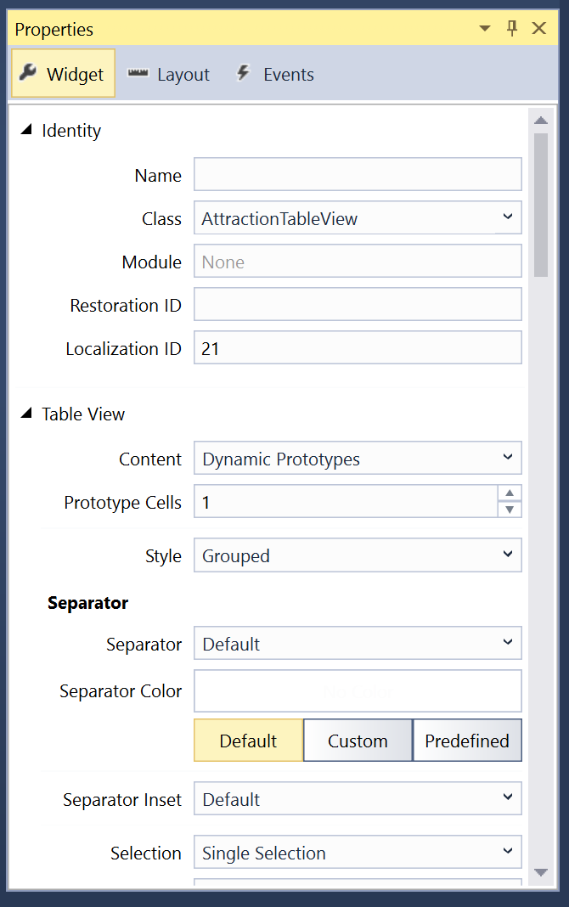](table-views-images/table11-vs.png#lightbox)
1. For each **Prototype Cell**, select it and assign a unique **Identifier** in the **Widget** tab of the **Properties Explorer**. This step is _very important_ as you will need this Identifier later when you populate the table. For example `AttrCell`: 

	[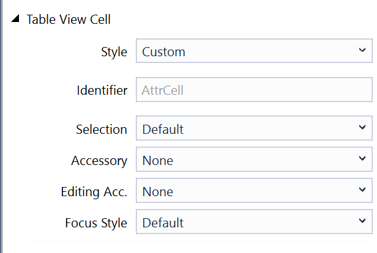](table-views-images/table12-vs.png#lightbox)
1. You can also select to present the Cell as one of the [Default Table View Cell Types](#Table-View-Cell-Types) via the **Style** dropdown or set it to **Custom** and use the Design Surface to layout the Cell by dragging in other UI widgets from the **Toolbox**: 

	[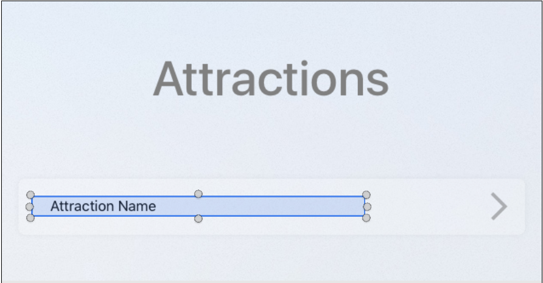](table-views-images/table13-vs.png#lightbox)
1. Assign a unique **Name** to each UI element in the Prototype Cell design in the **Widget** tab of the **Properties Explorer** so you can access them later in C# code: 

	[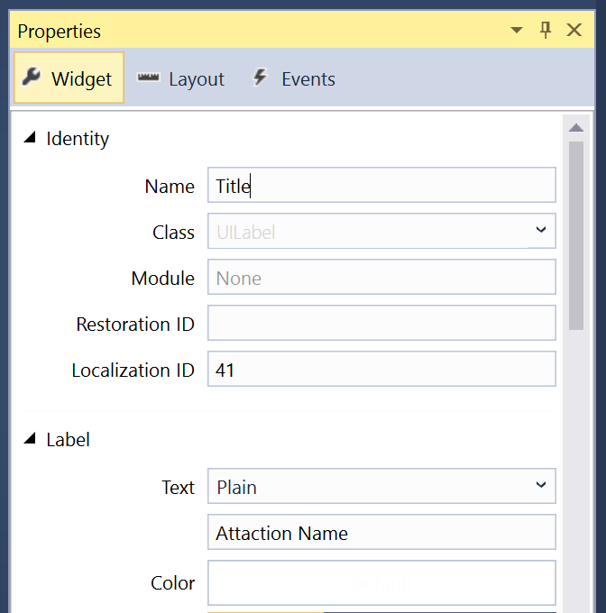](table-views-images/table14-vs.png#lightbox)
1. Repeat the above step for all of the Prototype Cells in the Table View.
1. Next, assign custom classes to the rest of your UI design, layout the Details view and assign unique **Names** to each UI element in the Details view so that you can access them in C# as well. For Example: 

	[](table-views-images/table15.png#lightbox)
1. Save your Changes to the Storyboard.
	
-----

<a name="Designing-a-Data-Model" />

## Designing a Data Model

To make working with the information that the Table View will display easier and to ease presenting of detailed information (as the user selects or highlights Rows in the Table View), create a custom class or classes to act as the Data Model for the information presented.

Take the example of a travel booking app that contains a list of **Cities**, each that contains a unique list of **Attractions** that the user can select. The user will be able to mark an attraction as a *Favorite*, select to get *Directions* to an attraction and *Book a Flight* to a given city.

# [Visual Studio for Mac](#tab/vsmac)

To create the Data Model for an **Attraction**, right-click on the Project Name in the **Solution Pad** and select **Add** > **New File...**. Enter `AttractionInformation` for the **Name** and click the **New** button: 

[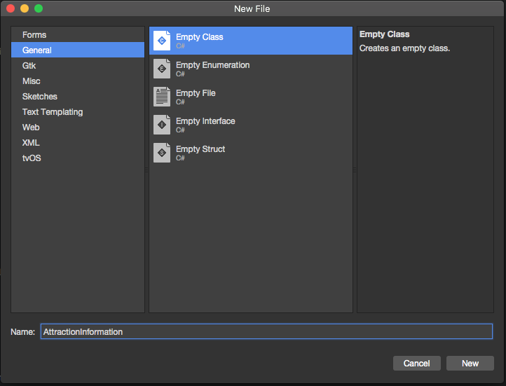](table-views-images/data01.png#lightbox)

# [Visual Studio](#tab/vswin)

To create the Data Model for an **Attraction**, right-click on the Project Name in the **Solution Explorer** and select **Add** > **New Item...**. Select **Class** and enter `AttractionInformation` for the **Name** and click the **Add** button: 

[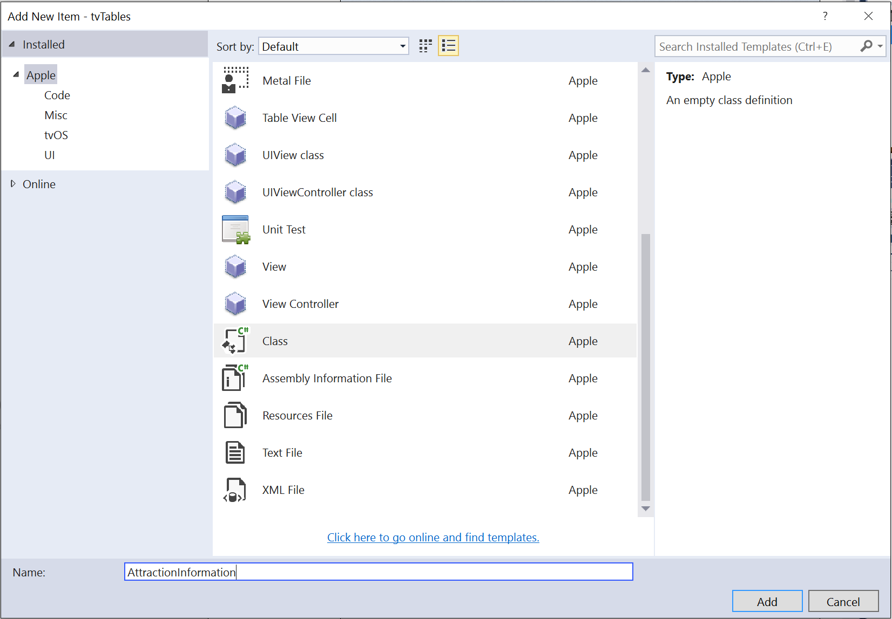](table-views-images/data01-vs.png#lightbox)

-----

Edit the `AttractionInformation.cs` file and make it look like the following:

```csharp
using System;
using Foundation;

namespace tvTable
{
	public class AttractionInformation : NSObject
	{
		#region Computed Properties
		public CityInformation City { get; set;}
		public string Name { get; set;}
		public string Description { get; set;}
		public string ImageName { get; set;}
		public bool IsFavorite { get; set;}
		public bool AddDirections { get; set;}
		#endregion

		#region Constructors
		public AttractionInformation (string name, string description, string imageName)
		{
			// Initialize
			this.Name = name;
			this.Description = description;
			this.ImageName = imageName;
		}
		#endregion
	}
}
```

This class provides the properties to store the information about a given **Attraction**.

# [Visual Studio for Mac](#tab/vsmac)

Next, right-click on the Project Name in the **Solution Pad** again and select **Add** > **New File...**. Enter `CityInformation` for the **Name** and click the **New** button: 

[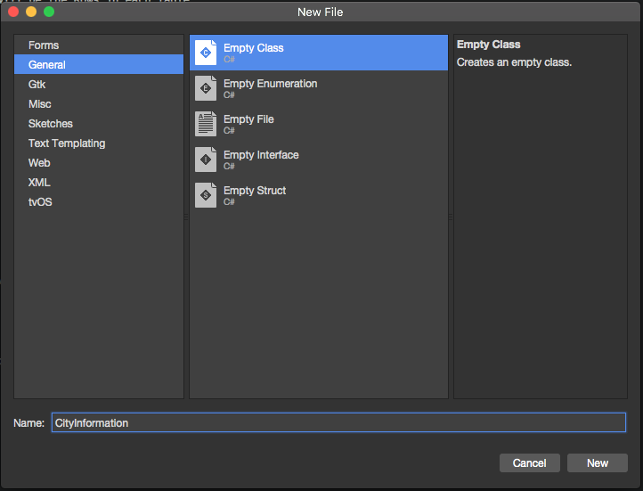](table-views-images/data02.png#lightbox)

# [Visual Studio](#tab/vswin)

Next, right-click on the Project Name in the **Solution Explorer** again and select **Add** > **New Item...**. Enter `CityInformation` for the **Name** and click the **Add** button: 

[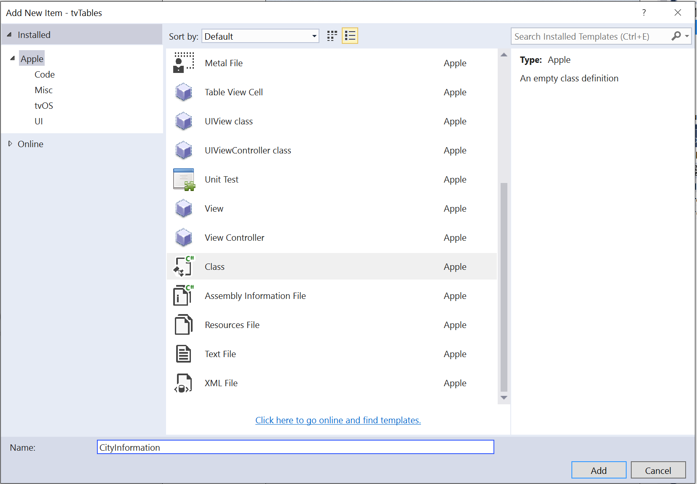](table-views-images/data02-vs.png#lightbox)

-----

Edit the `CityInformation.cs` file and make it look like the following:

```csharp
using System;
using System.Collections.Generic;
using Foundation;

namespace tvTable
{
	public class CityInformation : NSObject
	{
		#region Computed Properties
		public string Name { get; set; }
		public List<AttractionInformation> Attractions { get; set;}
		public bool FlightBooked { get; set;}
		#endregion

		#region Constructors
		public CityInformation (string name)
		{
			// Initialize
			this.Name = name;
			this.Attractions = new List<AttractionInformation> ();
		}
		#endregion

		#region Public Methods
		public void AddAttraction (AttractionInformation attraction)
		{
			// Mark as belonging to this city
			attraction.City = this;

			// Add to collection
			Attractions.Add (attraction);
		}

		public void AddAttraction (string name, string description, string imageName)
		{
			// Create attraction
			var attraction = new AttractionInformation (name, description, imageName);

			// Mark as belonging to this city
			attraction.City = this;

			// Add to collection
			Attractions.Add (attraction);
		}
		#endregion
	}
}
```

This class holds all of the information about a destination **City**, a collection of **Attractions** for that city and provides two helper methods (`AddAttraction`) to make it easier to add attractions to the city.

<a name="The-Table-Data-Source" />

## The Table View Data Source

Each Table View requires a Data Source (`UITableViewDataSource`) to provide the data for the Table and generate the necessary Rows as required by the Table View.

For the example given above, right-click on the Project Name in the **Solution Explorer**, select **Add** > **New File...** and call it `AttractionTableDatasource` and click the **New** button to create. Next, edit the `AttractionTableDatasource.cs` file and make it look like the following:

```csharp
using System;
using System.Collections.Generic;
using UIKit;

namespace tvTable
{
	public class AttractionTableDatasource : UITableViewDataSource
	{
		#region Constants
		const string CellID = "AttrCell";
		#endregion

		#region Computed Properties
		public AttractionTableViewController Controller { get; set;}
		public List<CityInformation> Cities { get; set;}
		#endregion

		#region Constructors
		public AttractionTableDatasource (AttractionTableViewController controller)
		{
			// Initialize
			this.Controller = controller;
			this.Cities = new List<CityInformation> ();
			PopulateCities ();
		}
		#endregion

		#region Public Methods
		public void PopulateCities ()
		{
			// Clear existing
			Cities.Clear ();

			// Define cities and attractions
			var Paris = new CityInformation ("Paris");
			Paris.AddAttraction ("Eiffel Tower", "Is a wrought iron lattice tower on the Champ de Mars in Paris, France.", "EiffelTower");
			Paris.AddAttraction ("Musée du Louvre", "is one of the world's largest museums and a historic monument in Paris, France.", "Louvre");
			Paris.AddAttraction ("Moulin Rouge", "French for 'Red Mill', is a cabaret in Paris, France.", "MoulinRouge");
			Paris.AddAttraction ("La Seine", "Is a 777-kilometre long river and an important commercial waterway within the Paris Basin.", "RiverSeine");
			Cities.Add (Paris);

			var SanFran = new CityInformation ("San Francisco");
			SanFran.AddAttraction ("Alcatraz Island", "Is located in the San Francisco Bay, 1.25 miles (2.01 km) offshore from San Francisco.", "Alcatraz");
			SanFran.AddAttraction ("Golden Gate Bridge", "Is a suspension bridge spanning the Golden Gate strait between San Francisco Bay and the Pacific Ocean", "GoldenGateBridge");
			SanFran.AddAttraction ("San Francisco", "Is the cultural, commercial, and financial center of Northern California.", "SanFrancisco");
			SanFran.AddAttraction ("Telegraph Hill", "Is primarily a residential area, much quieter than adjoining North Beach.", "TelegraphHill");
			Cities.Add (SanFran);

			var Houston = new CityInformation ("Houston");
			Houston.AddAttraction ("City Hall", "It was constructed in 1938-1939, and is located in Downtown Houston.", "CityHall");
			Houston.AddAttraction ("Houston", "Is the most populous city in Texas and the fourth most populous city in the US.", "Houston");
			Houston.AddAttraction ("Texas Longhorn", "Is a breed of cattle known for its characteristic horns, which can extend to over 6 ft.", "LonghornCattle");
			Houston.AddAttraction ("Saturn V Rocket", "was an American human-rated expendable rocket used by NASA between 1966 and 1973.", "Rocket");
			Cities.Add (Houston);
		}
		#endregion

		#region Override Methods
		public override UITableViewCell GetCell (UITableView tableView, Foundation.NSIndexPath indexPath)
		{
			// Get cell
			var cell = tableView.DequeueReusableCell (CellID) as AttractionTableCell;

			// Populate cell
			cell.Attraction = Cities [indexPath.Section].Attractions [indexPath.Row];

			// Return new cell
			return cell;
		}

		public override nint NumberOfSections (UITableView tableView)
		{
			// Return number of cities
			return Cities.Count;
		}

		public override nint RowsInSection (UITableView tableView, nint section)
		{
			// Return the number of attractions in the given city
			return Cities [(int)section].Attractions.Count;
		}

		public override string TitleForHeader (UITableView tableView, nint section)
		{
			// Get the name of the current city
			return Cities [(int)section].Name;
		}
		#endregion
	}
}
```

Let's take a look at a few sections of the class in detail.

First, we have defined a constant to hold the unique Identifier of the Prototype Cell (this is the same Identifier assigned in the Interface Designer above), added a shortcut back to the Table View Controller and created storage for our data:

```csharp
const string CellID = "AttrCell";
public AttractionTableViewController Controller { get; set;}
public List<CityInformation> Cities { get; set;}
```

Next, we save the Table View Controller, then build and populate our data source (using the Data Models defined above) when the class is created:

```csharp
public AttractionTableDatasource (AttractionTableViewController controller)
{
	// Initialize
	this.Controller = controller;
	this.Cities = new List<CityInformation> ();
	PopulateCities ();
}
```

For the sake of example, the `PopulateCities` method simply creates Data Model objects in memory however these could easily be read from a database or web service in a real app:

```csharp
public void PopulateCities ()
{
	// Clear existing
	Cities.Clear ();

	// Define cities and attractions
	var Paris = new CityInformation ("Paris");
	Paris.AddAttraction ("Eiffel Tower", "Is a wrought iron lattice tower on the Champ de Mars in Paris, France.", "EiffelTower");
	...
}
```

The `NumberOfSections` method returns the number of Sections in the table:

```csharp
public override nint NumberOfSections (UITableView tableView)
{
	// Return number of cities
	return Cities.Count;
}
```

For **Plain** styled Table Views, always return 1.

The `RowsInSection` method returns the number of Rows in the current Section:

```csharp
public override nint RowsInSection (UITableView tableView, nint section)
{
	// Return the number of attractions in the given city
	return Cities [(int)section].Attractions.Count;
}
```

Again, for **Plain** Table Views, return the total number of items in the data source.

The `TitleForHeader` method returns the Title for given Section:

```csharp
public override string TitleForHeader (UITableView tableView, nint section)
{
	// Get the name of the current city
	return Cities [(int)section].Name;
}
```

For a **Plain** Table View type, leave the title blank (`""`).

Finally, when requested by the Table View, create and populate a Prototype Cell using the `GetCell` method: 

```csharp
public override UITableViewCell GetCell (UITableView tableView, Foundation.NSIndexPath indexPath)
{
	// Get cell
	var cell = tableView.DequeueReusableCell (CellID) as AttractionTableCell;

	// Populate cell
	cell.Attraction = Cities [indexPath.Section].Attractions [indexPath.Row];

	// Return new cell
	return cell;
}
```

For more information on working with a `UITableViewDatasource`, please see Apple's [UITableViewDatasource](https://developer.apple.com/library/prerelease/tvos/documentation/UIKit/Reference/UITableViewDataSource_Protocol/index.html#//apple_ref/doc/uid/TP40006941) documentation.

<a name="The-Table-View-Delegate" />

## The Table View Delegate

Each Table View requires a Delegate (`UITableViewDelegate`) to respond to user interaction or other system events on the Table.

For the example given above, right-click on the Project Name in the **Solution Explorer**, select **Add** > **New File...** and call it `AttractionTableDelegate` and click the **New** button to create. Next, edit the `AttractionTableDelegate.cs` file and make it look like the following:

```csharp
using System;
using System.Collections.Generic;
using UIKit;

namespace tvTable
{
	public class AttractionTableDelegate : UITableViewDelegate
	{
		#region Computed Properties
		public AttractionTableViewController Controller { get; set;}
		#endregion

		#region Constructors
		public AttractionTableDelegate (AttractionTableViewController controller)
		{
			// Initializw
			this.Controller = controller;
		}
		#endregion

		#region Override Methods
		public override void RowSelected (UITableView tableView, Foundation.NSIndexPath indexPath)
		{
			var attraction = Controller.Datasource.Cities [indexPath.Section].Attractions [indexPath.Row];
			attraction.IsFavorite = (!attraction.IsFavorite);

			// Update UI
			Controller.TableView.ReloadData ();
		}

		public override bool CanFocusRow (UITableView tableView, Foundation.NSIndexPath indexPath)
		{
			// Inform caller of highlight change
			RaiseAttractionHighlighted (Controller.Datasource.Cities [indexPath.Section].Attractions [indexPath.Row]);
			return true;
		}
		#endregion

		#region Events
		public delegate void AttractionHighlightedDelegate (AttractionInformation attraction);
		public event AttractionHighlightedDelegate AttractionHighlighted;

		internal void RaiseAttractionHighlighted (AttractionInformation attraction)
		{
			// Inform caller
			if (this.AttractionHighlighted != null) this.AttractionHighlighted (attraction);
		}
		#endregion
	}
}
```

Let's take a look at several sections of this class in details.

First, we create a shortcut to the Table View Controller when the class is created:

```csharp
public AttractionTableViewController Controller { get; set;}
...

public AttractionTableDelegate (AttractionTableViewController controller)
{
	// Initialize
	this.Controller = controller;
}
```

Then, when a row is selected (the user clicks on the Touch Surface of the Apple Remote) we want to mark the **Attraction** represented by the selected Row as a Favorite:

```csharp
public override void RowSelected (UITableView tableView, Foundation.NSIndexPath indexPath)
{
	var attraction = Controller.Datasource.Cities [indexPath.Section].Attractions [indexPath.Row];
	attraction.IsFavorite = (!attraction.IsFavorite);

	// Update UI
	Controller.TableView.ReloadData ();
}
```

Next, when the user highlights a Row (by giving it Focus using the Apple Remote Touch Surface) we want to present the Details of the **Attraction** represented by that Row in the Details section of our Split View Controller:

```csharp
public override bool CanFocusRow (UITableView tableView, Foundation.NSIndexPath indexPath)
{
	// Inform caller of highlight change
	RaiseAttractionHighlighted (Controller.Datasource.Cities [indexPath.Section].Attractions [indexPath.Row]);
	return true;
}
...

public delegate void AttractionHighlightedDelegate (AttractionInformation attraction);
public event AttractionHighlightedDelegate AttractionHighlighted;

internal void RaiseAttractionHighlighted (AttractionInformation attraction)
{
	// Inform caller
	if (this.AttractionHighlighted != null) this.AttractionHighlighted (attraction);
}
```

The `CanFocusRow` method is called for each Row that is about to get Focus in the Table View. Return `true` if the Row can get Focus, else return	`false`. In the case of this example, we have created a custom `AttractionHighlighted` event that will be raised on each Row as it receives Focus.

For more information on working with a `UITableViewDelegate`, please see Apple's [UITableViewDelegate](https://developer.apple.com/library/prerelease/tvos/documentation/UIKit/Reference/UITableViewDelegate_Protocol/index.html#//apple_ref/doc/uid/TP40006942) documentation.

<a name="The-Table-View-Cell" />

## The Table View Cell

For each Prototype Cell that you added to the Table View in the Interface Designer, you also created a custom instance of the Table View Cell (`UITableViewCell`) to allow you to populate the new cell (Row) as it is created.

For the example app, double-click the `AttractionTableCell.cs` file to open it for editing and make it look like the following:

```csharp
using System;
using Foundation;
using UIKit;

namespace tvTable
{
	public partial class AttractionTableCell : UITableViewCell
	{
		#region Private Variables
		private AttractionInformation _attraction = null;
		#endregion

		#region Computed Properties
		public AttractionInformation Attraction {
			get { return _attraction; }
			set {
				_attraction = value;
				UpdateUI ();
			}
		}
		#endregion

		#region Constructors
		public AttractionTableCell (IntPtr handle) : base (handle)
		{
		}
		#endregion

		#region Private Methods
		private void UpdateUI ()
		{
			// Trap all errors
			try {
				Title.Text = Attraction.Name;
				Favorite.Hidden = (!Attraction.IsFavorite);
			} catch {
				// Since the UI might not be fully loaded, ignore
				// all errors at this point
			}
		}
		#endregion
	}
}
```

This class provides storage for the Attraction Data Model object (`AttractionInformation` as defined above) displayed in the given Row:

```csharp
private AttractionInformation _attraction = null;
...

public AttractionInformation Attraction {
	get { return _attraction; }
	set {
		_attraction = value;
		UpdateUI ();
	}
}
```

The `UpdateUI` method populates the UI Widgets (that were added to the Cell's prototype in the Interface Designer) as required:

```csharp
private void UpdateUI ()
{
	// Trap all errors
	try {
		Title.Text = Attraction.Name;
		Favorite.Hidden = (!Attraction.IsFavorite);
	} catch {
		// Since the UI might not be fully loaded, ignore
		// all errors at this point
	}
}
```

For more information on working with a `UITableViewCell`, please see Apple's [UITableViewCell](https://developer.apple.com/library/prerelease/tvos/documentation/UIKit/Reference/UITableViewCell_Class/index.html#//apple_ref/doc/uid/TP40006938) documentation.

<a name="The-Table-View-Controller" />

## The Table View Controller

A Table View Controller (`UITableViewController`) manages a Table View that has been added to a Storyboard via the Interface Designer.

For the example app, double-click the `AttractionTableViewController.cs` file to open it for editing and make it look like the following:

```csharp
using System;
using Foundation;
using UIKit;

namespace tvTable
{
	public partial class AttractionTableViewController : UITableViewController
	{
		#region Computed Properties
		public AttractionTableDatasource Datasource {
			get { return TableView.DataSource as AttractionTableDatasource; }
		}

		public AttractionTableDelegate TableDelegate {
			get { return TableView.Delegate as AttractionTableDelegate; }
		}
		#endregion

		#region Constructors
		public AttractionTableViewController (IntPtr handle) : base (handle)
		{
		}
		#endregion

		#region Override Methods
		public override void ViewDidLoad ()
		{
			base.ViewDidLoad ();

			// Setup table
			TableView.DataSource = new AttractionTableDatasource (this);
			TableView.Delegate = new AttractionTableDelegate (this);
			TableView.ReloadData ();
		}
		#endregion
	}
}
```

Let's take a closer look at this class. First, we have created shortcuts to make it easier to access the Table View's `DataSource` and `TableDelegate`. We'll use those later to communicate between the Table View in the left side of the Split View and the Details View in the right.

Finally, when the Table View is loaded into memory, we create instances of the `AttractionTableDatasource` and `AttractionTableDelegate` (both created above) and attach them to the Table View.

For more information on working with a `UITableViewController`, please see Apple's [UITableViewController](https://developer.apple.com/library/prerelease/tvos/documentation/UIKit/Reference/UITableViewController_Class/index.html#//apple_ref/doc/uid/TP40007523) documentation.

<a name="Pulling-it-All-Together" />

## Pulling it All Together

As stated at the start of this document, Table Views are typically displayed in one side of a [Split View](~/ios/tvos/user-interface/split-views.md) as navigation, with the details of the selected item displayed in the opposite side. For example: 

[](table-views-images/intro01.png#lightbox)

Since this is a standard pattern in tvOS, let's look at the final steps to bring everything together and have the left and right sides of the Split View interact with each other.

<a name="The-Detail-View" />

### The Detail View

For the example of the travel app presented above, a custom class (`AttractionViewController`) is defined for the standard View Controller presented in the right side of the Split View as the Detail View:

```csharp
using System;
using Foundation;
using UIKit;

namespace tvTable
{
	public partial class AttractionViewController : UIViewController
	{
		#region Private Variables
		private AttractionInformation _attraction = null;
		#endregion

		#region Computed Properties
		public AttractionInformation Attraction {
			get { return _attraction; }
			set {
				_attraction = value;
				UpdateUI ();
			}
		}

		public MasterSplitView SplitView { get; set;}
		#endregion

		#region Constructors
		public AttractionViewController (IntPtr handle) : base (handle)
		{
		}
		#endregion

		#region Public Methods
		public void UpdateUI ()
		{
			// Trap all errors
			try {
				City.Text = Attraction.City.Name;
				Title.Text = Attraction.Name;
				SubTitle.Text = Attraction.Description;

				IsFlighBooked.Hidden = (!Attraction.City.FlightBooked);
				IsFavorite.Hidden = (!Attraction.IsFavorite);
				IsDirections.Hidden = (!Attraction.AddDirections);
				BackgroundImage.Image = UIImage.FromBundle (Attraction.ImageName);
				AttractionImage.Image = BackgroundImage.Image;
			} catch {
				// Since the UI might not be fully loaded, ignore
				// all errors at this point
			}
		}
		#endregion

		#region Override Methods
		public override void ViewWillAppear (bool animated)
		{
			base.ViewWillAppear (animated);

			// Ensure the UI Updates
			UpdateUI ();
		}
		#endregion

		#region Actions
		partial void BookFlight (NSObject sender)
		{
			// Ask user to book flight
			AlertViewController.PresentOKCancelAlert ("Book Flight",
			                                          string.Format ("Would you like to book a flight to {0}?", Attraction.City.Name),
			                                          this,
			                                          (ok) => {
				Attraction.City.FlightBooked = ok;
				IsFlighBooked.Hidden = (!Attraction.City.FlightBooked);
			});
		}

		partial void GetDirections (NSObject sender)
		{
			// Ask user to add directions
			AlertViewController.PresentOKCancelAlert ("Add Directions",
													 string.Format ("Would you like to add directions to {0} to you itinerary?", Attraction.Name),
													 this,
													 (ok) => {
														 Attraction.AddDirections = ok;
														 IsDirections.Hidden = (!Attraction.AddDirections);
													 });
		}

		partial void MarkFavorite (NSObject sender)
		{
			// Flip favorite state
			Attraction.IsFavorite = (!Attraction.IsFavorite);
			IsFavorite.Hidden = (!Attraction.IsFavorite);

			// Reload table
			SplitView.Master.TableController.TableView.ReloadData ();
		}
		#endregion
	}
}
```

Here, we have supplied the **Attraction** (`AttractionInformation`) being displayed as a property and created a `UpdateUI` method that populates the UI Widgets added to the View in the Interface Designer.

We have also defined a shortcut back to the Split View Controller (`SplitView`) that we will use to communicate changes back to the Table View (`AcctractionTableView`).

Finally, custom Actions (events) were added to the three `UIButton` instances created in the Interface Designer, that allow the user to mark an attraction as a _Favorite_, get _Directions_ to an attraction and _Book a Flight_ to a given city.

<a name="The-Navigation-View-Controller" />

### The Navigation View Controller

Because the Table View Controller is nested in a Navigation View Controller in the left side of the Split View, the Navigation View Controller was assigned a custom class (`MasterNavigationController`) in the Interface Designer and defined as follows:

```csharp
using System;
using Foundation;
using UIKit;

namespace tvTable
{
	public partial class MasterNavigationController : UINavigationController
	{
		#region Computed Properties
		public MasterSplitView SplitView { get; set;}
		public AttractionTableViewController TableController {
			get { return TopViewController as AttractionTableViewController; }
		}
		#endregion

		#region Constructors
		public MasterNavigationController (IntPtr handle) : base (handle)
		{
		}
		#endregion
	}
}
```

Again, this class just defines a few shortcuts to make it easier to communicate across the two sides of the Split View Controller:

* `SplitView` - Is a link to the Split View Controller (`MainSpiltViewController`) that the Navigation View Controller belongs to.
* `TableController` - Gets the Table View Controller (`AttractionTableViewController`) that is presented as the Top View in the Navigation View Controller.

<a name="The-Split-View-Controller" />

### The Split View Controller

Because the Split View Controller is the base of our application, we created a custom class (`MasterSplitViewController`) for it in the Interface Designer and defined it as follows:

```csharp
using System;
using Foundation;
using UIKit;

namespace tvTable
{
	public partial class MasterSplitView : UISplitViewController
	{
		#region Computed Properties
		public AttractionViewController Details {
			get { return ViewControllers [1] as AttractionViewController; }
		}

		public MasterNavigationController Master {
			get { return ViewControllers [0] as MasterNavigationController; }
		}
		#endregion

		#region Constructors
		public MasterSplitView (IntPtr handle) : base (handle)
		{
		}
		#endregion

		#region Override Methods
		public override void ViewDidLoad ()
		{
			base.ViewDidLoad ();

			// Initialize
			Master.SplitView = this;
			Details.SplitView = this;

			// Wire-up events
			Master.TableController.TableDelegate.AttractionHighlighted += (attraction) => {
				// Display new attraction
				Details.Attraction = attraction;
			};
		}
		#endregion
	}
}
```

First, we create shortcuts to the **Details** side of the Split View (`AttractionViewController`) and to the **Master** side (`MasterNavigationController`). Again, this makes it easier to communicate between the two sides later.

Next, when the Split View is loaded into memory, we attach the Split View Controller to both sides of the Split View and respond to the user highlighting an attraction in the Table View (`AttractionHighlighted`) by displaying the new attraction in the **Details** side of the Split View.

Please see the [tvTables](https://developer.xamarin.com/samples/monotouch/tvos/tvTable/) sample app for a full implementation of Table Views inside of a Split View.

## Table Views in Detail

Since tvOS is based off of iOS, Table Views and Table View Controllers are designed and behave in a similar fashion. For more detailed information on working with Table View in a Xamarin app, please see our iOS [Working with Tables and Cells](~/ios/user-interface/controls/tables/index.md) documentation.

<a name="Summary" />

## Summary

This article has covered designing and working with Table Views inside of a Xamarin.tvOS app. And has presented an example of working with a Table View inside of a Split View, which is the typical usage of a Table View in a tvOS app.


## Related Links

- [tvOS Samples](https://developer.xamarin.com/samples/tvos/all/)
- [UITableViewController](https://developer.apple.com/library/prerelease/tvos/documentation/UIKit/Reference/UITableViewController_Class/index.html#//apple_ref/doc/uid/TP40007523)
- [tvOS](https://developer.apple.com/tvos/)
- [tvOS Human Interface Guides](https://developer.apple.com/tvos/human-interface-guidelines/)
- [App Programming Guide for tvOS](https://developer.apple.com/library/prerelease/tvos/documentation/General/Conceptual/AppleTV_PG/)
