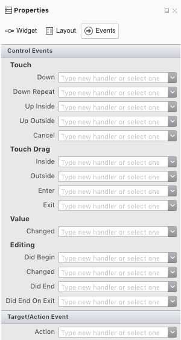

# Buttons in Xamarin.iOS

_The UIButton class is used to represent various different styles of button in iOS screens. This section introduces the different options for working with buttons in iOS._

The `UIButton`class represents a button control in iOS. 

Button properties can be edited in the `Properties Pad` of the iOS designer:


## Creating a button

A UIButton can be created in through only a few lines of code.

First, instantiate a new button and specify the type of button you need:

```csharp
UIButton myButton = new UIButton(UIButtonType.System);
```

The UIButtonType should be specified as one of the following:

- **System** - This is the standard button type used by iOS and is the type that you will use most often.
- **DetailDisclosure** - Presents a "turn down" type of button used to hide or show detailed information.
- **InfoDark** - A dark detailed info button displayed an "i" in a circle.
- **InfoLight** - A light detailed info button displayed an "i" in a circle.
- **AddContact** - Display the button as an Add Contact button.
- **Custom** - Allows you to customize several traits of the button.

More information about button types can be found in the [Button Types](https://developer.xamarin.com/recipes/ios/standard_controls/buttons/create_different_types_of_buttons/) recipe.

Next, define the on-screen size and location of the button. Example:

```csharp
myButton.Frame = new CGRect (25, 25, 300, 150);
```

To change the text in a button, use the `SetTitle` property on the button, which requires you to set a string of text and a `UIControlStyle`. For example:

```csharp
myButton.SetTitle("Hello, World!", UIControlState.Normal);
```

Setting different properties for each state allows you to communicate more information to the user (eg. make the text color grey for the disabled state). You can switch between each state using the iOS Designer, or you can do it programmatically. For more information on setting button text and state, refer to the [Set Button Text](https://developer.xamarin.com/recipes/ios/standard_controls/buttons/set_button_text/) recipe.

## Dealing with user interactions


Buttons are not very useful unless they do something when clicked! 

In iOS events on buttons are almost always touch events, as the use interacts with the button on their screen by touching it. A list of all possible UIControl events are listed [here](https://developer.apple.com/documentation/uikit/uicontrolevents), but the most commonly used event on iOS is `TouchUpInside`. You can then create an event handler to do something once the button has been pressed:


```csharp
button.TouchUpInside += (sender, e) => {
    DoSomething();
};
```

### Adding events in the iOS Designer
 
Use the Events tab in the Property Pad to add events to controls.

Select the event and either type the name of a new event handler or select one from the list. Doing this will create a new partial method in your View Controller class.



## Styling a Button

UIButtons are different than most UIKit controls in that they have a State so you can't just simply change the title, you have to change it for each `UIControlState`. Setting the Title Color and Shadow Color is done in a similar fashion:

```csharp
button.SetTitleColor (UIColor.White, UIControlState.Normal);
button.SetTitleShadowColor(UIColor.Black, UIControlState.Normal);
```

Additionally, you can use attributed text as the button's title. For example:

```csharp
var normalAttributedTitle = new NSAttributedString (buttonTitle, foregroundColor: UIColor.Blue, strikethroughStyle: NSUnderlineStyle.Single);
myButton.SetAttributedTitle (normalAttributedTitle, UIControlState.Normal);

var highlightedAttributedTitle = new NSAttributedString (buttonTitle, foregroundColor: UIColor.Green, strikethroughStyle: NSUnderlineStyle.Thick);
myButton.SetAttributedTitle (highlightedAttributedTitle, UIControlState.Highlighted);
```

## Custom Button Types


When you set the `Custom` button type, the object has no default rendering. You can configure the button’s appearance by setting an image for the different states. For example, the following code demonstrates how to add different images for the `Normal`, `Highlighted` and `Selected` states:


```csharp
button4.SetImage (UIImage.FromBundle ("Buttons/MagicWand.png"), UIControlState.Normal);
button4.SetImage (UIImage.FromBundle ("Buttons/MagicWand_Highlight.png"), UIControlState.Highlighted);
button4.SetImage (UIImage.FromBundle ("Buttons/MagicWand_On.png"), UIControlState.Selected);
```


Depending on whether the user is touching the button or not, it will be rendered as one of the following images (`Normal`, `Highlighted` and `Selected` states respectively):


For more information on working with custom buttons, refer to the [USe an Image for a button](https://developer.xamarin.com/recipes/ios/standard_controls/buttons/use_an_image_for_a_button/).


## Related Links

- [UIButton Workbook](https://developer.xamarin.com/workbooks/ios/user-interface/UIbutton/uibutton.workbook)
