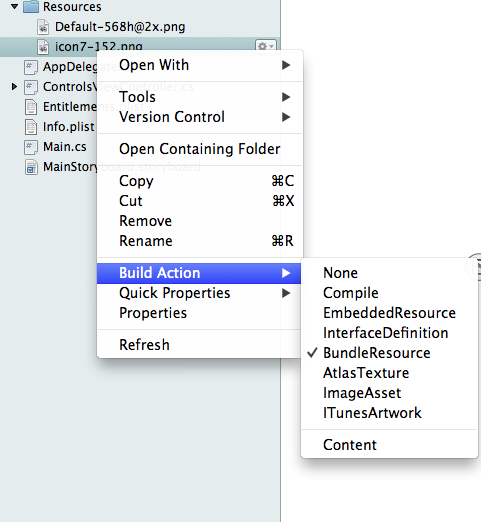
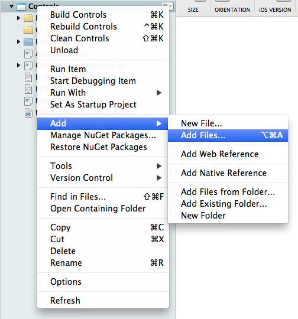
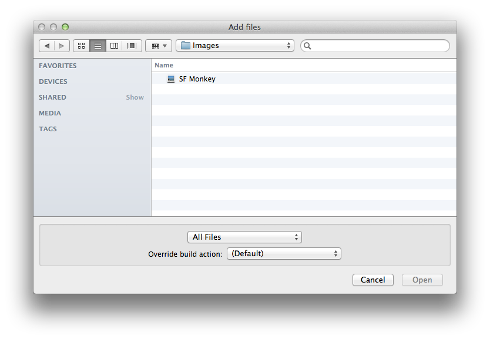
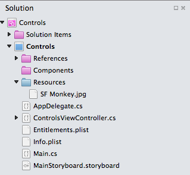
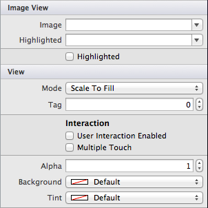

# Displaying Images

Adding images to your app requires two steps: first, add the images to your project; then, add controls and code to display them on a screen. Refer to the [Working with Images](~/ios/app-fundamentals/images-icons/index.md) article for more detailed coverage of image handling in Xamarin.iOS.

## Adding Images to Your App

Images can be added to any folder in your Visual Studio for Mac solution, and if the **Build Action** is set to **Content** then the file will be included with your app and can be displayed.

Visual Studio for Mac also supports a special directory called Resources that can also contain image files. Files in the Resources folder should have the **Build Action** set to **BundleResource**.

This screenshot shows the **Build Action** options that appear when a file is right-clicked:

 [ ](image-images/image30a.png)

Visual Studio for Mac will typically choose the correct **Build Action** automatically but you should be aware of these settings, especially if you move files around in your project.

### Adding An Image File

To add an image file to your project, first right-click the project and choose **Add Files...**

 [ ](image-images/image31a.png)

Select the image (or images) you wish to include in the standard file dialog. The default build action for images will be **BundleResource** – don’t override this value unless you have a specific reason.

 [ ](image-images/image32a.png)

The image will be added to your project and available to be loaded and displayed in code. This screenshot shows an image added to an iOS application project:

 [ ](image-images/image33a.png)

### What is the Resources Directory?

Files placed in the Resources directory are treated differently from regular files – the contents of the Resources folder are copied to the root of the application and can be referenced from there in your code. This can be useful for many reasons:

-  Storing the images configured in the application’s properties, such as the default start-up images and application icons.
-  Storing other images and files separately from the code, so they’re easier to manage (subdirectories are preserved when the Resources directory contents are copied).


The Resources directory is especially useful in a Library project, since the code can assume that those images will be copied into the root of the consuming application, making it easier to write shared code libraries that require image, sound, video, XML or other files.


The Resources directory must be so named, and all files should have the Build Action set to **BundleResource**

## Displaying the Image

To display an image using the designer, an Image View should be used as a container and can display a single image or an animation of images. The **Image View** icon from the Toolbox is shown below:

 [ ](image-images/image35.png)

Drag the **Image View** from the **Toobox** onto the View Controller. Then under **Image View > Image ** the drop down list will provide a list of all available image files in your project. Select any of these to add it to your image view.

 [ ](image-images/image36.png)

### Displaying the image programmatically

Because blocks.jpg is located in the root of the Resources directory it will be available at runtime in the application bundle’s root. To display this image in an ImageView control use the following code:

```csharp
imageview1.Image = UIImage.FromBundle ("SF Monkey.png");
```

If we had placed the image in `/Resources/Pics/blocks.jpg` then the code would include the Pics folder in the path:

```csharp
imageview1.Image = UIImage.FromBundle ("Pics/SF Monkey.png");
```

Resource file references never need to include the `Resources` folder.


## Related Links

- [Controls (sample)](https://developer.xamarin.com/samples/Controls/)
