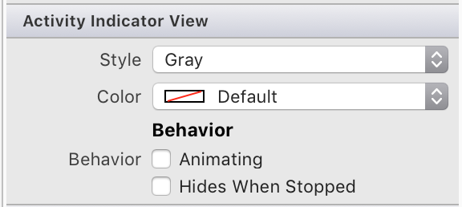
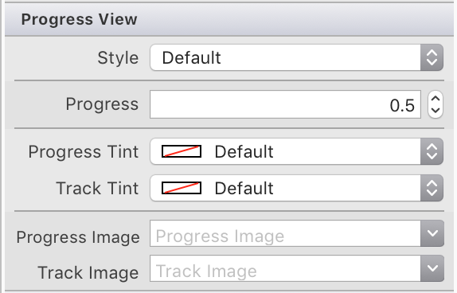

# Progress and Activity Indicators in Xamarin.iOS

It's likely that your app will have to carry out long running tasks such as loading or processing data and that this delay may cause a delay in updating your UI. During this time you should always use a progress indicator to reassure the user that the system is busy doing work. This gives the user control that the app is working on their request, that it's not waiting for their input, and can provide a means of detailing exactly how long they have to wait.

iOS provides two main ways to provide this progress indication in your app: Activity Indicators (including a specific _network_ activity indicator) and Progress Bars.

## Activity Indicator

Activity Indicators should be shown when your app is running a long process, but you don't know the exact length of time the task will require.

Apple has the following suggestions for working with Activity Indicators:

- **Whenever Possible, use Progress Bars Instead** - Because an Activity Indicator gives the user no feedback as to how long the process being run will take, always use a Progress Bar if the length is know (for example, how many bytes to download in a file).
- **Keep the Indicator Animated** - Users relate a stationary Activity Indicator to a stalled app so you should always have the indicator animated while it is being displayed.
- **Describe the Task being Processed** - Just displaying the Activity Indicator by itself isn't enough, the user needs to be informed about the process they are waiting on. Include a meaningful label (usually a single, complete sentence) that clearly defines the task.

### Implementing an Activity Indicator

An Activity Indicator is implemented through the [`UIActivityIndictorView`](https://developer.xamarin.com/api/type/UIKit.UIActivityIndicatorView/) class to indicate that a `UIActivity` is taking place.

### Activity Indicators and Storyboards

If you are using the iOS Designer to create your UI, the Activity Indicator can be added to your layout from the Toolbox. The following properties can be adjusted from the Properties Pad:



### Managing Activity Indicator Behavior

Use the `StartAnimating()` and `StopAnimating()` methods to start and stop the activity indicator animation.

Set the `HidesWhenStopped` property to `true` to make the activity indicator disappear after `StopAnimating()` has been called. This is set to `true` by default. At any point you can see if the Activity Indicator is running its spinning animation by checking the `IsAnimating` property. 


### Managing Activity Indicator Appearances

The `UIActivityIndicatorViewStyle` enumeration can be passed as a parameter when instantiating the Activity Indicator. You can use this to set the visual style to `Gray`, `White`, or `WhiteLarge`, for example:

```csharp
activitySpinner = new UIActivityIndicatorView(UIActivityIndicatorViewStyle.WhiteLarge);
```

You can override the color provided by `UIActivityIndicatorViewStyle`  by setting the `Color` property.

## Progress Bar

A Progress Bar presents as a line that fills with color to indicate the state and length of a time-consuming task. Progress Bars should always be used when the length of the tasks is know or can be computed.

Apple has the following suggestions for working with Progress Bars:

- **Accurately Report Progress** - Progress Bars should always be an accurate representation of the time required to complete a task. Never misrepresent the time to make the app appear busy.
- **Use for Well-Defined Durations** - Progress Bar should not only show that a lengthy task is taking place, but give the user and indication of how much of the task is completed and an estimate of the time remaining.

### Implementing an Progress Bar

A Progress Bar is created by instantiating a [`UIProgressView`](https://developer.xamarin.com/api/type/UIKit.UIProgressView/)

### Progress Bars and Storyboards

You can also add a Progress Bar to your UI when using the iOS Designer. Search for **Progress View** in the **Toolbox** and drag it to your view.

The following properties can be adjusted on the properties pad:




### Managing Progress Bar Behavior

The Progress of the bar can be initially set by using the `Progress` property:

```csharp
ProgressBar.Progress = 0f;
```

The progress can be adjusted by using the `SetProgress` method and passing a boolean declaring if you want the change animated or not.

```csharp
ProgressBar.SetProgress(1.0f, true);
```

For more information on using the progress bar, refer to the [Reporting Progress](https://github.com/xamarin/recipes/tree/master/Recipes/cross-platform/networking/download_progress) recipe, and the [UICatalog tvOS sample](https://developer.xamarin.com/samples/monotouch/tvos/UICatalog/).

### Managing Progress Bar Appearance

Similar to an activity indicator, the `UIProgressViewStyle` enumeration can be passed as a parameter when instantiating the Progress Bar.

The Progress and Track Image and Tint Color can be adjusted by using the following properties:

```csharp
progressBar = new UIProgressView(UIProgressViewStyle.Default)
            {
                ProgressImage = UIImage.FromBundle("TrackImage"),
                ProgressTintColor = UIColor.Cyan,
                TrackImage = UIImage.FromBundle("TrackImage"),
                TrackTintColor = UIColor.Magenta
            }; 
```


