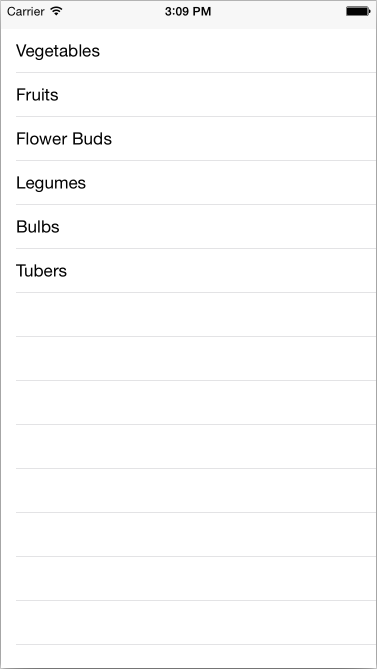
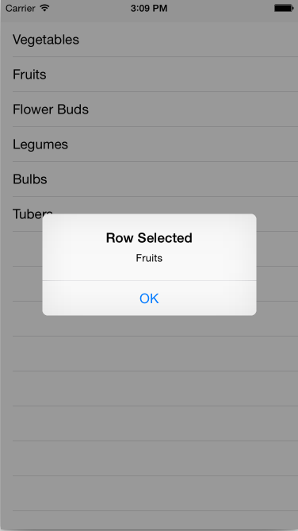
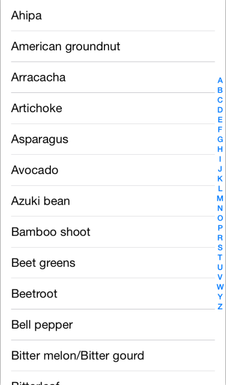
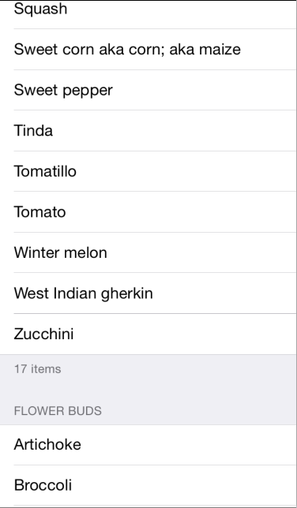

# Populating a Table with Data in Xamarin.iOS

To add rows to a `UITableView` you need to implement a `UITableViewSource` subclass and override the methods that the table
view calls to populate itself.

This guide covers:

- Subclassing a UITableViewSource
- Cell Reuse
- Adding an Index
- Adding Headers and Footers

<a name="Subclassing_UITableViewSource" />

## Subclassing UITableViewSource

A `UITableViewSource` subclass is assigned to every `UITableView`. The table view queries the source class to determine how to render itself (for example, how many rows are required and the height of each row if different from the default). Most importantly, the source supplies
each cell view populated with data.

There are only two mandatory methods required to make a table display data:

- **RowsInSection** – return an  [`nint`](~/cross-platform/macios/nativetypes.md) count of the total number of rows of data the table should display.
- **GetCell** – return a  `UITableCellView` populated with data for the corresponding row index passed to the method.

The BasicTable sample file **TableSource.cs** has the simplest possible
implementation of `UITableViewSource`. You can see in code snippet below that it accepts an array of strings to display in the table and returns a default cell style containing each
string:

```csharp
public class TableSource : UITableViewSource {

        string[] TableItems;
        string CellIdentifier = "TableCell";

        public TableSource (string[] items)
        {
            TableItems = items;
        }

        public override nint RowsInSection (UITableView tableview, nint section)
        {
            return TableItems.Length;
        }

        public override UITableViewCell GetCell (UITableView tableView, NSIndexPath indexPath)
        {
            UITableViewCell cell = tableView.DequeueReusableCell (CellIdentifier);
            string item = TableItems[indexPath.Row];

            //---- if there are no cells to reuse, create a new one
            if (cell == null)
            { cell = new UITableViewCell (UITableViewCellStyle.Default, CellIdentifier); }

            cell.TextLabel.Text = item;

            return cell;
        }
}
```

A `UITableViewSource` can use any data structure, from a simple string array (as shown in this example) to a List <> or other collection. The implementation of `UITableViewSource` methods isolates the table from the underlying data structure.

To use this subclass, create a string array to construct the source then assign it to an instance of `UITableView`:

```csharp
public override void ViewDidLoad ()
{
    base.ViewDidLoad ();
    table = new UITableView(View.Bounds); // defaults to Plain style
    string[] tableItems = new string[] {"Vegetables","Fruits","Flower Buds","Legumes","Bulbs","Tubers"};
    table.Source = new TableSource(tableItems);
    Add (table);
}
```

The resulting table looks like this:

 [](populating-a-table-with-data-images/image3.png#lightbox)

Most tables allow the user to touch a row to select it and perform some other
action (such as playing a song, or calling a contact, or showing another
screen). To achieve this, there are a few things we need to do. First, let's create an AlertController to display a message when the user click on a row by adding the following to the `RowSelected` method:

```csharp
public override void RowSelected (UITableView tableView, NSIndexPath indexPath)
{
    UIAlertController okAlertController = UIAlertController.Create ("Row Selected", tableItems[indexPath.Row], UIAlertControllerStyle.Alert);
    okAlertController.AddAction(UIAlertAction.Create("OK", UIAlertActionStyle.Default, null));
    ...

    tableView.DeselectRow (indexPath, true);
}
```

Next, create an instance of our View Controller:

```csharp
HomeScreen owner;
```

Add a constructor to your UITableViewSource class which takes a view controller as a parameter and saves it in a field:

```csharp
public TableSource (string[] items, HomeScreen owner)
{
    ...
    this.owner = owner;

}
```

Modify the ViewDidLoad method where the UITableViewSource class is created to pass the `this` reference:

```csharp
table.Source = new TableSource(tableItems, this);
```

Finally, back in your `RowSelected` method, call `PresentViewController` on the cached field:

```csharp
public override void RowSelected (UITableView tableView, NSIndexPath indexPath)
{
    ...
    owner.PresentViewController (okAlertController, true, null);

    ...
}
```

Now the user can touch a row and an alert will appear:

 [](populating-a-table-with-data-images/image4.png#lightbox)

## Cell Reuse

In this example there are only six items, so there is no cell reuse required. When displaying hundreds or thousands of rows,
however, it would be a waste of memory to create hundreds or thousands of `UITableViewCell` objects when only a few fit on the screen at a time.

To avoid this situation, when a cell disappears from the screen its view is
placed in a queue for reuse. As the user scrolls, the table calls `GetCell` to request new views to display – to reuse an existing
cell (that is not currently being displayed) simply call the `DequeueReusableCell` method. If a cell is available for reuse it
will be returned, otherwise a null is returned and your code must create a new
cell instance.

This snippet of code from the example demonstrates the pattern:

```csharp
// request a recycled cell to save memory
UITableViewCell cell = tableView.DequeueReusableCell (cellIdentifier);
// if there are no cells to reuse, create a new one
if (cell == null)
    cell = new UITableViewCell (UITableViewCellStyle.Default, cellIdentifier);
```

The `cellIdentifier` effectively creates separate queues for
different types of cell. In this example all the cells look the same so only one
hardcoded identifier is used. If there were different types of cell they should
each have a different identifier string, both when they are instantiated and
when they are requested from the reuse queue.

### Cell Reuse in iOS 6+

iOS 6 added a cell reuse pattern similar to the one introduction with Collection Views. Although the existing reuse pattern shown above is still supported for backwards compatibility, this new pattern is preferable as it removes the need for the null check on the cell.

With the new pattern an application registers the cell class or xib to be used by calling either `RegisterClassForCellReuse` or `RegisterNibForCellReuse` in the controller's constructor. Then, when dequeueing the cell in the `GetCell` method, simply call `DequeueReusableCell` passing the identifier you registered for the cell class or xib and the index path.

For example, the following code registers a custom cell class in a UITableViewController:

```csharp
public class MyTableViewController : UITableViewController
{
  static NSString MyCellId = new NSString ("MyCellId");

  public MyTableViewController ()
  {
    TableView.RegisterClassForCellReuse (typeof(MyCell), MyCellId);
  }
  ...
}
```

With the MyCell class registered, the cell can be dequeued in the `GetCell` method of the `UITableViewSource` without the need for the extra null check, as shown below:

```csharp
class MyTableSource : UITableViewSource
{
  public override UITableViewCell GetCell (UITableView tableView, NSIndexPath indexPath)
  {
    // if cell is not available in reuse pool, iOS will create one automatically
    // no need to do null check and create cell manually
    var cell = (MyCell) tableView.DequeueReusableCell (MyCellId, indexPath);

    // do whatever you need to with cell, such as assigning properties, etc.

    return cell;
  }
}
```

Be aware, when using the new reuse pattern with a custom cell class, you need to implement the constructor that takes an `IntPtr`, as shown in the snippet below, otherwise Objective-C won't be able to construct an instance of the cell class:

```csharp
public class MyCell : UITableViewCell
{
  public MyCell (IntPtr p):base(p)
  {
  }
  ...
}
```

You can see examples of the topics explained above in the **BasicTable** sample linked to this article.

<a name="Adding_an_Index" />

## Adding an Index

An index helps the user scroll through long lists, typically ordered
alphabetically although you can index by whatever criteria you wish. The
**BasicTableIndex** sample loads a much longer list of items from a file to
demonstrate the index. Each item in the index corresponds to a ‘section’ of
the table.

 [](populating-a-table-with-data-images/image5.png#lightbox)

To support ‘sections’ the data behind the table needs to be grouped, so
the BasicTableIndex sample creates a `Dictionary<>` from the
array of strings using the first letter of each item as the dictionary key:

```csharp
indexedTableItems = new Dictionary<string, List<string>>();
foreach (var t in items) {
    if (indexedTableItems.ContainsKey (t[0].ToString ())) {
        indexedTableItems[t[0].ToString ()].Add(t);
    } else {
        indexedTableItems.Add (t[0].ToString (), new List<string>() {t});
    }
}
keys = indexedTableItems.Keys.ToArray ();
```

The `UITableViewSource` subclass then needs the following methods
added or modified to use the `Dictionary<>` :

- **NumberOfSections** – this method is optional, by default the table assumes one section. When displaying an index this method should return the number of items in the index (for example, 26 if the index contains all the letters of the English alphabet).
- **RowsInSection** – returns the number of rows in a given section.
- **SectionIndexTitles** – returns the array of strings that will be used to display the index. The sample code returns an array of letters.

The updated methods in the sample file **BasicTableIndex/TableSource.cs** look
like this:

```csharp
public override nint NumberOfSections (UITableView tableView)
{
    return keys.Length;
}
public override nint RowsInSection (UITableView tableview, nint section)
{
    return indexedTableItems[keys[section]].Count;
}
public override string[] SectionIndexTitles (UITableView tableView)
{
    return keys;
}
```

Indexes are generally only used with the Plain table style.

<a name="Adding_Headers_and_Footers" />

## Adding Headers and Footers

Headers and footers can be used to visually group rows in a table. The data
structure required is very similar to adding an index – a `Dictionary<>` works really well. Instead of using the alphabet
to group the cells, this example will group the vegetables by botanical type.
The output looks like this:

 [](populating-a-table-with-data-images/image6.png#lightbox)

To display headers and footers the `UITableViewSource` subclass
requires these additional methods:

- **TitleForHeader** – returns the text to use as the header
- **TitleForFooter** – returns the text to use as the footer.

The updated methods in the sample file
**BasicTableHeaderFooter/Code/TableSource.cs** look like this:

```csharp
public override string TitleForHeader (UITableView tableView, nint section)
{
    return keys[section];
}
public override string TitleForFooter (UITableView tableView, nint section)
{
    return indexedTableItems[keys[section]].Count + " items";
}
```

You can further customize the appearance of the header and footer with a View
object, using the `GetViewForHeader` and `GetViewForFooter` method overrides on `UITableViewSource`.

## Related Links

- [WorkingWithTables (sample)](https://docs.microsoft.com/samples/xamarin/ios-samples/workingwithtables)
