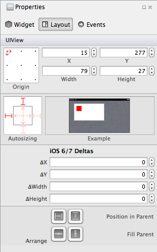
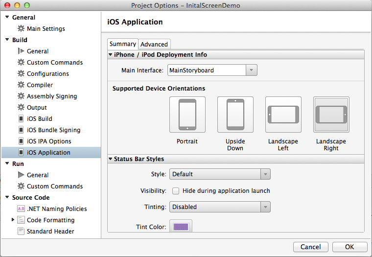
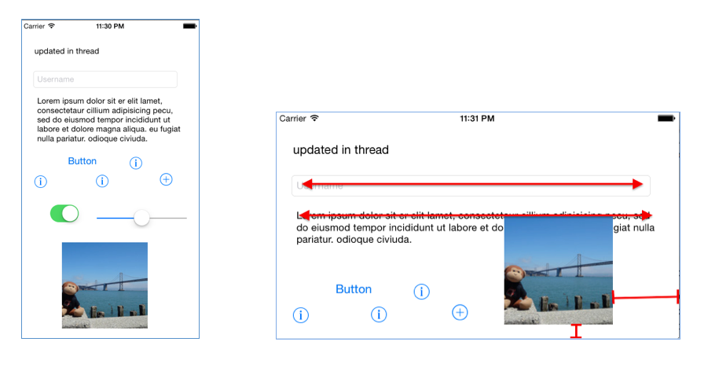

# Layout Options

There are two different mechanisms for controlling the layout when a view is resized or rotated:

-  **Autosizing** – The Autosizing inspector in the designer provides a way to set the `AutoresizingMask` properties. 
This will let a control be anchored to the edges of their container and/or fix their size. Autosizing works in all 
versions of iOS. This is described in more detail below
-  **Autolayout** – A feature, introduced in iOS6 that allows fine-grained control over the relationships of the UI controls. 
It will allow control of the positions of elements relative to other elements on the design surface. This topic is 
covered in more detail in the  [Auto Layout with the Xamarin iOS Designer](~/ios/user-interface/designer/designer-auto-layout.md) guide.


## Autosizing

When a user resizes a window, such as when the device is rotated and the orientation changes, the system will automatically resize the Views inside that window according to their autosizing rules. These rules can be set in C# using the 
`AutoresizingMask` property of the `UIView` or in the **Properties Pad** of the iOS Designer, 
as illustrated below:

 [ ](layout-options-images/image41.png)

When a control is selected, this allows you to manually specify the location and dimensions of the control, as well as 
choosing **Autosizing** behavior. As illustrated in the screenshot below, we can use the springs 
and struts in the autosizing control to define the selected View's relationship to it's parent:

 [ ](layout-options-images/image42.png)

Adjusting a *spring* will cause the view to resize based on the width or height of its parent view. Adjusting a *strut* 
will make the view maintain a constant distance between itself and its parent view, on that particular edge.

These settings can also be set in code:

```csharp
textfield1.Frame = new RectangleF(15, 277, 79, 27);
textfield1.AutoresizingMask = UIViewAutoresizing.FlexibleRightMargin | UIViewAutoresizing.FlexibleBottomMargin;
```


To test the Autosizing settings, enable different **Supported Device Orientations** in the 
project’s options:

 [ ](layout-options-images/image43a.png)

In the code behind we can use the following code, which causes the two text controls to resize horizontally:

```csharp
textview1.AutoresizingMask = UIViewAutoresizing.FlexibleWidth;
textfield1.AutoresizingMask = UIViewAutoresizing.FlexibleWidth;
imageview1.AutoresizingMask = UIViewAutoresizing.FlexibleTopMargin | UIViewAutoresizing.FlexibleLeftMargin;
```


We can also adjust the controls using the Designer. Selecting the struts as exhibited below will cause the image to stay 
right-aligned without being clipped off the bottom of the view:

 [ ](layout-options-images/autoresize.png)

These screenshots show how the controls resize or reposition themselves when the screen is rotated:

 [ ](layout-options-images/image44a.png)

Notice that the text view and text field both stretch to keep the same left and right margins, due to the `FlexibleWidth` 
setting. The image has the top and left margin flexible, which means it preserves the bottom and right margins – keeping 
the image in view when the screen is rotated. Complex layouts typically require a combination of these settings on every visible control to keep the user-interface consistent and to prevent controls from overlapping when the view’s bounds change (due to rotation or other resizing event).


## Related Links

- [Controls (sample)](https://developer.xamarin.com/samples/Controls/)
