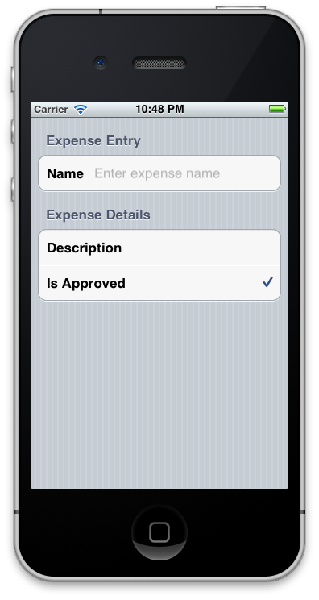
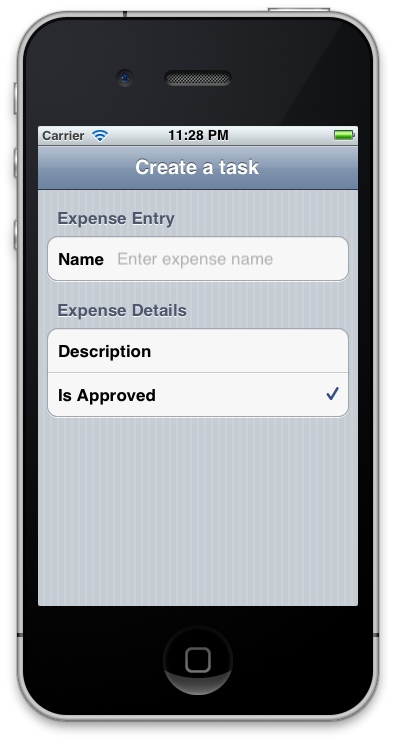
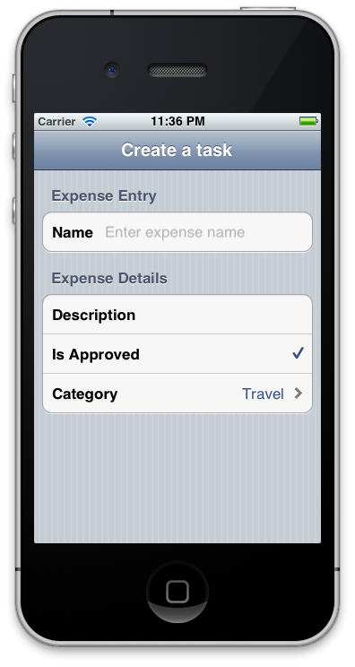
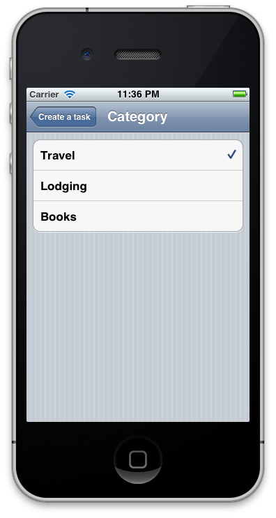

# Creating a Xamarin.iOS application using the Reflection API

The MT.D Reflection API allows classes to be decorated with attributes that
MT.D uses to create screens automatically. The reflection API provides a binding
between these classes and what is displayed on screen. Although this API
doesn’t provide the fine-grained control that the elements API does, it
reduces complexity by automatically building out the element hierarchy based on
class decoration.

## Setting up MT.D

MT.D is distributed with Xamarin.iOS. To use it, right-click on the
**References** node of a Xamarin.iOS project in Visual Studio 2017 or
Visual Studio for Mac and add a reference to the **MonoTouch.Dialog-1**
assembly. Then, add `using MonoTouch.Dialog` statements in your source
code as necessary.

## Getting started with the Reflection API

Using the Reflection API is as simple as:

1.  Creating a class decorated with MT.D attributes.
1.  Creating a  `BindingContext` instance, passing it an instance of the above class. 
1.  Creating a  `DialogViewController` , passing it the  `BindingContext’s` `RootElement` . 


Let’s look at an example to illustrate how to use the Reflection API. In
this example, we’ll build a simple data entry screen as shown below:

 [](reflection-api-walkthrough-images/01-expense-entry.png#lightbox)

## Creating a class with MT.D attributes

The first thing we need to use the Reflection API is a class decorated with
attributes. These attributes will be used by MT.D internally to create objects
from the Elements API. For example, consider the following class definition:

```csharp
public class Expense
{
        [Section("Expense Entry")]

        [Entry("Enter expense name")]
        public string Name;
        
        [Section("Expense Details")]
  
        [Caption("Description")]
        [Entry]
        public string Details;
        
        [Checkbox]
        public bool IsApproved = true;
}
```

The `SectionAttribute` will result in sections of the `UITableView` being created, with the string argument used to
populate the section’s header. Once a section is declared, every field that
follows it will be included in that section, until another section is declared.
The type of user interface element created for the field will depend upon the
field’s type and the MT.D attribute decorating it.

For example, the `Name` field is a `string` and it is
decorated with an `EntryAttribute`. This results in a row being added
to the table with a text entry field and the specified caption. Similarly, the `IsApproved` field is a `bool` with a `CheckboxAttribute`, resulting in a table row with a checkbox on the
right of the table cell. MT.D uses the field name, automatically adding a space,
to create the caption in this case, since it is not specified in an
attribute.

## Adding the BindingContext

To use the `Expense` class, we need to create a `BindingContext`. A `BindingContext` is a class that will
bind the data from the attributed class to create the hierarchy of elements. To
create one, we simply instantiate it and pass in an instance of the attributed
class to the constructor.

For example, to add UI that we declared using attribute in the `Expense` class, include the following code in the `FinishedLaunching` method of the `AppDelegate`:

```csharp
var expense = new Expense ();
var bctx = new BindingContext (null, expense, "Create a task");
```

Then all we have to do to create the UI is add the `BindingContext` to the `DialogViewController` and set it
as the `RootViewController` of the window, as shown below:

```csharp
UIWindow window;

public override bool FinishedLaunching (UIApplication app, 
        NSDictionary options)
{
   
        window = new UIWindow (UIScreen.MainScreen.Bounds);
            
        var expense = new Expense ();
        var bctx = new BindingContext (null, expense, "Create a task");
        var dvc = new DialogViewController (bctx.Root);
            
        window.RootViewController = dvc;
        window.MakeKeyAndVisible ();
            
        return true;
}
```

Running the application now results in the screen shown above being
displayed.

### Adding a UINavigationController

Notice however that the title “Create a task” that we passed to the `BindingContext` is not displayed. This is because the `DialogViewController` is not part of a `UINavigatonController`. Let’s change the code to add a `UINavigationController` as the window’s `RootViewController,` and add the `DialogViewController`
as the root of the `UINavigationController` as shown below:

```csharp
nav = new UINavigationController(dvc);
window.RootViewController = nav;
```

Now when we run the application, the title appears in the `UINavigationController’s` navigation bar as the screenshot below
shows:

 [](reflection-api-walkthrough-images/02-create-task.png#lightbox)

By including a `UINavigationController`, we can now take advantage
of other features of MT.D for which navigation is necessary. For example, we can
add an enumeration to the `Expense` class to define the category for
the expense, and MT.D will create a selection screen automatically. To
demonstrate, modify the `Expense` class to include an `ExpenseCategory` field as follows:

```csharp
public enum Category
{
        Travel,
        Lodging,
        Books
}
        
public class Expense
{
        …

        [Caption("Category")]
        public Category ExpenseCategory;
}
```

Running the application now results in a new row in the table for the
category as shown:

 [](reflection-api-walkthrough-images/03-set-details.png#lightbox)

Selecting the row results in the application navigating to a new screen with
rows corresponding to the enumeration, as shown below:

 [](reflection-api-walkthrough-images/04-set-category.png#lightbox)

 <a name="Summary" />


## Summary

This article presented a walkthrough of the Reflection API. We showed how to
add attributes to a class to control what is displayed. We also discussed how to
use a `BindingContext` to bind data from a class to the element
hierarchy that is created, as well as how to use MT.D with a `UINavigationController`.


## Related links

- [MTDReflectionWalkthrough (sample)](https://developer.xamarin.com/samples/MTDReflectionWalkthrough/)
- [Screencast - Miguel de Icaza creates an iOS login screen with MonoTouch.Dialog](http://youtu.be/3butqB1EG0c)
- [Screencast - Easily create iOS user interfaces with MonoTouch.Dialog](http://youtu.be/j7OC5r8ZkYg)
- [Introduction to MonoTouch Dialog](~/ios/user-interface/monotouch.dialog/index.md)
- [Elements API Walkthrough](~/ios/user-interface/monotouch.dialog/elements-api-walkthrough.md)
- [JSON Element Walkthrough](~/ios/user-interface/monotouch.dialog/monotouch.dialog-json-markup.md)
- [MonoTouch Dialog on Github](https://github.com/migueldeicaza/MonoTouch.Dialog)
- [TweetStation Application](https://github.com/migueldeicaza/TweetStation)
- [UITableViewController Class Reference](https://developer.apple.com/library/ios/#DOCUMENTATION/UIKit/Reference/UITableViewController_Class/Reference/Reference.html)
- [UINavigationController Class Reference](https://developer.apple.com/library/ios/#documentation/UIKit/Reference/UINavigationController_Class/Reference/Reference.html)
