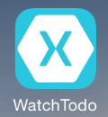
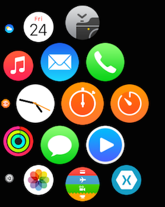
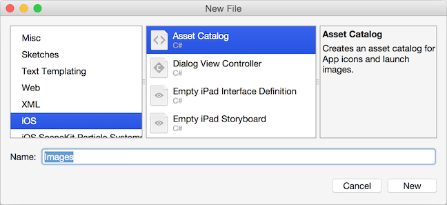
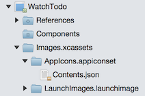
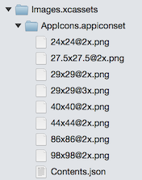

# Working with watchOS Icons in Xamarin

Apple Watch solutions require two sets of icons:

- The iOS app icons that will appear on the iPhone.
- Apple Watch icons that will be rendered in a circle
  on the watch menu and in notification screens. The watch
  app icon also appears in the [Apple Watch](~/ios/watchos/app-fundamentals/settings.md)
  iOS app.

## Apple Watch Icons

| | | |
|-|-|-|
|iOS App Icon|Appears on the iPhone and starts the Parent app||
|Watch App Icon|Appears on the Apple Watch home screen||
||Appears on Watch notifications||
||Appears in the [iOS Apple Watch App](~/ios/watchos/app-fundamentals/settings.md)||

## Configuring Your Solution

To ensure your iOS app and watch app both show the correct
  name and icon, follow these instructions for each project:

### iOS App

Refer to the [iOS Application Icons guide](~/ios/app-fundamentals/images-icons/app-icons.md)
  to ensure your iOS app's icons are correctly configured.

#### Info.plist

The string that appears next to your watch app in the [Apple Watch settings app](~/ios/watchos/app-fundamentals/settings.md) is configured in the
**iOS app's Info.plist**.

Confirm that your **Info.plist** has a `CFBundleName` key and value (note:
  this is different to the `CFBundleDisplayName`, you can have both):

```xml
<key>CFBundleName</key>
<string>Your App Name</string>
```

### Apple Watch App

Once your [Parent app](~/ios/watchos/app-fundamentals/parent-app.md) has
  its icons configured, you need to add an application icon
  asset catalog to the watch app.

1. Right-click on the Watch App Project and select
    **File > Add > New File... > iOS > Asset Catalog** to add an
    asset catalog to the project.

    

2. Double-click on the **AppIcon.appiconset/Contents.json** file

    

3. Add all the watchOS images, as shown in this screenshot:

    [](icons-images/appicons.png#lightbox)

    Refer to [Apple's icon guidelines](https://developer.apple.com/design/human-interface-guidelines/watchos/icons-and-images/menu-icons/) for the required sizes
    (the dimensions are also shown on the screen). Remember
    that these icons will be automatically clipped to render
    in a circle.

    Your icon list should look something like this:

    

4. To ensure the asset catalog is included in the app, add
  the following key and value to the **Watch App's Info.plist**:

    ```xml
    <key>XSAppIconAssets</key>
    <string>Images.xcassets/AppIcon.appiconset</string>
    ```

You can verify the icons are configured correct by checking
  the [Apple Watch settings app](~/ios/watchos/app-fundamentals/settings.md)
  in the iPhone Simulator, or generating a [notification](~/ios/watchos/platform/notifications.md)
  and confirming the icon appears on the notification screen.

> [!NOTE]
> Icons cannot have an alpha channel (the app will be rejected during App Store submission if an alpha channel is present). You can check if an alpha channel exists and remove it [using the Preview app on Mac OS X](~/ios/watchos/troubleshooting.md#noalpha).


## Related Links

- [Apple's watchOS icon & images guide](https://developer.apple.com/design/human-interface-guidelines/watchos/icons-and-images/)
