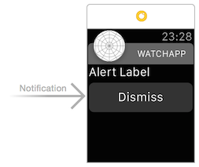
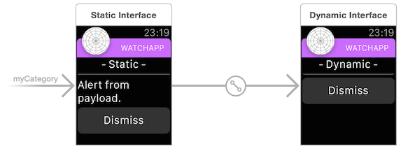
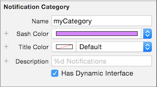
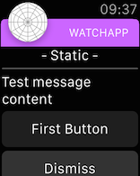
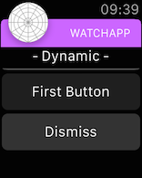
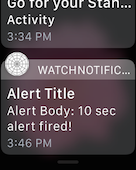
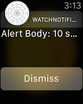
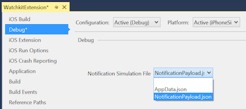
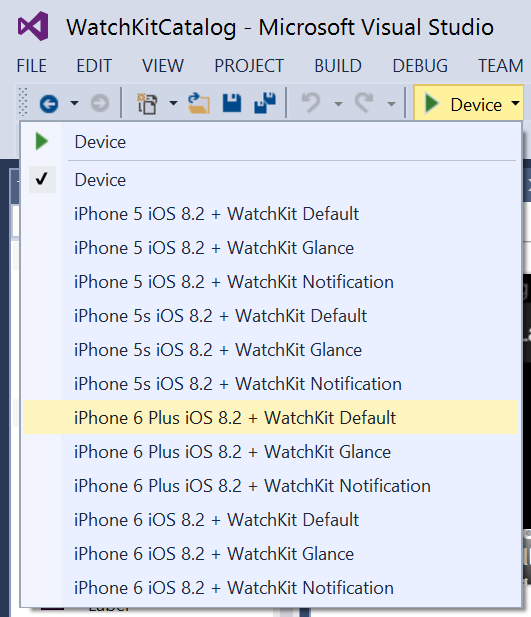
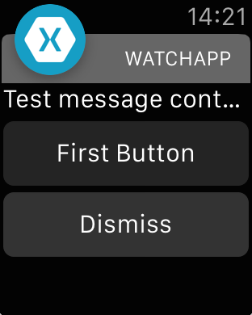

# Notifications

Watch apps can receive notifications if the containing
	iOS app supports them. There is built-in notification handling
	so you do not *need* to add the additional notification
	support described below, however if you wish to customize
	notification behavior and appearance then read on.

Refer to the [iOS Notifications](~/ios/platform/user-notifications/deprecated/index.md)
	doc for more information on adding notification support
	to the iOS app in your solution.

## Creating Notification Controllers

On the storyboard notifications controllers have a
	special type of segue triggering them. When you drag
	a new **Notification Interface Controller** onto a
	storyboard it will automatically have a segue attached:



When the notification segue is selected you can edit
	its properties:



After you have customized the controller it may look like
	this example from the WatchKitCatalog:




There are two types of notification:

- **Short-look** - non-scrollable static view
	defined by the system.

- **Long-look** - scrollable, customizable view
	defined by you! A simpler, static version and
	a more complex dynamic version can be specified.

### Short-Look Notification Controller

The short-look UI consists of just the app icon,
	app name and the notification title string.

If the user does not ignore the notification,
	the system will automatically switch to
	a long-look notification that provides
	more information.


### Long-Look Notification Controller

The OS decides whether to display the static or dynamic
	view based on a number of factors. You must provide
	a static interface, and can optionally also include
	a dynamic interface for notifications.

#### Static

The static view should be simple and quick to display.



#### Dynamic

The dynamic view can display more data and provide
	more interactivity.




## Generating Notifications

Notifications can come from a remote server ([Apple Push Notifications Service](https://developer.apple.com/library/ios/documentation/NetworkingInternet/Conceptual/RemoteNotificationsPG/Chapters/ApplePushService.html), or APNS)
	or can be generated locally in the iOS app.

Refer to the [iOS Notifications walkthrough](~/ios/platform/user-notifications/deprecated/local-notifications-in-ios-walkthrough.md) for an example of how to generate
	local notifications, and the [WatchNotifications sample](https://developer.xamarin.com/samples/monotouch/WatchKit/WatchNotifications/) for a working example.

Local notifications must have the `AlertTitle` set to be displayed on the Apple Watch -
	the `AlertTitle` string is displayed in the Short-Look interface. Both the `AlertTitle`
	and `AlertBody` are displayed in the notifications list; and the `AlertBody` is displayed
	in the Long-Look interface.

This screenshot shows the `AlertTitle` being displayed in the notifications list, and the
 	`AlertBody` displayed in the Long-Look interface (using the [sample code](https://developer.xamarin.com/samples/monotouch/WatchKit/WatchNotifications/)):

 

## Testing Notifications

Notifications (both local and remote) can only be properly tested on a device,
	however they can be simulated using a **.json** file in the iOS Simulator.

### Testing on Apple Watch

When testing notifications on an Apple Watch, remember that [Apple's documentation](https://developer.apple.com/library/ios/documentation/General/Conceptual/WatchKitProgrammingGuide/BasicSupport.html) states the following:

> When one of your app’s local or remote notifications arrives on the user’s iPhone, iOS decides whether to display that notification on the iPhone or on the Apple Watch.

This is alluding to the fact that iOS decides whether a notification will
	appear on the iPhone or on the Watch. If the paired iPhone is active when
	a notification is received, the notification is likely to be displayed on the
	iPhone and *not* routed to the Watch.

To ensure the notification appears on the watch, turn off the iPhone screen
	(pressing the power button once) or let it go to sleep. If the paired Watch
	is in range, has power and is being worn on your wrist, the notification will
	be routed there and appear on the Watch (accompanied by a subtle ).

### Testing on the iOS Simulator

You *must* provide a test JSON payload when
	testing notification mode in the iOS Simulator. Set the path in the
	**Custom Execution Arguments** window in Visual Studio for Mac.

# [Visual Studio for Mac](#tab/vsmac)

Visual Studio for Mac will display additional options when a
	watch extension is set as the **Startup project**.
	Right-click on the watch extension project and choose
	**Run With > Custom Parameters...**:
	
[](notifications-images/runwith-customparams.png#lightbox)
	
This opens the **Execution Arguments** window which contains a **WatchKit**
	tab. Select **Notification** and provide a JSON
	payload, then press **Execute** to start the watch app in the simulator:
	
[](notifications-images/runwith-execargs.png#lightbox)

# [Visual Studio](#tab/vswin)

To set the test notification payload in Visual Studio
 	right-click on the watch extension to edit
	the **Project properties**. Go to the **Debug**
	section and select a notifications JSON file from
	the list (it will automatically list all the JSON
	files included in the project).
	
[](notifications-images/runwith-execargs-vs.png#lightbox)

When the watch extension is the **Startup Project**,
	Visual Studio will display additional options
	as shown below. Choose one of the **Notification**
	options to start the watch app in **Notification** mode
	(using the JSON file selected in the properties window):
	


-----

The default notification controller looks like this
	when testing on the simulator with the default
	payload JSON file:



It is also possible to use the
	[command line](~/ios/watchos/troubleshooting.md#command_line)
	to start the iOS Simulator.

### Example Notification Payload

In the [Watch Kit Catalog](https://developer.xamarin.com/samples/monotouch/WatchKit/WatchKitCatalog/) sample
	there is an example payload JSON file **NotificationPayload.json**
	(listed below).

```csharp
{
	"aps": {
		"alert": "Test message content",
		"title": "Optional title",
		"category": "myCategory"
		},

		"WatchKit Simulator Actions": [
		{
			"title": "First Button",
			"identifier": "firstButtonAction"
		}
		],

		"customKey": "Use this file to define a testing payload for your notifications. The aps dictionary specifies the category, alert text and title. The WatchKit Simulator Actions array can provide info for one or more action buttons in addition to the standard Dismiss button. Any other top level keys are custom payload. If you have multiple such JSON files in your project, you'll be able to choose between them in when selecting to debug the notification interface of your Watch App."
	}
```


## Related Links

- [WatchNotifications (local notifications) (sample)](https://developer.xamarin.com/samples/monotouch/WatchKit/WatchNotifications/)
- [WatchKitCatalog (sample)](https://developer.xamarin.com/samples/monotouch/WatchKit/WatchKitCatalog/)
- [Apple's Watch Kit Notifications docs](https://developer.apple.com/library/ios/documentation/General/Conceptual/WatchKitProgrammingGuide/BasicSupport.html)
