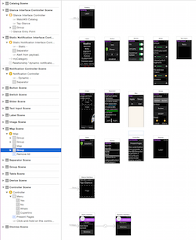

# watchOS User Interface

The [**WatchKitCatalog**](https://github.com/xamarin/monotouch-samples/tree/master/watchOS/WatchKitCatalog) sample
  demonstrates various watchOS controls. The app's storyboard
  is shown here (click to zoom):

The programmatic names of all the controls is prefixed with
  `WKInterface` (eg. `WKInterfaceLabel`, `WKInterfaceButton`).

<table align="center" border="1" cellpadding="1" cellspacing="1">
  <thead>
      <th>
        <strong>Control</strong>
      </th>
      <th>
        <strong>Description</strong>
      </th>
      <th>
        <strong>Screenshot</strong>
      </th>
    </thead>
    <tbody>
    <tr>
      <td valign="top">
        Label
      </td>
      <td valign="top">
        Use <code>SetText</code> and other properties to control the appearance
        of text in a label control. <code>NSAttributedString</code> is also supported.
         
        <a href="https://github.com/xamarin/ios-samples/blob/master/watchOS/WatchKitCatalog/WatchKit3Extension/LabelDetailController.cs">Catalog code</a>
      </td>
      <td>
        
      </td>
    </tr>
    <tr>
      <td valign="top">
        Button
      </td>
      <td valign="top">
        Create and set properties in the storyboard. <kbd>Ctrl+drag</kbd> to
        add an <code>Action</code> to implement a handler for when it's clicked.
         
        <a href="https://github.com/xamarin/ios-samples/blob/master/watchOS/WatchKitCatalog/WatchKit3Extension/ButtonDetailController.cs">Catalog code</a>
      </td>
      <td>
        
      </td>
    </tr>
    <tr>
      <td valign="top">
        Switch
      </td>
      <td valign="top">
        Use <code>SetOn</code> to control the switch state.
         
        <a href="https://github.com/xamarin/ios-samples/blob/master/watchOS/WatchKitCatalog/WatchKit3Extension/SwitchDetailController.cs">Catalog code</a>
      </td>
      <td>
        
      </td>
    </tr>
    <tr>
      <td valign="top">
        Slider
      </td>
      <td valign="top">
        Many different styles are possible.
         
        <a href="https://github.com/xamarin/ios-samples/blob/master/watchOS/WatchKitCatalog/WatchKit3Extension/SliderDetailController.cs">Catalog code</a>
      </td>
      <td>
        
      </td>
    </tr>
    <tr>
      <td valign="top">
        Image
      </td>
      <td valign="top">
        Use <code>myImage.SetImage("MyWatchImage")</code>
        to load images on the watch,
        or <code>WKInterfaceDevice.CurrentDevice.AddCachedImage</code> to
        cache them for repeated use on the watch.
         
        <a href="~/ios/watchos/user-interface/image.md">Image Control documentation</a>
         
        <a href="https://github.com/xamarin/ios-samples/blob/master/watchOS/WatchKitCatalog/WatchKit3Extension/ImageDetailController.cs">Catalog code</a>
      </td>
      <td>
        
      </td>
    </tr>
    <tr>
      <td valign="top">
        Separator
      </td>
      <td valign="top">
        Use separators to help create attractive watch UIs.
         
        <a href="https://github.com/xamarin/ios-samples/blob/master/watchOS/WatchKitCatalog/WatchKit3Extension/SeparatorDetailController.cs">Catalog code</a>
      </td>
      <td>
        
      </td>
    </tr>
    <tr>
      <td valign="top">
        Map
      </td>
      <td valign="top">
        The map image is statically displayed on the watch but you
        can control many aspects of its appearance, including adding
        pins.
         
        <a href="https://github.com/xamarin/ios-samples/blob/master/watchOS/WatchKitCatalog/WatchKit3Extension/MapDetailController.cs">Catalog code</a>
      </td>
      <td>
        
      </td>
    </tr>
    <tr>
      <td valign="top">
        Movie & InlineMove
      </td>
      <td valign="top">
        Movies can either open on their own, or inline
         
        <a href="https://github.com/xamarin/ios-samples/blob/master/watchOS/WatchKitCatalog/WatchKit3Extension/MovieDetailController.cs">Catalog code</a>
      </td>
      <td>
        
      </td>
    </tr>
    <tr>
      <td valign="top">
        Group
      </td>
      <td valign="top">
        Use groups to help create attractive watch UIs.
         
        <a href="https://github.com/xamarin/ios-samples/blob/master/watchOS/WatchKitCatalog/WatchKit3Extension/GroupDetailController.cs">Catalog code</a>
      </td>
      <td>
        
      </td>
    </tr>
    <tr>
      <td valign="top">
        Table
      </td>
      <td valign="top">
        A simplified version of tables on iOS.
        Implement <code>DidSelectRow</code>
        to respond to user selection (or use a segue).
         
        <a href="~/ios/watchos/user-interface/table.md">Table Control documentation</a>
         
        <a href="https://github.com/xamarin/ios-samples/blob/master/watchOS/WatchKitCatalog/WatchKit3Extension/TableDetailController.cs">Catalog code</a>
      </td>
      <td>
        
      </td>
    </tr>
    <tr>
      <td valign="top">
        Device
      </td>
      <td valign="top">
        <code>WKInterfaceDevice.CurrentDevice</code> includes properties
        such as <code>ScreenBounds</code>, <code>ScreenScale</code>,
        and <code>PreferredContentSizeCategory</code>.
         
        <a href="https://github.com/xamarin/ios-samples/blob/master/watchOS/WatchKitCatalog/WatchKit3Extension/DeviceDetailController.cs">Catalog code</a>
      </td>
      <td>
        
      </td>
    </tr>
    <tr>
      <td valign="top">
        <a href="~/ios/watchos/user-interface/menu.md">Menu</a>
      </td>
      <td valign="top">
        Define the force-press menu in the storyboard
        and implement the actions for each button
        in the code.
         
        <a href="~/ios/watchos/user-interface/menu.md">Menu Control (Force Touch) documentation</a>
         
        <a href="https://github.com/xamarin/ios-samples/blob/master/watchOS/WatchKitCatalog/WatchKit3Extension/ControllerDetailController.cs">Catalog code</a>
      </td>
      <td>
        
      </td>
    </tr>
    <tr>
      <td valign="top">
        Text Input
      </td>
      <td valign="top">
        Use <code>PresentTextInputController</code> and the
        <code>WKTextInputMode</code> enumeration.
         
        <a href="~/ios/watchos/user-interface/text-input.md">Text Input documentation</a>
         
        <a href="https://github.com/xamarin/ios-samples/blob/master/watchOS/WatchKitCatalog/WatchKit3Extension/TextInputDetailController.cs">Catalog code</a>
      </td>
      <td>
        
      </td>
    </tr>
    <tr>
      <td valign="top">
        Digital Crown
      </td>
      <td valign="top">
        The Digital Crown can be used to drive a picker, or it's rotation can be tracked in code.
         
        <a href="https://github.com/xamarin/ios-samples/blob/master/watchOS/WatchKitCatalog/WatchKit3Extension/CrownDetailController.cs">Catalog code</a>
      </td>
      <td>
        
      </td>
    </tr>
    <tr>
      <td valign="top">
        Gestures
      </td>
      <td valign="top">
        There are four types of gesture recognition that can be added to a scene: Tap, Swipe, Pan, and LongPress.
         
        <a href="https://github.com/xamarin/ios-samples/blob/master/watchOS/WatchKitCatalog/WatchKit3Extension/GestureDetailController.cs">Catalog code</a>
      </td>
      <td>
        
      </td>
    </tr>
    </tbody>
</table>

## Related Links

- [WatchKitCatalog (sample)](https://developer.xamarin.com/samples/monotouch/watchOS/WatchKitCatalog/)
- [Watch Kit API Reference](https://developer.xamarin.com/api/namespace/WatchKit/)
