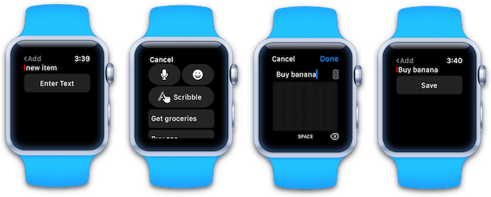
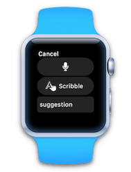
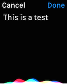

# Working with Text Input

The Apple Watch does not provide a keyboard for
  users to input text, however it does support
  some watch-friendly alternatives:

- Selecting from a pre-defined list of text options,
- Siri dictation,
- Choosing an emoji,
- Scribble letter-by-letter handwriting recognition (introduced in watchOS 3).

The simulator does not currently support dictation but you can still
  test the text input controller's other options, such as Scribble, as shown here:



To accept text input in a watch app:

1. Create a string array of predefined options.
2. Call `PresentTextInputController` with the array,
  whether to allow emoji or not, and an `Action` that
  is called when the user is finished.
3. In the completion action, test for the input result
  and take appropriate action in the app (possibly
  setting a label's text value).

The following code snippet presents three pre-defined
  options to the user:

```csharp
var suggest = new string[] {"Get groceries", "Buy gas", "Post letter"};

PresentTextInputController (suggest, WatchKit.WKTextInputMode.AllowEmoji, (result) => {
	// action when the "text input" is complete
	if (result != null && result.Count > 0) {
    // this only works if result is a text response (Plain or AllowEmoji)
		enteredText = result.GetItem<NSObject>(0).ToString();
		Console.WriteLine (enteredText);
		// do something, such as myLabel.SetText(enteredText);
	}
});
```

The `WKTextInputMode` enumeration has three values:

- Plain
- AllowEmoji
- AllowAnimatedEmoji

## Plain

When the plain mode is set, the user can choose:

- Dictation,
- Scribble, or
- from a pre-defined list that the application supplies.

[](text-input-images/plain-scribble.png#lightbox)

The result is always returned as an `NSObject` that can be cast to a `string`.

## Emoji

There are two types of emoji:

- Regular Unicode emoji
- Animated images

When the user chooses a Unicode emoji, it is returned as a string.

If an animated image emoji is selected
  the `result` in the completion handler will contain
  an `NSData` object that contains the emoji `UIImage`.

## Accepting Dictation Only

To take the user directly to the dictation screen without
  showing any suggestions (or the Scribble option):

- pass an empty array for the suggestions list, and
- set `WatchKit.WKTextInputMode.Plain`.

```csharp
PresentTextInputController (new string[0], WatchKit.WKTextInputMode.Plain, (result) => {
	// action when the "text input" is complete
	if (result != null && result.Count > 0) {
		dictatedText = result.GetItem<NSObject>(0).ToString();
		Console.WriteLine (dictatedText);
		// do something, such as myLabel.SetText(dictatedText);
	}
});
```

When the user is speaking, the watch screen displays
  the following screen which includes the text as it
  is understood (for example "This is a test"):



Once they press the **Done** button the text will
  be returned.


## Related Links

- [Apple's Text and Labels doc](https://developer.apple.com/library/ios/documentation/General/Conceptual/WatchKitProgrammingGuide/TextandLabels.html)
- [Introduction to watchOS 3](~/ios/watchos/platform/introduction-to-watchos3/index.md)
