# Provisioning Profiles for Xamarin.Mac apps

Provisioning profiles allow a developer to incorporate several macOS (formerly known as Mac OS X) specific features (such as iCloud and Push Notifications) into their Xamarin.Mac apps. They must create, download and install a Mac Provisioning Profile for each application they are developing that use these features.

[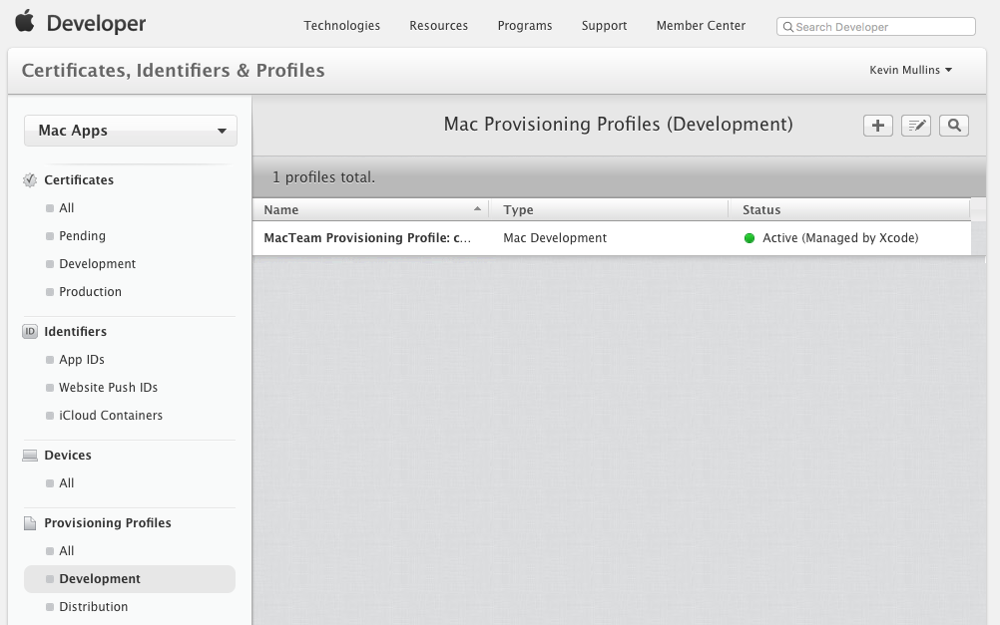](profiles-images/certif13.png#lightbox)

<a name="Development_Provisioning_Profile" />

## Development Provisioning Profile

A Development Provisioning Profile allows a Mac App Store-targeted app to be tested on the specific computers that have been set-up in the profile. This is particularly relevant when using macOS features like iCloud and Push Notifications.

> [!NOTE]
> The developer must have already created a Mac Development Certificate before they can create a Development Provisioning Profile. Complete the details as shown on this screenshot to generate a **Development Provisioning Profile** that can be used to create builds. There must be a valid Mac Development Certificate available for selection in the **Certificate** box, and at least one system registered for testing.

Do the following:

1. Select the type of Provisioning Profile that to create and click the **Continue** button: 

    
2. Select the ID of the Application to create the profile for and click the **Continue** button: 

    
3. Select the developer ID used to sign the profile and click **Continue**: 

    [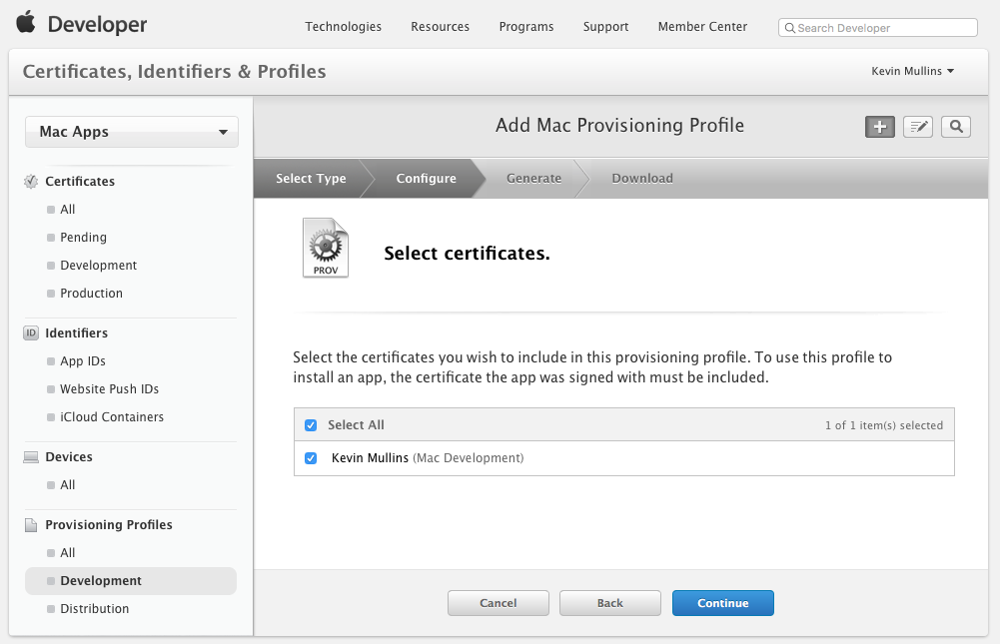](profiles-images/certif16.png#lightbox)
4. Select the computers that this profile can be used on and click **Continue**: 

    [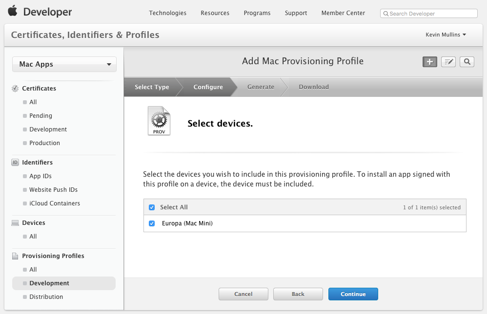](profiles-images/certif17.png#lightbox)
5. Now, enter a **Profile Name** and click the **Generate** button: 

    
6. Click the **Download** button to download the new profile: 

    [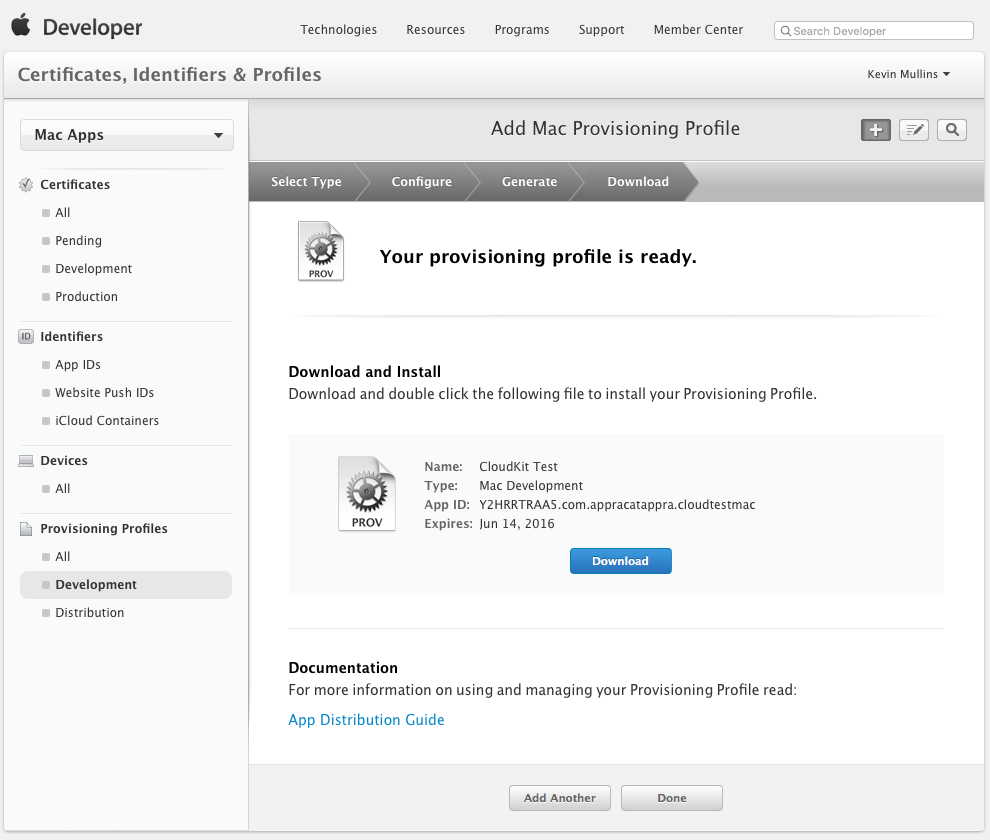](profiles-images/certif19.png#lightbox)
7. Development provisioning profiles are installed to the Profiles Preferences pane of the Mac's **System Preferences** application: 

    [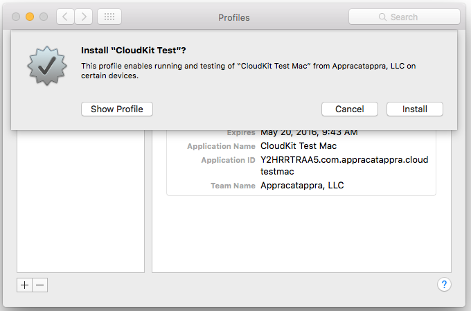](profiles-images/certif20.png#lightbox)
8. The Profile Preferences pane will show all installed profiles: 

    
9. The profile will also appear in the **Developer Certificate Utility** in case it needs to be downloaded again: 

    

A new Development Provisioning Profile will need to be created for each new app or when a new computer is being added to test on.

<a name="Production_Provisioning_Profile" />

## Production Provisioning Profile

Production provisioning profiles are required to build a package for
submission to the Mac App Store.

Do the following:

1. Select the type of profile to create and click the **Continue** button: 

    [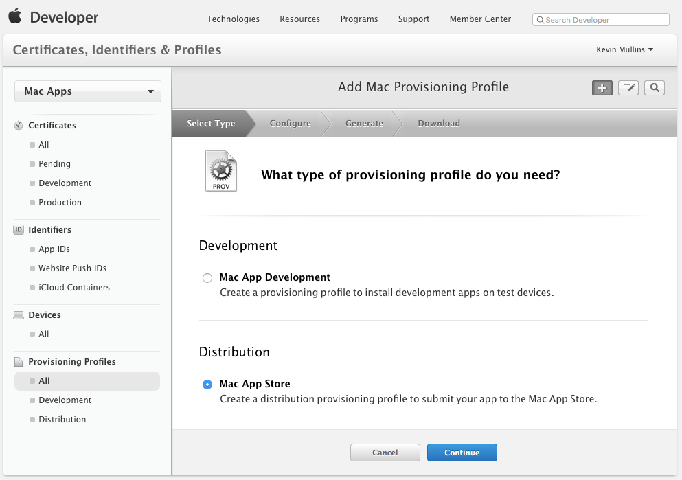](profiles-images/certif21.png#lightbox)
2. Select the ID of the app to create the profile for and click the **Continue** button: 

    
3. Select the company ID to sign the profile and click the **Continue** button: 

    [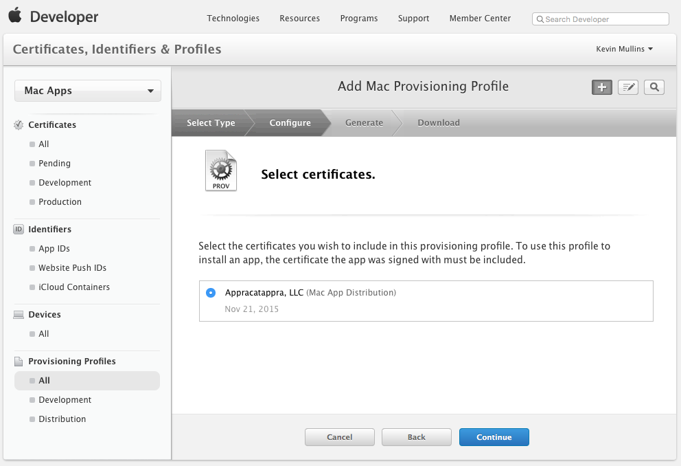](profiles-images/certif23.png#lightbox)
4. Enter a **Profile name** and click the **Generate** button: 

    [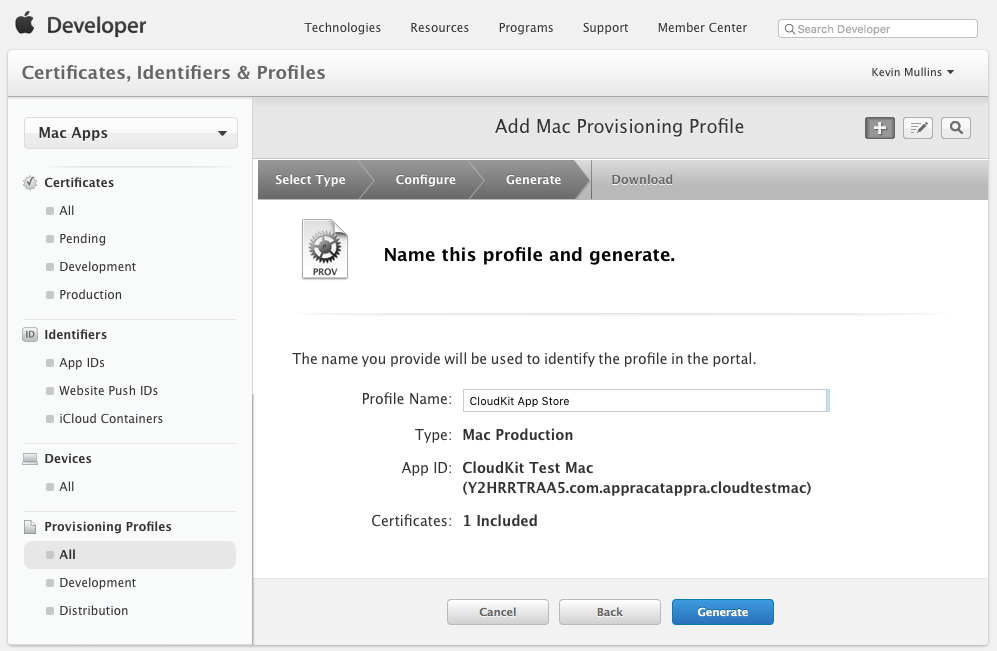](profiles-images/certif24.png#lightbox)
5. Click **Download** to get the provisioning profile file (extension `.provisionprofile`): 

    [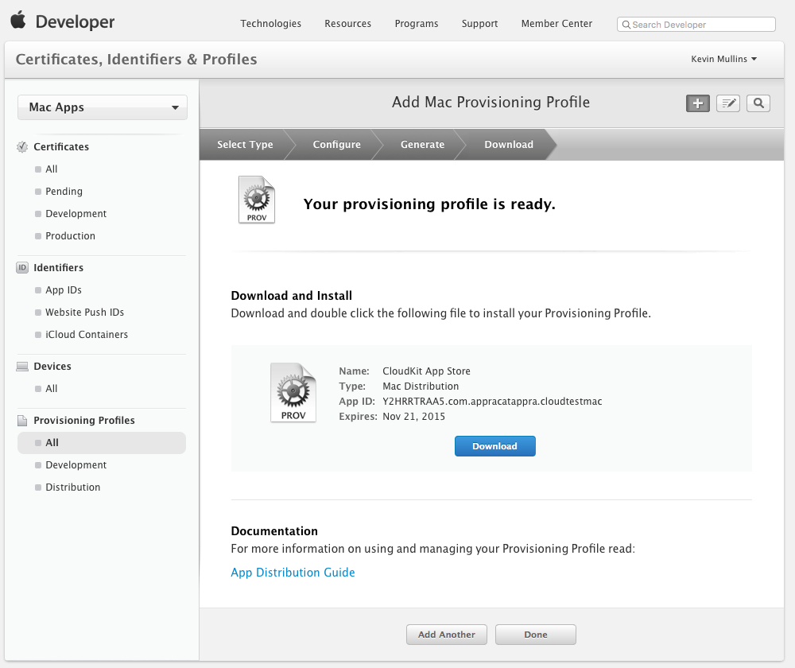](profiles-images/certif25.png#lightbox)
6. Drag it into the **Xcode Organizer** or double-click it to install. The profile will then appear in the Xcode Organizer: 

    [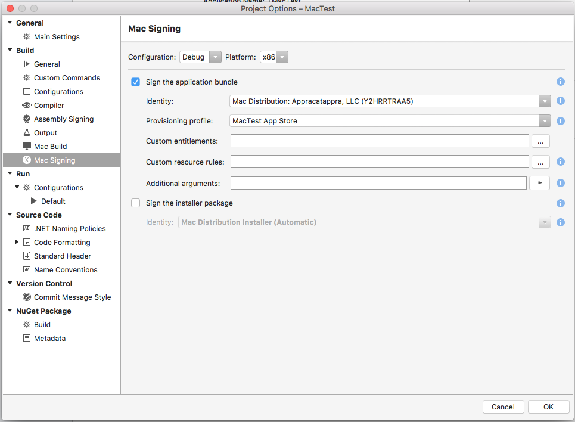](profiles-images/image51.png#lightbox)
7. The provisioning profile will also appear in the list: 

    [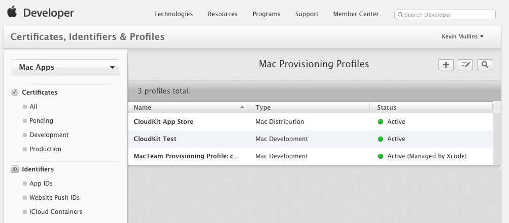](profiles-images/certif26.png#lightbox)

If the developer ever changes the features being used by an App ID (eg. enabling iCloud or push notifications) then they should re-create the provision profiles for that App ID.

## Related Links

- [Installation](~//mac/get-started/installation.md)
- [Hello, Mac sample](~//mac/get-started/hello-mac.md)
- [Distribute your apps on the Mac App Store](https://developer.apple.com/devcenter/mac/checklist/)
- [Tools Guide : Code Signing Your App](https://developer.apple.com/library/mac/#documentation/ToolsLanguages/Conceptual/OSXWorkflowGuide/CodeSigning/CodeSigning.html)
- [Developer ID and GateKeeper](https://developer.apple.com/resources/developer-id/)
