# Outline views

_This article covers working with outline views in a Xamarin.Mac application. It describes creating and maintaining outline views in Xcode and Interface Builder and working with them programmatically._

When working with C# and .NET in a Xamarin.Mac application, you have access to the same Outline Views that a developer working in in *Objective-C* and *Xcode* does. Because Xamarin.Mac integrates directly with Xcode, you can use Xcode's _Interface Builder_ to create and maintain your Outline Views (or optionally create them directly in C# code).

An Outline View is a type of Table that allows the user expand or collapse rows of hierarchical data. Like a Table View, an Outline View displays data for a set of related items, with rows representing individual items and columns representing the attributes of those items. Unlike a Table View, items in an Outline View are not in a flat list, they are organized in a hierarchy, like files and folders on a hard drive.

[](outline-view-images/populate03.png#lightbox)

In this article, we'll cover the basics of working with Outline Views in a Xamarin.Mac application. It is highly suggested that you work through the [Hello, Mac](~/mac/get-started/hello-mac.md) article first, specifically the [Introduction to Xcode and Interface Builder](~/mac/get-started/hello-mac.md#Introduction_to_Xcode_and_Interface_Builder) and [Outlets and Actions](~/mac/get-started/hello-mac.md#Outlets_and_Actions) sections, as it covers key concepts and techniques that we'll be using in this article.

You may want to take a look at the [Exposing C# classes / methods to Objective-C](~/mac/internals/how-it-works.md) section of the [Xamarin.Mac Internals](~/mac/internals/how-it-works.md) document as well, it explains the `Register` and `Export` commands used to wire-up your C# classes to Objective-C objects and UI Elements.

<a name="Introduction_to_Outline_Views" />

## Introduction to Outline Views

An Outline View is a type of Table that allows the user expand or collapse rows of hierarchical data. Like a Table View, an Outline View displays data for a set of related items, with rows representing individual items and columns representing the attributes of those items. Unlike a Table View, items in an Outline View are not in a flat list, they are organized in a hierarchy, like files and folders on a hard drive.

If an item in an Outline View contains other items, it can be expanded or collapsed by the user. An expandable item displays a disclosure triangle, which points to the right when the item is collapsed and points down when the item is expanded. Clicking on the disclosure triangle causes the item to expand or collapse.

The Outline View (`NSOutlineView`) is a subclass of the Table View (`NSTableView`) and as such, inherits much of its behavior from its parent class. As a result, many operations supported by a Table View, such as selecting rows or columns, repositioning columns by dragging Column Headers, etc., are also supported by an Outline View. A Xamarin.Mac application has control of these features, and can configure the Outline View's parameters (either in code or Interface Builder) to allow or disallow certain operations.

An Outline View does not store it's own data, instead it relies on a Data Source (`NSOutlineViewDataSource`) to provide both the rows and columns required, on a as-needed basis.

An Outline View's behavior can be customized by providing a subclass of the Outline View Delegate (`NSOutlineViewDelegate`) to support Outline column management, type to select functionality, row selection and editing, custom tracking, and custom views for individual columns and rows.

Since an Outline View shares much of it's behavior and functionality with a Table View, you might want to go through our [Table Views](~/mac/user-interface/table-view.md) documentation before continuing with this article.

<a name="Creating_and_Maintaining_Outline_Views_in_Xcode" />

## Creating and Maintaining Outline Views in Xcode

When you create a new Xamarin.Mac Cocoa application, you get a standard blank, window by default. This windows is defined in a `.storyboard` file automatically included in the project. To edit your windows design, in the **Solution Explorer**, double click the `Main.storyboard` file:

[](outline-view-images/edit01.png#lightbox)

This will open the window design in Xcode's Interface Builder:

[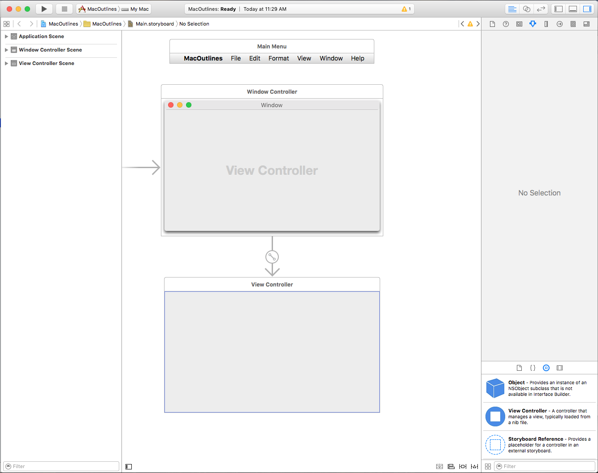](outline-view-images/edit02.png#lightbox)

Type `outline` into the **Library Inspector's** Search Box to make it easier to find the Outline View controls:

[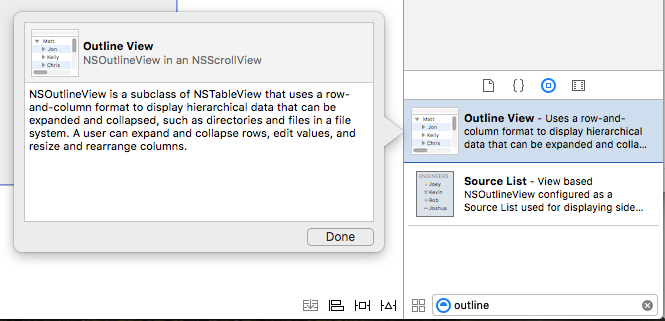](outline-view-images/edit03.png#lightbox)

Drag a Outline View onto the View Controller in the **Interface Editor**, make it fill the content area of the View Controller and set it to where it shrinks and grows with the window in the **Constraint Editor**:

[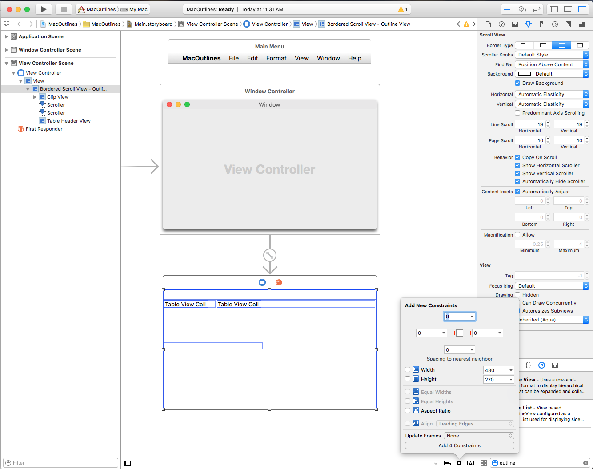](outline-view-images/edit04.png#lightbox)

Select the Outline View in the **Interface Hierarchy** and the following properties are available in the **Attribute Inspector**:

[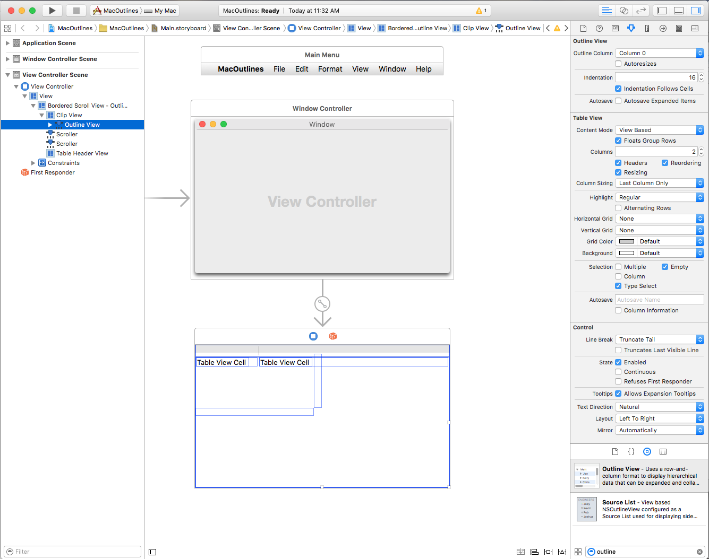](outline-view-images/edit05.png#lightbox)

- **Outline Column** - The Table Column in which the Hierarchical data is displayed.
- **Autosave Outline Column** - If `true`, the Outline Column will be automatically saved and restored between application runs.
- **Indentation** - The amount to indent columns under an expanded item.
- **Indentation Follows Cells** - If `true`, the Indentation Mark will be indented along with the cells.
- **Autosave Expanded Items** - If `true`, the expanded/collapsed state of the items will be automatically saved and restored between application runs.
- **Content Mode** - Allows you to use either Views (`NSView`) or Cells (`NSCell`) to display the data in the rows and columns. Starting with macOS 10.7, you should use Views.
- **Floats Group Rows** - If `true`, the Table View will draw grouped cells as if they are floating.
- **Columns** - Defines the number of columns displayed.
- **Headers** - If `true`, the columns will have Headers.
- **Reordering** - If `true`, the user will be able to drag reorder the columns in the table.
- **Resizing** - If `true`, the user will be able to drag column Headers to resize columns.
- **Column Sizing** - Controls how the table will auto size columns.
- **Highlight** - Controls the type of highlighting the table uses when a cell is selected.
- **Alternate Rows** - If `true`, ever other row will have a different background color.
- **Horizontal Grid** - Selects the type of border drawn between cells horizontally.
- **Vertical Grid** - Selects the type of border drawn between cells vertically.
- **Grid Color** - Sets the cell border color.
- **Background** - Sets the cell background color.
- **Selection** - Allow you to control how the user can select cells in the table as:
    - **Multiple** - If `true`, the user can select multiple rows and columns.
    - **Column** - If `true`,the user can select columns.
    - **Type Select** - If `true`, the user can type a character to select a row.
    - **Empty** - If `true`, the user is not required to select a row or column, the table allows for no selection at all.
- **Autosave** - The name that the tables format is automatically save under.
- **Column Information** - If `true`, the order and width of the columns will be automatically saved.
- **Line Breaks** - Select how the cell handles line breaks.
- **Truncates Last Visible Line** - If `true`, the cell will be truncated in the data can not fit inside it's bounds.

> [!IMPORTANT]
> Unless you are maintaining a legacy Xamarin.Mac application, `NSView` based Outline Views should be used over `NSCell` based Table Views. `NSCell` is considered legacy and may not be supported going forward.

Select a Table Column in the **Interface Hierarchy** and the following properties are available in the **Attribute Inspector**:

[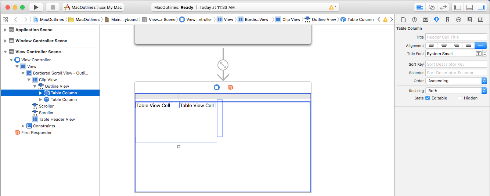](outline-view-images/edit06.png#lightbox)

- **Title** - Sets the title of the column.
- **Alignment** - Set the alignment of the text within the cells.
- **Title Font** - Selects the font for the cell's Header text.
- **Sort Key** - Is the key used to sort data in the column. Leave blank if the user cannot sort this column.
- **Selector** - Is the **Action** used to perform the sort. Leave blank if the user cannot sort this column.
- **Order** - Is the sort order for the columns data.
- **Resizing** - Selects the type of resizing for the column.
- **Editable** - If `true`, the user can edit cells in a cell based table.
- **Hidden** - If `true`, the column is hidden.

You can also resize the column by dragging it's handle (vertically centered on the column's right side) left or right.

Let's select the each Column in our Table View and give the first column a **Title** of `Product` and the second one `Details`.

Select a Table Cell View (`NSTableViewCell`) in the **Interface Hierarchy** and the following properties are available in the **Attribute Inspector**:

[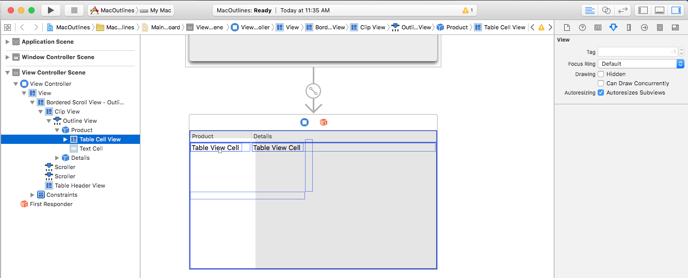](outline-view-images/edit07.png#lightbox)

These are all of the properties of a standard View. You also have the option of resizing the rows for this column here.

Select a Table View Cell (by default, this is a `NSTextField`) in the **Interface Hierarchy** and the following properties are available in the **Attribute Inspector**:

[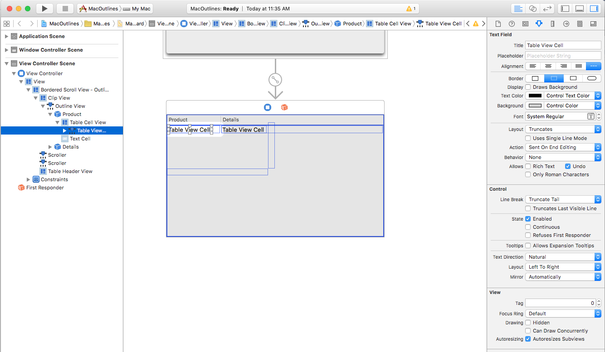](outline-view-images/edit08.png#lightbox)

You'll have all the properties of a standard Text Field to set here. By default, a standard Text Field is used to display data for a cell in a column.

Select a Table Cell View (`NSTableFieldCell`) in the **Interface Hierarchy** and the following properties are available in the **Attribute Inspector**:

[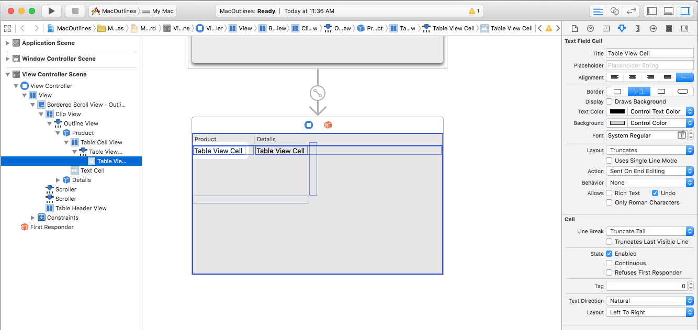](outline-view-images/edit09.png#lightbox)

The most important settings here are:

- **Layout** - Select how cells in this column are laid out.
- **Uses Single Line Mode** - If `true`, the cell is limited to a single line.
- **First Runtime Layout Width** - If `true`, the cell will prefer the width set for it (either manually or automatically) when it is displayed the first time the application is run.
- **Action** - Controls when the Edit **Action** is sent for the cell.
- **Behavior** - Defines if a cell is selectable or editable.
- **Rich Text** - If `true`, the cell can display formatted and styled text.
- **Undo** - If `true`, the cell assumes responsibility for it's undo behavior.

Select the Table Cell View (`NSTableFieldCell`) at the bottom of a Table Column in the **Interface Hierarchy**:

[](outline-view-images/edit10.png#lightbox)

This allows you to edit the Table Cell View used as the base _Pattern_ for all cells created for the given column.

<a name="Adding_Actions_and_Outlets" />

### Adding Actions and Outlets

Just like any other Cocoa UI control, we need to expose our Outline View and it's columns and cells to C# code using **Actions** and **Outlets** (based on the functionality required).

The process is the same for any Outline View element that we want to expose:

1. Switch to the **Assistant Editor** and ensure that the `ViewController.h` file is selected: 

    [](outline-view-images/edit11.png#lightbox)
2. Select the Outline View from the **Interface Hierarchy**, control-click and drag to the `ViewController.h` file.
3. Create an **Outlet** for the Outline View called `ProductOutline`: 

    [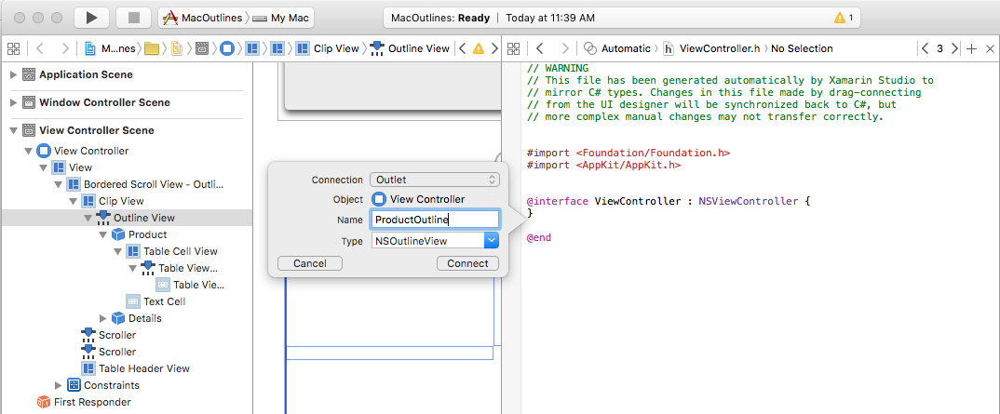](outline-view-images/edit13.png#lightbox)
4. Create **Outlets** for the tables columns as well called `ProductColumn` and `DetailsColumn`: 

    [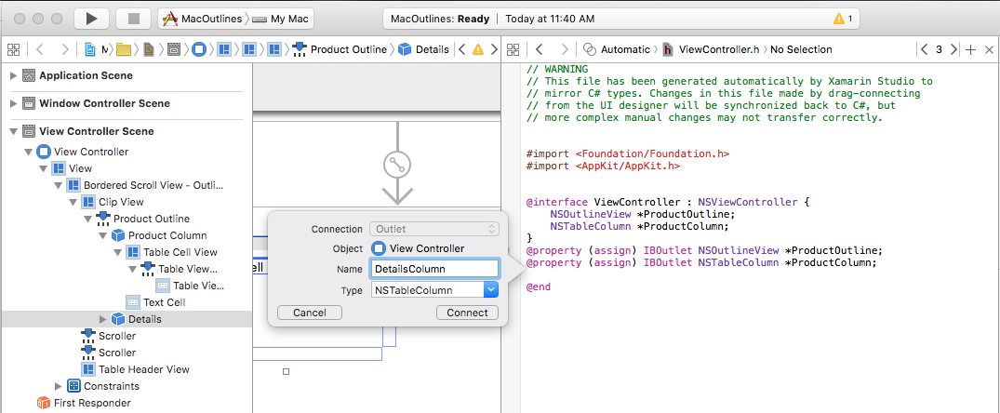](outline-view-images/edit14.png#lightbox)
5. Save you changes and return to Visual Studio for Mac to sync with Xcode.

Next, we'll write the code display some data for the outline when the application is run.

<a name="Populating_the_Table_View" />

## Populating the Outline View

With our Outline View designed in Interface Builder and exposed via an **Outlet**, next we need to create the C# code to populate it.

First, let's create a new `Product` class to hold the information for the individual rows and groups of sub products. In the **Solution Explorer**, right-click the Project and select **Add** > **New File...** Select **General** > **Empty Class**, enter `Product` for the **Name** and click the **New** button:

[](outline-view-images/populate01.png#lightbox)

Make the `Product.cs` file look like the following:

```csharp
using System;
using Foundation;
using System.Collections.Generic;

namespace MacOutlines
{
    public class Product : NSObject
    {
        #region Public Variables
        public List<Product> Products = new List<Product>();
        #endregion

        #region Computed Properties
        public string Title { get; set;} = "";
        public string Description { get; set;} = "";
        public bool IsProductGroup {
            get { return (Products.Count > 0); }
        }
        #endregion

        #region Constructors
        public Product ()
        {
        }

        public Product (string title, string description)
        {
            this.Title = title;
            this.Description = description;
        }
        #endregion
    }
}
```

Next, we need to create a subclass of `NSOutlineDataSource` to provide the data for our outline as it is requested. In the **Solution Explorer**, right-click the Project and select **Add** > **New File...** Select **General** > **Empty Class**, enter `ProductOutlineDataSource` for the **Name** and click the **New** button.

Edit the `ProductTableDataSource.cs` file and make it look like the following:

```csharp
using System;
using AppKit;
using CoreGraphics;
using Foundation;
using System.Collections;
using System.Collections.Generic;

namespace MacOutlines
{
    public class ProductOutlineDataSource : NSOutlineViewDataSource
    {
        #region Public Variables
        public List<Product> Products = new List<Product>();
        #endregion

        #region Constructors
        public ProductOutlineDataSource ()
        {
        }
        #endregion

        #region Override Methods
        public override nint GetChildrenCount (NSOutlineView outlineView, NSObject item)
        {
            if (item == null) {
                return Products.Count;
            } else {
                return ((Product)item).Products.Count;
            }

        }

        public override NSObject GetChild (NSOutlineView outlineView, nint childIndex, NSObject item)
        {
            if (item == null) {
                return Products [childIndex];
            } else {
                return ((Product)item).Products [childIndex];
            }
                
        }

        public override bool ItemExpandable (NSOutlineView outlineView, NSObject item)
        {
            if (item == null) {
                return Products [0].IsProductGroup;
            } else {
                return ((Product)item).IsProductGroup;
            }
        
        }
        #endregion
    }
}
```

This class has storage for our Outline View's items and overrides the `GetChildrenCount` to return the number of rows in the table. The `GetChild` returns a specific parent or child item (as requested by the Outline View) and the `ItemExpandable` defines the specified item as either a parent or a child.

Finally, we need to create a subclass of `NSOutlineDelegate` to provide the behavior for our outline. In the **Solution Explorer**, right-click the Project and select **Add** > **New File...** Select **General** > **Empty Class**, enter `ProductOutlineDelegate` for the **Name** and click the **New** button.

Edit the `ProductOutlineDelegate.cs` file and make it look like the following:

```csharp
using System;
using AppKit;
using CoreGraphics;
using Foundation;
using System.Collections;
using System.Collections.Generic;

namespace MacOutlines
{
    public class ProductOutlineDelegate : NSOutlineViewDelegate
    {
        #region Constants 
        private const string CellIdentifier = "ProdCell";
        #endregion

        #region Private Variables
        private ProductOutlineDataSource DataSource;
        #endregion

        #region Constructors
        public ProductOutlineDelegate (ProductOutlineDataSource datasource)
        {
            this.DataSource = datasource;
        }
        #endregion

        #region Override Methods

        public override NSView GetView (NSOutlineView outlineView, NSTableColumn tableColumn, NSObject item) {
            // This pattern allows you reuse existing views when they are no-longer in use.
            // If the returned view is null, you instance up a new view
            // If a non-null view is returned, you modify it enough to reflect the new data
            NSTextField view = (NSTextField)outlineView.MakeView (CellIdentifier, this);
            if (view == null) {
                view = new NSTextField ();
                view.Identifier = CellIdentifier;
                view.BackgroundColor = NSColor.Clear;
                view.Bordered = false;
                view.Selectable = false;
                view.Editable = false;
            }

            // Cast item
            var product = item as Product;

            // Setup view based on the column selected
            switch (tableColumn.Title) {
            case "Product":
                view.StringValue = product.Title;
                break;
            case "Details":
                view.StringValue = product.Description;
                break;
            }

            return view;
        }
        #endregion
    }
}
```

When we create an instance of the `ProductOutlineDelegate`, we also pass in an instance of the `ProductOutlineDataSource` that provides the data for the outline. The `GetView` method is responsible for returning a view (data) to display the cell for a give column and row. If possible, an existing view will be reused to display the cell, if not a new view must be created.

To populate the outline, let's edit the `MainWindow.cs` file and make the `AwakeFromNib` method look like the following:

```csharp
public override void AwakeFromNib ()
{
    base.AwakeFromNib ();

    // Create data source and populate
    var DataSource = new ProductOutlineDataSource ();

    var Vegetables = new Product ("Vegetables", "Greens and Other Produce");
    Vegetables.Products.Add (new Product ("Cabbage", "Brassica oleracea - Leaves, axillary buds, stems, flowerheads"));
    Vegetables.Products.Add (new Product ("Turnip", "Brassica rapa - Tubers, leaves"));
    Vegetables.Products.Add (new Product ("Radish", "Raphanus sativus - Roots, leaves, seed pods, seed oil, sprouting"));
    Vegetables.Products.Add (new Product ("Carrot", "Daucus carota - Root tubers"));
    DataSource.Products.Add (Vegetables);

    var Fruits = new Product ("Fruits", "Fruit is a part of a flowering plant that derives from specific tissues of the flower");
    Fruits.Products.Add (new Product ("Grape", "True Berry"));
    Fruits.Products.Add (new Product ("Cucumber", "Pepo"));
    Fruits.Products.Add (new Product ("Orange", "Hesperidium"));
    Fruits.Products.Add (new Product ("Blackberry", "Aggregate fruit"));
    DataSource.Products.Add (Fruits);

    var Meats = new Product ("Meats", "Lean Cuts");
    Meats.Products.Add (new Product ("Beef", "Cow"));
    Meats.Products.Add (new Product ("Pork", "Pig"));
    Meats.Products.Add (new Product ("Veal", "Young Cow"));
    DataSource.Products.Add (Meats);

    // Populate the outline
    ProductOutline.DataSource = DataSource;
    ProductOutline.Delegate = new ProductOutlineDelegate (DataSource);

}
```

If we run the application, the following is displayed:

[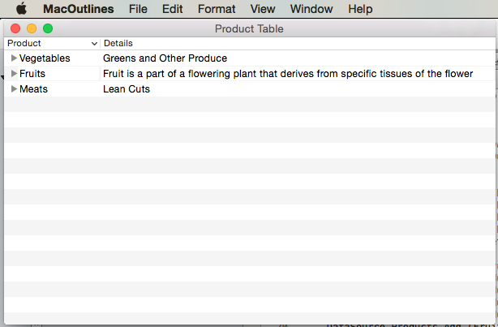](outline-view-images/populate02.png#lightbox)

If we expand a node in the Outline View, it will look like the following:

[](outline-view-images/populate03.png#lightbox)

<a name="Sorting_by_Column" />

## Sorting by Column

Let's allow the user to sort the data in the outline by clicking on a Column Header. First, double-click the `Main.storyboard` file to open it for editing in Interface Builder. Select the `Product` column, enter `Title` for the **Sort Key**, `compare:` for the **Selector** and select `Ascending` for the **Order**:

[](outline-view-images/sort01.png#lightbox)

Save your changes and return to Visual Studio for Mac to sync with Xcode.

Now let's edit the `ProductOutlineDataSource.cs` file and add the following methods:

```csharp
public void Sort(string key, bool ascending) {

    // Take action based on key
    switch (key) {
    case "Title":
        if (ascending) {
            Products.Sort ((x, y) => x.Title.CompareTo (y.Title));
        } else {
            Products.Sort ((x, y) => -1 * x.Title.CompareTo (y.Title));
        }
        break;
    }
}

public override void SortDescriptorsChanged (NSOutlineView outlineView, NSSortDescriptor[] oldDescriptors)
{
    // Sort the data
    Sort (oldDescriptors [0].Key, oldDescriptors [0].Ascending);
    outlineView.ReloadData ();
}
```

The `Sort` method allow us to sort the data in the Data Source based on a given `Product` class field in either ascending or descending order. The overridden `SortDescriptorsChanged` method will be called every time the use clicks on a Column Heading. It will be passed the **Key** value that we set in Interface Builder and the sort order for that column.

If we run the application and click in the Column Headers, the rows will be sorted by that column:

[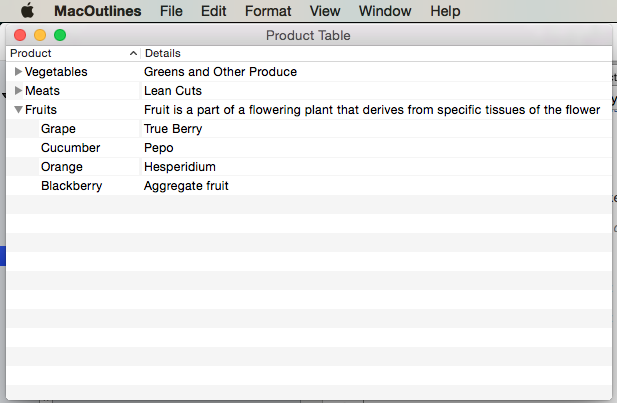](outline-view-images/sort02.png#lightbox)

<a name="Row_Selection" />

## Row Selection

If you want to allow the user to select a single row, double-click the `Main.storyboard` file to open it for editing in Interface Builder. Select the Outline View in the **Interface Hierarchy** and uncheck the **Multiple** checkbox in the **Attribute Inspector**:

[](outline-view-images/select01.png#lightbox)

Save your changes and return to Visual Studio for Mac to sync with Xcode.


Next, edit the `ProductOutlineDelegate.cs` file and add the following method:

```csharp
public override bool ShouldSelectItem (NSOutlineView outlineView, NSObject item)
{
    // Don't select product groups
    return !((Product)item).IsProductGroup;
}
```

This will allow the user to select any single row in the Outline View. Return `false` for the `ShouldSelectItem` for any item that you don't want the user to be able to select or `false` for every item if you don't want the user to be able to select any items.

<a name="Multiple_Row_Selection" />

## Multiple Row Selection

If you want to allow the user to select a multiple rows, double-click the `Main.storyboard` file to open it for editing in Interface Builder. Select the Outline View in the **Interface Hierarchy** and check the **Multiple** checkbox in the **Attribute Inspector**:

[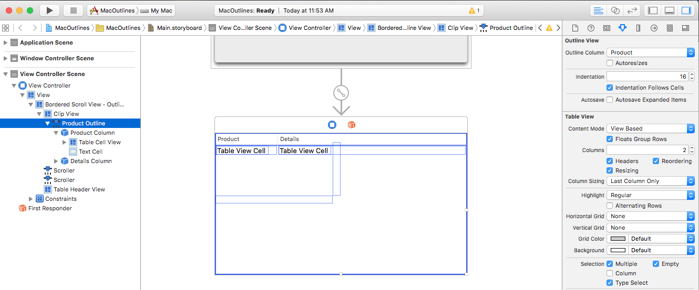](outline-view-images/select02.png#lightbox)

Save your changes and return to Visual Studio for Mac to sync with Xcode.


Next, edit the `ProductOutlineDelegate.cs` file and add the following method:

```csharp
public override bool ShouldSelectItem (NSOutlineView outlineView, NSObject item)
{
    // Don't select product groups
    return !((Product)item).IsProductGroup;
}
```

This will allow the user to select any single row in the Outline View. Return `false` for the `ShouldSelectRow` for any item that you don't want the user to be able to select or `false` for every item if you don't want the user to be able to select any items.

<a name="Type_to_Select_Row" />

## Type to Select Row

If you want to allow the user to type a character with the Outline View selected and select the first row that has that character, double-click the `Main.storyboard` file to open it for editing in Interface Builder. Select the Outline View in the **Interface Hierarchy** and check the **Type Select** checkbox in the **Attribute Inspector**:

[](outline-view-images/type01.png#lightbox)

Save your changes and return to Visual Studio for Mac to sync with Xcode.

Now let's edit the `ProductOutlineDelegate.cs` file and add the following method:

```csharp
public override NSObject GetNextTypeSelectMatch (NSOutlineView outlineView, NSObject startItem, NSObject endItem, string searchString)
{
    foreach(Product product in DataSource.Products) {
        if (product.Title.Contains (searchString)) {
            return product;
        }
    }

    // Not found
    return null;
}
```

The `GetNextTypeSelectMatch` method takes the given `searchString` and returns the item of the first `Product` that has that string in it's `Title`.

<a name="Reordering_Columns" />

## Reordering Columns

If you want to allow the user to drag reorder columns in the Outline View, double-click the `Main.storyboard` file to open it for editing in Interface Builder. Select the Outline View in the **Interface Hierarchy** and check the **Reordering** checkbox in the **Attribute Inspector**:

[](outline-view-images/reorder01.png#lightbox)

If we give a value for the **Autosave** property and check the **Column Information** field, any changes we make to the table's layout will automatically be saved for us and restored the next time the application is run.

Save your changes and return to Visual Studio for Mac to sync with Xcode.

Now let's edit the `ProductOutlineDelegate.cs` file and add the following method:

```csharp
public override bool ShouldReorder (NSOutlineView outlineView, nint columnIndex, nint newColumnIndex)
{
    return true;
}
```

The `ShouldReorder` method should return `true` for any column that it want to allow to be drag reordered into the `newColumnIndex`, else return `false`;

If we run the application, we can drag Column Headers around to reorder our columns:

[](outline-view-images/reorder02.png#lightbox)

<a name="Editing_Cells" />

## Editing Cells

If you want to allow the user to edit the values for a given cell, edit the `ProductOutlineDelegate.cs` file and change the `GetViewForItem` method as follows:

```csharp
public override NSView GetView (NSOutlineView outlineView, NSTableColumn tableColumn, NSObject item) {
    // Cast item
    var product = item as Product;

    // This pattern allows you reuse existing views when they are no-longer in use.
    // If the returned view is null, you instance up a new view
    // If a non-null view is returned, you modify it enough to reflect the new data
    NSTextField view = (NSTextField)outlineView.MakeView (tableColumn.Title, this);
    if (view == null) {
        view = new NSTextField ();
        view.Identifier = tableColumn.Title;
        view.BackgroundColor = NSColor.Clear;
        view.Bordered = false;
        view.Selectable = false;
        view.Editable = !product.IsProductGroup;
    }

    // Tag view
    view.Tag = outlineView.RowForItem (item);

    // Allow for edit
    view.EditingEnded += (sender, e) => {

        // Grab product
        var prod = outlineView.ItemAtRow(view.Tag) as Product;

        // Take action based on type
        switch(view.Identifier) {
        case "Product":
            prod.Title = view.StringValue;
            break;
        case "Details":
            prod.Description = view.StringValue;
            break; 
        }
    };

    // Setup view based on the column selected
    switch (tableColumn.Title) {
    case "Product":
        view.StringValue = product.Title;
        break;
    case "Details":
        view.StringValue = product.Description;
        break;
    }

    return view;
}
```

Now if we run the application, the user can edit the cells in the Table View:

[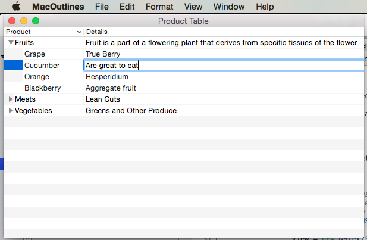](outline-view-images/editing01.png#lightbox)

<a name="Using_Images_in_Outline_Views" />

## Using Images in Outline Views

To include an image as part of the cell in a `NSOutlineView`, you'll need to change how the data is returned by the Outline View's `NSTableViewDelegate's` `GetView` method to use a `NSTableCellView` instead of the typical `NSTextField`. For example:

```csharp
public override NSView GetView (NSOutlineView outlineView, NSTableColumn tableColumn, NSObject item) {
    // Cast item
    var product = item as Product;

    // This pattern allows you reuse existing views when they are no-longer in use.
    // If the returned view is null, you instance up a new view
    // If a non-null view is returned, you modify it enough to reflect the new data
    NSTableCellView view = (NSTableCellView)outlineView.MakeView (tableColumn.Title, this);
    if (view == null) {
        view = new NSTableCellView ();
        if (tableColumn.Title == "Product") {
            view.ImageView = new NSImageView (new CGRect (0, 0, 16, 16));
            view.AddSubview (view.ImageView);
            view.TextField = new NSTextField (new CGRect (20, 0, 400, 16));
        } else {
            view.TextField = new NSTextField (new CGRect (0, 0, 400, 16));
        }
        view.TextField.AutoresizingMask = NSViewResizingMask.WidthSizable;
        view.AddSubview (view.TextField);
        view.Identifier = tableColumn.Title;
        view.TextField.BackgroundColor = NSColor.Clear;
        view.TextField.Bordered = false;
        view.TextField.Selectable = false;
        view.TextField.Editable = !product.IsProductGroup;
    }

    // Tag view
    view.TextField.Tag = outlineView.RowForItem (item);

    // Allow for edit
    view.TextField.EditingEnded += (sender, e) => {

        // Grab product
        var prod = outlineView.ItemAtRow(view.Tag) as Product;

        // Take action based on type
        switch(view.Identifier) {
        case "Product":
            prod.Title = view.TextField.StringValue;
            break;
        case "Details":
            prod.Description = view.TextField.StringValue;
            break; 
        }
    };

    // Setup view based on the column selected
    switch (tableColumn.Title) {
    case "Product":
        view.ImageView.Image = NSImage.ImageNamed (product.IsProductGroup ? "tags.png" : "tag.png");
        view.TextField.StringValue = product.Title;
        break;
    case "Details":
        view.TextField.StringValue = product.Description;
        break;
    }

    return view;
}
```

For more information, please see the [Using Images with Outline Views](~/mac/app-fundamentals/image.md) section of our [Working with Image](~/mac/app-fundamentals/image.md) documentation.

<a name="Data_Binding_Outline_Views" />

## Data Binding Outline Views

By using Key-Value Coding and Data Binding techniques in your Xamarin.Mac application, you can greatly decrease the amount of code that you have to write and maintain to populate and work with UI elements. You also have the benefit of further decoupling your backing data (_Data Model_) from your front end User Interface (_Model-View-Controller_), leading to easier to maintain, more flexible application design.

Key-Value Coding (KVC) is a mechanism for accessing an object’s properties indirectly, using keys (specially formatted strings) to identify properties instead of accessing them through instance variables or accessor methods (`get/set`). By implementing Key-Value Coding compliant accessors in your Xamarin.Mac application, you gain access to other macOS features such as Key-Value Observing (KVO), Data Binding, Core Data, Cocoa bindings, and scriptability.

For more information, please see the [Outline View Data Binding](~/mac/app-fundamentals/databinding.md#Outline_View_Data_Binding) section of our [Data Binding and Key-Value Coding](~/mac/app-fundamentals/databinding.md) documentation.

<a name="Summary" />

## Summary

This article has taken a detailed look at working with Outline Views in a Xamarin.Mac application. We saw the different types and uses of Outline Views, how to create and maintain Outline Views in Xcode's Interface Builder and how to work with Outline Views in C# code.

## Related Links

- [MacOutlines (sample)](https://developer.xamarin.com/samples/mac/MacOutlines/)
- [MacImages (sample)](https://developer.xamarin.com/samples/mac/MacImages/)
- [Hello, Mac](~/mac/get-started/hello-mac.md)
- [Table Views](~/mac/user-interface/table-view.md)
- [Source Lists](~/mac/user-interface/source-list.md)
- [Data Binding and Key-Value Coding](~/mac/app-fundamentals/databinding.md)
- [OS X Human Interface Guidelines](https://developer.apple.com/library/mac/documentation/UserExperience/Conceptual/OSXHIGuidelines/)
- [Introduction to Outline Views](https://developer.apple.com/library/mac/documentation/Cocoa/Conceptual/OutlineView/OutlineView.html#//apple_ref/doc/uid/10000023i)
- [NSOutlineView](https://developer.apple.com/library/mac/documentation/Cocoa/Reference/ApplicationKit/Classes/NSOutlineView_Class/index.html#//apple_ref/doc/uid/TP40004079)
- [NSOutlineViewDataSource](https://developer.apple.com/library/mac/documentation/Cocoa/Reference/ApplicationKit/Protocols/NSOutlineViewDataSource_Protocol/index.html#//apple_ref/doc/uid/TP40004175)
- [NSOutlineViewDelegate](https://developer.apple.com/library/mac/documentation/Cocoa/Reference/NSOutlineViewDelegate_Protocol/index.html#//apple_ref/doc/uid/TP40008609)
