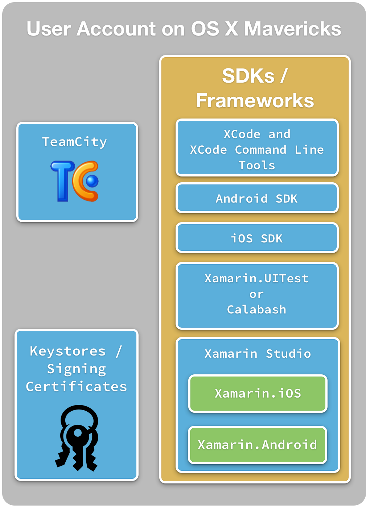
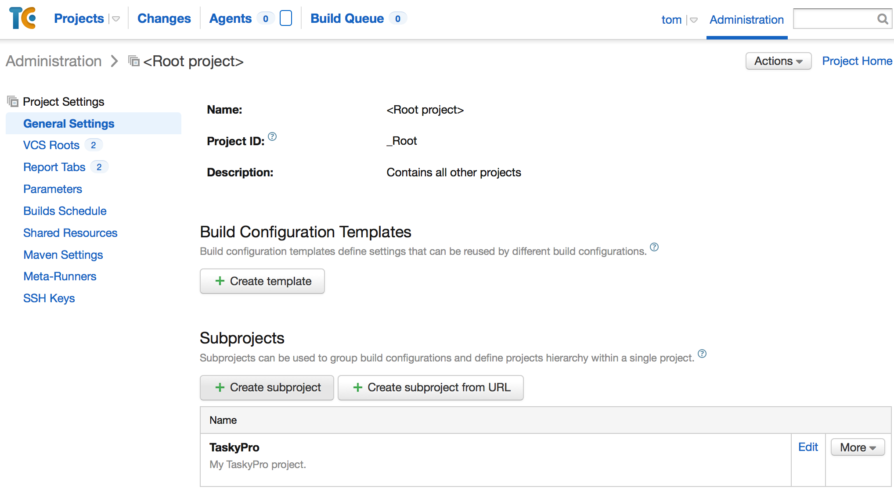
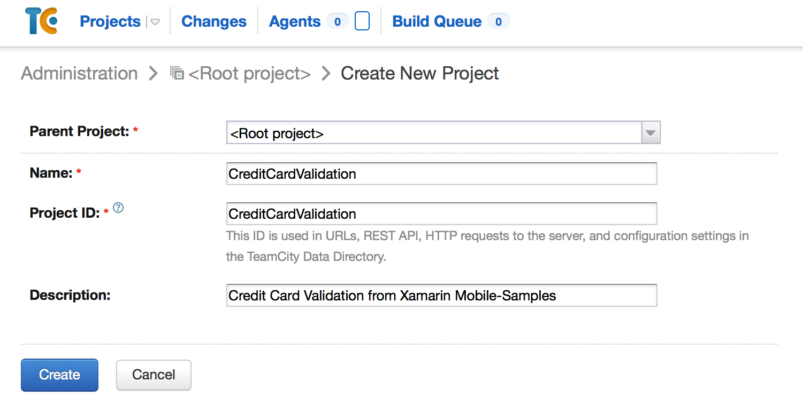
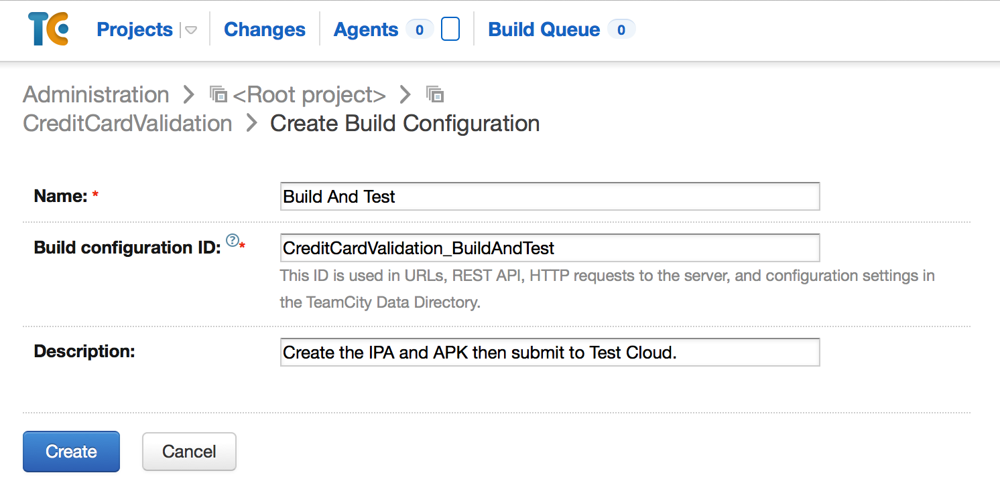
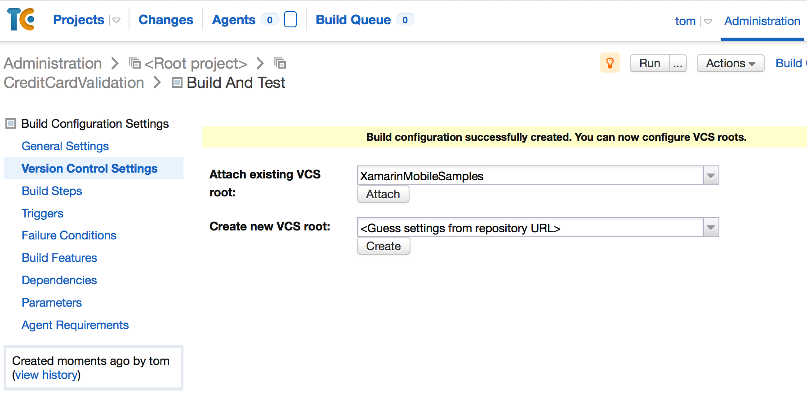
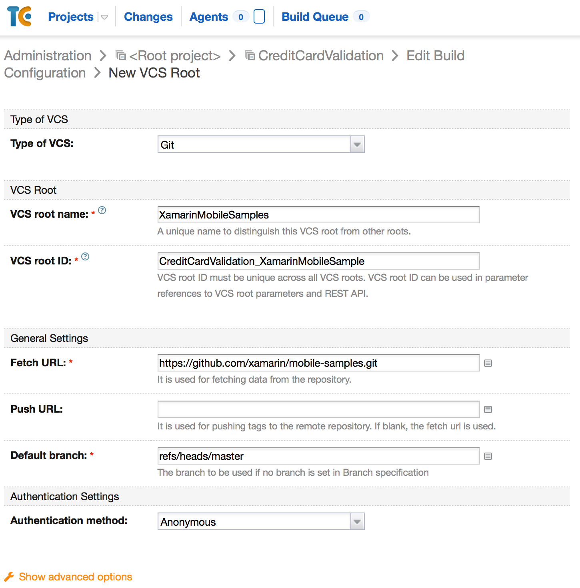
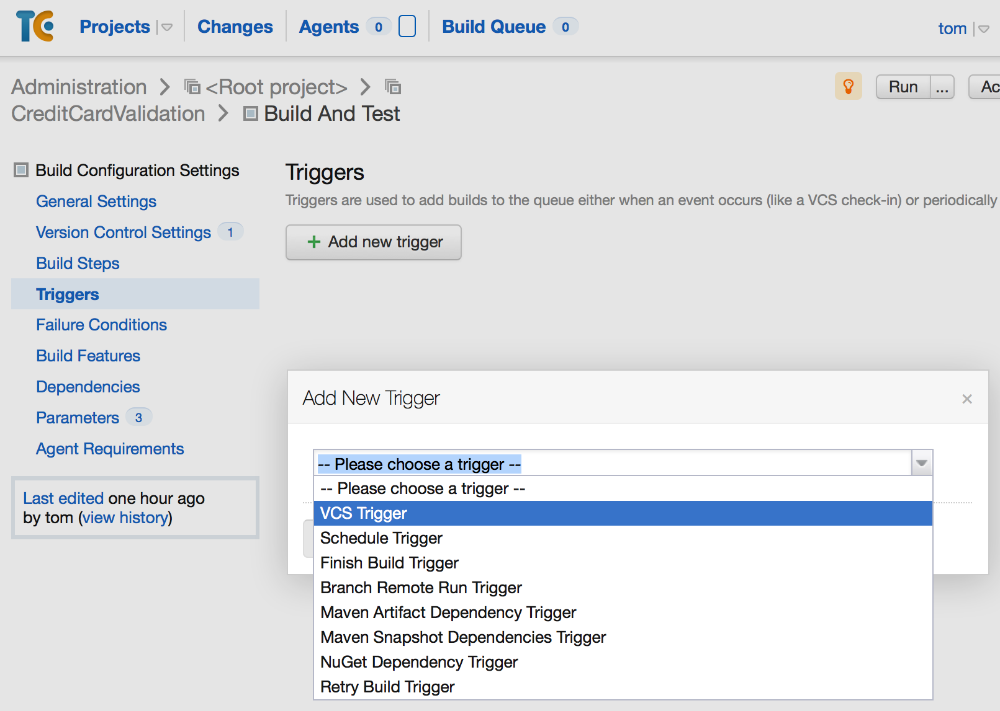
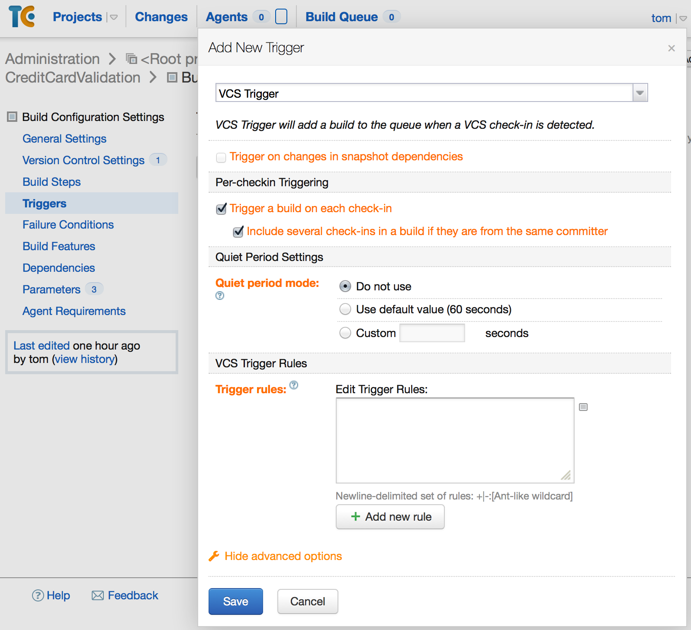
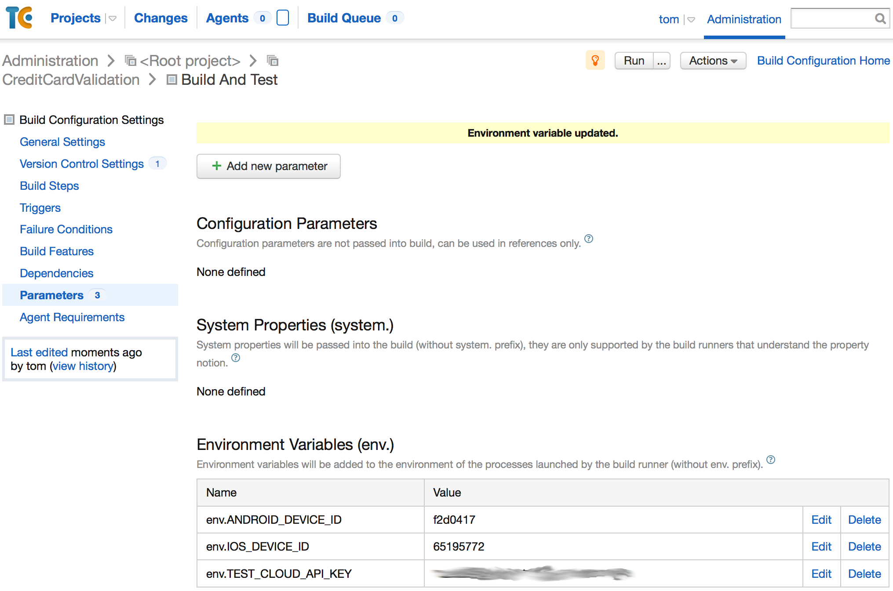
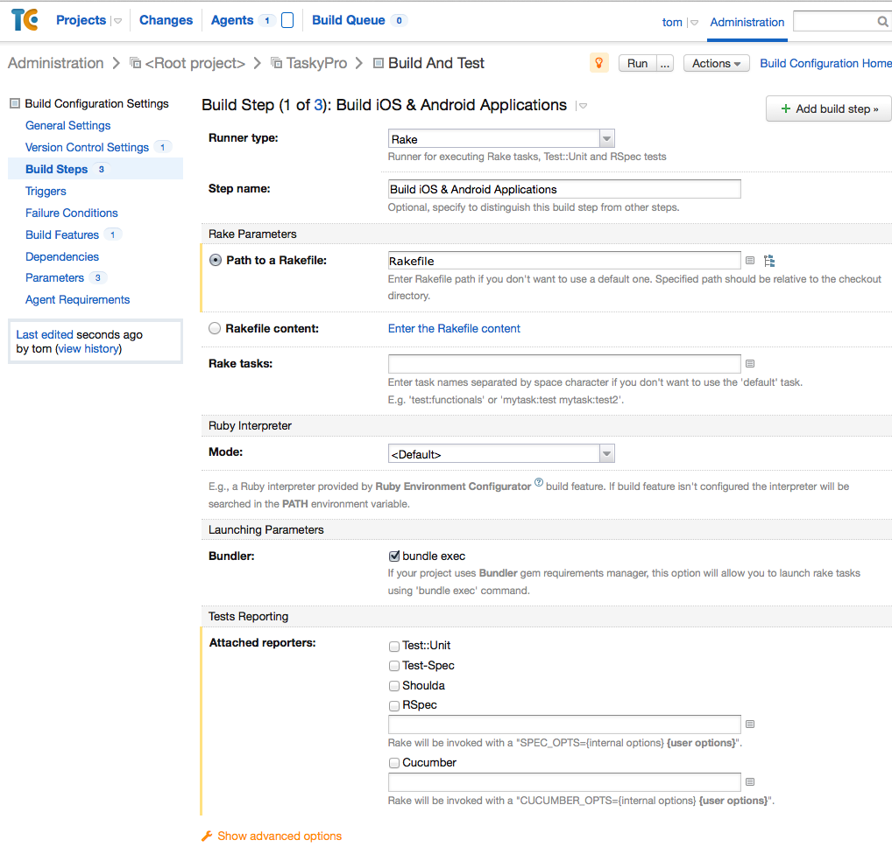

# Using Team City with Xamarin

_This guide will discuss the steps involved with using TeamCity to compile mobile applications and then submit them to Xamarin Test Cloud._

As discussed in the [Introduction to Continuous Integration](~/tools/ci/intro-to-ci.md) guide, continuous integration (CI) is a useful practice when developing quality mobile applications. There are many viable options for continuous integration server software; this guide will focus on [TeamCity](http://www.jetbrains.com/teamcity/) from JetBrains.

There are several different permutations of a TeamCity installation. The following is a list of some of these:

- **Windows Service** – In this scenario, TeamCity starts up when Windows boots as a Windows Service. It must be paired with a Mac Build Host to compile any iOS applications.

- **Launch Daemon on OS X** – Conceptually, this is very similar to running as a Windows Service described in the previous step. By default the builds will be run under the root account.

- **User Account on OS X** – It is possible to run TeamCity under a user account that starts up each time the user logs in.

Of the previous scenarios, running TeamCity under a user account on OS X is the simplest and easiest to setup.

There are several steps involved with setting up TeamCity:

- **Installing TeamCity** – The installation of TeamCity is not covered in this guide. This guide assumes that TeamCity is installed and running under a user account. Instructions on [installing TeamCity](http://confluence.jetbrains.com/display/TCD8/Installation) can be found in the [TeamCity 8 documentation](http://confluence.jetbrains.com/display/TCD8/TeamCity+Documentation) by JetBrains.

- **Preparing the Build Server** – This step involves installing the necessary software, tools, and certificates required to build mobile applications and prepare them for distribution.

- **Creating A Build Script** – This step is not strictly necessary, but a build script is a useful aid to building applications unattended. Using a build script will help with troubleshooting build issues that may arise and provides a consistent, repeatable way to create the binaries for distribution, even if continuous integration is not practiced.

- **Creating A TeamCity Project** – Once the previous three steps are completed, we must create a TeamCity project that will contain all of the meta-data necessary to retrieve the source code, compile the projects, and submit the tests to Xamarin Test Cloud.

# Requirements

Experience with [Xamarin Test Cloud](https://developer.xamarin.com/guides/testcloud) is required.

Familiarity with TeamCity 8.1 is required. The installation of TeamCity is beyond the scope of this document. It is assumed that TeamCity is installed on OS X Mavericks and is running under a regular user account and not the root account.

The build server should be a stand-alone computer, running OS X, that is dedicated to continuous integration. Ideally, the build server will not be responsible for any other roles, such as a database server, web server, or developer workstation.

> [!IMPORTANT]
> This guide does not cover a "headless" installation of Xamarin.

[!include[](~/tools/ci/includes/firewall-information.md)]

## Preparing the Build Server

A crucial step in configuring a build server is to install all of the necessary tools, software, and certificates to build the mobile applications. It is important that the build server be able to compile the mobile solution and run any tests. To minimize configuration issues, the software and tools should be installed in the same user account that is hosting TeamCity. The following is a list of what is required:

1. **Visual Studio for Mac** – This includes Xamarin.iOS and Xamarin.Android.
2. **Login to the Xamarin Component Store** – This is an optional step and is only required if your application uses Components from the Xamarin Component store. Proactively logging into the Component store at this point will prevent any issues when a TeamCity build tries to compile the application.
3. **Xcode** – Xcode is required to compile and sign iOS applications.
4. **Xcode Command Line Tools** – This is described in step 1 of the Installation section of the [Updating Ruby with rbenv](https://developer.xamarin.com/guides/testcloud/calabash/updating-ruby-using-rbenv/) guide.
5. **Signing Identity & Provisioning Profiles** – Import the certificates and provisioning profile via XCode. Please see Apple’s guide on [Exporting Signing Identities and Provisioning Profiles](https://developer.apple.com/library/ios/recipes/xcode_help-accounts_preferences/articles/export_signing_assets.html) for more details.
6. **Android Keystores** – Copy the required Android keystores to a directory that the TeamCity user has access to, i.e. `~/Documents/keystores/MyAndroidApp1`.
7. **Calabash** – This is an optional step if your application has tests written using Calabash. Please see the [Installing Calabash on OS X Mavericks](https://developer.xamarin.com/guides/testcloud/calabash/osx-installation/) guide and the [Updating Ruby with rbenv](https://developer.xamarin.com/guides/testcloud/calabash/updating-ruby-using-rbenv/) guide for more information.

The following diagram illustrates all of these components:



Once all of the software has been installed, log in to the user account and confirm that all of the software has been properly installed and is working. This should involve compiling the solution and submitting the application to Test Cloud. This can be greatly simplified by running the build script, as described in the next section.

## Create a Build Script

Although it is entirely possible for TeamCity to handle all aspects of compiling and submitting the mobile applications to Test Cloud by itself, it is strongly recommended to create a build script. A build script provides the following advantages:

1. **Documentation** – A build script serves as a form of documentation on how the software is built. This removes some of the “magic” that is associated with deploying the application and allows developers to concentrate on functionality.
1. **Repeatability** – A build script ensures that each time the application is compiled and deployed, it happens in exactly the same way, regardless of who or what does the work. This repeatable consistency removes any issues or errors that might creep in due to an incorrectly executed build or human error.
1. **Versioning** – A build script can be included in the source control system. This means that changes to the build script can be tracked, monitored, and corrected if errors or inaccuracies are found.
1. **Prepare the Environment** – A build script can include logic to install any required 3rd party dependencies. This will ensure that the applications are built with the proper components.

The build script can be as simple as a Powershell file (on Windows) or a bash script (on OS X). When creating the build script, there are several choices for scripting languages:

- [**Rake**](https://github.com/jimweirich/rake) – this is a Domain Specific Language (DSL) for building projects, based on Ruby. Rake has the advantage of popularity and a rich ecosystem of libraries.

- [**psake**](https://github.com/psake/psake) – this is a Windows Powershell library for building software

- [**FAKE**](http://fsharp.github.io/FAKE/) – this is a DSL based in F# which makes it possible to utilize existing .NET libraries if necessary.

Which scripting language is used depends on your preferences and requirements. The [TaskyPro-Calabash](https://github.com/xamarin/test-cloud-samples/tree/master/TaskyPro/TaskyPro-Calabash) example contains an example of using Rake as a [build script](https://github.com/xamarin/test-cloud-samples/blob/master/TaskyPro/TaskyPro-Calabash/Rakefile).


> [!NOTE]
> It is possible to use an XML based build system such as MSBuild or NAnt, but these lack the expressiveness and maintainability of a DSL that is dedicated to building software.

### Parameterizing The Build Script

The process of building and testing software requires information that should be kept secret. In particular creating an APK may require a password for the keystore and/or the key alias in the keystore. Likewise, Test Cloud requires an API key that is unique to a developer. These types of values should not be hard coded in the build script. Instead they should be passed as variables to the build script.

Less sensitive are values such as the iOS device ID or the Android device ID that identify what devices Test Cloud should use for test runs. These are not values that need to be protected, but they may change from build to build.

Storing these types of variables outside of the build script also makes it easier to share the build script within an organization, with developers for example. Developers may use the exact same script as the build server, but can use their own keystores and API keys.

There are two possible options for storing these sensitive values:

- **A configuration file** – To protect the Test Cloud API key this value should not be checked into version control. The file can be created for each machine. How values are read from this file depends on the scripting language used.

- **Environment variables** – these can be easily set on a per-machine basis and ared independent of the underlying scripting language.

There are advantages and disadvantages to each of these choices. TeamCity works nicely with environment variables, so this guide will recommend this technique when creating build scripts.

### Build Steps

The build script must be able to perform the following steps:

- **Compile the Application** – This includes signing the application with the correct provisioning profile.

- **Submit the Application to Xamarin Test Cloud** – This includes signing and zip aligning the APK with the appropriate keystore.

These two steps will be explained in more detail below.

#### Compiling a Xamarin.iOS Application

[!include[](~/tools/ci/includes/commandline-compile-of-xamarin-ios-ipa.md)]

#### Compiling a Xamarin.Android Application

To compile an Android application, use **xbuild** (or **msbuild** on Windows):

```bash
/Library/Frameworks/Mono.framework/Commands/xbuild /t:SignAndroidPackage /p:Configuration=Release /path/to/android.csproj
```

Notice that to compile the Xamarin Android application **xbuild** uses the project, and that to build the iOS application **xbuild** requires the solution.

#### Submitting Xamarin.UITests to Test Cloud

UITests are submitted using the `test-cloud.exe` application, as shown in the following snippet:

```bash
test-cloud.exe <path-to-apk-or-ipa-file> <test-cloud-team-api-key> --devices <device-selection-id> --assembly-dir <path-to-tests-containing-test-assemblies> --nunit-xml report.xml --user <email>
```

When the test is run, the test results will be returned in the form of an NUnit style XML file called **report.xml**. TeamCity will display the information in the Build Log.

For more information about how to submit UITests to Test Cloud, consult Xamarin’s guide on [Submitting Tests to Test Cloud](https://developer.xamarin.com/guides/testcloud/uitest/working-with/submitting-tests-to-xamarin-test-cloud/).

#### Submitting Calabash Tests to Test Cloud

Calabash tests are submitted using the `test-cloud` gem, as shown in the following snippet:

```bash
test-cloud submit /path/to/APK-or-IPA <test-cloud-team-api-key> --devices <device-id> --user <email>
```
To submit an Android application to Test Cloud, it is necessary to first rebuild the APK test server using calabash-android:

```bash
$ calabash-android build </path/to/signed/APK>
$ test-cloud submit /path/to/APK <test-cloud-team-api-key> --devices <ANDROID_DEVICE_ID> --profile=android --config=config/cucumber.yml --pretty
```
For more information on submitting Calabash tests, please consult Xamarin’s guide on [Submitting Calabash Tests to Test Cloud](https://developer.xamarin.com/guides/testcloud/calabash/working-with/submitting-tests-to-xamarin-test-cloud/).

## Creating a TeamCity Project

Once TeamCity is installed and Visual Studio for Mac can build your project, it is time to create a project in TeamCity to build the project and submit it to Test Cloud.

1. Started by logging into TeamCity via the web browser. Navigate to the Root Project:

	
Underneath the Root Project, create a new sub-project:

	
2. Once the sub-project has been created, add a new Build Configuration:

	
3. Attach a VCS project to the Build Configuration. This is done via the Version Control Setting screen:

	

    If there is no VCS project created, you have the option to create one from the New VCS Root page shown below:

	

    Once the VCS root has been attached,  TeamCity will checkout the project and try to auto detect build steps. If you are familiar with TeamCity, then you can select one of the detected build steps. It is safe to ignore the detected build steps for now.

4. Next, configure a Build Trigger. This will queue up a build when certain conditions are met, such as when a user commits code to the repository. The following screenshot shows how to add a build trigger:

	
    An example of configuring a build trigger can be seen in the following screenshot:

	

5. The previous section, Parameterizing the Build Script, suggested storing some values as environment variables. These variables can be added to the build configuration via the Parameters screen. Add the variables for the Test Cloud API Key, the iOS device ID, and the Android Device ID as shown in the screenshot below:

	

6. The final step is to add a build step that will invoke the build script to compile the application and enqueue the application to Test Cloud. The following screenshot is an example of a build step that uses a Rakefile to build an application:

	

7. At this point, the build configuration is complete. It is a good idea to trigger a build to confirm that the project is properly configured. A good way to do this is to commit a small, insignificant change to the repository. TeamCity should detect the commit and start a build.

8. Once the build has completed, inspect the build log and see if there are any problems or warnings with the build that require attention.

## Summary

This guide covered how to use TeamCity to build Xamarin Mobile applications and then submit them to Test Cloud. We discussed creating a build script to automate the build process. The build script takes care of compiling the application, submitting to Test Cloud, and waiting for the results

Then we covered how to create a project in TeamCity that will queue a build each time a developer commits code and will call the build script.

## Related Links

- [Submitting Tests to Xamarin Test Cloud (UITest)](https://developer.xamarin.com~/testcloud/uitest/working-with/submitting-tests-to-xamarin-test-cloud/)
- [Submitting Tests to Xamarin Test Cloud (Calabash)](https://developer.xamarin.com~/testcloud/calabash/working-with/submitting-tests-to-xamarin-test-cloud/)
- [Installing and Configuring TeamCity](http://confluence.jetbrains.com/display/TCD8/Installing+and+Configuring+the+TeamCity+Server)
