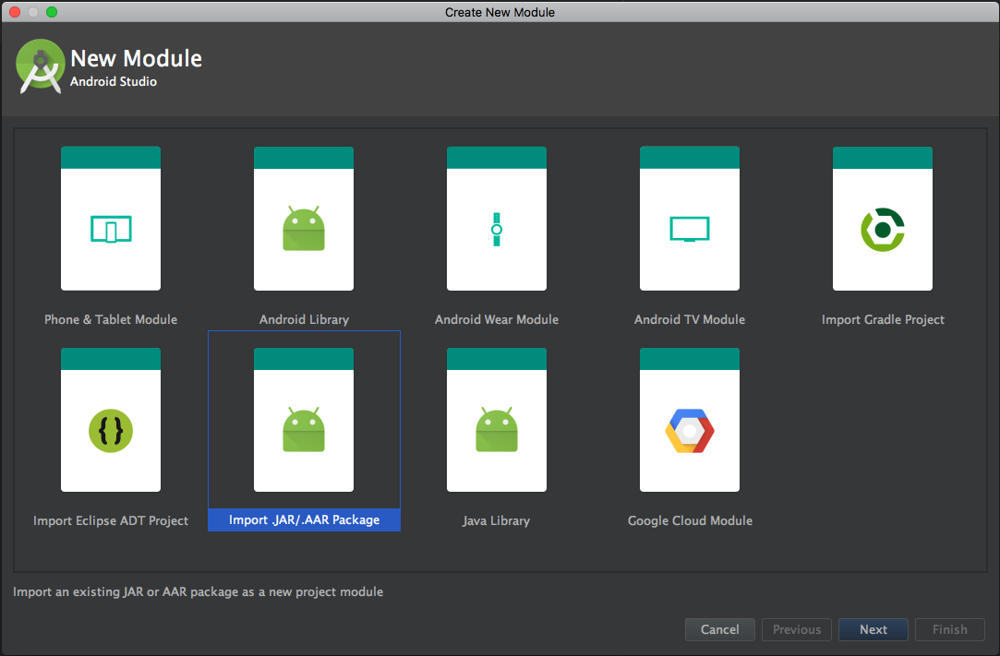
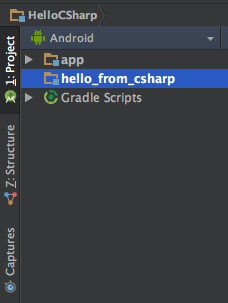
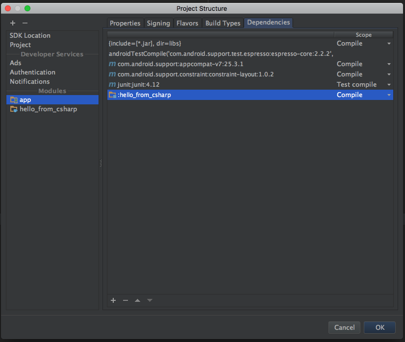
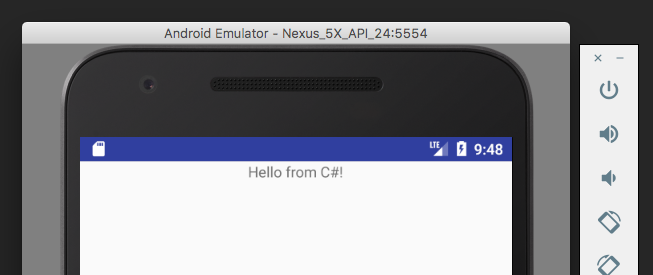

# Getting started with Android

In addition to the requirements from the [Getting started with Java](~/tools/dotnet-embedding/get-started/java/index.md) guide you'll also need:

* [Xamarin.Android 7.5](https://www.visualstudio.com/xamarin/) or later
* [Android Studio 3.x](https://developer.android.com/studio/index.html) with Java 1.8

As an overview, we will:

* Create a C# Android Library project
* Install .NET Embedding via NuGet
* Run .NET Embedding on the Android library assembly
* Use the generated AAR file in a Java project in Android Studio

## Create an Android Library Project

Open Visual Studio for Windows or Mac, create a new Android Class Library project, name it **hello-from-csharp**, and save it to **~/Projects/hello-from-csharp** or **%USERPROFILE%\Projects\hello-from-csharp**.

Add a new Android Activity named **HelloActivity.cs**, followed by an Android Layout at **Resource/layout/hello.axml**.

Add a new `TextView` to your layout, and change the text to something enjoyable.

Your layout source should look something like this:

```xml
<?xml version="1.0" encoding="utf-8"?>
<LinearLayout xmlns:android="http://schemas.android.com/apk/res/android"
    android:orientation="vertical"
    android:layout_width="match_parent"
    android:layout_height="match_parent"
    android:minWidth="25px"
    android:minHeight="25px">
    <TextView
        android:text="Hello from C#!"
        android:layout_width="match_parent"
        android:layout_height="wrap_content"
        android:gravity="center" />
</LinearLayout>
```

In your activity, make sure you are calling `SetContentView` with your new layout:

```csharp
[Activity(Label = "HelloActivity"),
    Register("hello_from_csharp.HelloActivity")]
public class HelloActivity : Activity
{
    protected override void OnCreate(Bundle savedInstanceState)
    {
        base.OnCreate(savedInstanceState);

        SetContentView(Resource.Layout.hello);
    }
}
```

> [!NOTE]
> Don't forget the `[Register]` attribute. For details, see 
> [Limitations](#current-limitations-on-android).

Build the project. The resulting assembly will be saved in `bin/Debug/hello-from-csharp.dll`.

## Installing .NET Embedding from NuGet

Follow these [instructions](~/tools/dotnet-embedding/get-started/install/install.md) to install and configure .NET Embedding for your project.

The command invocation you should configure will look like this:

### Visual Studio for Mac

```shell
mono '${SolutionDir}/packages/Embeddinator-4000.0.4.0.0/tools/Embeddinator-4000.exe' '${TargetPath}' --gen=Java --platform=Android --outdir='${SolutionDir}/output' -c
```

#### Visual Studio 2017

```shell
set E4K_OUTPUT="$(SolutionDir)output"
if exist %E4K_OUTPUT% rmdir /S /Q %E4K_OUTPUT%
"$(SolutionDir)packages\Embeddinator-4000.0.2.0.80\tools\Embeddinator-4000.exe" "$(TargetPath)" --gen=Java --platform=Android --outdir=%E4K_OUTPUT% -c
```

## Use the generated output in an Android Studio project

1. Open Android Studio and create a new project with an **Empty Activity**.
2. Right-click on your **app** module and choose **New > Module**.
3. Select **Import .JAR/.AAR Package**.
4. Use the directory browser to locate **~/Projects/hello-from-csharp/output/hello_from_csharp.aar** and click **Finish**.



This will copy the AAR file into a new module named **hello_from_csharp**.



To use the new module from your **app**, right-click and choose **Open Module Settings**. On the **Dependencies** tab, add a new **Module Dependency** and choose **:hello_from_csharp**.



In your activity, add a new `onResume` method, and use the following code to launch the C# activity:

```java
import hello_from_csharp.*;

public class MainActivity extends AppCompatActivity {
    //... Other stuff here ...
    @Override
    protected void onResume() {
        super.onResume();

        Intent intent = new Intent(this, HelloActivity.class);
        startActivity(intent);
    }
}
```

### Assembly compression (*IMPORTANT*)

One further change is required for .NET Embedding in your Android Studio project.

Open your app's **build.gradle** file and add the following change:

```groovy
android {
    // ...
    aaptOptions {
        noCompress 'dll'
    }
}
```

Xamarin.Android currently loads .NET assemblies directly from the APK, but it requires the assemblies to not be compressed.

If you do not have this setup, the app will crash on launch and print something like this to the console:

```shell
com.xamarin.hellocsharp A/monodroid: No assemblies found in '(null)' or '<unavailable>'. Assuming this is part of Fast Deployment. Exiting...
```

## Run the app

Upon launching your app:



Note what happened here:

* We have a C# class, `HelloActivity`, that subclasses Java
* We have Android Resource files
* We used these from Java in Android Studio

For this sample to work, all the following are set up in the final APK:

* Xamarin.Android is configured on application start
* .NET assemblies included in **assets/assemblies**
* **AndroidManifest.xml** modifications for your C# activities, etc.
* Android resources and assets from .NET libraries
* [Android Callable Wrappers](~/android/platform/java-integration/android-callable-wrappers.md) for any `Java.Lang.Object` subclass

If you are looking for an additional walkthrough, check out the following
video, which demonstrates embedding Charles Petzold's 
[FingerPaint demo](https://developer.xamarin.com/samples/monodroid/ApplicationFundamentals/FingerPaint/) in an Android Studio project:

[](https://www.youtube.com/watch?v=ZVcrXUpCNpI)

## Using Java 1.8

As of writing this, the best option is to use Android Studio 3.0 ([download here](https://developer.android.com/studio/index.html)).

To enable Java 1.8 in your app module's **build.gradle** file:

```groovy
android {
    // ...
    compileOptions {
        sourceCompatibility JavaVersion.VERSION_1_8
        targetCompatibility JavaVersion.VERSION_1_8
    }
}
```

You can also take a look at an [Android Studio test 
project](https://github.com/mono/Embeddinator-4000/blob/master/tests/android/app/build.gradle) for more details. 

If you are wanting to use Android Studio 2.3.x stable, you will have to enable the deprecated Jack toolchain:

```groovy
android {
    // ..
    defaultConfig {
        // ...
        jackOptions.enabled true
    }
}
```

## Current limitations on Android

Right now, if you subclass `Java.Lang.Object`, Xamarin.Android will generate the Java stub (Android Callable Wrapper) instead of .NET Embedding. Because of this, you must follow the same rules for exporting C# to Java as Xamarin.Android. For example:

```csharp
[Register("mono.embeddinator.android.ViewSubclass")]
public class ViewSubclass : TextView
{
    public ViewSubclass(Context context) : base(context) { }

    [Export("apply")]
    public void Apply(string text)
    {
        Text = text;
    }
}
```

* `[Register]` is required to map to a desired Java package name
* `[Export]` is required to make a method visible to Java

We can use `ViewSubclass` in Java like so:

```java
import mono.embeddinator.android.ViewSubclass;
//...
ViewSubclass v = new ViewSubclass(this);
v.apply("Hello");
```

Read more about [Java integration with Xamarin.Android](~/android/platform/java-integration/index.md).

## Multiple assemblies

Embedding a single assembly is straightforward; however, it is much more likely you will have more than one C# assembly. Many times you will have dependencies on NuGet packages such as the Android support libraries or Google Play Services that further complicate things.

This causes a dilemma, since .NET Embedding needs to include many types of files into the final AAR such as:

* Android assets
* Android resources
* Android native libraries
* Android java source

You most likely do not want to include these files from the Android support library or Google Play Services into your AAR, but would rather use the official version from Google in Android Studio.

Here is the recommended approach:

* Pass .NET Embedding any assembly that you own (have source for) and want to call from Java
* Pass .NET Embedding any assembly that you need Android assets, native libraries, or resources from
* Add Java dependencies like the Android support library or Google Play Services in Android Studio

So your command might be:

```shell
mono Embeddinator-4000.exe --gen=Java --platform=Android -c -o output YourMainAssembly.dll YourDependencyA.dll YourDependencyB.dll
```

You should exclude anything from NuGet, unless you find out it contains Android assets, resources, etc. that you will need in your Android Studio project. You can also omit dependencies that you do not need to call from Java, and the linker _should_ include the parts of your library that are needed.

To add any Java dependencies needed in Android Studio, your **build.gradle** file might look like:

```groovy
dependencies {
    // ...
    compile 'com.android.support:appcompat-v7:25.3.1'
    compile 'com.google.android.gms:play-services-games:11.0.4'
    // ...
}
```

## Further reading

* [Callbacks on Android](~/tools/dotnet-embedding/android/callbacks.md)
* [Preliminary Android Research](~/tools/dotnet-embedding/android/index.md)
* [.NET Embedding Limitations](~/tools/dotnet-embedding/limitations.md)
* [Contributing to the open source project](https://github.com/mono/Embeddinator-4000/blob/master/Contributing.md)
* [Error codes and descriptions](~/tools/dotnet-embedding/errors.md)

## Related links

- [Weather Sample (Android)](https://github.com/jamesmontemagno/embeddinator-weather)
