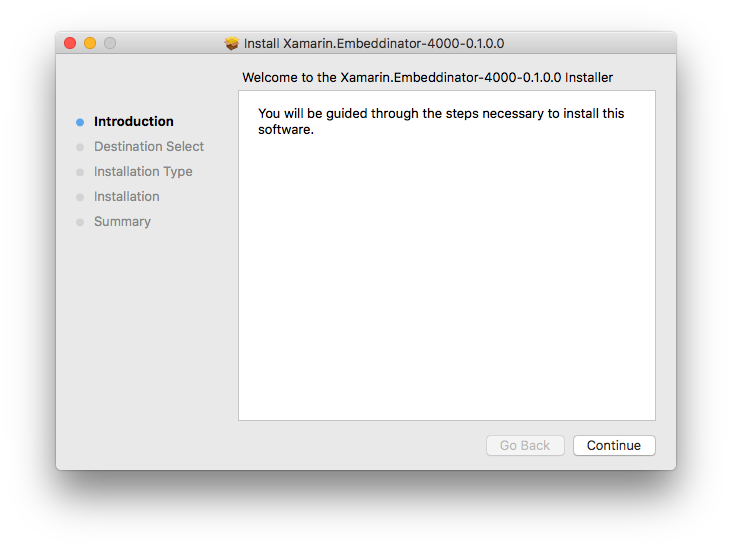
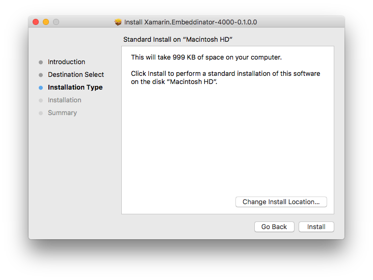
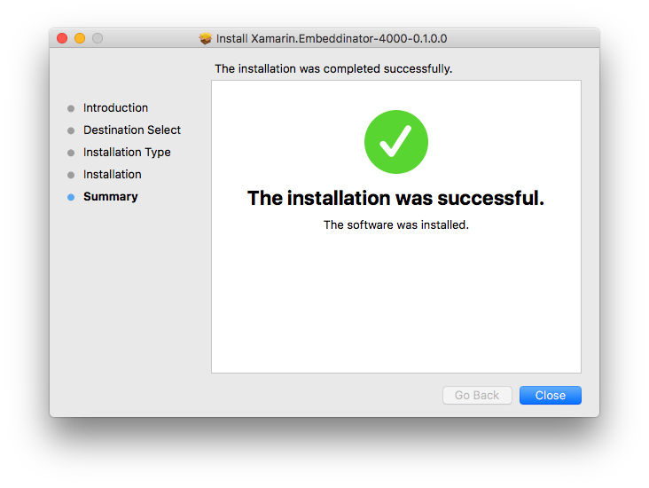

# Getting started with Objective-C

This is the getting started page for Objective-C, which covers the basics for all supported platforms.

## Requirements

To use .NET Embedding with Objective-C you'll need a Mac running:

* macOS 10.12 (Sierra) or later
* Xcode 8.3.2 or later
* [Mono 5.0](http://www.mono-project.com/download/)

You can install [Visual Studio for Mac](https://www.visualstudio.com/vs/visual-studio-mac/) to edit and compile your C# code.

Notes:

* Earlier versions of macOS, Xcode, and Mono _might_ work, but are untested and unsupported;
* Code generation can be done on Windows, but it is only possible to compile it on a Mac computer where Xcode is installed;

## Installation

Your next step is to download and install .NET Embedding on your Mac.

* [Package](https://dl.xamarin.com/embeddinator/Xamarin.Embeddinator-4000-0.2.0.79.pkg)
* [Release Notes](https://github.com/mono/Embeddinator-4000/tree/master/docs/releases)

As an alternative it is possible to build it from our [git repository](https://github.com/mono/Embeddinator-4000/tree/objc), see the [contributing](https://github.com/mono/Embeddinator-4000/blob/master/docs/Contributing.md) document for instructions.

The installer is a standard pkg based installer:

Once installed via the installer, after you start a new terminal session, you can use the `objcgen` command.
Otherwise you can always run the tool via its absolute path: `/Library/Frameworks/Xamarin.Embeddinator-4000.framework/Commands/objcgen`.

## Platforms

Objective-C is a language that is most commonly used to write applications for macOS, iOS, tvOS and watchOS; and the embeddinator supports all of those platforms. Working with each platform implies some key differences and these are explained [here](~/tools/dotnet-embedding/objective-c/platforms.md).

### macOS

[Creating a macOS application](~/tools/dotnet-embedding/get-started/objective-c/macos.md) is easiest since it does not involve as many additional steps, like setting up identity, provisining profiles, simulators and devices. You are encouraged to start with the macOS document before the one for iOS.

### iOS / tvOS

Please make sure you are already set up to develop iOS applications before trying to create one using the embeddinator. The [following instructions](~/tools/dotnet-embedding/get-started/objective-c/ios.md) assume that you have already successfully built and deployed an iOS application from your computer.

Support for tvOS is analogous to how iOS works, by just using tvOS projects in the IDEs (both Visual Studio and Xcode) instead of iOS projects.

> [!NOTE]
> Note: Support for watchOS will be available in a future release and will be very similar to iOS/tvOS.

## Further Reading

* [.NET Embedding features specific to Objective-C](~/tools/dotnet-embedding/objective-c/index.md)
* [Best Practices for Objective-C](~/tools/dotnet-embedding/objective-c/best-practices.md)
* [.NET Embedding Limitations](~/tools/dotnet-embedding/limitations.md)
* [Contributing to the open source project](https://github.com/mono/Embeddinator-4000/blob/master/docs/Contributing.md)
* [Error codes and descriptions](~/tools/dotnet-embedding/errors.md)
* [Target platforms](~/tools/dotnet-embedding/objective-c/platforms.md)

## Related Links

- [Weather Sample (iOS & macOS)](https://github.com/jamesmontemagno/embeddinator-weather)
