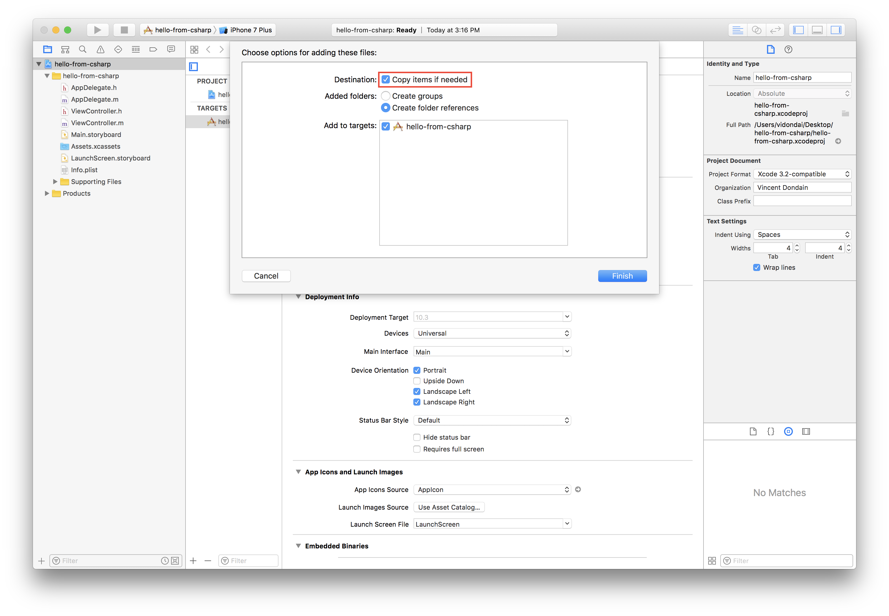
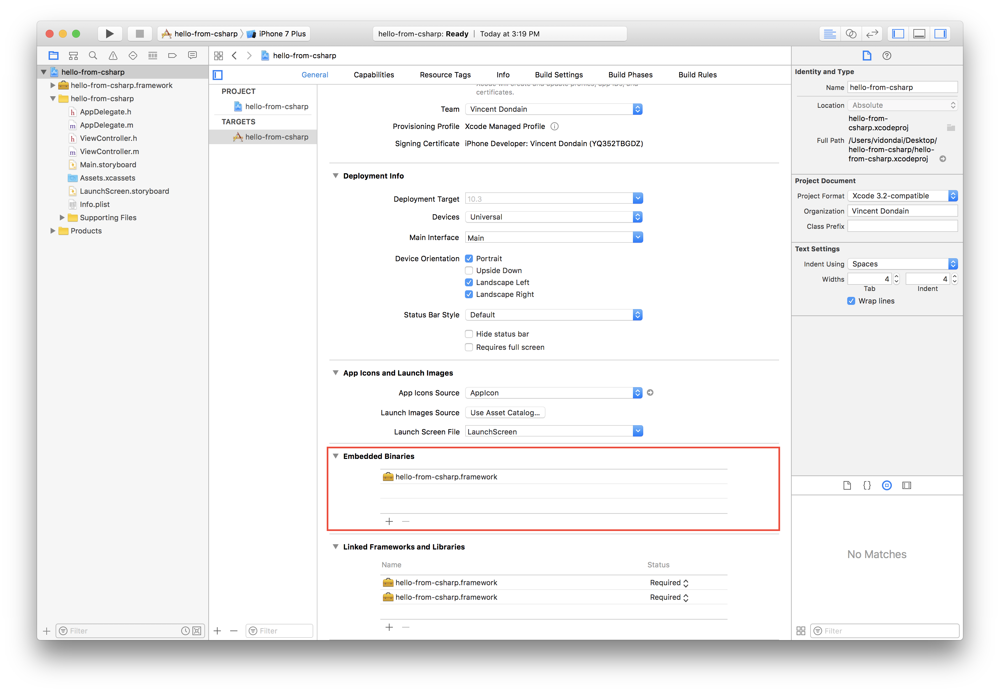
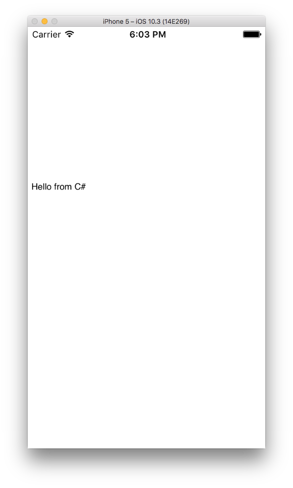

# Getting started with iOS

## Requirements

In addition to the requirements from our [Getting started with Objective-C](~/tools/dotnet-embedding/get-started/objective-c/index.md) guide, you'll also need:

* [Xamarin.iOS 10.11](https://visualstudio.microsoft.com/xamarin/) or later

## Hello world

First, build a simple hello world example in C#.

### Create C# sample

Open Visual Studio for Mac, create a new iOS Class Library project, name it **hello-from-csharp**, and save it to **~/Projects/hello-from-csharp**.

Replace the code in the **MyClass.cs** file with the following snippet:

```csharp
using UIKit;
public class MyUIView : UITextView
{
	public MyUIView ()
	{
		Text = "Hello from C#";
	}
}
```

Build the project, and the resulting assembly will be saved as **~/Projects/hello-from-csharp/hello-from-csharp/bin/Debug/hello-from-csharp.dll**.

### Bind the managed assembly

Once you have a managed assembly, bind it by invoking .NET Embedding.

As described in the
[installation](~/tools/dotnet-embedding/get-started/install/install.md)
guide, this can be done as post-build step in your project, with a
custom MSBuild target, or manually:

```shell
cd ~/Projects/hello-from-csharp
objcgen ~/Projects/hello-from-csharp/hello-from-csharp/bin/Debug/hello-from-csharp.dll --target=framework --platform=iOS --outdir=output -c --debug
```

The framework will be placed in **~/Projects/hello-from-csharp/output/hello-from-csharp.framework**.

### Use the generated output in an Xcode project

Open Xcode, create a new iOS Single View Application, name it **hello-from-csharp**, and select the **Objective-C** language.

Open the **~/Projects/hello-from-csharp/output** directory in Finder, select **hello-from-csharp.framework**, drag it to the Xcode project and drop it just above the **hello-from-csharp** folder in the project.

![Drag and drop framework]Images/hello-from-csharp-ios-drag-drop-framework.png)

Make sure **Copy items if needed** is checked in the dialog that pops up, and click **Finish**.



Select the **hello-from-csharp** project and navigate to the **hello-from-csharp** target's **General tab**. In the **Embedded Binary** section, add **hello-from-csharp.framework**.



Open **ViewController.m**, and replace the contents with:

```objective-c
#import "ViewController.h"
#include "hello-from-csharp/hello-from-csharp.h"

@interface ViewController ()
@end

@implementation ViewController
- (void)viewDidLoad {
    [super viewDidLoad];

    MyUIView *view = [[MyUIView alloc] init];
    view.frame = CGRectMake(0, 200, 200, 200);
    [self.view addSubview: view];
}
@end
```

.NET Embedding does not currently support bitcode on iOS, which is enabled for some Xcode project templates. 

Disable it in your project settings:


Finally, run the Xcode project, and something like this will show up:


