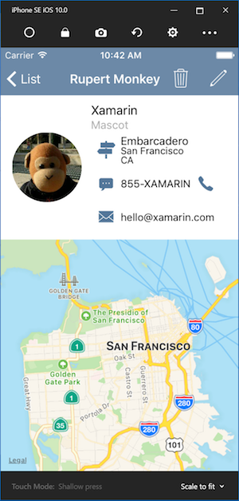
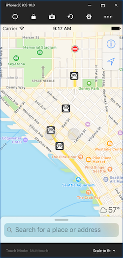
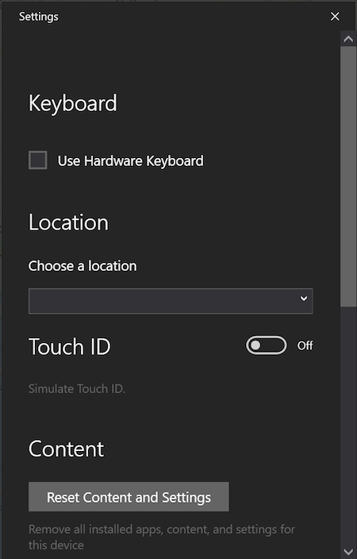
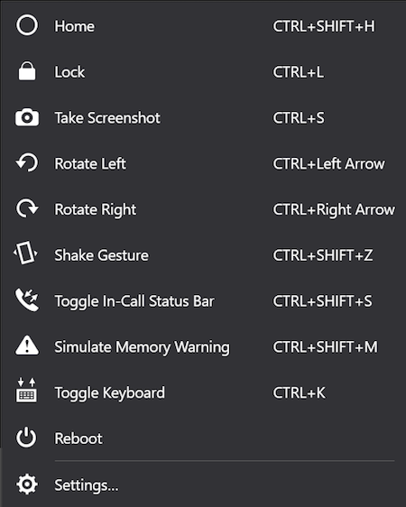

# Remoted iOS Simulator (for Windows)

_Test and debug iOS apps entirely within Visual Studio on Windows_

## Download and Install

Download the [installer](https://dl.xamarin.com/xamarin-simulator/Xamarin.Simulator.Installer.msi)
and install on your Windows computer. Visual Studio Tools for Xamarin should already be installed.

> [!NOTE]
> Using a remote iOS Simulator requires Visual Studio a networked Mac with Xamarin installed.

## Getting Started

To use the remote iOS simulator:

1. Make sure Visual Studio has connected to your Mac at least once before starting the remote iOS Simulator.
2. Ensure an iOS or tvOS app is the **Startup Project** and start debugging.

You can disable the remote iOS simulator from **Tools > Options > Xamarin > iOS Settings**
by unchecking the box for **Remote Simulator to Windows** shown here:

The iOS simulator will then open on the connected Mac computer. Check this option to
turn the remote iOS simulator back on.

## Features

The remote iOS Simulator provides you with a way to test and debug
iOS apps on the simulator entirely from Visual Studio on Windows.

### Simulator Window

The window toolbar includes a number of buttons to interact with the simulator:

- **Home** – simulates the home button on the device.
- **Lock** – locks the simulator (you can swipe to unlock).
- **Screenshot** – saves a screenshot of the simulator to disk.
- [**Settings**](#settings) – configure the keyboard and location.
 - Other [**options**](#options) – a variety of simulator options are available such as rotate, shake, or invoke other states in the simulator. When some options are obscured, they can be accessed from the ellipsis icon that appears in the toolbar, or by right-clicking on the window.

	

### Settings

The "gear" icon opens the **Settings** window:

This allows you to enable the hardware keyboard on the simulator, and
choose what location is reported to the device (including a static location, or
other moving location options).

### Other Options

Right-click anywhere in the simulator window to view all the options available in the simulator, such as
rotation, triggering a shake gesture, and rebooting the simulator:

### Touchscreen Support

Most modern Windows computers have touch screens, and the remote iOS simulator
lets you touch the simulator window to test user interactions in your iOS app.

This includes pinching, swiping, and multiple-finger touch gestures - things that
previously could only be easily tested on physical devices.

Stylus support in Windows is also translated to Apple Pencil input on the simulator.

<!--
<a name="knownissues" />

# Known Issues

 - Apple Watch devices may show in the Visual Studio device list, but are not yet supported.
 - Launching in **Release** mode may also start Apple’s simulator on the networked Mac.
 - Closing the remote iOS Simulator on Windows will not immediately stop debugging in Visual Studio. Stop debugging manually from the menu or the red button.
 - Opening too many different simulators simultaneously will produce unexpected results.
 - Exception of type `Foundation.NSErrorException` may be thrown while launching Simulators. Workaround is to kill csproxy (server process) on the Mac host and re-deploy to the simulator.
 - Performance may be slower when using Xcode 8
-->
