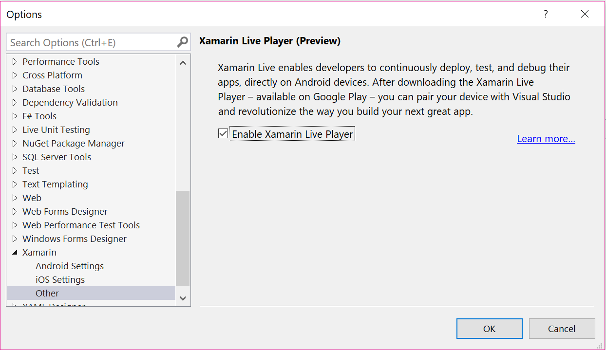
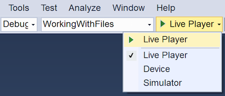
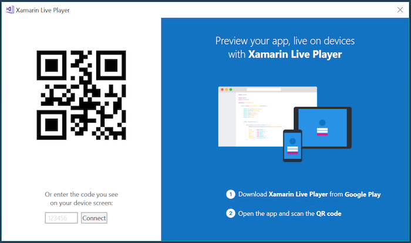
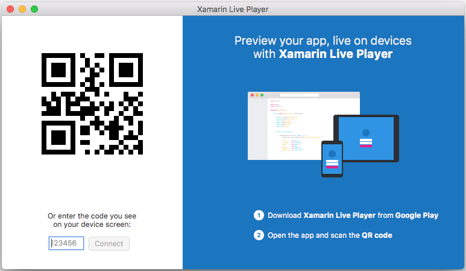
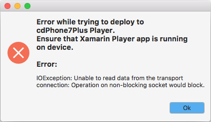

# Xamarin Live Player Setup

Xamarin Live Player lets you make live edits to your app and have those changes reflected live on the device. Your code runs inside the Xamarin Live Player app – no need to set up emulators or to use cables to deploy! This article describes how to set up Xamarin Live Player.

## 1. Get the App

# [Android](#tab/android)

Xamarin Live Player is available for Android from Google Play:

For Android devices without Google Play the Xamarin Live Player is available through [HockeyApp](https://aka.ms/xlp-hockeyapp) distribution. Additionally, early preview builds for Android can be installed directly from Google Play by opting in to the [open beta program](https://play.google.com/apps/testing/com.xamarin.live)

# [iOS](#tab/ios)

We encourage users to join the [Xamarin Live Player app _iOS Preview_](https://aka.ms/liveplayeralpha) to enjoy quick access to the latest improvements through TestFlight.

-----

# [Visual Studio](#tab/windows)

## 2. Get Visual Studio 2017

Xamarin Live Player requires:

- Visual Studio 2017 15.4 or newer.
- A Visual Studio computer and a device on the same WiFi network.

## 3. Using Xamarin Live Player for the first time

1. Open **Visual Studio 2017**.
2. Go to **Tools > Options...** and select the **Xamarin > Other** tab.
3. Tick **Enable Xamarin Live Player**:

  

2. Create or open a Xamarin project (or a [sample](~/tools/live-player/samples.md)).
3. Choose **Live Player** in the device list:

  

  * If you have already paired a device, it will be available as an option.
  * Otherwise you'll be prompted to pair a device when required.
4. Press the **Run** button, or select one of the following options from the **Run** or right-click menu:

  - **Start Without Debugging** – you can edit the app and see the changes occur on the device (app is restarted as changes are made and the file saved).
  - **Start Debugging** – you can set breakpoints and inspect variables, but code cannot be edited.

  Alternatively, select **Tools > Xamarin Live Player > Live Run Current View**, which lets you edit the app and see the changes occur on the device. The current view is shown (instead of the application's main screen).

5. If a device is already paired and the Xamarin Live Player app is running on the device,
    the code will execute straight away!

  If no device is is paired, a QR code will appear with instructions on how to pair a device:

  

  If the device cannot be contacted for pairing, an error may appear.

# [Visual Studio for Mac](#tab/macos)

## 2. Get Visual Studio for Mac

Xamarin Live Player requires:

- OS X 10.11, macOS 10.12, or greater
- Visual Studio for Mac
- A Mac and a device on the same WiFi network

## 3. Using Xamarin Live Player for the First Time

1. Open **Visual Studio for Mac**.
2. Go to **Visual Studio > Preferences...** and select the **Projects > Xamarin Live Player (Preview)** tab.
3. Tick **Enable Xamarin Live Player**:

  

2. Create or open a Xamarin project (or a [sample](~/tools/live-player/samples.md)).
3. Choose **Live Player** in the device list.

  

  * If you have already paired a device, it will be available as an option.
  * Otherwise you'll be prompted to pair a device when required.
  * Choose **Xamarin Live Player Devices...** to manage the devices you wish to use with Xamarin Live Player.

4. Press the **Run** button, or select one of the following options from the **Run** or right-click menu:

  

  - **Start Without Debugging** – You can edit the app and see the changes occur on the device (app is restarted as changes are made and the file saved).
  - **Start Debugging** – You can set breakpoints and inspect variables, but code cannot be edited.
  - **Live Run Current View** – You can edit the app and see the changes occur on the device. The current view is shown (instead of the application's main screen).

5. If a device is already paired and the Xamarin Live Player app is running on the device, the code will execute straight away!

  If no device is paired, a QR code will appear with instructions on how to pair a device:

  

  If the device cannot be contacted for pairing, an error will appear:

  

-----

If you experience any issues or can not connect, see [limitations and troubleshooting](~/tools/live-player/troubleshooting.md).

## Related Links

- [Limitations](~/tools/live-player/limitations.md)
- [Troubleshooting](~/tools/live-player/troubleshooting.md)
- [Xamarin Live Player Samples](~/tools/live-player/samples.md)
