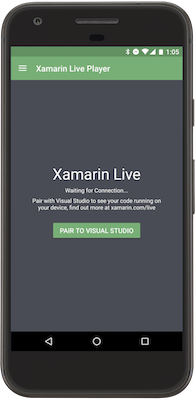
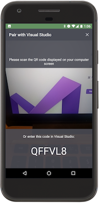
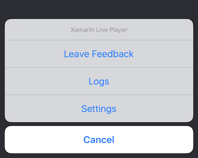
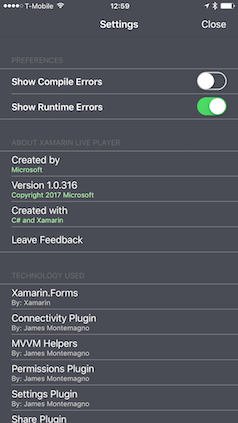
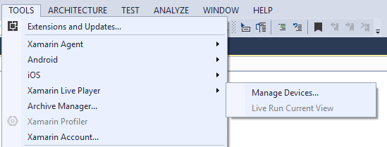
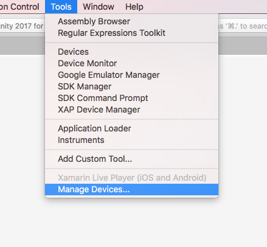
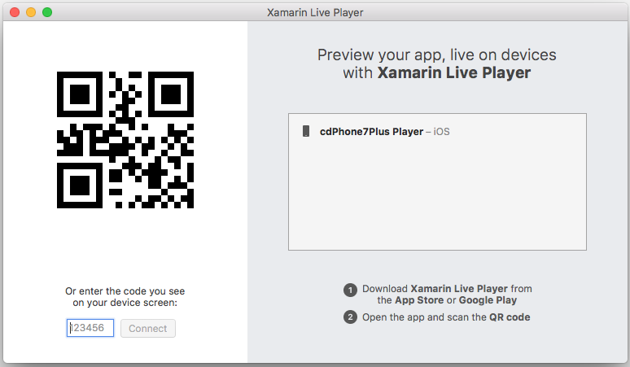
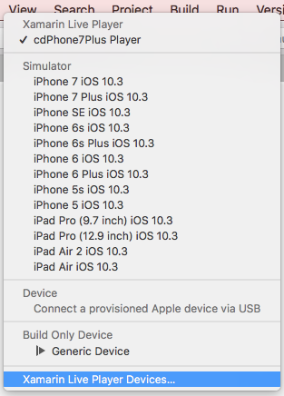

# Xamarin Live Player App

Once you have installed the app on your phone, follow the
[setup instructions](~/tools/live-player/install.md) to connect to your
computer. Try one of the [sample apps](~/tools/live-player/samples.md) to get it working.

On startup, the Xamarin Live Player app looks like this (on iOS and Android respectively):

 

When you press **Pair to Visual Studio**, use the camera to scan the
barcode showing on your computer:

 

If the connection is successful, the code should run on
the device almost immediately (such as the [Calculator sample](https://developer.xamarin.com/samples/mobile/LivePlayer/BasicCalculator)):

## Options

Press the information button **(i)** on the bottom of the app to reveal the **Options** menu:

### Logs

View logs to diagnose problems.

### Settings

- Toggle display of compile and runtime errors.
- Version information.
- Send feedback.

## Managing Devices

To connect a device for the first time, follow the instructions in [Requirements & Setup](~/tools/live-player/install.md). You can pair multiple devices (for example an iOS
and an Android), and manage them via the IDE.

# [Visual Studio](#tab/windows)

In Visual Studio, choose **Tools > Xamarin Live Player > Manage Devices...**

This window lets you do the following:

- Pair a new device by scanning the code
- Alternatively pair a device by typing the code displayed on its screen
- Remove existing devices from the list

You can also access this window from the device list.

# [Visual Studio for Mac](#tab/macos)

In Visual Studio for Mac, choose **Tools > (Xamarin Live Player) Manage Devices...**

This window lets you do the following:

- Pair a new device by scanning the code
- Alternatively pair a device by typing the code displayed on its screen
- Remove existing devices from the list

You can also access this window from the device list:

-----

If you experience any issues see [limitations and troubleshooting](~/tools/live-player/troubleshooting.md).

## Related Links

- [Limitations](~/tools/live-player/limitations.md)
- [Troubleshooting](~/tools/live-player/troubleshooting.md)
- [Xamarin Live Player Samples](samples.md)
