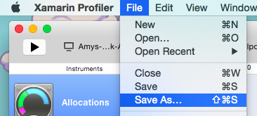
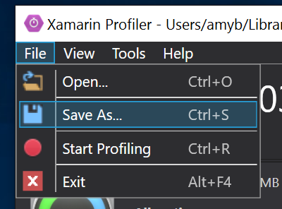
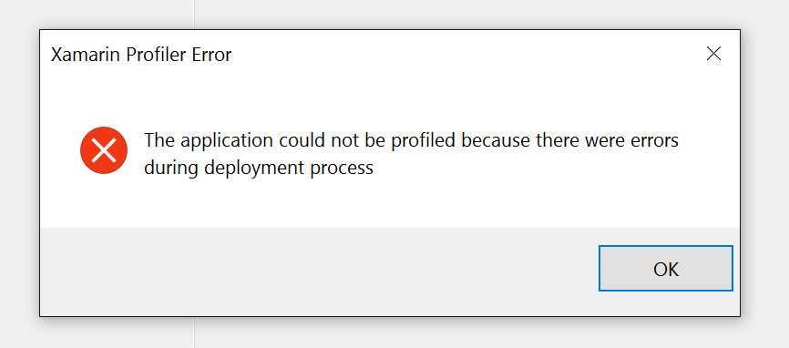

# Xamarin Profiler Troubleshooting

_Troubleshooting the Xamarin Profiler_

## Logging and Diagnostics

The Xamarin team can help track issues if you provide us with information, including:

- A Screencast of the problem, crash, or failure and your workflow leading up to it.
- Log outputs (see below).
- The **.mlpd** being generated for the profiling session (see below).

### Getting Log Outputs
On Mac logs are saved to `~/Library/Logs/Xamarin.Profiler/Profiler.<date>.log`.

On Windows these are saved to `%appdata%Local//Xamarin/Log/Xamarin.Profiler/Profiler.<date>.log` Please include the latest log whenever you submit an issue.

We’re adding more logging as we go, so this output should grow and become more useful over time.

<a name="gen_mlpd" />

### Generating .mlpd Files

An **.mlpd** file is the compressed output of the mono runtime profiler. The Xamarin Profiler GUI reads the data from an **.mlpd** and displays it for the user. **.mlpd** files are useful debugging tools for Xamarin because they help our engineers diagnose problems the Profiler might be having with your data.

The **.mlpd** for the current session is automatically saved in your Mac’s `/tmp` directory, and can be identified by the timestamp. If you turn on logging, the first output will be the path to the **.mlpd** file. The **.mlpd** file will normally be saved in the directory starting ~/var/folders…

The **.mlpd** for a current session can also be saved by choosing **File > Save As…** from the Profiler’s menu:

**Visual Studio for Mac**:



**Visual Studio**:




It is important to note that **.mlpd** contain a lot of information, and the file size will be large.

## Troubleshooting

The list below shows common gotchas, workarounds, and tips and tricks for using the Profiler.

> [!NOTE]
> **NOTE**: You need to be a Visual Studio **Enterprise** subscriber to unlock this feature in either Visual Studio Enterprise on Windows or Visual Studio for Mac.

#### I can't see the iOS profiler option, or it is greyed out [Visual Studio and Visual Studio for Mac]

Check the following settings to resolve this:

- Ensure that you are using the Debug configuration
- Ensure that you are using the SGen Garbage collector.
- Ensure the Platform is [supported](~/tools/profiler/index.md#Profiler_Support).
- Ensure that you have the right license.
- Ensure that you are logged in and properly authenticated.
- [Visual Studio] You must be using [Visual Studio Enterprise](https://www.visualstudio.com/vs/enterprise/) and have a valid Enterprise license.


#### I get an error when I try to launch the profiler

If you run into this error box when using the profiler in Visual Studio :



It is normally due to being unable to launch to the Simulator / Emulator. Try and run the app normally, fix the issues that it gives, and then try to use the Profiler again.

#### To watch a specific thread

If you have a thread that you wanted to specifically watch, it would be ideal to name the thread at the very beginning of its creation so that get get `ThreadName` instead of `0x0`. For example to set the thread name as UI, you could use the following code:


```csharp
RunOnUiThread (() => {
  Thread.CurrentThread.Name  = "UI";
});
```


## Related Links

- [Walkthrough - Using the Xamarin Profiler](~/tools/profiler/index.md)
- [Memory and Performance Best Practices](~/cross-platform/deploy-test/memory-perf-best-practices.md)
- [Release Notes](https://developer.xamarin.com/releases/profiler/preview/)
