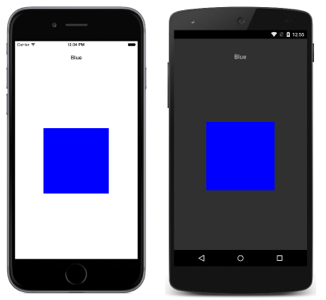
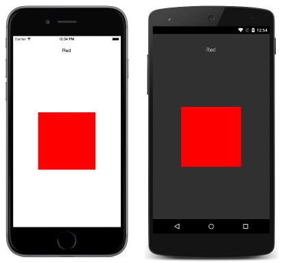
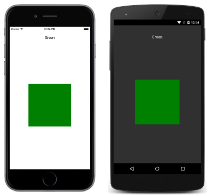

# Carousel Page

_The Xamarin.Forms CarouselPage is a page that users can swipe from side to side to navigate through pages of content, like a gallery. This article demonstrates how to use a CarouselPage to navigate through a collection of pages._

## Overview

The following screenshots show a [`CarouselPage`](https://developer.xamarin.com/api/type/Xamarin.Forms.CarouselPage/) on each platform:



The layout of a [`CarouselPage`](https://developer.xamarin.com/api/type/Xamarin.Forms.CarouselPage/) is identical on each platform. Pages can be navigated through by swiping right to left to navigate forwards through the collection, and by swiping left to right to navigate backwards through the collection. The following screenshots show the first page in a [`CarouselPage`](https://developer.xamarin.com/api/type/Xamarin.Forms.CarouselPage/) instance:



Swiping from right to left moves to the second page, as shown in the following screenshots:



Swiping from right to left again moves to the third page, while swiping from left to right returns to the previous page.

<!--
> [!NOTE]
> The [`CarouselPage`](https://developer.xamarin.com/api/type/Xamarin.Forms.CarouselPage/) has been deprecated, and will be removed from Xamarin.Forms in a future release. Instead, the [`CarouselView`](https://developer.xamarin.com/api/type/Xamarin.Forms.CarouselView/) should be used to provide a gallery-like view, where users can swipe from side to side to move through a collection of items.
-->

## Creating a CarouselPage

Two approaches can be used to create a [`CarouselPage`](https://developer.xamarin.com/api/type/Xamarin.Forms.CarouselPage/):

- [Populate](#Populating_a_CarouselPage_with_a_Page_Collection) the `CarouselPage` with a collection of child [`ContentPage`](https://developer.xamarin.com/api/type/Xamarin.Forms.ContentPage/) instances.
- [Assign](#Populating_a_CarouselPage_with_a_Template) a collection to the [`ItemsSource`](https://developer.xamarin.com/api/property/Xamarin.Forms.MultiPage%601.ItemsSource/) property and assign a [`DataTemplate`](https://developer.xamarin.com/api/type/Xamarin.Forms.DataTemplate/) to the [`ItemTemplate`](https://developer.xamarin.com/api/property/Xamarin.Forms.MultiPage%601.ItemTemplate/) property to return [`ContentPage`](https://developer.xamarin.com/api/type/Xamarin.Forms.ContentPage/) instances for objects in the collection.

With both approaches, the `CarouselPage` will then display each page in turn, with a swipe interaction moving to the next page to be displayed. 

> [!NOTE]
> A [`CarouselPage`](https://developer.xamarin.com/api/type/Xamarin.Forms.CarouselPage/) can only be populated with [`ContentPage`](https://developer.xamarin.com/api/type/Xamarin.Forms.ContentPage/) instances, or `ContentPage` derivatives.

<a name="Populating_a_CarouselPage_with_a_Page_Collection" />

### Populating a CarouselPage with a Page Collection

The following XAML code example shows a [`CarouselPage`](https://developer.xamarin.com/api/type/Xamarin.Forms.CarouselPage/) that displays three [`ContentPage`](https://developer.xamarin.com/api/type/Xamarin.Forms.ContentPage/) instances:

```xaml
<CarouselPage xmlns="http://xamarin.com/schemas/2014/forms"
              xmlns:x="http://schemas.microsoft.com/winfx/2009/xaml"
              x:Class="CarouselPageNavigation.MainPage">
    <ContentPage>
        <ContentPage.Padding>
          <OnPlatform x:TypeArguments="Thickness">
              <On Platform="iOS, Android" Value="0,40,0,0" />
          </OnPlatform>
        </ContentPage.Padding>
        <StackLayout>
            <Label Text="Red" FontSize="Medium" HorizontalOptions="Center" />
            <BoxView Color="Red" WidthRequest="200" HeightRequest="200" HorizontalOptions="Center" VerticalOptions="CenterAndExpand" />
        </StackLayout>
    </ContentPage>
    <ContentPage>
        ...
    </ContentPage>
    <ContentPage>
        ...
    </ContentPage>
</CarouselPage>
```

The following code example shows the equivalent UI in C#:

```csharp
public class MainPageCS : CarouselPage
{
    public MainPageCS ()
    {
        Thickness padding;
        switch (Device.RuntimePlatform)
        {
            case Device.iOS:
            case Device.Android:
                padding = new Thickness(0, 40, 0, 0);
                break;
            default:
                padding = new Thickness();
                break;
        }

        var redContentPage = new ContentPage {
            Padding = padding,
            Content = new StackLayout {
                Children = {
                    new Label {
                        Text = "Red",
                        FontSize = Device.GetNamedSize (NamedSize.Medium, typeof(Label)),
                        HorizontalOptions = LayoutOptions.Center
                    },
                    new BoxView {
                        Color = Color.Red,
                        WidthRequest = 200,
                        HeightRequest = 200,
                        HorizontalOptions = LayoutOptions.Center,
                        VerticalOptions = LayoutOptions.CenterAndExpand
                    }
                }
            }
        };
        var greenContentPage = new ContentPage {
            Padding = padding,
            Content = new StackLayout {
                ...
            }
        };
        var blueContentPage = new ContentPage {
            Padding = padding,
            Content = new StackLayout {
                ...
            }
        };

        Children.Add (redContentPage);
        Children.Add (greenContentPage);
        Children.Add (blueContentPage);
    }
}
```

Each [`ContentPage`](https://developer.xamarin.com/api/type/Xamarin.Forms.ContentPage/) simply displays a [`Label`](https://developer.xamarin.com/api/type/Xamarin.Forms.Label/) for a particular color and a [`BoxView`](https://developer.xamarin.com/api/type/Xamarin.Forms.BoxView/) of that color.

> [!NOTE]
> The [`CarouselPage`](https://developer.xamarin.com/api/type/Xamarin.Forms.CarouselPage/) does not support UI virtualization. Therefore, performance may be affected if the `CarouselPage` contains too many child elements.

If a [`CarouselPage`](https://developer.xamarin.com/api/type/Xamarin.Forms.CarouselPage/) is embedded into the [`Detail`](https://developer.xamarin.com/api/property/Xamarin.Forms.MasterDetailPage.Detail/) page of a [`MasterDetailPage`](https://developer.xamarin.com/api/type/Xamarin.Forms.MasterDetailPage/), the [`MasterDetailPage.IsGestureEnabled`](https://developer.xamarin.com/api/field/Xamarin.Forms.MasterDetailPage.IsGestureEnabledProperty/) property should be set to `false` to prevent gesture conflicts between the `CarouselPage` and the `MasterDetailPage`.

For more information about the [`CarouselPage`](https://developer.xamarin.com/api/type/Xamarin.Forms.CarouselPage/), see [Chapter 25](https://developer.xamarin.com/r/xamarin-forms/book/chapter25.pdf) of Charles Petzold's Xamarin.Forms book.

<a name="Populating_a_CarouselPage_with_a_Template" />

### Populating a CarouselPage with a Template

The following XAML code example shows a [`CarouselPage`](https://developer.xamarin.com/api/type/Xamarin.Forms.CarouselPage/) constructed by assigning a [`DataTemplate`](https://developer.xamarin.com/api/type/Xamarin.Forms.DataTemplate/) to the [`ItemTemplate`](https://developer.xamarin.com/api/property/Xamarin.Forms.MultiPage%601.ItemTemplate/) property to return pages for objects in the collection:

```xaml
<CarouselPage xmlns="http://xamarin.com/schemas/2014/forms"
              xmlns:x="http://schemas.microsoft.com/winfx/2009/xaml"
              x:Class="CarouselPageNavigation.MainPage">
    <CarouselPage.ItemTemplate>
        <DataTemplate>
            <ContentPage>
                <ContentPage.Padding>
                  <OnPlatform x:TypeArguments="Thickness">
                    <On Platform="iOS, Android" Value="0,40,0,0" />
                  </OnPlatform>
                </ContentPage.Padding>
                <StackLayout>
                    <Label Text="{Binding Name}" FontSize="Medium" HorizontalOptions="Center" />
                    <BoxView Color="{Binding Color}" WidthRequest="200" HeightRequest="200" HorizontalOptions="Center" VerticalOptions="CenterAndExpand" />
                </StackLayout>
            </ContentPage>
        </DataTemplate>
    </CarouselPage.ItemTemplate>
</CarouselPage>
```

The [`CarouselPage`](https://developer.xamarin.com/api/type/Xamarin.Forms.CarouselPage/) is populated with data by setting the [`ItemsSource`](https://developer.xamarin.com/api/property/Xamarin.Forms.MultiPage%601.ItemsSource/) property in the constructor for the code-behind file:

```csharp
public MainPage ()
{
    ...
    ItemsSource = ColorsDataModel.All;
}
```

The following code example shows the equivalent [`CarouselPage`](https://developer.xamarin.com/api/type/Xamarin.Forms.CarouselPage/) created in C#:

```csharp
public class MainPageCS : CarouselPage
{
    public MainPageCS ()
    {
        Thickness padding;
        switch (Device.RuntimePlatform)
        {
            case Device.iOS:
            case Device.Android:
                padding = new Thickness(0, 40, 0, 0);
                break;
            default:
                padding = new Thickness();
                break;
        }

        ItemTemplate = new DataTemplate (() => {
            var nameLabel = new Label {
                FontSize = Device.GetNamedSize (NamedSize.Medium, typeof(Label)),
                HorizontalOptions = LayoutOptions.Center
            };
            nameLabel.SetBinding (Label.TextProperty, "Name");

            var colorBoxView = new BoxView {
                WidthRequest = 200,
                HeightRequest = 200,
                HorizontalOptions = LayoutOptions.Center,
                VerticalOptions = LayoutOptions.CenterAndExpand
            };
            colorBoxView.SetBinding (BoxView.ColorProperty, "Color");

            return new ContentPage {
                Padding = padding,
                Content = new StackLayout {
                    Children = {
                        nameLabel,
                        colorBoxView
                    }
                }
            };
        });

        ItemsSource = ColorsDataModel.All;
    }
}
```

Each [`ContentPage`](https://developer.xamarin.com/api/type/Xamarin.Forms.ContentPage/) simply displays a [`Label`](https://developer.xamarin.com/api/type/Xamarin.Forms.Label/) for a particular color and a [`BoxView`](https://developer.xamarin.com/api/type/Xamarin.Forms.BoxView/) of that color.

> [!NOTE]
> The [`CarouselPage`](https://developer.xamarin.com/api/type/Xamarin.Forms.CarouselPage/) does not support UI virtualization. Therefore, performance may be affected if the `CarouselPage` contains too many child elements.

If a [`CarouselPage`](https://developer.xamarin.com/api/type/Xamarin.Forms.CarouselPage/) is embedded into the [`Detail`](https://developer.xamarin.com/api/property/Xamarin.Forms.MasterDetailPage.Detail/) page of a [`MasterDetailPage`](https://developer.xamarin.com/api/type/Xamarin.Forms.MasterDetailPage/), the [`MasterDetailPage.IsGestureEnabled`](https://developer.xamarin.com/api/field/Xamarin.Forms.MasterDetailPage.IsGestureEnabledProperty/) property should be set to `false` to prevent gesture conflicts between the `CarouselPage` and the `MasterDetailPage`.

For more information about the [`CarouselPage`](https://developer.xamarin.com/api/type/Xamarin.Forms.CarouselPage/), see [Chapter 25](https://developer.xamarin.com/r/xamarin-forms/book/chapter25.pdf) of Charles Petzold's Xamarin.Forms book.

## Summary

This article demonstrated how to use a [`CarouselPage`](https://developer.xamarin.com/api/type/Xamarin.Forms.CarouselPage/) to navigate through a collection of pages. The `CarouselPage` is a page that users can swipe from side to side to navigate through pages of content,much like a gallery.


## Related Links

- [Page Varieties](~/xamarin-forms/user-interface/controls/pages.md)
- [CarouselPage (sample)](https://developer.xamarin.com/samples/xamarin-forms/Navigation/CarouselPage/)
- [CarouselPageTemplate (sample)](https://developer.xamarin.com/samples/xamarin-forms/Navigation/CarouselPageTemplate/)
- [CarouselPage](https://developer.xamarin.com/api/type/Xamarin.Forms.CarouselPage/)
