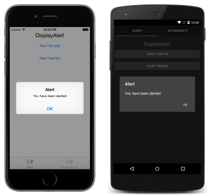
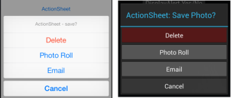

# Displaying Pop-ups

_Xamarin.Forms provides two pop-up-like user interface elements – an alert and an action sheet. This article demonstrates using the alert and action sheet APIs to ask users simple questions and to guide users through tasks._

Displaying an alert or asking a user to make a choice is a common UI task. Xamarin.Forms has two methods on the [`Page`](https://developer.xamarin.com/api/type/Xamarin.Forms.Page/) class for interacting with the user via a pop-up: [`DisplayAlert`](https://developer.xamarin.com/api/member/Xamarin.Forms.Page.DisplayAlert(System.String,System.String,System.String)/) and [`DisplayActionSheet`](https://developer.xamarin.com/api/member/Xamarin.Forms.Page.DisplayActionSheet(System.String,System.String,System.String,System.String[])/). They are rendered with appropriate native controls on each platform.

## Displaying an Alert

All Xamarin.Forms-supported platforms have a modal pop-up to alert the user or ask simple questions of them. To display these alerts in Xamarin.Forms, use the [`DisplayAlert`](https://developer.xamarin.com/api/member/Xamarin.Forms.Page.DisplayAlert(System.String,System.String,System.String)/) method on any [`Page`](https://developer.xamarin.com/api/type/Xamarin.Forms.Page/). The following line of code shows a simple message to the user:

```csharp
DisplayAlert ("Alert", "You have been alerted", "OK");
```



This example does not collect information from the user. The alert displays modally and once dismissed the user continues interacting with the application.

The [`DisplayAlert`](https://developer.xamarin.com/api/member/Xamarin.Forms.Page.DisplayAlert(System.String,System.String,System.String)/) method can also be used to capture a user's response by presenting two buttons and returning a `boolean`. To get a response from an alert, supply text for both buttons and `await` the method. After the user selects one of the options the answer will be returned to your code. Note the `async` and `await` keywords in the sample code below:

```csharp
async void OnAlertYesNoClicked (object sender, EventArgs e)
{
  var answer = await DisplayAlert ("Question?", "Would you like to play a game", "Yes", "No");
  Debug.WriteLine ("Answer: " + answer);
}
```

[](pop-ups-images/alert2.png#lightbox "Alert Dialog with Two Buttons")

## Guiding Users Through Tasks

The [UIActionSheet](https://developer.apple.com/library/ios/documentation/uikit/reference/uiactionsheet_class/Reference/Reference.html) is a common UI element in iOS. The Xamarin.Forms [`DisplayActionSheet`](https://developer.xamarin.com/api/member/Xamarin.Forms.Page.DisplayActionSheet(System.String,System.String,System.String,System.String[])/) method lets you include this control in cross-platforms apps, rendering native alternatives in Android and Windows Phone.

To display an action sheet, `await` [`DisplayActionSheet`](https://developer.xamarin.com/api/member/Xamarin.Forms.Page.DisplayActionSheet(System.String,System.String,System.String,System.String[])/) in any [`Page`](https://developer.xamarin.com/api/type/Xamarin.Forms.Page/), passing the message and button labels as strings. The method returns the string label of the button that was clicked by the user. A simple example is shown here:

```csharp
async void OnActionSheetSimpleClicked (object sender, EventArgs e)
{
  var action = await DisplayActionSheet ("ActionSheet: Send to?", "Cancel", null, "Email", "Twitter", "Facebook");
  Debug.WriteLine ("Action: " + action);
}
```


The `destroy` button is rendered differently than the others, and can be left `null` or specified as the third string parameter. The following example uses the `destroy` button:

```csharp
async void OnActionSheetCancelDeleteClicked (object sender, EventArgs e)
{
  var action = await DisplayActionSheet ("ActionSheet: SavePhoto?", "Cancel", "Delete", "Photo Roll", "Email");
  Debug.WriteLine ("Action: " + action);
}
```

[](pop-ups-images/action2.png#lightbox "Action Sheet Dialog with Destroy Button")

## Summary

This article demonstrated using the alert and action sheet APIs to ask users simple questions and to guide users through tasks. Xamarin.Forms has two methods on the [`Page`](https://developer.xamarin.com/api/type/Xamarin.Forms.Page/) class for interacting with the user via a pop-up: [`DisplayAlert`](https://developer.xamarin.com/api/member/Xamarin.Forms.Page.DisplayAlert(System.String,System.String,System.String)/) and [`DisplayActionSheet`](https://developer.xamarin.com/api/member/Xamarin.Forms.Page.DisplayActionSheet(System.String,System.String,System.String,System.String[])/), and they are both rendered with appropriate native controls on each platform.


## Related Links

- [PopupsSample](https://developer.xamarin.com/samples/xamarin-forms/Navigation/Pop-ups/)
