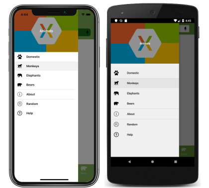
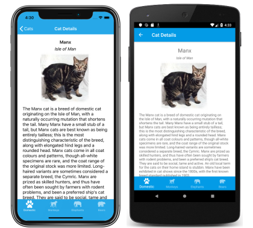

# Xamarin.Forms Shell


[ Download the sample](https://github.com/xamarin/xamarin-forms-samples/tree/forms40/UserInterface/Xaminals/)

Xamarin.Forms Shell reduces the complexity of mobile application development by providing the fundamental features that most mobile applications require, including:

- A single place to describe the visual hierarchy of an application.
- A common navigation user experience.
- A URI-based navigation scheme that permits navigation to any page in the application.
- An integrated search handler.

In addition, Shell applications benefit from an increased rendering speed, and reduced memory consumption.

> [!IMPORTANT]
> Existing iOS and Android applications can adopt Shell and benefit immediately from navigation, performance, and extensibility improvements.

Shell is currently experimental, and can only be used by adding `Forms.SetFlags("Shell_Experimental");` to your platform project, prior to invoking the `Forms.Init` method.

# [Android](#tab/android)

```csharp
public class MainActivity : global::Xamarin.Forms.Platform.Android.FormsAppCompatActivity
{
    protected override void OnCreate(Bundle savedInstanceState)
    {
        global::Xamarin.Forms.Forms.SetFlags("Shell_Experimental");

        TabLayoutResource = Resource.Layout.Tabbar;
        ToolbarResource = Resource.Layout.Toolbar;

        base.OnCreate(savedInstanceState);

        global::Xamarin.Forms.Forms.Init(this, savedInstanceState);
        LoadApplication(new App());
    }
}
```

# [iOS](#tab/ios)

```csharp
public partial class AppDelegate : global::Xamarin.Forms.Platform.iOS.FormsApplicationDelegate
{
    public override bool FinishedLaunching(UIApplication app, NSDictionary options)
    {
        global::Xamarin.Forms.Forms.SetFlags("Shell_Experimental");

        global::Xamarin.Forms.Forms.Init();
        LoadApplication(new App());

        return base.FinishedLaunching(app, options);
    }
}
```

----

## Shell navigation experience

Shell provides an opinionated navigation experience, based on flyouts and tabs. The top level of navigation in a Shell application is a flyout:

[](introduction-images/flyout-large.png#lightbox "Shell flyout")

Selecting a flyout item results in the bottom tab that represents the item being selected and displayed:

[](introduction-images/monkeys-large.png#lightbox "Shell bottom tabs")

> [!NOTE]
> When the flyout isn't open the bottom tab bar is considered to be the top level of navigation in the application.

Each tab displays a [`ContentPage`](xref:Xamarin.Forms.ContentPage). However, if a bottom tab contains more than one page, the pages are navigable by the top tab bar:

[](introduction-images/cats-large.png#lightbox "Shell top tabs")

Within each tab, additional [`ContentPage`](xref:Xamarin.Forms.ContentPage) objects can be navigated to:

[](introduction-images/cat-details-large.png#lightbox "Shell app navigation")

## Subclassing the Shell class

A subclassed `Shell` object describes the visual hierarchy of a Shell application, and consists of three main hierarchical objects:

- `FlyoutItem`, which represents one or more items in the flyout. Every `FlyoutItem` object is a child of the `Shell` object.
- `Tab`, which represents grouped content, navigable by bottom tabs. Every `Tab` object is a child of a `FlyoutItem` object.
- `ShellContent`, which represents the `ContentPage` objects in your application. Every `ShellContent` object is a child of a `Tab` object. When more than one `ShellContent` object is present in a `Tab`, the objects will be navigable by top tabs.

None of these objects represent any user interface, but rather the organization of the application's visual hierarchy. Shell will take these objects and produce the navigation user interface for the content.

> [!NOTE]
> The `FlyoutItem` class is an alias for the `ShellItem` class, and the `Tab` class is an alias for the `ShellSection` class. These aliases are designed to make the API friendlier to consume.

The following XAML shows an example of a subclassed `Shell` object:

```xaml
<Shell xmlns="http://xamarin.com/schemas/2014/forms"
       xmlns:x="http://schemas.microsoft.com/winfx/2009/xaml"
       xmlns:views="clr-namespace:Xaminals.Views"
       x:Class="Xaminals.AppShell">
    ...
    <FlyoutItem Title="Animals"
                FlyoutDisplayOptions="AsMultipleItems">
        <Tab Title="Domestic"
             Icon="paw.png">
            <ShellContent Title="Cats"
                          Icon="cat.png">
                <views:CatsPage />
            </ShellContent>
            <ShellContent Title="Dogs"
                          Icon="dog.png">
                <views:DogsPage />
            </ShellContent>
        </Tab>
        <ShellContent Title="Monkeys"
                      Icon="monkey.png">
            <views:MonkeysPage />
        </ShellContent>
        <ShellContent Title="Elephants"
                      Icon="elephant.png">  
            <views:ElephantsPage />
        </ShellContent>
        <ShellContent Title="Bears"
                      Icon="bear.png">
            <views:BearsPage />
        </ShellContent>
    </FlyoutItem>
    ...
</Shell>
```

When run, this XAML displays the `CatsPage`, because it's the first item of content declared in the subclassed `Shell` object:

[](introduction-images/cats-large.png#lightbox "Shell app")

Pressing the hamburger icon, or swiping from the left, displays the flyout:

[](introduction-images/flyout-reduced-large.png#lightbox "Shell flyout")

> [!IMPORTANT]
> In a Shell application, each [`ContentPage`](xref:Xamarin.Forms.ContentPage) that's a child of a `ShellContent` object is created during application startup. Adding additional `ShellContent` objects using this approach will result in additional pages being created during application startup, which can lead to a poor startup experience. However, Shell is also capable of creating pages on demand, in response to navigation. For more information, see [Efficient page loading](tabs.md#efficient-page-loading) in the [Xamarin.Forms Shell Tabs](tabs.md) guide.

## Bootstrapping a Shell application

A Shell application is bootstrapped by setting the [`MainPage`](xref:Xamarin.Forms.Application.MainPage) property of the `App` class to a subclassed `Shell` object:

```csharp
namespace Xaminals
{
    public partial class App : Application
    {
        public App()
        {
            InitializeComponent();
            MainPage = new AppShell();
        }
        ...
    }
}
```

In this example, the `AppShell` class is a XAML file that derives from the `Shell` class, which describes the visual hierarchy of the application.

## Shell appearance

The `Shell` class defines the following properties that control the appearance of a Shell application:

- `ShellBackgroundColor`, of type `Color` an attached property that defines the background color in the Shell chrome. The color will not fill in behind the Shell content.
- `ShellDisabledColor`, of type `Color`, an attached property that defines the color to shade text and icons that are disabled.
- `ShellForegroundColor`, of type `Color`, an attached property that defines the color to shade text and icons.
- `ShellTitleColor`, of type `Color`, an attached property that defines the color used for the title of the current page.
- `ShellUnselectedColor`, of type `Color`, an attached property that defines the color used for unselected text and icons in the Shell chrome.

All of these properties are backed by [`BindableProperty`](xref:Xamarin.Forms.BindableProperty) objects, which means that the properties can be targets of data bindings.

In addition, these properties can be set using Cascading Style Sheets (CSS). For more information, see [Xamarin.Forms Shell specific properties](~/xamarin-forms/user-interface/styles/css/index.md#xamarinforms-shell-specific-properties).

## Shell content layout

The `Shell` class defines the following properties that affect the layout of Shell application content:

- `NavBarIsVisible`, of type `boolean`, an attached property that defines if the navigation bar should be visible when a page is presented. This property should be set on a page, and its default value is `true`.
- `SetPaddingInsets`, of type `bool`, an attached property that controls whether page content will flow under any Shell chrome. This property should be set on a page, and its default value is `false`.
- `TabBarIsVisible`, of type `bool`, an attached property that defines if the tab bar should be visible when a page is presented. This property should be set on a page, and its default value is `true`.
- `TitleView`, of type `View`, an attached property that defines the `TitleView` for a page. This property should be set on a page.

All of these properties are backed by [`BindableProperty`](xref:Xamarin.Forms.BindableProperty) objects, which means that the properties can be targets of data bindings.

## Related links

- [Xaminals (sample)](https://github.com/xamarin/xamarin-forms-samples/tree/forms40/UserInterface/Xaminals/)
- [Xamarin.Forms Shell specific properties](~/xamarin-forms/user-interface/styles/css/index.md#xamarinforms-shell-specific-properties)
