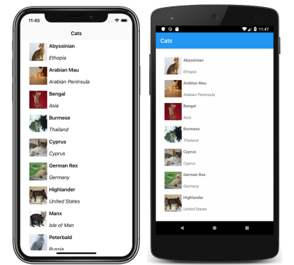
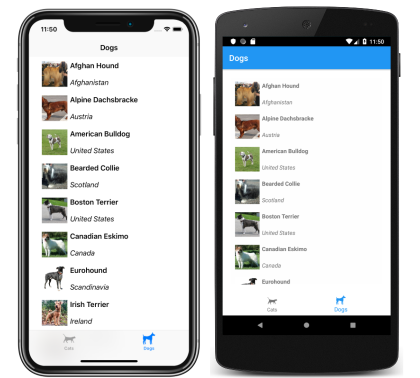
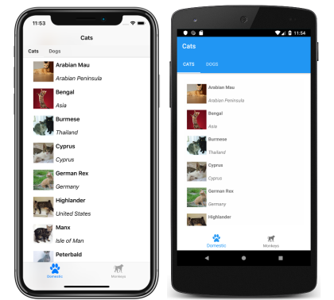

# Xamarin.Forms Shell Tabs


[ Download the sample](https://github.com/xamarin/xamarin-forms-samples/tree/forms40/UserInterface/Xaminals/)

After a flyout, the next level of navigation in a Shell application is the bottom tab bar. Alternatively, when the flyout is closed the bottom tab bar is considered to be the top level of navigation.

Each `FlyoutItem` object can contain one or more `Tab` objects, with each `Tab` object representing a tab on the bottom tab bar. Each `Tab` object can contain one or more `ShellContent` objects, and each `ShellContent` object will display a single [`ContentPage`](xref:Xamarin.Forms.ContentPage) object. When more than one `ShellContent` object is present in a `Tab` object, the `ContentPage` objects will be navigable by top tabs.

Within each `ContentPage` object, additional `ContentPage` objects can be navigated to. For more information about navigation, see [Xamarin.Forms Shell Navigation](navigation.md).

## Single page application

The simplest Shell application is a single page application, which can be created by adding a single `Tab` object to a `FlyoutItem` object. Within the `Tab` object, a `ShellContent` object should be set to a [`ContentPage`](xref:Xamarin.Forms.ContentPage) object:

```xaml
<Shell xmlns="http://xamarin.com/schemas/2014/forms"
       xmlns:x="http://schemas.microsoft.com/winfx/2009/xaml"
       xmlns:views="clr-namespace:Xaminals.Views"
       x:Class="Xaminals.AppShell"
       FlyoutBehavior="Disabled">
    <FlyoutItem>
        <Tab>
            <ShellContent>
                <views:CatsPage />
            </ShellContent>
        </Tab>
    </FlyoutItem>
</Shell>
```

This code example results in the following single page application:

[](tabs-images/single-page-app-large.png#lightbox "Shell single page app")

A flyout is unnecessary in a single page application, and therefore the `Shell.FlyoutBehavior` property is set to `Disabled`.

> [!NOTE]
> The navigation bar can be hidden, if required, by setting the `Shell.NavBarIsVisible` attached property to `false` on the [`ContentPage`](xref:Xamarin.Forms.ContentPage) object.

Shell has implicit conversion operators that enable the Shell visual hierarchy to be simplified, without introducing additional views into the visual tree. This is possible because a subclassed `Shell` object can only ever contain `FlyoutItem` objects, which can only ever contain `Tab` objects, which can only ever contain `ShellContent` objects. These implicit conversion operators can be used to remove the `FlyoutItem`, `Tab`, and `ShellContent` objects from the previous example:

```xaml
<Shell xmlns="http://xamarin.com/schemas/2014/forms"
       xmlns:x="http://schemas.microsoft.com/winfx/2009/xaml"
       xmlns:views="clr-namespace:Xaminals.Views"
       x:Class="Xaminals.AppShell"
       FlyoutBehavior="Disabled">
    <views:CatsPage />
</Shell>
```

This implicit conversion automatically wraps the [`ContentPage`](xref:Xamarin.Forms.ContentPage) object in a `ShellContent` object, which is wrapped in a `Tab` object, which is wrapped in a `FlyoutItem` object.

> [!IMPORTANT]
> In a Shell application, each [`ContentPage`](xref:Xamarin.Forms.ContentPage) that's a child of a `ShellContent` object is created during application startup. Adding additional `ShellContent` objects using this approach will result in additional pages being created during application startup, which can lead to a poor startup experience. However, Shell is also capable of creating pages on demand, in response to navigation. For more information, see [Efficient page loading](tabs.md#efficient-page-loading).

## Bottom tabs

`Tab` objects are rendered as bottom tabs, provided that there are multiple `Tab` objects in a single `FlyoutItem` object:

```xaml
<Shell xmlns="http://xamarin.com/schemas/2014/forms"
       xmlns:x="http://schemas.microsoft.com/winfx/2009/xaml"
       xmlns:views="clr-namespace:Xaminals.Views"
       x:Class="Xaminals.AppShell"
       FlyoutBehavior="Disabled">
    <FlyoutItem>
        <Tab Title="Cats"
             Icon="cat.png">
            <ShellContent>
                <views:CatsPage />
            </ShellContent>
        </Tab>
        <Tab Title="Dogs"
             Icon="dog.png">
            <ShellContent>
                <views:DogsPage />
            </ShellContent>
        </Tab>
    </FlyoutItem>
</Shell>
```

Tab titles and icons are set on each `Tab` object, and displayed on the bottom tabs:

[](tabs-images/two-page-app-bottom-tabs-large.png#lightbox "Shell two page app with bottom tabs")

Alternatively, Shell's implicit conversion operators can be used to remove the `ShellContent` and `Tab` objects from the previous example:

```xaml
<Shell xmlns="http://xamarin.com/schemas/2014/forms"
       xmlns:x="http://schemas.microsoft.com/winfx/2009/xaml"
       xmlns:views="clr-namespace:Xaminals.Views"
       x:Class="Xaminals.AppShell"
       FlyoutBehavior="Disabled">
    <FlyoutItem>
        <views:CatsPage Icon="cat.png" />
        <views:DogsPage Icon="dog.png" />
    </FlyoutItem>
</Shell>
```

This implicit conversion automatically wraps each [`ContentPage`](xref:Xamarin.Forms.ContentPage) object in a `ShellContent` object, which are then both wrapped in a `Tab` object.

> [!IMPORTANT]
> In a Shell application, each [`ContentPage`](xref:Xamarin.Forms.ContentPage) that's a child of a `ShellContent` object is created during application startup. Adding additional `ShellContent` objects using this approach will result in additional pages being created during application startup, which can lead to a poor startup experience. However, Shell is also capable of creating pages on demand, in response to navigation. For more information, see [Efficient page loading](tabs.md#efficient-page-loading).

### Tab class

The `Tab` class includes the following properties that control tab appearance and behavior:

- `CurrentItem`, of type `ShellContent`, the selected item.
- `FlyoutDisplayOptions`, of type `FlyoutDisplayOptions`, defines how the item and its children are displayed in the flyout. The default value is `AsSingleItem`.
- `FlyoutIcon`, of type `ImageSource`, defines the icon that will be displayed in the flyout.
- `Icon`, of type `ImageSource`, defines the icon to display in parts of the chrome which are not the flyout.
- `IsChecked`, of type `boolean`, defines if the item is currently highlighted in the flyout.
- `IsEnabled`, of type `boolean`, defines if the item is selectable in the chrome.
- `Items`, of type `ShellContentCollection`, defines all the content within a `Tab`.
- `Title`, of type `string`, the title to display on the tab in the UI.

## Shell content

The child of every `Tab` object is a `ShellContent` object, whose `Content` property is set to a [`ContentPage`](xref:Xamarin.Forms.ContentPage):

```xaml
<Shell xmlns="http://xamarin.com/schemas/2014/forms"
       xmlns:x="http://schemas.microsoft.com/winfx/2009/xaml"
       xmlns:views="clr-namespace:Xaminals.Views"
       x:Class="Xaminals.AppShell"
       FlyoutBehavior="Disabled">
    <FlyoutItem>
        <Tab Title="Cats"
             Icon="cat.png">
            <ShellContent>
                <views:CatsPage />
            </ShellContent>
        </Tab>
        <Tab Title="Dogs"
             Icon="dog.png">
            <ShellContent>
                <views:DogsPage />
            </ShellContent>
        </Tab>
    </FlyoutItem>
</Shell>
```

Within each `ContentPage` object, additional `ContentPage` objects can be navigated to. For more information about navigation, see [Xamarin.Forms Shell Navigation](navigation.md).

### ShellContent class

The `ShellContent` class includes the following properties that control tab content appearance and behavior:

- `Content`, of type `object`, the content of the `ShellContent`.
- `ContentTemplate`, of type `DataTemplate`, the template used to dynamically inflate the content of the `ShellContent`.
- `FlyoutIcon`, of type `ImageSource`, defines the icon that will be displayed in the flyout.
- `Icon`, of type `ImageSource`, defines the icon to display in parts of the chrome which are not the flyout.
- `IsChecked`, of type `boolean`, defines if the item is currently highlighted in the flyout.
- `IsEnabled`, of type `boolean`, defines if the item is selectable in the chrome.
- `MenuItems`, of type `MenuItemCollection`, the menu items to display in the flyout when this `ShellContent` is the presented page.
- `Title`, of type `string`, the title to display in the UI.

All of these properties are backed by [`BindableProperty`](xref:Xamarin.Forms.BindableProperty) objects, which means that the properties can be targets of data bindings.

## Bottom and top tabs

When more than one `ShellContent` object is present in a `Tab` object, a top tab bar is added to the bottom tab, through which the `ContentPage` objects are navigable:

```xaml
<Shell xmlns="http://xamarin.com/schemas/2014/forms"
       xmlns:x="http://schemas.microsoft.com/winfx/2009/xaml"
       xmlns:views="clr-namespace:Xaminals.Views"
       x:Class="Xaminals.AppShell"
       FlyoutBehavior="Disabled">
    <FlyoutItem>
        <Tab Title="Domestic"
             Icon="domestic.png">
            <ShellContent>
                <views:CatsPage />
            </ShellContent>
            <ShellContent>
                <views:DogsPage />
            </ShellContent>
        </Tab>
        <Tab Title="Monkeys"
             Icon="monkey.png">
            <ShellContent>
                <views:MonkeysPage />
            </ShellContent>
        </Tab>
    </FlyoutItem>
</Shell>
```

This results in the layout shown in the following screenshots:

[](tabs-images/two-page-app-top-tabs-large.png#lightbox "Shell two page app with top and bottom tabs")

Alternatively, Shell's implicit conversion operators can be used to remove the `ShellContent` objects, and the second `Tab` object from the previous example:

```xaml
<Shell xmlns="http://xamarin.com/schemas/2014/forms"
       xmlns:x="http://schemas.microsoft.com/winfx/2009/xaml"
       xmlns:views="clr-namespace:Xaminals.Views"
       x:Class="Xaminals.AppShell"
       FlyoutBehavior="Disabled">
    <FlyoutItem>
        <Tab Title="Domestic"
             Icon="domestic.png">
            <views:CatsPage />
            <views:DogsPage />
        </Tab>
        <views:MonkeysPage Icon="monkey.png" />
    </FlyoutItem>
</Shell>
```

This implicit conversion automatically wraps `MonkeysPage` in a `ShellContent` object, which is then wrapped in a `Tab` object. In addition, `CatsPage` and `DogsPage` are implicitly wrapped in `ShellContent` objects.

## Efficient page loading

In a Shell application, every [`ContentPage`](xref:Xamarin.Forms.ContentPage) object in a `ShellContent` object is created during application startup, which can lead to a poor startup experience. However, Shell also allows pages to be created on demand, in response to navigation. This can be accomplished by using the `DataTemplate` markup extension to convert each `ContentPage` into a [`DataTemplate`](xref:Xamarin.Forms.DataTemplate), and then setting the result as the `ShellContent.ContentTemplate` property value:

```xaml
<Shell xmlns="http://xamarin.com/schemas/2014/forms"
       xmlns:x="http://schemas.microsoft.com/winfx/2009/xaml"
       xmlns:views="clr-namespace:Xaminals.Views"
       x:Class="Xaminals.AppShell">    
    <FlyoutItem Title="Animals"
                FlyoutDisplayOptions="AsMultipleItems">
        <Tab Title="Domestic"
             Icon="paw.png">
            <ShellContent Title="Cats"
                          Icon="cat.png"
                          ContentTemplate="{DataTemplate views:CatsPage}" />
            <ShellContent Title="Dogs"
                          Icon="dog.png"
                          ContentTemplate="{DataTemplate views:DogsPage}" />
        </Tab>
        <ShellContent Title="Monkeys"
                      Icon="monkey.png"
                      ContentTemplate="{DataTemplate views:MonkeysPage}" />
    </FlyoutItem>    
</Shell>
```

This XAML creates and displays `CatsPage`, because it's the first item of content declared in the subclassed `Shell` object. `CatsPage` and `MonkeysPage` can be navigated to via bottom tabs, and these pages are only created when the user navigates to them. The advantage of this approach is that the poor startup experience is avoided, as pages are created on demand in response to navigation, rather than at application startup.

## Tab appearance

The `Shell` class defines the following properties that control the appearance of tabs:

- `ShellTabBarBackgroundColor`, of type `Color`, an attached property that defines the background color for the tab bar. If the property is unset, the `ShellBackgroundColor` property value is used.
- `ShellTabBarDisabledColor`, of type `Color`, an attached property that defines the disabled color for the tab bar. If the property is unset, the `ShellDisabledColor` property value is used.
- `ShellTabBarForegroundColor`, of type `Color`, an attached property that defines the foreground color for the tab bar. If the property is unset, the `ShellForegroundColor` property value is used.
- `ShellTabBarTitleColor`, of type `Color`, an attached property that defines the title color for the tab bar. If the property is unset, the `ShellTitleColor` property value will be used.
- `ShellTabBarUnselectedColor`, of type `Color`, an attached property that defines the unselected color for the tab bar. If the property is unset, the `ShellUnselectedColor` property value is used.

All of these properties are backed by [`BindableProperty`](xref:Xamarin.Forms.BindableProperty) objects, which means that the properties can be targets of data bindings.

Therefore, tabs can be styled using XAML styles. The following example shows a XAML style that sets different tab color properties:

```xaml
<Style x:Key="BaseStyle"
       TargetType="Element">
    <Setter Property="Shell.ShellTabBarBackgroundColor"
            Value="#3498DB" />
    <Setter Property="Shell.ShellTabBarTitleColor"
            Value="White" />
    <Setter Property="Shell.ShellTabBarUnselectedColor"
            Value="#B4FFFFFF" />
</Style>
```

In addition, tabs can also be styled using Cascading Style Sheets (CSS). For more information, see [Xamarin.Forms Shell specific properties](~/xamarin-forms/user-interface/styles/css/index.md#xamarinforms-shell-specific-properties).

## Related links

- [Xaminals (sample)](https://github.com/xamarin/xamarin-forms-samples/tree/forms40/UserInterface/Xaminals/)
- [Xamarin.Forms Shell Navigation](navigation.md)
- [Xamarin.Forms Shell specific properties](~/xamarin-forms/user-interface/styles/css/index.md#xamarinforms-shell-specific-properties)
