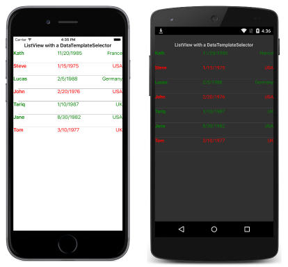

# Creating a Xamarin.Forms DataTemplateSelector

_A DataTemplateSelector can be used to choose a DataTemplate at runtime based on the value of a data-bound property. This enables multiple DataTemplates to be applied to the same type of object, to customize the appearance of particular objects. This article demonstrates how to create and consume a DataTemplateSelector._

A data template selector enables scenarios such as a [`ListView`](xref:Xamarin.Forms.ListView) binding to a collection of objects, where the appearance of each object in the `ListView` can be chosen at runtime by the data template selector returning a particular [`DataTemplate`](xref:Xamarin.Forms.DataTemplate).

## Creating a DataTemplateSelector

A data template selector is implemented by creating a class that inherits from [`DataTemplateSelector`](xref:Xamarin.Forms.DataTemplateSelector). The `OnSelectTemplate` method is then overridden to return a particular [`DataTemplate`](xref:Xamarin.Forms.DataTemplate), as shown in the following code example:

```csharp
public class PersonDataTemplateSelector : DataTemplateSelector
{
  public DataTemplate ValidTemplate { get; set; }
  public DataTemplate InvalidTemplate { get; set; }

  protected override DataTemplate OnSelectTemplate (object item, BindableObject container)
  {
    return ((Person)item).DateOfBirth.Year >= 1980 ? ValidTemplate : InvalidTemplate;
  }
}
```

The `OnSelectTemplate` method returns the appropriate template based on the value of the `DateOfBirth` property. The template to return is the value of the `ValidTemplate` property or the `InvalidTemplate` property, which are set when consuming the `PersonDataTemplateSelector`.

An instance of the data template selector class can then be assigned to Xamarin.Forms control properties such as [`ListView.ItemTemplate`](xref:Xamarin.Forms.ItemsView`1). For a list of valid properties, see [Creating a DataTemplate](~/xamarin-forms/app-fundamentals/templates/data-templates/creating.md).

### Limitations

[`DataTemplateSelector`](xref:Xamarin.Forms.DataTemplateSelector) instances have the following limitations:

- The `DataTemplateSelector` subclass must always return the same template for the same data if queried multiple times.
- The `DataTemplateSelector` subclass must not return another `DataTemplateSelector` subclass.
- The `DataTemplateSelector` subclass must not return new instances of a `DataTemplate` on each call. Instead, the same instance must be returned. Failure to do so will create a memory leak and will disable virtualization.
- On Android, there can be no more than 20 different data templates per `ListView`.

## Consuming a DataTemplateSelector in XAML

In XAML, the `PersonDataTemplateSelector` can be instantiated by declaring it as a resource, as shown in the following code example:

```xaml
<ContentPage xmlns="http://xamarin.com/schemas/2014/forms" xmlns:x="http://schemas.microsoft.com/winfx/2009/xaml" xmlns:local="clr-namespace:Selector;assembly=Selector" x:Class="Selector.HomePage">
    <ContentPage.Resources>
        <ResourceDictionary>
            <DataTemplate x:Key="validPersonTemplate">
                <ViewCell>
                   ...
                </ViewCell>
            </DataTemplate>
            <DataTemplate x:Key="invalidPersonTemplate">
                <ViewCell>
                   ...
                </ViewCell>
            </DataTemplate>
            <local:PersonDataTemplateSelector x:Key="personDataTemplateSelector"
                ValidTemplate="{StaticResource validPersonTemplate}"
                InvalidTemplate="{StaticResource invalidPersonTemplate}" />
        </ResourceDictionary>
    </ContentPage.Resources>
  ...
</ContentPage>
```

This page level [`ResourceDictionary`](xref:Xamarin.Forms.ResourceDictionary) defines two [`DataTemplate`](xref:Xamarin.Forms.DataTemplate) instances and a `PersonDataTemplateSelector` instance. The `PersonDataTemplateSelector` instance sets its `ValidTemplate` and `InvalidTemplate` properties to the appropriate `DataTemplate` instances by using the `StaticResource` markup extension. Note that while the resources are defined in the page's [`ResourceDictionary`](xref:Xamarin.Forms.ResourceDictionary), they could also be defined at the control level or application level.

The `PersonDataTemplateSelector` instance is consumed by assigning it to the [`ListView.ItemTemplate`](xref:Xamarin.Forms.ItemsView`1) property, as shown in the following code example:

```xaml
<ListView x:Name="listView" ItemTemplate="{StaticResource personDataTemplateSelector}" />
```

At runtime, the [`ListView`](xref:Xamarin.Forms.ListView) calls the `PersonDataTemplateSelector.OnSelectTemplate` method for each of the items in the underlying collection, with the call passing the data object as the `item` parameter. The [`DataTemplate`](xref:Xamarin.Forms.DataTemplate) that is returned by the method is then applied to that object.

The following screenshots show the result of the [`ListView`](xref:Xamarin.Forms.ListView) applying the `PersonDataTemplateSelector` to each object in the underlying collection:



Any `Person` object that has a `DateOfBirth` property value greater than or equal to 1980 is displayed in green, with the remaining objects being displayed in red.

## Consuming a DataTemplateSelector in C&num;

In C#, the `PersonDataTemplateSelector` can be instantiated and assigned to the [`ListView.ItemTemplate`](xref:Xamarin.Forms.ItemsView`1) property, as shown in the following code example:

```csharp
public class HomePageCS : ContentPage
{
  DataTemplate validTemplate;
  DataTemplate invalidTemplate;

  public HomePageCS ()
  {
    ...
    SetupDataTemplates ();
    var listView = new ListView {
      ItemsSource = people,
      ItemTemplate = new PersonDataTemplateSelector {
        ValidTemplate = validTemplate,
        InvalidTemplate = invalidTemplate }
    };

    Content = new StackLayout {
      Margin = new Thickness (20),
      Children = {
        ...
        listView
      }
    };
  }
  ...  
}
```

The `PersonDataTemplateSelector` instance sets its `ValidTemplate` and `InvalidTemplate` properties to the appropriate [`DataTemplate`](xref:Xamarin.Forms.DataTemplate) instances created by the `SetupDataTemplates` method. At runtime, the [`ListView`](xref:Xamarin.Forms.ListView) calls the `PersonDataTemplateSelector.OnSelectTemplate` method for each of the items in the underlying collection, with the call passing the data object as the `item` parameter. The `DataTemplate` that is returned by the method is then applied to that object.

## Summary

This article has demonstrated how to create and consume a [`DataTemplateSelector`](xref:Xamarin.Forms.DataTemplateSelector). A `DataTemplateSelector` can be used to choose a [`DataTemplate`](xref:Xamarin.Forms.DataTemplate) at runtime based on the value of a data-bound property. This enables multiple `DataTemplate` instances to be applied to the same type of object, to customize the appearance of particular objects.


## Related Links

- [Data Template Selector (sample)](https://developer.xamarin.com/samples/xamarin-forms/templates/datatemplateselector/)
- [DataTemplateSelector](xref:Xamarin.Forms.DataTemplateSelector)
