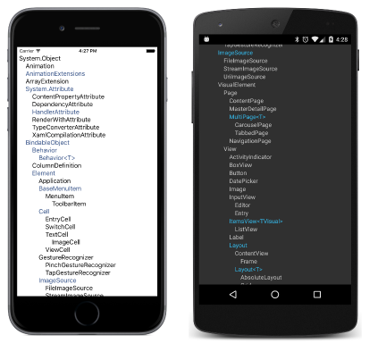

# Summary of Chapter 11. The Bindable infrastructure

Every C# programmer is familiar with C# *properties*. Properties contain a *set* accessor and/or a *get* accessor. They are often called *CLR properties* for the Common Language Runtime.

Xamarin.Forms defines an enhanced property definition called a *bindable property* encapsulated by the [`BindableProperty`](https://developer.xamarin.com/api/type/Xamarin.Forms.BindableProperty/) class and supported by the [`BindableObject`](https://developer.xamarin.com/api/type/Xamarin.Forms.BindableObject/) class. These classes are related but quite distinct: The `BindableProperty` is used to define the property itself; `BindableObject` is like `object` in that it is a base class for classes that define bindable properties.

## The Xamarin.Forms class hierarchy

The [**ClassHierarchy**](https://github.com/xamarin/xamarin-forms-book-samples/tree/master/Chapter11/ClassHierarchy) sample uses reflection to display a class hierarchy of Xamarin.Forms and demonstrate the crucial role played by `BindableObject` in this hierarchy. `BindableObject` derives from `Object` and is the parent class to [`Element`](https://developer.xamarin.com/api/type/Xamarin.Forms.Element/) from which [`VisualElement`](https://developer.xamarin.com/api/type/Xamarin.Forms.VisualElement/) derives. This is the parent class to [`Page`](https://developer.xamarin.com/api/type/Xamarin.Forms.Page/) and [`View`](https://developer.xamarin.com/api/type/Xamarin.Forms.View/), which is the parent class to [`Layout`](https://developer.xamarin.com/api/type/Xamarin.Forms.Layout/):

## A peek into BindableObject and BindableProperty

In the classes that derive from `BindableObject` many CLR properties are said to be "backed by" bindable properties. For example, the [`Text`](https://developer.xamarin.com/api/property/Xamarin.Forms.Label.Text/) property of the `Label` class is a CLR property, but the `Label` class also defines a public static read-only field named [`TextProperty`](https://developer.xamarin.com/api/property/Xamarin.Forms.Label.TextProperty/) of type `BindableProperty`.

An application can set or get the `Text` property of `Label` normally, or the application can set the `Text` by calling the [`SetValue`](https://developer.xamarin.com/api/member/Xamarin.Forms.BindableObject.SetValue/p/Xamarin.Forms.BindableProperty/System.Object/) method defined by `BindableObject` with a `Label.TextProperty` argument. Similarly, an application can obtain the value of the `Text` property by calling the [`GetValue`](https://developer.xamarin.com/api/member/Xamarin.Forms.BindableObject.GetValue/p/Xamarin.Forms.BindableProperty/) method, again with a `Label.TextProperty` argument. This is demonstrated by the [**PropertySettings**](https://github.com/xamarin/xamarin-forms-book-samples/tree/master/Chapter11/PropertySettings) sample.

Indeed, the `Text` CLR property is entirely implemented using the `SetValue` and `GetValue` methods defined by `BindableObject` in conjunction with the `Label.TextProperty` static property.

`BindableObject` and `BindableProperty` provide support for:

- Giving properties default values
- Storing their current values
- Providing mechanisms for validating property values
- Maintaining consistency among related properties in a single class
- Responding to property changes
- Triggering notifications when a property is about to change or has changed
- Supporting data binding
- Supporting styles
- Supporting dynamic resources

Whenever a property that is backed by a bindable property changes, `BindableObject` fires a [`PropertyChanged`](https://developer.xamarin.com/api/event/Xamarin.Forms.BindableObject.PropertyChanged/) event identifying the property that has changed. This event is not fired when the property is set to the same value.

Some properties are not backed by bindable properties, and some Xamarin.Forms classes &mdash; such as `Span` &mdash; do not derive from `BindableObject`. Only a class that derives from `BindableObject` can support bindable properties because `BindableObject` defines the `SetValue` and `GetValue` methods.

Because `Span` does not derive from `BindableObject`, none of its properties &mdash; such as `Text` &mdash; are backed by a bindable property. This is why a `DynamicResource` setting on the `Text` property of `Span` raises an exception in the [**DynamicVsStatic**](https://github.com/xamarin/xamarin-forms-book-samples/tree/master/Chapter10/DynamicVsStatic) sample in the previous chapter. The [**DynamicVsStaticCode**](https://github.com/xamarin/xamarin-forms-book-samples/tree/master/Chapter11/DynamicVsStaticCode) sample demonstrates how to set a dynamic resources in code using the [`SetDynamicResource`](https://developer.xamarin.com/api/member/Xamarin.Forms.Element.SetDynamicResource/p/Xamarin.Forms.BindableProperty/System.String/) method defined by `Element`. The first argument is an object of type `BindableProperty`.

Similarly, the [`SetBinding`](https://developer.xamarin.com/api/member/Xamarin.Forms.BindableObject.SetBinding/p/Xamarin.Forms.BindableProperty/Xamarin.Forms.BindingBase/) method defined by `BindableObject` has a first argument of type `BindableProperty`.

## Defining bindable properties

You can define your own bindable properties using the static [`BindableProperty.Create`](https://developer.xamarin.com/api/member/Xamarin.Forms.BindableProperty.Create/p/System.String/System.Type/System.Type/System.Object/Xamarin.Forms.BindingMode/Xamarin.Forms.BindableProperty+ValidateValueDelegate/Xamarin.Forms.BindableProperty+BindingPropertyChangedDelegate/Xamarin.Forms.BindableProperty+BindingPropertyChangingDelegate/Xamarin.Forms.BindableProperty+CoerceValueDelegate/Xamarin.Forms.BindableProperty+CreateDefaultValueDelegate/) method or the slightly shorter [`BindableProperty.Create`](https://developer.xamarin.com/api/member/Xamarin.Forms.BindableProperty.Create/p/System.String/System.Type/System.Type/System.Object/Xamarin.Forms.BindingMode/Xamarin.Forms.BindableProperty+ValidateValueDelegate/Xamarin.Forms.BindableProperty+BindingPropertyChangedDelegate/Xamarin.Forms.BindableProperty+BindingPropertyChangingDelegate/Xamarin.Forms.BindableProperty+CoerceValueDelegate/) overload to create a static read-only field of type `BindableProperty`.

This is demonstrated in the [`AltLabel`](https://github.com/xamarin/xamarin-forms-book-samples/blob/master/Libraries/Xamarin.FormsBook.Toolkit/Xamarin.FormsBook.Toolkit/AltLabel.cs) class in the [**Xamarin.FormsBook.Toolkit**](https://github.com/xamarin/xamarin-forms-book-samples/tree/master/Libraries/Xamarin.FormsBook.Toolkit) library. The class derives from `Label` and lets you specify a font size in points. It is demonstrated in the [**PointSizedText**](https://github.com/xamarin/xamarin-forms-book-samples/tree/master/Chapter11/PointSizedText) sample.

Four arguments of the `BindableProperty.Create` method are required:

- `propertyName`: the text name of the property (the same as the CLR property name)
- `returnType`: the type of the CLR property
- `declaringType`: the type of the class declaring the property
- `defaultValue`: the property's default value

Because `defaultValue` is of type `object`, the compiler must be able to determine the default value's type. For example, if the `returnType` is `double`, the `defaultValue` should be set to something like 0.0 rather than just 0, or the type mismatch will trigger an exception at runtime.

It is also very common for a bindable property to include:

- `propertyChanged`: a static method called when the property changes value. The first argument is the instance of the class whose property has been changed.

The other arguments to `BindableProperty.Create` are not as common:

- `defaultBindingMode`: used in connection with data binding (as discussed in [**Chapter 16. Data binding**](chapter16.md))
- `validateValue`: a callback to check for a valid value
- `propertyChanging`: a callback to indicate when the property is about to change
- `coerceValue`: a callback to coerce a set value to another value
- `defaultValueCreate`: a callback to create a default value that cannot be shared among instances of the class (for example, a collection)

### The read-only bindable property

A bindable property can be read-only. Creating a read-only bindable property requires calling the static method [`BindableProperty.CreateReadOnly`](https://developer.xamarin.com/api/member/Xamarin.Forms.BindableProperty.CreateReadOnly/p/System.String/System.Type/System.Type/System.Object/Xamarin.Forms.BindingMode/Xamarin.Forms.BindableProperty+ValidateValueDelegate/Xamarin.Forms.BindableProperty+BindingPropertyChangedDelegate/Xamarin.Forms.BindableProperty+BindingPropertyChangingDelegate/Xamarin.Forms.BindableProperty+CoerceValueDelegate/Xamarin.Forms.BindableProperty+CreateDefaultValueDelegate/) or a shorter [`BindableProperty.CreateReadOnly`](https://developer.xamarin.com/api/member/Xamarin.Forms.BindableProperty.CreateReadOnly/p/System.String/System.Type/System.Type/System.Object/Xamarin.Forms.BindingMode/Xamarin.Forms.BindableProperty+ValidateValueDelegate/Xamarin.Forms.BindableProperty+BindingPropertyChangedDelegate/Xamarin.Forms.BindableProperty+BindingPropertyChangingDelegate/Xamarin.Forms.BindableProperty+CoerceValueDelegate/) to define a private static read-only field of type [`BindablePropertyKey`](https://developer.xamarin.com/api/type/Xamarin.Forms.BindablePropertyKey/).

Then, define the CLR property `set` accesor as `private` to call a [`SetValue`](https://developer.xamarin.com/api/member/Xamarin.Forms.BindableObject.SetValue/p/Xamarin.Forms.BindablePropertyKey/System.Object/) overload with the `BindablePropertyKey` object. This prevents the property from being set outside the class.

This is demonstrated in the [`CountedLabel`](https://github.com/xamarin/xamarin-forms-book-samples/blob/master/Libraries/Xamarin.FormsBook.Toolkit/Xamarin.FormsBook.Toolkit/CountedLabel.cs) class used in the  [**BaskervillesCount**](https://github.com/xamarin/xamarin-forms-book-samples/tree/master/Chapter11/BaskervillesCount) sample.

## Related Links

- [Chapter 11 full text (PDF)](https://download.xamarin.com/developer/xamarin-forms-book/XamarinFormsBook-Ch11-Apr2016.pdf)
- [Chapter 11 samples](https://github.com/xamarin/xamarin-forms-book-samples/tree/master/Chapter11)
