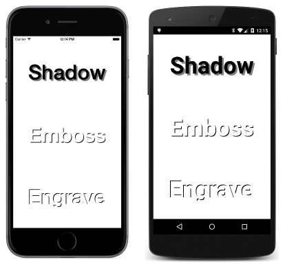
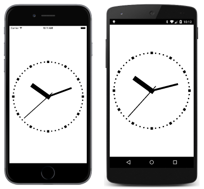

# Summary of Chapter 21. Transforms

A Xamarin.Forms view appears on the screen in a location and size determined by its parent, which is generally a `Layout` or `Layout<View>` derivative. The *transform* is a Xamarin.Forms feature that can modify that location, size, or even orientation.

Xamarin.Forms supports three basic types of transforms:

- *Translation* &#x2014; shift an element horizontally or vertically
- *Scale* &#x2014; change the size of an element
- *Rotation* &#x2014; turn an element around a point or axis

In Xamarin.Forms, the scaling is isotropic; it affects the width and height uniformly. Rotation is supported both on the two-dimensional surface of the screen and in 3D space. There is no skew (or sheer) transform, and no generalized matrix transform.

Transforms are supported with eight properties of type `double` defined by the `VisualElement` class:

- [`TranslationX`](https://developer.xamarin.com/api/property/Xamarin.Forms.VisualElement.TranslationX/)
- [`TranslationY`](https://developer.xamarin.com/api/property/Xamarin.Forms.VisualElement.TranslationY/)
- [`Scale`](https://developer.xamarin.com/api/property/Xamarin.Forms.VisualElement.Scale/)
- [`Rotation`](https://developer.xamarin.com/api/property/Xamarin.Forms.VisualElement.Rotation/)
- [`RotationX`](https://developer.xamarin.com/api/property/Xamarin.Forms.VisualElement.RotationX/)
- [`RotationY`](https://developer.xamarin.com/api/property/Xamarin.Forms.VisualElement.RotationY/)
- [`AnchorX`](https://developer.xamarin.com/api/property/Xamarin.Forms.VisualElement.AnchorX/)
- [`AnchorY`](https://developer.xamarin.com/api/property/Xamarin.Forms.VisualElement.AnchorY/)

All these properties are backed by bindable properties. They can be targets of data binding and styled. [**Chapter 22. Animation**](~/xamarin-forms/creating-mobile-apps-xamarin-forms/summaries/chapter22.md) demonstrates how these properties can be animated, but some samples in this chapter show how you can animate them using the Xamarin.Forms [timer](~/xamarin-forms/platform/device.md#Device_StartTimer).

Transform properties affect only how the element is rendered, and do *not* affect how the element is perceived in layout.

## The translation transform

Nonzero values of the [`TranslationX`](https://developer.xamarin.com/api/property/Xamarin.Forms.VisualElement.TranslationX/)
and [`TranslationY`](https://developer.xamarin.com/api/property/Xamarin.Forms.VisualElement.TranslationY/) properties shift an element horizontally or vertically.

The [**TranslationDemo**](https://github.com/xamarin/xamarin-forms-book-samples/tree/master/Chapter21/TranslationDemo) program allows you to experiment with these properties with two `Slider` elements that control the `TranslationX` and `TranslationY` properties of a `Frame`. The transform also affects all children of that `Frame`.

### Text effects

One common use of the translation properties is to offset slightly the rendering of text. This is demonstrated in the [**TextOffsets**](https://github.com/xamarin/xamarin-forms-book-samples/tree/master/Chapter21/TextOffsets) sample:

Another effect is to render multiple copies of a `Label` to resemble a 3D block, such as demonstrated in the [**BlockText**](https://github.com/xamarin/xamarin-forms-book-samples/tree/master/Chapter21/BlockText) sample.

### Jumps and animations

The
[**ButtonJump**](https://github.com/xamarin/xamarin-forms-book-samples/tree/master/Chapter21/ButtonJump) sample uses translation to move a `Button` whenever it's tapped, but the primary intent is to demonstrate that the `Button` receives user input at the location where the button is rendered.

The [**ButtonGlide**](https://github.com/xamarin/xamarin-forms-book-samples/tree/master/Chapter21/ButtonGlide) sample is similar but uses a timer to animate the `Button` from one point to another.

## The scale transform

The [`Scale`](https://developer.xamarin.com/api/property/Xamarin.Forms.VisualElement.Scale/) transform can increase or decrease the rendered size of the element. The default value is 1. A value of 0 causes the element to be invisible. Negative values cause the element to appear to be rotated 180 degrees. The `Scale` property does not affect the `Width` or `Height` properties of the element. Those values remain the same.

You can experiment with the `Scale` property using the [**SimpleScaleDemo**](https://github.com/xamarin/xamarin-forms-book-samples/tree/master/Chapter21/SimpleScaleDemo) sample.

The [**ButtonScaler**](https://github.com/xamarin/xamarin-forms-book-samples/tree/master/Chapter21/ButtonScaler) sample demonstrates the difference between animating the `Scale` property of a `Button` and animating the `FontSize` property. The `FontSize` property affects how the `Button` is perceived in layout; the `Scale` property does not.

The [**ScaleToSize**](https://github.com/xamarin/xamarin-forms-book-samples/tree/master/Chapter21/ScaleToSize) sample calculates a `Scale` property that is applied to a `Label` element to make it as large as possible while still fitting within the page.

### Anchoring the scale

The elements scaled in the previous three samples have all increased or decreased in size relative to the center of the element. In other words, the element increases or decreases in size the same in all directions. Only the point at the center of the element remains in the same location during the scaling.

You can change the center of the scaling by setting the [`AnchorX`](https://developer.xamarin.com/api/property/Xamarin.Forms.VisualElement.AnchorX/) and
[`AnchorY`](https://developer.xamarin.com/api/property/Xamarin.Forms.VisualElement.AnchorY/) properties. These properties are relative to the element itself. For `AnchorX`, a value of 0 refers to the left side of the element and 1 refers to the right side. Similarly for `AnchorY`, 0 is the top and 1 is the bottom. Both properties have default values of 0.5, which is the center.

The
[**AnchoredScaleDemo**](https://github.com/xamarin/xamarin-forms-book-samples/tree/master/Chapter21/AnchoredScaleDemo) sample allows you to experiment with the `AnchorX` and `AnchorY` properties as well as the `Scale` property.

On iOS, using non-default values of `AnchorX` and `AnchorY` properties is generally incompatible with phone orientation changes.

## The rotation transform

The [`Rotation`](https://developer.xamarin.com/api/property/Xamarin.Forms.VisualElement.Rotation/) property is specified in degrees and indicates clockwise rotation around a point of the element defined by `AnchorX` and `AnchorY`. The [**PlaneRotationDemo**](https://github.com/xamarin/xamarin-forms-book-samples/tree/master/Chapter21/PlaneRotationDemo) allows you to experiment with these three properties.

### Rotated text effects

The [**BoxViewCircle**](https://github.com/xamarin/xamarin-forms-book-samples/tree/master/Chapter21/BoxViewCircle) sample demonstrates the mathematics necessary to draw a circle using 64 tiny rotated `BoxView` elements.

The  [**RotatedText**](https://github.com/xamarin/xamarin-forms-book-samples/tree/master/Chapter21/RotatedText) sample displays multiple `Label` elements with the same text string rotated to appear like spokes.

The [**CircularText**](https://github.com/xamarin/xamarin-forms-book-samples/tree/master/Chapter21/CircularText) sample displays a text string that appears to wrap in a circle.

### An analog clock

The [**Xamarin.FormsBook.Toolkit**](https://github.com/xamarin/xamarin-forms-book-samples/tree/master/Libraries/Xamarin.FormsBook.Toolkit) library contains an [`AnalogClockViewModel`](https://github.com/xamarin/xamarin-forms-book-samples/blob/master/Libraries/Xamarin.FormsBook.Toolkit/Xamarin.FormsBook.Toolkit/AnalogClockViewModel.cs) class that calculates angles for the hands of a clock. To avoid platform dependencies in the ViewModel, the class uses `Task.Delay` rather than a timer for finding a new `DateTime` value.

Also included in **Xamarin.FormsBook.Toolkit** is a  [`SecondTickConverter`](https://github.com/xamarin/xamarin-forms-book-samples/blob/master/Libraries/Xamarin.FormsBook.Toolkit/Xamarin.FormsBook.Toolkit/SecondTickConverter.cs) class that implements `IValueConverter` and serves to round a second angle to the nearest second.

The [**MinimalBoxViewClock**](https://github.com/xamarin/xamarin-forms-book-samples/tree/master/Chapter21/MinimalBoxViewClock) uses three rotating `BoxView` elements to draw an analog clock.

The [**BoxViewClock**](https://github.com/xamarin/xamarin-forms-book-samples/tree/master/Chapter21/BoxViewClock) uses `BoxView` for more extensive graphics, including tick marks around the face of the clock, and hands that rotate a little distance from their ends:

In addition a [`SecondBackEaseConverter`](https://github.com/xamarin/xamarin-forms-book-samples/blob/master/Libraries/Xamarin.FormsBook.Toolkit/Xamarin.FormsBook.Toolkit/SecondBackEaseConverter.cs) class in **Xamarin.FormsBook.Toolkit** causes the second hand to appear to pull back a little before jumping ahead, and then to move back into its correct position.

### Vertical sliders?

The [**VerticalSliders**](https://github.com/xamarin/xamarin-forms-book-samples/tree/master/Chapter21/VerticalSliders) sample demonstrates that `Slider` elements can be rotated 90 degrees and still function. However, it's difficult to position these rotated `Slider` elements because in layout they still appear to be horizontal.

## 3D-ish rotations

The [`RotationX`](https://developer.xamarin.com/api/property/Xamarin.Forms.VisualElement.RotationX/) property appears to rotate an element around a 3D X-axis so that the top and bottom of the element seem to move towards or away from the viewer. Similarly, the [`RotationY`](https://developer.xamarin.com/api/property/Xamarin.Forms.VisualElement.RotationY/) seems to rotate an element around the Y-axis to make the left and right sides of the element seem to move towards or away from the viewer.

The `AnchorX` property affects `RotationY` but not `RotationX`. The `AnchorY` property affects `RotationX` but not `RotationY`. You can experiment with the [**ThreeDeeRotationDemo**](https://github.com/xamarin/xamarin-forms-book-samples/tree/master/Chapter21/ThreeDeeRotationDemo) sample to explore the interactions of these properties.

The 3D coordinate system implied by Xamarin.Forms is left-handed. If you point the forefinger of your left hand in the direction of increasing X coordinates (to the right) and your middle finger in the direction of increasing Y coordinates (down), then your thumb points in the direction of increasing Z coordinates (out of the screen).

Also, for any of the three axis, if you point your left-hand thumb in the direction of increasing values, then the curve of your fingers indicates the direction of rotation for positive rotating angles.

## Related Links

- [Chapter 21 full text (PDF)](https://download.xamarin.com/developer/xamarin-forms-book/XamarinFormsBook-Ch21-Apr2016.pdf)
- [Chapter 21 samples](https://github.com/xamarin/xamarin-forms-book-samples/tree/master/Chapter21)
