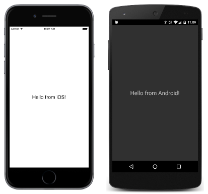
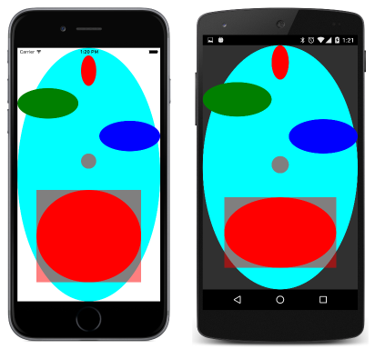

# Summary of Chapter 27. Custom renderers

A Xamarin.Forms element such as `Button` is rendered with a platform-specific button encapsulated in a class named `ButtonRenderer`.  Here is the [iOS version of `ButtonRenderer`](https://github.com/xamarin/Xamarin.Forms/blob/master/Xamarin.Forms.Platform.iOS/Renderers/ButtonRenderer.cs), the [Android version of `ButtonRenderer`](https://github.com/xamarin/Xamarin.Forms/blob/master/Xamarin.Forms.Platform.Android/Renderers/ButtonRenderer.cs), and the [Windows Runtime version of `ButtonRenderer`](https://github.com/xamarin/Xamarin.Forms/blob/master/Xamarin.Forms.Platform.WinRT/ButtonRenderer.cs).

This chapter discusses how you can write your own renderers to create custom views that map to platform-specific objects.

## The complete class hierarchy

There are seven assemblies that contain the Xamarin.Forms platform-specific code.
You can view the source on GitHub using these links:

- [**Xamarin.Forms.Platform**](https://github.com/xamarin/Xamarin.Forms/tree/master/Xamarin.Forms.Platform) (very small)
- [**Xamarin.Forms.Platform.iOS**](https://github.com/xamarin/Xamarin.Forms/tree/master/Xamarin.Forms.Platform.iOS)
- [**Xamarin.Forms.Platform.Android**](https://github.com/xamarin/Xamarin.Forms/tree/master/Xamarin.Forms.Platform.Android)
- [**Xamarin.Forms.Platform.WinRT**](https://github.com/xamarin/Xamarin.Forms/tree/master/Xamarin.Forms.Platform.WinRT) (larger than the next three)
- [**Xamarin.Forms.Platform.UAP**](https://github.com/xamarin/Xamarin.Forms/tree/master/Xamarin.Forms.Platform.UAP)
- [**Xamarin.Forms.Platform.WinRT.Tablet**](https://github.com/xamarin/Xamarin.Forms/tree/master/Xamarin.Forms.Platform.WinRT.Tablet)
- [**Xamarin.Forms.Platform.WinRT.Phone**](https://github.com/xamarin/Xamarin.Forms/tree/master/Xamarin.Forms.Platform.WinRT.Phone)

The [**PlatformClassHierarchy**](https://github.com/xamarin/xamarin-forms-book-samples/tree/master/Chapter27/PlatformClassHierarchy) sample
displays a class hierarchy for the assemblies that are valid for the executing platform.

You'll notice an important class named `ViewRenderer`. This is the class you derive from when creating a platform-specific renderer. It exists in three different versions, because it's tied to the view system of the target platform:

The iOS [`ViewRenderer<TView, TNativeView>`](https://github.com/xamarin/Xamarin.Forms/blob/master/Xamarin.Forms.Platform.iOS/ViewRenderer.cs#L26) has generic arguments:

- `TView` constrained to [`Xamarin.Forms.View`](https://developer.xamarin.com/api/type/Xamarin.Forms.View/)
- `TNativeView` constrained to [`UIKit.UIView`](https://developer.xamarin.com/api/type/UIKit.UIView/)

The Android [`ViewRenderer<TView, TNativeView>`](https://github.com/xamarin/Xamarin.Forms/blob/master/Xamarin.Forms.Platform.Android/ViewRenderer.cs#L14) has generic arguments:

- `TView` constrained to [`Xamarin.Forms.View`](https://developer.xamarin.com/api/type/Xamarin.Forms.View/)
- `TNativeView` constrained to [`Android.Views.View`](https://developer.xamarin.com/api/type/Android.Views.View/)

The Windows Runtime [`ViewRenderer<TElement, TNativeElement>`](https://github.com/xamarin/Xamarin.Forms/blob/master/Xamarin.Forms.Platform.WinRT/ViewRenderer.cs#L12) has differently named generic arguments:

- `TElement` constrained to [`Xamarin.Forms.View`](https://developer.xamarin.com/api/type/Xamarin.Forms.View/)
- `TNativeElement` constrained to [`Windows.UI.Xaml.FrameworkElement`](https://msdn.microsoft.com/library/windows/apps/windows.ui.xaml.frameworkelement.aspx)

When writing a renderer, you will be deriving a class from `View`, and then writing multiple `ViewRenderer` classes, one for each supported platform. Each platform-specific implementation will reference a native class that derives from the type you specify as the `TNativeView` or `TNativeElement` parameter.

## Hello, custom renderers!

The [**HelloRenderers**](https://github.com/xamarin/xamarin-forms-book-samples/tree/master/Chapter27/HelloRenderers) program references a custom view named `HelloView` in its [`App`](https://github.com/xamarin/xamarin-forms-book-samples/blob/master/Chapter27/HelloRenderers/HelloRenderers/HelloRenderers/App.cs) class.

The [`HelloView`](https://github.com/xamarin/xamarin-forms-book-samples/blob/master/Chapter27/HelloRenderers/HelloRenderers/HelloRenderers/HelloView.cs) class is included in the **HelloRenderers** project and simply derives from `View`.

The [`HelloViewRenderer`](https://github.com/xamarin/xamarin-forms-book-samples/blob/master/Chapter27/HelloRenderers/HelloRenderers/HelloRenderers.iOS/HelloViewRenderer.cs) class in the **HelloRenderers.iOS** project derives from `ViewRenderer<HelloView, UILabel>`. In the `OnElementChanged` override, it creates a native iOS `UILabel` and calls `SetNativeControl`.

The [`HelloViewRenderer`](https://github.com/xamarin/xamarin-forms-book-samples/blob/master/Chapter27/HelloRenderers/HelloRenderers/HelloRenderers.Droid/HelloViewRenderer.cs) class in the **HelloRenderers.Droid** project derives from `ViewRenderer<HelloView, TextView>`. In the `OnElementChanged` override, it creates an Android `TextView` and calls `SetNativeControl`.

The [`HelloViewRenderer`](https://github.com/xamarin/xamarin-forms-book-samples/blob/master/Chapter27/HelloRenderers/HelloRenderers/HelloRenderers.UWP/HelloViewRenderer.cs) class in the **HelloRenderers.UWP** and other Windows projects derives from `ViewRenderer<HelloView, TextBlock>`. In the `OnElementChanged` override, it creates a Windows `TextBlock` and calls `SetNativeControl`.

All the `ViewRenderer` derivatives contain an `ExportRenderer` attribute on the assembly level that associates the `HelloView` class with the particular `HelloViewRenderer` class. This is how Xamarin.Forms locates renderers in the individual platform projects:

## Renderers and properties

The next set of renderers implements ellipse drawing, and is located in the various projects of the [**Xamarin.FormsBook.Platform**](https://github.com/xamarin/xamarin-forms-book-samples/tree/master/Libraries/Xamarin.FormsBook.Platform) solution.

The [`EllipseView`](https://github.com/xamarin/xamarin-forms-book-samples/blob/master/Libraries/Xamarin.FormsBook.Platform/Xamarin.FormsBook.Platform/EllipseView.cs) class is in the **Xamarin.FormsBook.Platform** platform. The class is similar to `BoxView` and defines just a single property: `Color` of type `Color`.

The renderers can transfer property values set on a `View` to the native object by overriding the `OnElementPropertyChanged` method in the renderer. Within this method (and within most of the renderer), two properties are available:

- `Element`, the Xamarin.Forms element
- `Control`, the native view or widget or control object

The types of these properties are determined by the generic parameters to `ViewRenderer`. In this example, `Element` is of type `EllipseView`.

The `OnElementPropertyChanged` override can therefore transfer the `Color` value of the `Element` to the native `Control` object, probably with some kind of conversion. The three renderers are:

- iOS: [`EllipseViewRenderer`](https://github.com/xamarin/xamarin-forms-book-samples/blob/master/Libraries/Xamarin.FormsBook.Platform/Xamarin.FormsBook.Platform.iOS/EllipseViewRenderer.cs), which uses an [`EllipseUIView`](https://github.com/xamarin/xamarin-forms-book-samples/blob/master/Libraries/Xamarin.FormsBook.Platform/Xamarin.FormsBook.Platform.iOS/EllipseUIView.cs) class for the ellipse.
- Android: [`EllipseViewRenderer`](https://github.com/xamarin/xamarin-forms-book-samples/blob/master/Libraries/Xamarin.FormsBook.Platform/Xamarin.FormsBook.Platform.Android/EllipseViewRenderer.cs), which uses an [`EllipseDrawableView`](https://github.com/xamarin/xamarin-forms-book-samples/blob/master/Libraries/Xamarin.FormsBook.Platform/Xamarin.FormsBook.Platform.Android/EllipseDrawableView.cs) class for the ellipse.
- Windows Runtime: [`EllipseViewRenderer`](https://github.com/xamarin/xamarin-forms-book-samples/blob/master/Libraries/Xamarin.FormsBook.Platform/Xamarin.FormsBook.Platform.WinRT/EllipseViewRenderer.cs), which can use the native Windows [`Ellipse`](https://msdn.microsoft.com/library/windows/apps/windows.ui.xaml.shapes.ellipse.aspx) class.

The [**EllipseDemo**](https://github.com/xamarin/xamarin-forms-book-samples/tree/master/Chapter27/EllipseDemo) class displays several of these `EllipseView` objects:

The [**BouncingBall**](https://github.com/xamarin/xamarin-forms-book-samples/tree/master/Chapter27/BouncingBall) bounces an `EllipseView` off the sides of the screen.

## Renderers and events

It is also possible for renderers to indirectly generate events. The [`StepSlider`](https://github.com/xamarin/xamarin-forms-book-samples/blob/master/Libraries/Xamarin.FormsBook.Platform/Xamarin.FormsBook.Platform/StepSlider.cs) class is similar to the normal Xamarin.Forms `Slider` but allows specifying a number of discrete steps between the `Minimum` and `Maximum` values.

The three renderers are:

- iOS: [`StepSliderRenderer`](https://github.com/xamarin/xamarin-forms-book-samples/blob/master/Libraries/Xamarin.FormsBook.Platform/Xamarin.FormsBook.Platform.iOS/StepSliderRenderer.cs)
- Android: [`StepSliderRenderer`](https://github.com/xamarin/xamarin-forms-book-samples/blob/master/Libraries/Xamarin.FormsBook.Platform/Xamarin.FormsBook.Platform.Android/StepSliderRenderer.cs)
- Windows Runtime: [`StepSliderRenderer`](https://github.com/xamarin/xamarin-forms-book-samples/blob/master/Libraries/Xamarin.FormsBook.Platform/Xamarin.FormsBook.Platform.WinRT/StepSliderRenderer.cs)

The renderers detect changes to the native control, and then call `SetValueFromRenderer`, which references a bindable property defined in the `StepSlider`, a change to which causes the `StepSlider` to fire a `ValueChanged` event.

The [**StepSliderDemo**](https://github.com/xamarin/xamarin-forms-book-samples/tree/master/Chapter27/StepSliderDemo) sample demonstrates this new slider.

## Related Links

- [Chapter 27 full text (PDF)](https://download.xamarin.com/developer/xamarin-forms-book/XamarinFormsBook-Ch27-Apr2016.pdf)
- [Chapter 27 samples](https://github.com/xamarin/xamarin-forms-book-samples/tree/master/Chapter27)
- [Custom Renderers](~/xamarin-forms/app-fundamentals/custom-renderer/index.md)
