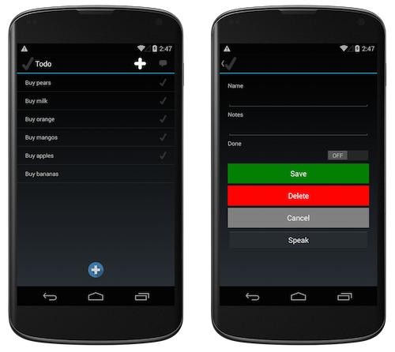
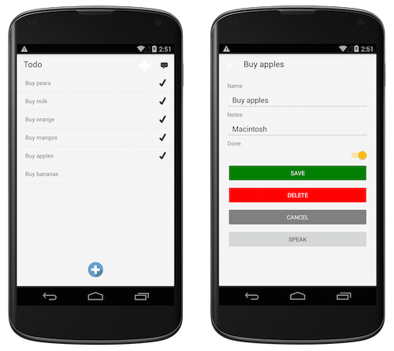

# Android Platform Features

## Platform Support

Originally, the default Xamarin.Forms Android project used an older style of control
renderering that was common prior to Android 5.0. Applications built using
the template have `FormsApplicationActivity` as the base class of their main
activity.

## Material Design via AppCompat

Xamarin.Forms Android projects now use `FormsAppCompatActivity` as the base class of their
main activity. This class uses **AppCompat** features provided by Android to implement Material Design
themes.

To add Material Design themes to your Xamarin.Forms Android project, follow the
[installation instructions for AppCompat support](appcompat.md)

Here is the **Todo** sample with the default `FormsApplicationActivity`:

And this is the same code after upgrading the project to use `FormsAppCompatActivity`
(and adding the additional theme information):

> [!NOTE]
> When using `FormsAppCompatActivity`, the [base classes for some Android custom renderers](~/xamarin-forms/app-fundamentals/custom-renderer/renderers.md) will be different.

## Related Links

- [Add Material Design Support](appcompat.md)
